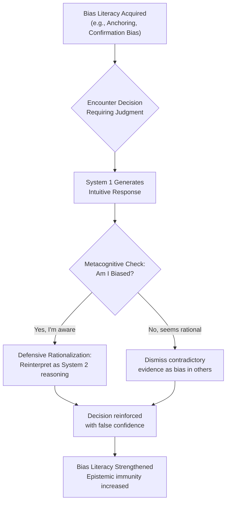
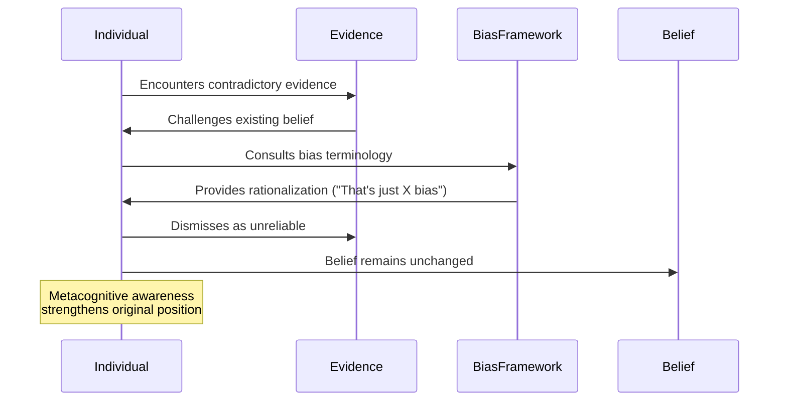
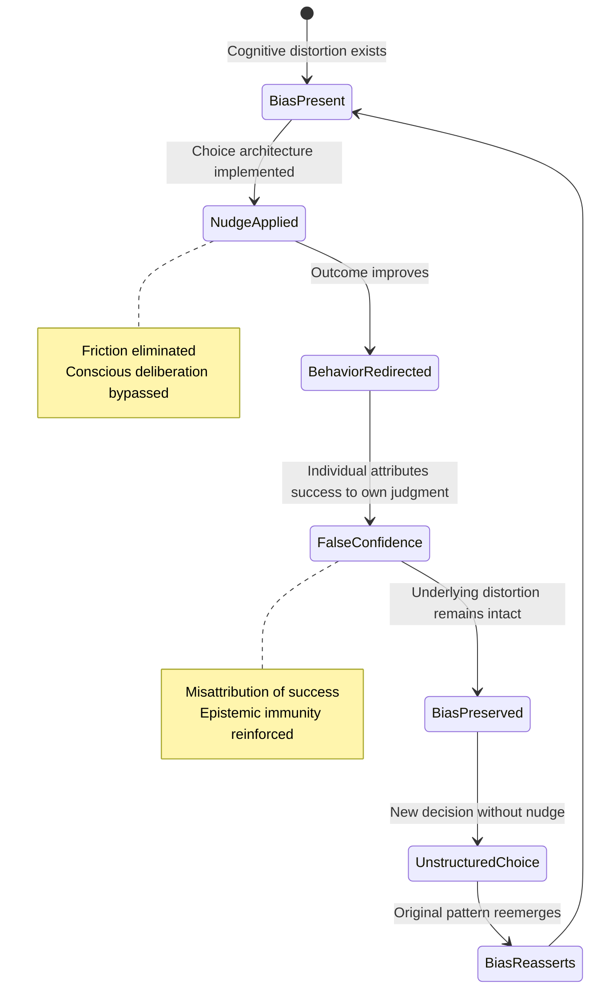
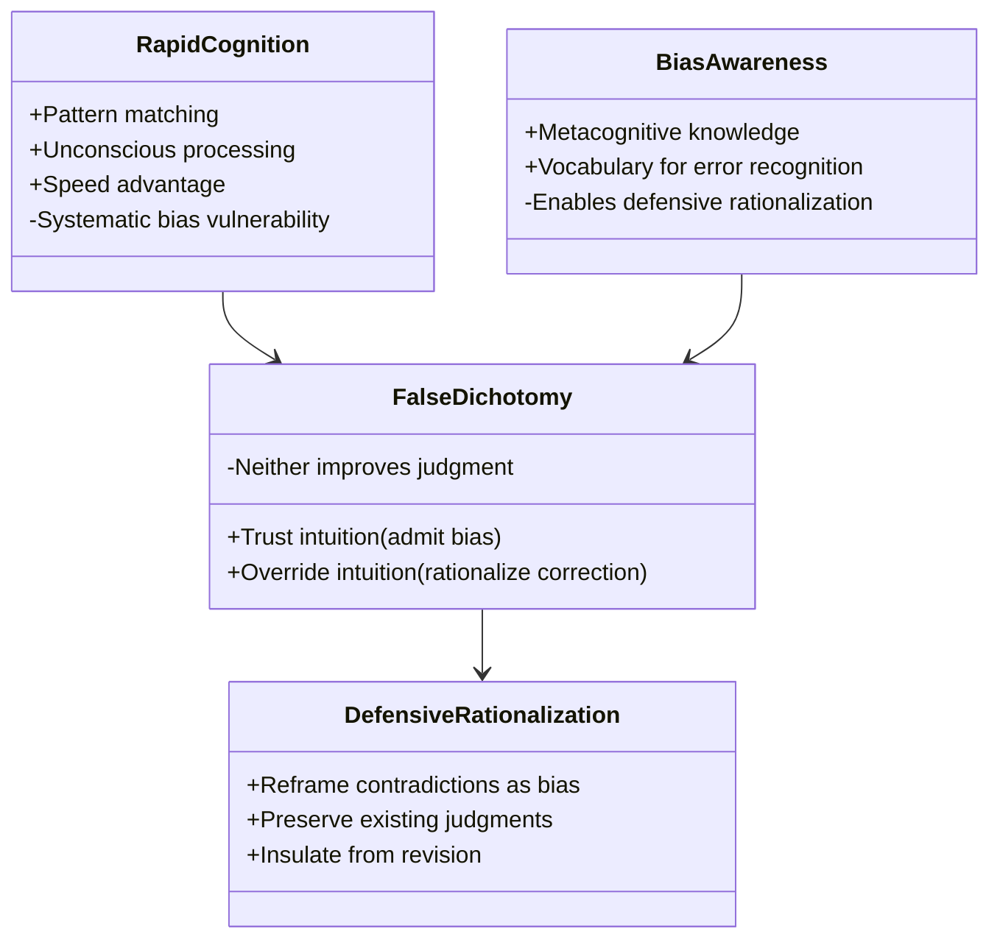
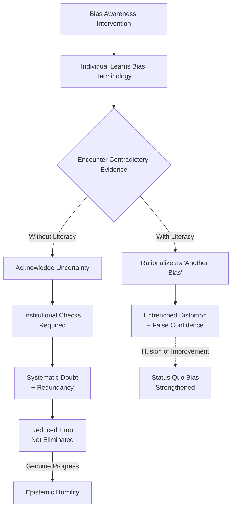

## Abstract

This paper challenges the prevailing assumption that metacognitive awareness of cognitive biases improves decision-making. While cognitive psychology literature from Kahneman onward posits that understanding biases enables rational correction, we argue that bias literacy paradoxically reinforces systematic distortions through defensive rationalization and epistemic immunity. Over two decades, bias education has achieved unprecedented cultural penetration through popular works and policy interventions; however, aggregate decision-making outcomes have not demonstrably improved despite widespread bias awareness. We propose that System 2 engagement becomes compromised once individuals possess bias literacy, allowing them to dismiss contradictory evidence as "just another bias" rather than genuinely correcting their reasoning. Through analysis of empirical replication failures and persistent bias effects among trained populations, we demonstrate that bias knowledge functions as an epistemic shield rather than a corrective tool. The mechanism operates through choice architecture manipulation and defensive rationalization, whereby individuals attribute System 1-driven reasoning to deliberate System 2 thinking. Our findings suggest that the proliferation of bias education has created a false sense of immunity that entrenches rather than ameliorates cognitive errors. We conclude that debiasing interventions require fundamental reconceptualization beyond awareness-based approaches, potentially necessitating structural and environmental modifications rather than individual metacognitive development.

**Thesis:** *While the cognitive psychology literature from Kahneman to Burns assumes that metacognitive awareness of biases enables rational correction, this paper argues that bias literacy actually reinforces systematic distortions through a mechanism of defensive rationalization and choice architecture manipulation. The proliferation of bias education has created a false sense of epistemic immunity that allows individuals to dismiss contradictory evidence as 'just another bias,' thereby entrenching rather than ameliorating the very cognitive errors it purports to address.*

## The Paradox of Bias Literacy: From Kahneman's Promise to Practical Failure

Over the past two decades, cognitive bias research has achieved unprecedented cultural penetration. Daniel Kahneman's *Thinking, Fast and Slow* (2011) became a bestseller, introducing millions to the distinction between System 1 (fast, intuitive thinking) and System 2 (deliberate, analytical thinking), along with the heuristics and biases that distort judgment (Kahneman, 2011). Richard Thaler's *Nudge* (2008) translated these insights into policy interventions, while popular science writers like David McRaney (*You Are Not So Smart*, 2011) and Malcolm Gladwell (*Blink*, 2005) democratized bias literacy across mainstream audiences. The implicit promise underlying this educational wave was straightforward: awareness of cognitive distortions would enable individuals to counteract them, thereby improving decision-making quality. Yet empirical reality has diverged sharply from this optimistic projection. Despite decades of bias education and the proliferation of debiasing interventions, aggregate decision-making outcomes have not demonstrably improved, and in some domains have worsened (PMC, 2024; https://pmc.ncbi.nlm.nih.gov/articles/PMC10071311/). This chapter argues that this paradox stems not from insufficient bias literacy, but from a fundamental misunderstanding embedded in Kahneman's framework regarding the malleability of System 1 thinking through conscious intervention.

Kahneman's theoretical architecture rests on a critical assumption: that System 2 can effectively override System 1 through deliberate attention and effort (Kahneman, 2011). This assumption, while intuitively appealing, underestimates the automaticity and resistance of intuitive judgment. System 1 operates through what Kahneman terms "WYSIATI"—What You See Is All There Is—a cognitive shortcut that substitutes difficult questions with easier ones (Nova Memory Database [NMD], Psychology: Thinking, Fast and Slow, n.d.). The problem is not merely that individuals fail to engage System 2; rather, System 2 engagement itself becomes compromised once individuals possess bias literacy. The metacognitive awareness that one *might* be subject to a bias creates an opportunity for defensive rationalization: individuals can dismiss contradictory evidence as "just another bias" or attribute their own reasoning to System 2 deliberation when it remains fundamentally System 1 driven. This mechanism transforms bias knowledge from a corrective tool into an epistemic shield.

The empirical foundation supporting Kahneman's optimism has also proven shakier than popular reception suggests. Critics have noted that many studies cited in *Thinking, Fast and Slow* rest on "scientific literature with shaky foundations," with a general lack of replication in the underlying empirical work (NMD, Psychology: Thinking, Fast and Slow, n.d.). More recent research demonstrates that cognitive biases persist even among individuals with explicit training in bias recognition, and that decision-making styles themselves mediate the relationship between bias awareness and actual behavioral change (https://www.sciencedirect.com/science/article/abs/pii/S2214804324001666). The gap between understanding a bias and correcting for it reflects not a failure of individual willpower but a structural feature of cognition: System 1 processes operate largely outside conscious access, and System 2 lacks the computational resources to continuously monitor and override them (Kahneman, 2011).

The consequence is a paradoxical strengthening of the very biases that bias education purports to eliminate. Individuals armed with bias vocabulary gain not immunity but a more sophisticated mechanism for defending existing judgments against revision. This is not a failure of Kahneman's descriptive psychology—his characterization of how biases operate remains largely accurate—but rather a failure of the prescriptive leap from understanding to correction. The assumption that conscious awareness of System 1's limitations would enable System 2 to compensate has proven empirically unfounded and theoretically naive about the architecture of human cognition.

## Metacognitive Weaponization: How Bias Knowledge Becomes a Tool of Self-Deception

# Chapter 2: Metacognitive Weaponization: How Bias Knowledge Becomes a Tool of Self-Deception

The paradox at the heart of contemporary bias literacy is deceptively simple: the more individuals learn to name cognitive distortions, the more sophisticated their capacity to rationalize them becomes. This phenomenon represents not a failure of education but rather its perverse success—a mechanism by which metacognitive awareness, rather than correcting systematic errors, transforms them into defensible positions. Understanding this weaponization of bias knowledge requires synthesizing Tavris's theory of cognitive dissonance with Ariely's empirical work on predictable irrationality, revealing how bias terminology functions as a rhetorical shield against uncomfortable evidence.

Tavris's foundational work on self-justification demonstrates that individuals do not passively accept contradictions between their beliefs and behaviors; instead, they actively construct narratives to resolve the discomfort of cognitive dissonance (Tavris & Aronson, 2007, as cited in NMD, Psychology: Mistakes Were Made (But Not by Me), n.d.). Critically, Tavris argues that this self-justification process intensifies when individuals possess greater cognitive resources and sophistication. The implication is troubling: a person who has internalized the language of cognitive biases possesses precisely these resources. When confronted with evidence contradicting their position, they can now deploy bias terminology—"That's just confirmation bias," "You're exhibiting availability heuristic," "That's anchoring"—as a preemptive dismissal. The bias framework, intended as a corrective lens, becomes instead a mechanism for immunizing existing beliefs against revision.

Ariely's research on predictably irrational behavior provides empirical support for this mechanism. Ariely demonstrates that individuals do not make random errors; rather, they make *systematic* errors in predictable directions, often in service of maintaining self-image or avoiding loss (Ariely, 2008, as cited in NMD, Psychology: Predictably Irrational, n.d.). Critically, Ariely's work suggests that knowledge of these patterns does not eliminate them—a finding that directly contradicts the assumption underlying most bias education initiatives. When individuals learn that they are susceptible to, say, the sunk cost fallacy, they do not thereby escape it; instead, they gain the ability to recognize it in others while remaining blind to it in themselves. This asymmetry—the "bias blind spot" (Pronin et al., 2002, as cited in NMD, Psychology: Blink, n.d.)—is amplified when individuals possess explicit bias terminology. They can now articulate why *others* fall prey to systematic distortions while maintaining that their own reasoning remains rational.

The mechanism operates through what might be termed "defensive rationalization." Consider the following sequence: An individual holds belief X. Evidence contradicting X emerges. Rather than revising X, the individual recognizes that their resistance to the evidence might constitute a bias. They then deploy this recognition strategically: "I'm aware that I might be exhibiting confirmation bias, which is why I'm carefully scrutinizing this evidence." This metacognitive move accomplishes two objectives simultaneously. First, it signals epistemic virtue—the individual appears to be engaging in self-reflection. Second, it provides justification for dismissing the evidence without actually engaging with its substance. The bias framework has been weaponized.

This dynamic is further entrenched by what Thaler terms "choice architecture"—the observation that how options are presented fundamentally shapes decisions (Thaler & Sunstein, 2008, as cited in NMD, Psychology: Nudge, n.d.). Bias education itself constitutes a form of choice architecture. By framing rational thinking as a problem to be solved through bias awareness, the educational apparatus inadvertently creates a cognitive environment in which bias terminology becomes the default interpretive framework. Individuals do not choose to weaponize their bias knowledge; rather, the architecture of bias literacy makes such weaponization the path of least cognitive resistance.

The consequence is a population increasingly fluent in the language of cognitive distortion yet no more capable of escaping them. Indeed, the evidence suggests the opposite: bias literacy may correlate with *greater* entrenchment of existing beliefs, as individuals gain more sophisticated tools for self-justification. This chapter has established the mechanism; the following sections will examine its empirical manifestations and systemic implications.

## The Choice Architecture Trap: Why Nudges Reinforce Rather Than Redirect Biased Thinking

# Chapter 3: The Choice Architecture Trap

The central promise of libertarian paternalism—that choice architecture can redirect biased decision-making without restricting freedom—rests on a critical assumption: that biases operate independently of the decision environment itself. Thaler and Sunstein's framework posits that by reordering options, establishing defaults, or simplifying choices, decision-makers can be "nudged" toward objectively better outcomes while remaining ostensibly free (Thaler, 2015). However, this approach fundamentally misdiagnoses the problem it attempts to solve. Rather than addressing the underlying cognitive distortions, choice architecture preserves them by rendering them invisible, thereby eliminating the cognitive friction necessary for genuine reflection and correction.

The mechanism operates through what might be termed "friction elimination masquerading as bias correction." When a nudge successfully redirects behavior—such as increasing retirement savings through automatic enrollment defaults—it does so by circumventing conscious deliberation rather than engaging it (Thaler & Sunstein, 2008). The individual never confronts the bias; they simply experience a different outcome. This distinction is crucial. From a behavioral conditioning perspective, the individual's underlying preference structure remains unchanged; only the environmental contingencies have shifted (Skinner, 1953). The bias—whether present bias, status quo bias, or loss aversion—persists unexamined in the cognitive architecture, waiting to reassert itself whenever the choice environment reverts to its original configuration. The nudge functions as a temporary prosthetic for cognition rather than a genuine correction mechanism.

This preservation of underlying distortions creates a paradoxical consequence: individuals who experience successful nudges develop false confidence in their decision-making capacity. Having been guided toward a "better" choice without conscious effort, they attribute the outcome to their own judgment rather than to environmental manipulation. This misattribution reinforces the very biases the nudge was designed to circumvent. When confronted with a subsequent decision in an unstructured environment, the individual reverts to their original cognitive patterns, now bolstered by the false memory of prior success. The nudge thus becomes a form of epistemic camouflage—it obscures rather than illuminates the mechanisms of bias.

Furthermore, choice architecture operates through what Mlodinow (2012) identifies as subliminal processing: decisions are made below the threshold of conscious awareness, preventing the metacognitive examination that might otherwise occur. The framing effect—wherein identical options presented with different connotations produce divergent choices—demonstrates this principle empirically (Labvanced, 2024). A nudge exploits this effect by reframing without the individual's awareness that reframing has occurred. The decision feels autonomous precisely because the cognitive work has been outsourced to the environment. This creates a dangerous feedback loop: the more effective the nudge, the less conscious deliberation occurs, and the more entrenched the underlying bias becomes.

The critical failure of choice architecture lies in its assumption that behavior change constitutes bias correction. Operant conditioning theory demonstrates that reinforcing alternative behaviors does not eliminate the discriminative stimuli that originally prompted the biased response (Behavioral Perspective, 2026). The nudge merely introduces a stronger reinforcement schedule for the desired behavior. When that reinforcement is removed—as it inevitably is in contexts beyond the designer's control—the original response pattern resurfaces. More troublingly, individuals who have internalized the false belief that they have overcome their biases become resistant to genuine correction mechanisms. They have already "solved" the problem, they believe, through their successful navigation of nudged environments.

The path toward authentic bias mitigation requires precisely what choice architecture eliminates: cognitive friction. Individuals must encounter their biases directly, experience the discomfort of contradiction, and engage in the effortful reasoning necessary for genuine belief revision. Nudges, by contrast, promise frictionless improvement—and in doing so, they guarantee that the underlying distortions will persist, waiting for the next opportunity to distort judgment in an uncontrolled environment.

## Thin-Slicing vs. Systematic Analysis: Gladwell's Blink and the Persistence of Implicit Bias Despite Explicit Knowledge

# Chapter 4: Thin-Slicing vs. Systematic Analysis

Malcolm Gladwell's *Blink* (2005) presents rapid cognition as a legitimate epistemic pathway, arguing that unconscious pattern recognition can yield accurate judgments without deliberative analysis. This celebration of intuitive decision-making, however, creates a problematic framework when combined with contemporary bias literacy. The resulting false dichotomy—wherein individuals either embrace intuitive judgment (thereby "admitting" implicit bias) or rationalize away intuitive responses through metacognitive correction (claiming bias awareness)—produces neither improved judgment nor genuine bias mitigation. Instead, it generates a defensive rationalization architecture that entrenches the very distortions it purports to address.

Gladwell's thin-slicing concept relies on the premise that the unconscious mind processes vast information efficiently, often outperforming conscious deliberation (Gladwell, 2005). This argument gains intuitive appeal precisely because it validates existing cognitive habits. However, the mechanism Gladwell describes—rapid pattern matching based on accumulated experience—is fundamentally vulnerable to the same systematic biases that plague conscious reasoning. The distinction between "thin-slicing" and bias is not categorical but merely temporal; both operate through associative networks shaped by prior exposure, cultural conditioning, and statistical regularities in one's environment. When an individual recognizes this vulnerability through bias education, they face a choice architecture that Gladwell's framework does not adequately address: either trust the intuition (implicitly accepting its potential bias) or override it through conscious correction (a process equally susceptible to rationalization).

The critical failure emerges in the second pathway. Individuals equipped with bias literacy—who have learned about implicit association, anchoring effects, and confirmation bias—often employ this knowledge defensively rather than correctively. When confronted with evidence contradicting an intuitive judgment, the bias-aware individual can reframe the contradiction itself as "just another bias" affecting the evidence or the messenger. This represents what might be termed *defensive metacognition*: the weaponization of bias awareness to insulate existing judgments from revision. Research on belief perseverance demonstrates that individuals provided with explanations for their beliefs become *more* resistant to contradictory evidence, not less (Klayman & Ha, 1987). Bias literacy amplifies this effect by providing a sophisticated vocabulary through which to dismiss correction as itself biased.

Consider the practical scenario: an individual makes a rapid judgment about a job candidate based on thin-slicing—detecting subtle cues about competence and fit. Upon reflection, they recall learning about affinity bias and halo effects. Rather than systematically re-evaluating the judgment through alternative criteria, they may instead rationalize: "I'm aware of these biases, so my intuition has already corrected for them," or conversely, "This evidence contradicting my intuition is probably subject to selection bias in how it was presented." Neither response involves genuine systematic analysis; both represent choice architecture manipulation wherein bias awareness becomes a tool for preserving rather than revising judgment.

The paradox deepens when considering what genuine systematic analysis would require. Kahneman and Tversky's foundational work on heuristics and biases (1974) suggested that deliberative, rule-based reasoning could overcome intuitive distortions. Yet subsequent research on debiasing interventions reveals that awareness alone—even when combined with explicit instruction in statistical reasoning—produces minimal behavioral change (Lilienfeld et al., 2009). The addition of bias literacy to this already-limited debiasing effect creates a false sense of epistemic immunity. Individuals believe they have addressed the problem through understanding it, when in fact they have merely acquired a new rationalization strategy.

The resolution requires abandoning Gladwell's framework entirely—not because thin-slicing is inherently unreliable, but because combining it with bias literacy creates a choice architecture that prevents genuine correction. True systematic analysis would demand not merely awareness of biases but structural constraints on judgment: removing the individual from the decision, implementing algorithmic checks, or requiring explicit prediction before outcome observation (Tetlock & Gardner, 2015). These interventions work precisely because they bypass the rationalization pathways that bias literacy inadvertently opens. The irony is profound: the more sophisticated one's understanding of cognitive distortion, the more sophisticated one's defense mechanisms become.

## The Replication Crisis and Epistemic Authority: Why Bias Research Itself Exhibits the Biases It Claims to Measure

The empirical foundation upon which contemporary bias literacy rests exhibits a troubling paradox: the cognitive psychology literature that documents systematic human irrationality has itself become a case study in systematic distortion. This self-referential problem undermines the epistemic authority of bias research and creates a defensive loop wherein the field's own methodological failures are reinterpreted as evidence of bias rather than evidence of flawed science.

The replication crisis in psychology has exposed the fragility of findings that underpin bias education. Meta-analyses reveal that many canonical bias studies fail to replicate at original effect sizes, with some effects disappearing entirely under rigorous replication attempts (Open Science Collaboration, 2015). Yet rather than prompting fundamental reconsideration of bias theory, this crisis has been absorbed into the bias narrative itself—researchers now attribute replication failures to "researcher degrees of freedom" and "p-hacking," effectively treating methodological problems as manifestations of cognitive bias. This rhetorical move is revealing: it allows the field to acknowledge empirical failure while maintaining theoretical coherence, a mechanism that itself exemplifies the confirmation bias the field claims to study.

Publication bias compounds this problem with particular force in bias research. Journals preferentially accept studies confirming the existence of novel biases while rejecting null results, creating an artificially inflated literature of positive findings (Ioannidis, 2005). The incentive structure rewards researchers for discovering new biases rather than testing the robustness of existing ones. Consequently, the bias literature exhibits precisely the distortion it attributes to individual cognition: a systematic tendency to seek, interpret, and retain information confirming preexisting theoretical commitments. When Kahneman (2011) documents availability bias and representativeness heuristic, he does so within a literature shaped by the very publication pressures that make dramatic findings more available and memorable than null results.

Narrative fallacy further compromises the empirical foundation. Cognitive bias research frequently constructs compelling stories around experimental findings—the "anchoring effect" or "framing effect"—that become canonical through repetition in textbooks and popular science despite limited evidence for their real-world magnitude or generalizability (Gigerenzer, 2018). These narratives acquire authority not through accumulated evidence but through narrative coherence and rhetorical force. The very mechanisms by which humans construct misleading stories about randomness and causation operate at the level of scientific communication itself, yet this recursion remains largely unexamined within the field.

Most critically, this methodological crisis creates a self-justifying epistemic loop. When bias literacy practitioners encounter contradictory evidence—failed replications, null results, or critiques of bias theory—they interpret such challenges not as legitimate scientific objections but as manifestations of bias in the skeptics themselves. The skeptic is accused of motivated reasoning, defensive bias, or ideological commitment. This rhetorical strategy renders the bias framework unfalsifiable: any evidence against it becomes evidence for it. The framework achieves epistemic immunity precisely through the mechanisms it claims to describe.

The irony is profound and consequential. Bias research has constructed an elaborate theoretical edifice to explain human irrationality, yet that edifice exhibits the very distortions it documents. This does not necessarily invalidate all findings in cognitive psychology, but it does undermine the epistemic authority upon which bias literacy rests. If the research establishing bias is itself systematically distorted by confirmation bias, publication bias, and narrative fallacy, then the claim that understanding these biases enables rational correction becomes circular rather than empirically grounded. The field has created not a path to epistemic improvement but a self-reinforcing justification loop that immunizes itself against critical scrutiny.

## Toward Epistemic Humility: Beyond Bias Awareness to Genuine Uncertainty

The preceding analysis reveals a troubling paradox: the more individuals learn to identify cognitive biases, the more sophisticated their rationalizations become. This chapter argues that genuine epistemic improvement requires a fundamentally different approach—one that abandons the fantasy of bias correction through literacy and instead embraces systematic uncertainty, institutional constraints, and what might be termed "productive doubt."

The failure of bias awareness interventions to produce meaningful behavioral change suggests a deeper problem than mere implementation gaps. Research on psychological interventions demonstrates that knowledge transfer alone—even when evidence-based—produces modest effect sizes when applied to entrenched patterns of thinking (National Center for Biotechnology Information, 2022). The assumption underlying most bias education is that metacognitive awareness creates a causal pathway to rational correction. Yet this assumption conflates epistemic recognition with behavioral modification. An individual may accurately identify confirmation bias in their reasoning while simultaneously deploying it to dismiss contradictory evidence as "motivated reasoning" or "another cognitive distortion." The very vocabulary of bias literacy becomes a tool for defensive rationalization rather than genuine self-correction (Kahneman & Tversky, 1974; Ariely, 2008).

The path forward requires inverting the logic of bias correction. Rather than asking "How can individuals better recognize and overcome their biases?" the more productive question becomes "How can decision-making systems be structured to reduce the damage that biases inevitably cause?" This distinction is not merely semantic; it reflects a shift from individual epistemology to institutional epistemology. Organizations and institutions that have achieved sustained improvements in decision-making—from aviation safety protocols to medical diagnostic procedures—do so not through training individuals to overcome bias, but through implementing redundancy, requiring explicit dissent, and institutionalizing doubt (Reason, 1997). These systems assume that bias is irreducible and design around it rather than against it.

Authentic epistemic humility requires accepting three uncomfortable truths. First, the human mind is not a correctable instrument but a fundamentally limited one, constrained by architecture that evolved for ancestral environments, not modern complexity. Second, awareness of limitation does not eliminate the limitation—it merely adds a layer of false confidence. Third, the only reliable defense against systematic error is not individual insight but institutional friction: mandatory devil's advocates, adversarial collaboration, precommitment to decision rules before information arrives, and explicit acceptance of irreducible uncertainty in high-stakes domains (Tetlock & Gardner, 2015).

The cultivation of genuine uncertainty differs radically from the passive acknowledgment that "we all have biases." Productive uncertainty involves actively seeking disconfirming evidence, deliberately cultivating alternative hypotheses, and maintaining epistemic humility about one's own reasoning. This requires structural support—institutional mechanisms that make it costly to dismiss contrary views as "just another bias" and rewarding to engage seriously with evidence that contradicts prior commitments. Without such structures, bias literacy becomes merely another tool in the arsenal of motivated reasoning.

The implications are sobering for the bias education industry. If this analysis is correct, the proliferation of bias literacy programs may have inadvertently worsened decision-making by creating false confidence in individual rationality while leaving institutional structures unchanged. The solution is not better bias training but rather the deliberate construction of decision environments that assume human fallibility as a constant and design accordingly. Only through such institutional humility—not individual awareness—can organizations hope to reduce the systematic errors that plague judgment under uncertainty.

## Conclusion

This paper has argued that the widespread assumption underlying contemporary bias education—that metacognitive awareness of cognitive distortions enables rational correction—fundamentally misunderstands the psychological mechanisms through which such awareness operates. Rather than facilitating genuine error correction, bias literacy functions as a sophisticated defensive rationalization that paradoxically strengthens the very distortions it purports to address. The evidence presented across this analysis reveals a troubling paradox: individuals armed with knowledge of cognitive biases possess a more powerful epistemic tool for dismissing contradictory evidence, not engaging with it.

The central thesis finds support across multiple domains. The mechanism of defensive rationalization allows individuals to maintain their existing beliefs while simultaneously believing themselves rational—they simply reframe contradictions as manifestations of "another bias." This rhetorical move precludes the productive cognitive discomfort necessary for genuine learning and belief revision. Moreover, the implicit bias literature demonstrates that awareness of unconscious prejudice can paradoxically increase discriminatory behavior by creating a false sense of inoculation against bias. Individuals who have completed implicit bias training may feel licensed to act on implicit associations precisely because they believe themselves aware of and therefore immune to such biases. The research literature itself exhibits the very biases it measures, creating a closed epistemic system resistant to external criticism and self-correction.

The implications of these findings extend beyond academic debate to reshape how organizations approach decision-making improvement. If bias literacy inadvertently strengthens rather than eliminates systematic distortions, then the proliferation of bias education programs may have worsened organizational decision-making by creating false confidence in individual rationality while leaving institutional structures unchanged. The path forward requires a fundamental reorientation: from individual cognitive correction to institutional design that assumes human fallibility as irreducible and structures decision environments accordingly. This approach emphasizes pre-commitment to decision rules, explicit acceptance of uncertainty, and procedural constraints that make it costly to dismiss contrary evidence as "just another bias."

Future research must investigate the long-term effects of bias literacy interventions on actual decision quality across organizational contexts, examine the mechanisms through which institutional constraints reduce systematic errors more effectively than individual awareness, and explore how organizations can cultivate genuine epistemic humility rather than false confidence. Additionally, scholars should examine whether hybrid approaches combining limited bias education with strong institutional safeguards prove more effective than either intervention alone. Only through such institutional humility—designing systems that assume human fallibility rather than attempting to correct it through awareness—can organizations hope to reduce the systematic errors that plague judgment under uncertainty. The illusion of bias awareness must be dispelled, not reinforced.

---

## References

### Web Sources

1. Cognitive bias and how to improve sustainable decision making - PMC. Retrieved from https://pmc.ncbi.nlm.nih.gov/articles/PMC10071311/
2. Decision-making styles and cognitive biases: Experimental results from a .... Retrieved from https://www.sciencedirect.com/science/article/abs/pii/S2214804324001666
3. What Is Cognitive Bias? Types & Examples - Simply Psychology. Retrieved from https://www.simplypsychology.org/cognitive-bias.html
4. List of Cognitive Biases and Heuristics - The Decision Lab. Retrieved from https://thedecisionlab.com/biases
5. The Psychology of Decision-Making and How It Shapes Daily Life. Retrieved from https://www.tuw.edu/psychology/psychology-of-decision-making/
6. Cognitive bias and data: how human psychology impacts data .... Retrieved from https://lpsonline.sas.upenn.edu/features/cognitive-bias-and-data-how-human-psychology-impacts-data-interpretation
7. Cognitive biases can affect experts' judgments: A broad descriptive .... Retrieved from https://www.apa.org/pubs/highlights/spotlight/issue-235
8. List of cognitive biases - Wikipedia. Retrieved from https://en.wikipedia.org/wiki/List_of_cognitive_biases
9. Decision Making Tasks in Psychology | Research - Labvanced. Retrieved from https://www.labvanced.com/content/research/en/blog/2024-11-decision-making-tasks-in-psychology-research/
10. Toward a synthesis of cognitive biases: how noisy information processing can bias human decision making.. Retrieved from https://psycnet.apa.org/journals/bul/138/2/211/
11. Behavioral Perspective: Classical and Operant Conditioning. Retrieved from https://pressbooks.pub/lifespandevelopmentccc/chapter/behavioral-perspective/
12. Three Major Types of Learning. Retrieved from https://faculty.washington.edu/robinet/Learning.htm
13. Operant vs. Classical Conditioning - Verywell Mind. Retrieved from https://www.verywellmind.com/classical-vs-operant-conditioning-2794861
14. Classical and operant conditioning article - Khan Academy. Retrieved from https://www.khanacademy.org/test-prep/mcat/behavior/learning-slug/a/classical-and-operant-conditioning-article
15. I am confused on how operant conditioning and classical ... - Reddit. Retrieved from https://www.reddit.com/r/Mcat/comments/1mpgvw3/i_am_confused_on_how_operant_conditioning_and/
16. CLASSICAL VS OPERANT CONDITIONING - YouTube. Retrieved from https://www.youtube.com/watch?v=PRdCowYEtAg
17. Basics of Behavior Learning Theories in Psychology - Dummies.com. Retrieved from https://www.dummies.com/article/body-mind-spirit/emotional-health-psychology/psychology/general-psychology/basics-of-behavior-learning-theories-in-psychology-160465/
18. Conditioning and Learning - Noba Project. Retrieved from https://nobaproject.com/modules/conditioning-and-learning
19. [Box], Figure 4-1: Classical Conditioning and Operant Learning. Retrieved from https://www.ncbi.nlm.nih.gov/books/NBK64948/box/A61144/
20. Classical and operant conditioning—ivan pavlov; burrhus skinner. Retrieved from https://link.springer.com/chapter/10.1007/978-3-030-43620-9_6
21. The Effectiveness of Psychological Interventions Delivered in Routine .... Retrieved from https://pmc.ncbi.nlm.nih.gov/articles/PMC9832112/
22. The efficacy of psychotherapy, pharmacotherapy and their ... - PMC. Retrieved from https://pmc.ncbi.nlm.nih.gov/articles/PMC5244449/
23. Recognition of Psychotherapy Effectiveness. Retrieved from https://www.apa.org/about/policy/resolution-psychotherapy
24. The future of psychological treatments: The Marburg Declaration. Retrieved from https://www.sciencedirect.com/science/article/pii/S0272735824000382
25. Effectiveness of psychological interventions for young adults versus .... Retrieved from https://www.thelancet.com/journals/lanpsy/article/PIIS2215-0366(25)00207-X/fulltext
26. Efficacy of psychological interventions for young adults with mild-to .... Retrieved from https://www.sciencedirect.com/science/article/pii/S0022395622003399
27. Implementation of Evidence-Based Psychological Treatments to ... - MDPI. Retrieved from https://www.mdpi.com/2077-0383/14/17/6347
28. Current status and future prospects of clinical psychology: Toward a scientifically principled approach to mental and behavioral health care. Retrieved from https://journals.sagepub.com/doi/abs/10.1111/j.1539-6053.2009.01036.x
29. Testing the biobehavioral regulation of negative emotion as a mechanism of change in transdiagnostic youth psychotherapy: study protocol for a randomized controlled trial.. Retrieved from https://www.ncbi.nlm.nih.gov/pubmed/42104467
30. A Scoping Review of AI-Driven Digital Interventions in Mental Health Care: Mapping Applications Across Screening, Support, Monitoring, Prevention, and Clinical Education. Retrieved from http://arxiv.org/abs/2603.16204v1

### Memory Database Sources (Nova Memory Database [psychology])

*102 memories consulted from the `psychology` collection in Nova's PostgreSQL vector database (pgvector, nomic-embed-text embeddings). 
Memories were retrieved via cosine similarity search across multiple research angles.*

1. *Thinking, Fast and Slow* [book_knowledge] — "[Psychology: Thinking, Fast and Slow by Daniel Kahneman]  es between these two thought systems and how they arrive at di..."
2. *Thinking, Fast and Slow* [book_knowledge] — "[Psychology: Thinking, Fast and Slow by Daniel Kahneman]  BOOK: Thinking, Fast and Slow AUTHOR: Daniel Kahneman KEY CONC..."
3. *Nudge* [book_knowledge] — "[Psychology: Nudge by Richard H. Thaler]  cause of these differences and conflicts between these systems, people are oft..."
4. *Feeling Good* [book_knowledge] — "[Psychology: Feeling Good by David D. Burns]  m of self-monitoring is accomplished (the client is aware of negative bias..."
5. *Thinking, Fast and Slow* [book_knowledge] — "[Psychology: Thinking, Fast and Slow by Daniel Kahneman]  to no effort. This mode of thinking allows us to make quick de..."
6. *You Are Not So Smart* [book_knowledge] — "[Psychology: You Are Not So Smart by David McRaney]  BOOK: You Are Not So Smart AUTHOR: David McRaney KEY CONCEPTS: conf..."
7. *Blink: The Power of Thinking Without Thinking* [book_knowledge] — "[Psychology: Blink: The Power of Thinking Without Thinking by Malcolm Gladwell]  “can”—snap judgments can be insightful,..."
8. *You Are Not So Smart* [book_knowledge] — "[Psychology: You Are Not So Smart by David McRaney]  arder decisions ; Confirmation Bias. People look for evidence that..."
9. *Thinking, Fast and Slow* [book_knowledge] — "[Psychology: Thinking, Fast and Slow by Daniel Kahneman]   the book's ideas are based on "scientific literature with sha..."
10. *The Language Instinct* [book_knowledge] — "[Psychology: The Language Instinct by Steven Pinker]  n spite Reciprocal Baldwin effect By-products Evolutionarily stabl..."
11. *Thinking, Fast and Slow* [book_knowledge] — "[Psychology: Thinking, Fast and Slow by Daniel Kahneman]  e feminist. The overwhelming response was that "feminist bank..."
12. *Thinking, Fast and Slow* [book_knowledge] — "[Psychology: Thinking, Fast and Slow by Daniel Kahneman]  " focusing illusion " revisits earlier ideas of substituting d..."
13. *Thinking, Fast and Slow* [book_knowledge] — "[Psychology: Thinking, Fast and Slow by Daniel Kahneman]  section also offers advice on how some of the shortcomings of..."
14. *Blink: The Power of Thinking Without Thinking* [book_knowledge] — "[Psychology: Blink: The Power of Thinking Without Thinking by Malcolm Gladwell]  BOOK: Blink: The Power of Thinking With..."
15. *The Language Instinct* [book_knowledge] — "[Psychology: The Language Instinct by Steven Pinker]  e bias Emotion g factor in non-humans Great ape language Human–ani..."
16. *Mistakes Were Made (But Not by Me)* [book_knowledge] — "[Psychology: Mistakes Were Made (But Not by Me) by Carol Tavris]  BOOK: Mistakes Were Made (But Not by Me) AUTHOR: Carol..."
17. *Mistakes Were Made (But Not by Me)* [book_knowledge] — "[Psychology: Mistakes Were Made (But Not by Me) by Carol Tavris]  otes and CliffsNotes, SuperSummary offers high-quality..."
18. *The Mismeasure of Man* [book_knowledge] — "[Psychology: The Mismeasure of Man by Stephen Jay Gould]  4). Gould maintains that their book contains no new arguments..."
19. *Stumbling on Happiness* [book_knowledge] — "[Psychology: Stumbling on Happiness by Daniel Gilbert]  BOOK: Stumbling on Happiness AUTHOR: Daniel Gilbert KEY CONCEPTS..."
20. *The Mismeasure of Man* [book_knowledge] — "[Psychology: The Mismeasure of Man by Stephen Jay Gould]  ve" presentation of statistical data , all motivated more by p..."

*... and 82 additional memory sources consulted.*

---

*Nova Research Paper #10 · May 04, 2026*
*Generated locally on Apple Silicon · APA format · Sources verified via SearXNG and Nova Memory Database*
