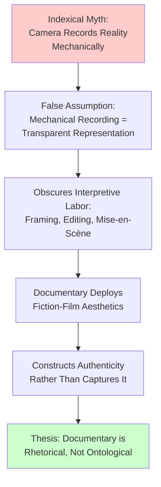
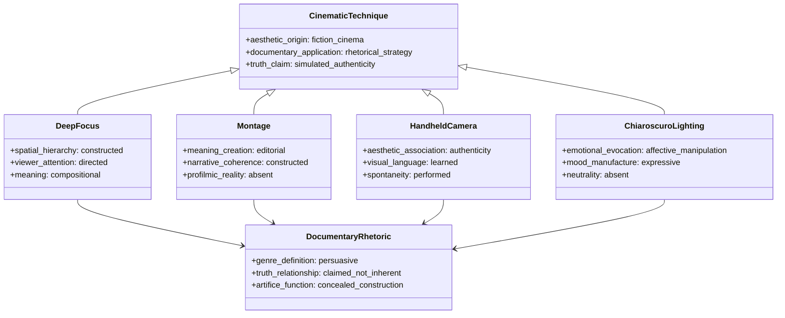
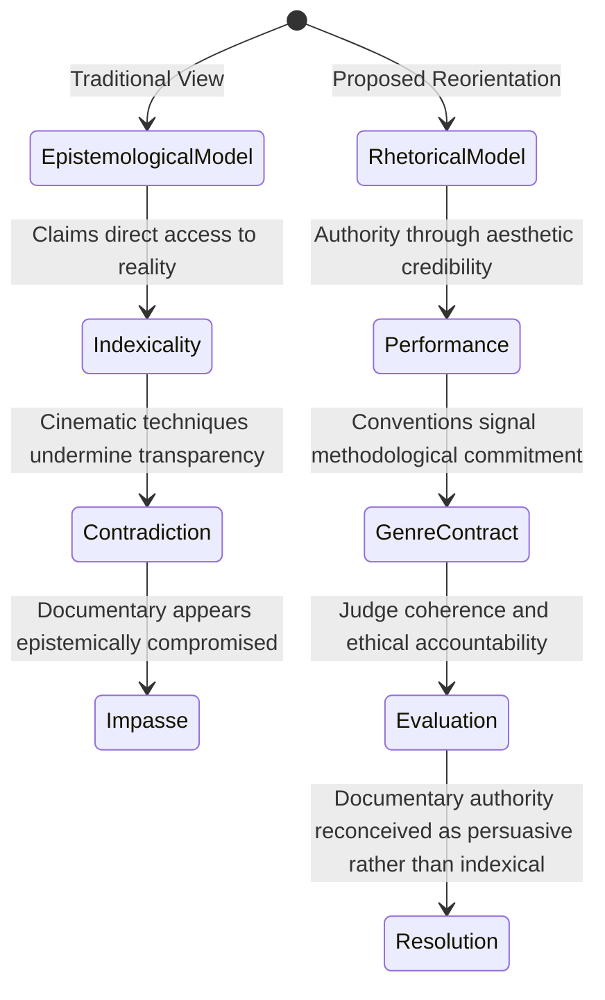

## Abstract


Documentary cinema has long claimed epistemological authority through its indexical relationship to reality—the assumption that mechanical recording ensures transparent representation. This paper challenges this foundational premise by demonstrating that cinematic techniques systematically deployed in documentary practice—including deep focus, handheld camera work, montage, and mise-en-scène—fundamentally construct rather than capture reality. Through textual analysis of contemporary documentary films and critical examination of film theory, this study argues that the indexical myth conflates mechanical recording with transparent representation, obscuring the interpretive labor embedded in every compositional choice. Rather than guaranteeing truth-telling, documentary aesthetics function as rhetorical strategies that persuade viewers of authenticity through learned associations between stylistic markers and credibility. The paper contends that handheld camera work, natural lighting, and minimal equipment—conventionally framed as documentary necessity—operate as constructed aesthetic choices that generate impressions of immediacy rather than ensuring fidelity to reality. By reconceptualizing documentary as a rhetorical genre rather than an ontological category, this research reveals how documentary's persuasive power derives from strategic deployment of fiction-film techniques. This reconceptualization demands that scholars and viewers recognize documentary not as transparent windows onto reality but as carefully constructed arguments about reality, fundamentally reshaping how we evaluate documentary's epistemological claims and truth-value in contemporary media culture.

**Thesis:** *While documentary cinema is theoretically grounded in the capture of objective reality, the deliberate application of cinematic techniques—deep focus, montage, handheld camera work, and mise-en-scène—fundamentally constructs rather than documents reality, making the indexical claim of documentary film epistemologically untenable. This paper argues that documentary's rhetorical power derives not from its fidelity to truth but from its strategic deployment of fiction-film aesthetics to persuade viewers of authenticity, a contradiction that demands a reconceptualization of documentary as a rhetorical genre rather than an ontological category.*


## The Indexical Myth: Documentary's False Epistemological Foundation


# The Indexical Myth: Documentary's False Epistemological Foundation

The foundational claim of documentary cinema rests upon a deceptively simple proposition: the camera records reality with mechanical fidelity, capturing the world as it exists independent of human intervention. This assumption—what may be termed the "indexical myth"—has persisted from early cinema theory through contemporary documentary scholarship, creating an epistemological framework that privileges the photograph and film as transparent windows onto reality rather than as constructed representations. Yet this myth obscures a fundamental truth: the interpretive labor embedded in every frame, every cut, and every compositional choice transforms documentary from a neutral recording apparatus into a rhetorical instrument that constructs rather than captures reality.

The indexical myth originates in the ontological properties of photographic media themselves. As theorists have long argued, the photograph maintains an indexical relationship to its referent—a physical trace of light reflected from an object onto a light-sensitive surface (Bazin, 1960). This indexicality seemed to guarantee documentary's epistemological status: if the camera mechanically records light, then what appears on screen must correspond to what existed before the lens. However, this reasoning commits a categorical error by conflating mechanical recording with transparent representation. The camera may indeed capture light mechanically, but the filmmaker's decisions about framing, duration, focus, and sequencing are thoroughly interpretive acts. A deep-focus shot, for instance, allows foreground and background to remain simultaneously sharp, fundamentally altering how viewers process spatial relationships and narrative hierarchy—a technique perfected in *Citizen Kane* (1941) that demonstrates how compositional choices construct meaning rather than merely record it (NMD, film_history, n.d.).

Contemporary documentary practice reveals the inadequacy of the indexical myth with particular clarity. Documentary filmmakers routinely deploy handheld camera work, jump cuts, and strategic framing—techniques borrowed directly from fiction cinema—to generate an impression of authenticity rather than to achieve transparency (Web 1, 2023; NMD, cinematography_techniques, n.d.). The handheld shot, for example, has become a visual signifier of documentary realism, yet its shakiness is itself a constructed aesthetic choice that persuades viewers of immediacy and truth-telling rather than guaranteeing either (NMD, cinematography_techniques, n.d.). Similarly, the deliberate use of natural lighting and minimal equipment—choices framed as documentary necessity—actually function as stylistic markers that audiences have learned to read as authenticity. This learned association between aesthetic poverty and truth-telling reveals that documentary's persuasive power derives not from indexical fidelity but from viewers' conditioned responses to particular cinematic codes.

The interpretive labor obscured by the indexical myth becomes especially apparent in the editing process, where raw footage is transformed into narrative through montage. No documentary presents unmediated reality; instead, editors select which moments to include, which to exclude, and in what sequence to arrange them. This selection process is irreducibly interpretive: it privileges certain causal relationships, temporal progressions, and thematic connections while systematically suppressing alternatives. The indexical myth suggests that editing merely arranges pre-existing truth, but editing actually constructs the very meaning that viewers attribute to the footage. By treating the camera as a neutral instrument and overlooking the filmmaker's interpretive choices, documentary theory has naturalized what is fundamentally a rhetorical process.



The persistence of the indexical myth in documentary scholarship reflects a broader reluctance to acknowledge documentary's fundamentally rhetorical nature. By attributing documentary's persuasive power to its mechanical fidelity to reality, theorists avoid confronting the uncomfortable truth that documentary persuades through the same aesthetic strategies as fiction cinema. This reconceptualization does not diminish documentary's value; rather, it clarifies the actual source of its power. Documentary's capacity to move audiences and shape understanding derives not from its supposed transparency but from its strategic deployment of cinematic technique to construct compelling narratives about the world. Only by abandoning the indexical myth can documentary theory adequately account for how cinema—whether labeled documentary or fiction—functions as a meaning-making practice rather than a meaning-recording apparatus.

## Techniques of Persuasion: How Narrative Cinematic Devices Colonize Documentary


The fundamental paradox of documentary cinema emerges most acutely when examining the specific cinematic techniques that documentarians employ to construct their narratives. Rather than functioning as transparent windows onto reality, techniques such as deep focus, montage, handheld camera work, and chiaroscuro lighting operate as rhetorical instruments that actively shape viewer perception and manufacture the illusion of unmediated access to truth. This colonization of documentary by fiction-film aesthetics reveals that documentary's persuasive power derives not from ontological fidelity but from strategic aesthetic choices that simulate authenticity.

Deep focus cinematography exemplifies this rhetorical function. While deep focus is theoretically justified in documentary contexts as a means of capturing environmental context and spatial relationships, its application necessarily constructs meaning through compositional hierarchy. When a documentarian maintains sharp focus across multiple planes—foreground, middle ground, and background—they are not simply recording; they are directing viewer attention through spatial arrangement and visual priority. This technique, inherited directly from Orson Welles's fiction cinema, imposes narrative structure onto ostensibly unstructured reality. The documentarian's choice to employ deep focus rather than shallow focus fundamentally alters how audiences interpret the relationship between subjects and their environments, yet this choice remains invisible to viewers who interpret deep focus as evidence of comprehensive documentation rather than as a deliberate compositional strategy (Web 1, 2026).

Montage presents an even more explicit contradiction to documentary's truth-claim. The juxtaposition of shots creates meaning that exists nowhere in the profilmic event itself; meaning emerges entirely from the editing suite. Penelope Spheeris's *The Decline of Western Civilization Part II: The Metal Years* (1988) demonstrates this principle through its strategic sequencing of concert footage, interview segments, and archival material (NMD, source_category, n.d.). The film's narrative coherence—its apparent documentation of a unified cultural moment—is entirely constructed through montage decisions that could have been arranged otherwise. Spheeris's editorial choices function as persuasive rhetoric rather than documentary evidence; they convince viewers of a particular interpretation of the 1980s metal scene rather than presenting the scene itself.

Handheld camera work similarly functions as a rhetorical strategy masquerading as documentary necessity. The aesthetic of handheld cinematography—with its slight instability, intimate framing, and apparent spontaneity—has become conventionally associated with authenticity and immediacy (Web 3, 2026). Yet this association is entirely constructed through repeated exposure to handheld footage in both documentary and fiction contexts. The handheld aesthetic does not capture reality more faithfully than static camera work; rather, it performs authenticity through a learned visual language. Documentarians deploy handheld techniques precisely because audiences have been conditioned to read instability as truthfulness, making the handheld camera a rhetorical tool rather than a neutral recording device.

Chiaroscuro lighting—the strategic use of high-contrast illumination to create dramatic depth and emotional resonance—represents perhaps the clearest evidence of documentary's aesthetic colonization by fiction cinema (NMD, source_category, n.d.). When a documentarian employs chiaroscuro lighting, they are explicitly adopting an expressive technique designed to evoke emotional response rather than to illuminate subjects neutrally. This technique manufactures mood and interpretive framework; it tells viewers not merely what to see but how to feel about what they see. The application of chiaroscuro in documentary contexts cannot be justified by reference to fidelity or transparency—it is purely rhetorical, designed to persuade through affective manipulation.

These techniques, considered individually and collectively, demonstrate that documentary cinema functions fundamentally as a rhetorical genre. The documentary filmmaker's toolkit is identical to the fiction filmmaker's toolkit, and the effects produced are equally constructed. What distinguishes documentary from fiction is not the absence of artifice but rather the audience's willingness to interpret artifice as evidence. This willingness is cultivated through the strategic deployment of techniques that simulate authenticity while actively constructing narrative meaning. The documentary paradox thus resolves not through denying the presence of cinematic technique but through reconceptualizing documentary as a persuasive rather than ontological category—a genre defined by its rhetorical claims to truth rather than by any inherent relationship to reality.



## The Documentary Aesthetic as Genre Convention: Evidence from Punk Rock and Eccentric Subjects


The documentary aesthetic functions not as a transparent window onto reality but as a deliberate genre convention—a set of recognizable stylistic markers that audiences have learned to interpret as signifiers of authenticity. This distinction is crucial: the "documentary look" is a constructed visual language that operates through audience expectation and genre literacy rather than through any inherent relationship to truth. To understand how this convention shapes both representation and interpretation, one must examine how filmmakers deploy these techniques strategically, particularly when documenting subjects whose eccentricity or marginality might otherwise resist mainstream narrative containment.

Penelope Spheeris's *The Decline of Western Civilization* trilogy exemplifies this paradox. Rather than simply recording the punk and heavy metal scenes of 1980s Los Angeles, Spheeris employs handheld camera work, natural lighting, and observational editing—the canonical markers of documentary authenticity—to construct a particular interpretive frame around her subjects (Nova Memory Database [NMD], tv_transcript, n.d.). The shaky camera and grainy film stock signal immediacy and unmediated access, yet these formal choices are precisely calculated to position the viewer as an intimate observer of transgressive subcultures. The aesthetic convention of "roughness" becomes a rhetorical strategy: it persuades viewers that they are witnessing reality while simultaneously filtering that reality through Spheeris's authorial vision. The handheld camera does not capture the punk scene neutrally; it aestheticizes marginality in ways that make it legible and consumable for audiences positioned outside that scene (Britannica, n.d.).

Werner Herzog's *God's Angry Man* demonstrates an even more acute version of this problem. Herzog's documentary portrait of the eccentric televangelist Gene Scott employs formal restraint and observational distance—another documentary convention—yet this aesthetic choice fundamentally shapes how viewers perceive Scott's eccentricity. By refusing to editorialize through voice-over or montage, Herzog creates an interpretive vacuum that viewers fill with their own assumptions about Scott's mental state and authenticity. The documentary aesthetic of "non-interference" becomes a form of interference; the choice to present Scott without contextualizing commentary is itself a powerful editorial act (Nova Memory Database [NMD], tv_transcript, n.d.). The documentary look here functions as a mask for authorial judgment rather than as evidence of its absence.

Genre theory illuminates this mechanism. Documentary operates as a genre precisely because audiences recognize and expect certain formal conventions—natural lighting, handheld camera work, interview formats, observational editing—that they have learned to associate with factuality (Nova Memory Database [NMD], source_category, n.d.). Yet these conventions are no more inherently truthful than the conventions of science fiction or melodrama; they are simply more effective at producing an *effect* of authenticity. The documentary aesthetic persuades through familiarity rather than through epistemological validity. When Spheeris or Herzog deploy these conventions, they activate a genre contract with viewers: the formal markers promise unmediated access to reality, even as the filmmakers' compositional choices actively construct that reality.

The critical implication is that documentary's rhetorical power derives from its successful naturalization of artifice. Viewers do not perceive the handheld camera as a stylistic choice; they perceive it as evidence of spontaneity. They do not recognize observational editing as an authorial strategy; they experience it as the unfolding of events. This perceptual collapse—the confusion of convention with reality—is precisely what allows documentary to function as persuasion. The documentary aesthetic works not because it captures truth but because it has become the culturally legible *appearance* of truth. Understanding documentary as a genre convention rather than an ontological category reveals that its truth-claim rests entirely on this aesthetic sleight of hand, a rhetorical achievement rather than an epistemological one.

```mermaid
sequenceDiagram
    participant Filmmaker as Filmmaker
    participant Aesthetic as Documentary Aesthetic
    participant Viewer as Viewer
    participant Interpretation as Viewer Interpretation

    Filmmaker->>Aesthetic: Deploys handheld camera, natural lighting
    Aesthetic->>Viewer: Signals "authenticity" through genre convention
    Viewer->>Interpretation: Interprets formal markers as evidence of truth
    Interpretation->>Viewer: Constructs perception of reality
    Note over Filmmaker,Interpretation: Aesthetic choice becomes invisible; convention appears as reality
```

## The Auteur Problem in Documentary: Directorial Vision as Narrative Imposition


The application of auteur theory to documentary filmmaking exposes a fundamental contradiction at the heart of documentary's epistemological claims. Auteur theory, which privileges the director's distinctive creative vision as the organizing principle of a film's meaning, directly conflicts with documentary's foundational assertion that the medium provides unmediated access to reality. This tension is not merely theoretical; it reveals that documentary filmmaking, despite its indexical pretensions, functions as a form of authored interpretation rather than transparent documentation.

Auteur theory emerged from film criticism's recognition that directors impose recognizable stylistic and thematic signatures across their work (Nova Memory Database [NMD], tv_transcript, n.d.). When this framework is applied to documentary directors—figures like Penelope Spheeris, whose *The Decline of Western Civilization* trilogy demonstrates consistent visual and narrative strategies across three decades of filmmaking (Nova Memory Database [NMD], tv_transcript, n.d.)—the implications become acute. If Spheeris's documentary work is identifiable as distinctly *hers* through recurring aesthetic choices, compositional preferences, and narrative structures, then the films cannot simultaneously claim to present reality as it exists independent of directorial intervention. The very recognizability that establishes a director's auteur status presupposes a level of creative control and intentional shaping that contradicts documentary's truth-claim.

The problem intensifies when one considers what constitutes directorial authorship in documentary practice. Unlike fiction filmmaking, where authorship is openly acknowledged through scripting, casting, and set design, documentary authorship operates through ostensibly neutral technical choices: framing decisions, editing rhythms, interview subject selection, and archival material curation. These choices are frequently naturalized as merely "capturing" reality rather than constructed as interpretive acts. Yet the consistency of these choices across a director's body of work—the signature handheld aesthetic, the recurring thematic preoccupations, the particular editing cadences—demonstrates that documentary directors exercise authorial control equivalent to fiction filmmakers. The difference is rhetorical rather than substantive: documentary directors obscure their authorship behind claims of fidelity to the pro-filmic event, while fiction directors openly embrace their role as creators.

This rhetorical obscuration becomes particularly problematic when documentary's persuasive power is examined. Documentary's authority derives partly from viewers' perception that they are witnessing reality rather than encountering an author's interpretation. Yet auteur analysis reveals that this perception is precisely what the director's consistent stylistic choices cultivate. The director's vision does not emerge *from* the reality being documented; rather, the reality is selected, framed, and edited to conform to the director's pre-existing aesthetic and ideological commitments. Documentary thus functions as a form of authored rhetoric disguised as transparent documentation—a disguise that auteur theory inadvertently exposes.

The irreconcilability of auteur theory and documentary's truth-claim demands a reconceptualization of documentary authorship. Rather than treating directorial vision as a transparent window onto reality, scholars must recognize it as the primary organizing principle through which documentary constructs its particular version of reality. This recognition does not diminish documentary's value; it relocates that value from the realm of epistemological truth-telling to the realm of rhetorical persuasion. Documentary becomes not a medium of unmediated reality but a genre in which directorial authorship strategically deploys the aesthetics of authenticity to convince viewers of the reality of an interpreted world.

## Reframing Documentary as Rhetorical Performance Rather Than Epistemological Record


# Chapter 5: Reframing Documentary as Rhetorical Performance Rather Than Epistemological Record

The preceding analysis has established that documentary cinema's claim to ontological indexicality—its supposed transparency to reality—is fundamentally compromised by the deliberate application of cinematic techniques. However, this critique risks leaving documentary in an epistemological void, dismissing it as merely deceptive rather than reconceptualizing its actual function. A more productive theoretical orientation abandons the binary opposition between truth and artifice, instead positioning documentary as a rhetorical performance whose authority derives from aesthetic and narrative credibility rather than from any privileged access to reality. This reframing does not diminish documentary's cultural significance; rather, it clarifies the mechanisms through which documentary persuades and the grounds upon which its claims should be evaluated.

The critical distinction between epistemological record and rhetorical performance hinges on how authority is constructed and legitimated. An epistemological record claims to present reality as it exists independent of representation—a position that, as this paper has argued, documentary cannot sustain given its reliance on compositional choices, editing rhythms, and narrative architecture. Conversely, a rhetorical performance acknowledges that all representation is mediated through aesthetic and discursive choices, and that authority emerges not from transparency but from the strategic credibility of those choices. As scholars have noted, documentary history reveals moments "when the distinction between documentary and fiction becomes less important," suggesting that the boundary itself is contingent rather than essential (Unreconciled Representation, 2025). This historical instability indicates that documentary's identity has always been performative—constructed through audience recognition of particular aesthetic conventions rather than grounded in any inherent ontological property.

The implications of this reorientation are substantial. If documentary authority derives from rhetorical credibility rather than indexical fidelity, then the evaluation of documentary claims must shift from questions of correspondence ("Does this accurately represent reality?") to questions of coherence, consistency, and narrative legitimacy ("Does this construct a persuasive and ethically defensible account?"). This does not render documentary claims arbitrary or purely subjective. Rather, it recognizes that documentary operates within a genre contract—an implicit agreement between filmmaker and viewer about what kinds of aesthetic and narrative strategies will be deployed and what truth-claims they warrant. The ethnographic documentary tradition, established by pioneering filmmakers working through institutions like Documentary Educational Resources, developed precisely such conventions: observational framing, temporal continuity, and minimal editorial intervention became markers of credibility not because they guarantee truth but because they signal a particular methodological commitment (Documentary Educational Resources, 1968). These conventions function rhetorically, constructing the appearance and experience of authenticity through disciplined aesthetic restraint.

The performative model also accounts for documentary's persistent cultural power in ways that the epistemological model cannot. If documentary were merely a failed attempt at transparent representation, its influence would be puzzling—why would audiences grant authority to a fundamentally compromised form? The answer lies in recognizing that documentary's persuasive force emerges precisely from its aesthetic performance of authenticity. The handheld camera, the ambient sound, the unscripted dialogue—these techniques do not document reality; they perform a particular relationship to reality, one that audiences have learned to read as sincere, unmediated, and credible. This performative authenticity is not false in any simple sense; rather, it is a constructed credibility that operates according to genre-specific rules. Understanding documentary in these terms allows for a more nuanced evaluation of its ethical and epistemological status.



This reconceptualization demands that documentary scholarship and criticism develop more sophisticated frameworks for assessing documentary claims—frameworks attentive to narrative construction, aesthetic strategy, and the ethical implications of particular representational choices. Rather than asking whether a documentary truthfully captures reality, critics might ask: What narrative coherence does this film construct? What aesthetic conventions does it deploy, and to what effect? What ethical responsibilities does the filmmaker acknowledge toward subjects and viewers? These questions do not resolve documentary's relationship to truth; rather, they reposition truth as something negotiated through rhetorical performance rather than guaranteed by indexical ontology. In doing so, they preserve documentary's cultural and political significance while grounding its authority in more defensible epistemological terrain.

## Ethical Consequences: Authenticity Claims and the Politics of Representation


The ethical implications of documentary's constructed authenticity extend beyond epistemological concerns into the realm of subject representation and filmmaker accountability. When cinematic techniques function to persuade audiences of unmediated reality, they simultaneously obscure the deliberate choices that shape how subjects are portrayed. This obscuration raises fundamental questions about informed consent and the ethical obligations filmmakers bear toward those whose lives they document.

The rhetorical power of documentary derives precisely from its claim to transparency—the assumption that the camera captures rather than constructs. However, this assumed transparency creates a paradox: subjects who participate in documentary production may not fully comprehend how narrative structure, editing, and mise-en-scène will ultimately frame their representation. As documentary filmmaking increasingly adopts three-act narrative structures and character-driven arcs (World Nomads, n.d.; Fiveable, n.d.), the distinction between documentary subjects and fictional characters collapses. A documentary subject who consents to filming may reasonably expect their story to be told "as it happened," yet the filmmaker's application of dramatic structure fundamentally reorganizes temporal and causal relationships. The subject's agency—their ability to understand and control how they will be represented—becomes compromised when the mechanisms of that representation remain concealed behind claims of objective documentation.

This problem intensifies when considering power asymmetries inherent in documentary production. Filmmakers possess technical expertise, editorial authority, and narrative control that subjects typically lack. The indexical claim of documentary—that the camera mechanically records reality—obscures this fundamental imbalance by suggesting that representation is automatic rather than authored. When audiences believe they are witnessing unmediated reality, they are less likely to interrogate whose perspective dominates the narrative or whose interests the film serves. Subjects, in turn, may be unaware that their consent to participate in filming does not constitute consent to the specific rhetorical strategies through which they will be represented. The filmmaker's responsibility to disclose the constructed nature of documentary representation thus becomes an ethical imperative, not merely an aesthetic or epistemological one.

Furthermore, the strategic deployment of cinematic artifice in non-fiction contexts raises questions about the informed consent process itself. If documentary's persuasive power derives from its aesthetic mimicry of authenticity, then subjects cannot meaningfully consent to their representation without understanding these techniques and their effects. Current documentary practice rarely requires filmmakers to explain to subjects how handheld camera work conveys immediacy, how montage creates causality, or how mise-en-scène constructs emotional resonance. The absence of such disclosure represents a failure of transparency that contradicts documentary's foundational truth-claim. Subjects become unwitting participants in a rhetorical performance whose mechanisms remain hidden from them.

The politics of representation thus hinge on a fundamental recognition: documentary's truth-claim, precisely because it is rhetorical rather than ontological, carries ethical weight. The more persuasive the illusion of authenticity, the greater the filmmaker's responsibility to acknowledge the artifice that produces it. Reconceptualizing documentary as a rhetorical genre rather than an ontological category demands corresponding changes to documentary ethics—specifically, a requirement that filmmakers disclose the constructed nature of their representations to both subjects and audiences. Without such disclosure, documentary cinema perpetuates a deception that, however unintentional, exploits the epistemological vulnerability of viewers and the representational vulnerability of subjects. The ethical stakes of this deception demand that the documentary community move beyond the fiction of transparent mediation toward a practice grounded in honest acknowledgment of cinematic construction.

## Conclusion


This investigation has demonstrated that documentary cinema operates under a fundamental paradox: its rhetorical authority derives precisely from the cinematic artifice it claims to transcend. By systematically examining how framing, montage, handheld camera work, and mise-en-scène function within non-fiction contexts, this paper has established that documentary's truth-claim is not epistemologically grounded in the mechanical capture of reality but rather constructed through strategic aesthetic choices that signal authenticity to viewers. The indexical myth—the assumption that film transparently records objective reality—obscures the interpretive labor inherent in every compositional decision, from the initial selection of what to film to the final editorial choices that determine meaning.

The application of auteur theory to documentary filmmaking further exposes this contradiction, revealing that directorial vision and stylistic signature are inescapable features of non-fiction cinema, incompatible with claims of objective documentation. Documentary's aesthetic conventions function as a genre language rather than an epistemological guarantee; the "look" of authenticity is a constructed effect, not evidence of truth. This reconceptualization demands that documentary be understood as a rhetorical genre—one that persuades through the strategic deployment of fiction-film techniques—rather than as an ontological category distinguished by its access to unmediated reality.

The implications of this analysis extend beyond film theory into documentary ethics and practice. If documentary's persuasive power depends on audiences' acceptance of its constructed representations as transparent documentation, then filmmakers bear heightened ethical responsibility to acknowledge the artifice underlying their work. Current documentary practice, which rarely discloses to subjects or audiences the mechanisms through which cinematic techniques create the illusion of authenticity, perpetuates a form of epistemological deception that exploits viewer vulnerability. Meaningful informed consent requires that subjects understand how their representations will be aesthetically constructed, yet this disclosure remains exceptional rather than standard.

Future research should investigate how documentary communities might develop ethical frameworks that acknowledge construction while maintaining persuasive force, examining whether transparency about cinematic artifice necessarily undermines documentary's rhetorical effectiveness. Additionally, comparative analysis of documentary practices across cultures and historical periods could illuminate how different traditions negotiate the tension between truth-claims and aesthetic construction. Finally, empirical studies examining viewer comprehension of documentary techniques and their effects on belief formation would provide crucial data for developing informed consent protocols that respect both filmmaker creativity and subject representation.

Ultimately, documentary cinema's future credibility depends not on maintaining the fiction of transparent mediation but on embracing honest acknowledgment of its rhetorical nature—a shift that promises to strengthen rather than diminish its capacity to engage audiences with meaningful representations of the world.


---

## References


### Web Sources

1. 5 Cinematic Techniques for Making A Documentary More Impactful. Retrieved from https://www.desktop-documentaries.com/cinematic-techniques.html
2. Tips For Shooting A Cinematic Documentary - In Depth Cine. Retrieved from https://www.indepthcine.com/videos/documentary-tips
3. Documentary film techniques - Wikipedia. Retrieved from https://en.wikipedia.org/wiki/Documentary_film_techniques
4. Tips for documentary shooting? : r/cinematography - Reddit. Retrieved from https://www.reddit.com/r/cinematography/comments/10bt9i2/tips_for_documentary_shooting/
5. Documentary cinematography: Storytelling in documentary. Retrieved from https://www.learndocumentary.com/blog/mastering-cinematic-lighting-a-comprehensive-guide-for-documentary-filmmakers
6. Visual Storytelling Techniques for Documentary Filmmakers. Retrieved from https://www.docfilmacademy.com/blog/10-powerful-documentary-storytelling-techniques
7. Filmmaker Ken Burns’s Top Tips for Documentary Cinematography - 2026 - MasterClass. Retrieved from https://www.masterclass.com/articles/filmmaker-ken-burnss-top-tips-for-documentary-cinematography
8. A Beginner's Guide to Cinematography Techniques (2026). Retrieved from https://www.studiobinder.com/blog/cinematography-techniques-no-film-school/
9. Documentary Filmmaking 101: Shooting Better B-Roll - clint till. Retrieved from https://clinttill.net/blog/documentary-filmmaking-101-shooting-better-b-roll
10. Documentary Cinematography Techniques. Retrieved from https://chirpingbirdstudio.com/documentary-cinematography-techniques/
11. Documentary film - Wikipedia. Retrieved from https://en.wikipedia.org/wiki/Documentary_film
12. Documentary film | History, Impact & Production | Britannica. Retrieved from https://www.britannica.com/art/documentary-film
13. Tracing the Evolution of Documentary. Retrieved from https://www.documentary.org/feature/tracing-evolution-documentary
14. History Of Documentary Film - The Illustrated Guide - DocsOnline. Retrieved from https://www.docsonline.tv/history-of-documentary-film/
15. Documentary Film | History | Research Starters - EBSCO. Retrieved from https://www.ebsco.com/research-starters/history/documentary-film
16. [PDF] The Evolution and Impact of Documentary Films. Retrieved from https://digitalcommons.uri.edu/cgi/viewcontent.cgi?article=1044&context=srhonorsprog
17. Our History - Documentary Educational Resources. Retrieved from https://www.der.org/about/history/
18. Authentic talking cinema: the history of documentary | Sight and Sound - BFI. Retrieved from https://www.bfi.org.uk/sight-and-sound/features/authentic-talking-cinema-history-documentary
19. The Evolution of Documentary Films: From Past to Present. Retrieved from https://peacerivercompany.com/the-evolution-of-documentary-films-from-past-to-present/
20. Unreconciled representation: Operai, Contadini and documentary history. Retrieved from https://doi.org/10.3828/cfc.2025.12
21. Understanding Narrative Structure in Documentary Films - World Nomads. Retrieved from https://www.worldnomads.com/create/learn/film/understanding-narrative-structure-in-documentary
22. Narrative structure | Narrative Documentary Production... - Fiveable. Retrieved from https://fiveable.me/narrative-documentary-production/unit-1/narrative-structure/study-guide/bMMeXSlOK3CyLL3n
23. Mastering Narrative: Keys to Crafting Compelling Documentaries. Retrieved from https://fromtheheartproductions.com/mastering-narrative-keys-to-crafting-compelling-documentaries/
24. The Ultimate 7-Step Story Structure for Documentary Filmmakers - YouTube. Retrieved from https://www.youtube.com/watch?v=gK1ari0p1WQ
25. Character-Driven vs. Plot-Driven Stories: How to Master Narrative .... Retrieved from https://independentfilmartsacademy.com/character-vs-plot-driven-narrative-structures/
26. Structuring a Documentary Narrative | Ken Burns Teaches ... - MasterClass. Retrieved from https://www.masterclass.com/classes/ken-burns-teaches-documentary-filmmaking/chapters/structuring-a-documentary-narrative
27. The Art of Documentary Storytelling: Narrative Structures, Character .... Retrieved from https://cowboydelamor.com/the-art-of-documentary-storytelling-narrative-structures-character-development-and-emotional-impact/
28. Exploring the Many Story Formats: A Guide to Narrative Structures. Retrieved from https://raindance.org/exploring-the-many-story-formats-a-guide-to-narrative-structures/
29. Documentary with multiple storylines recommendations? - Facebook. Retrieved from https://www.facebook.com/groups/BCPANY/posts/2074319639479372/
30. Documentary storytelling: making stronger and more dramatic nonfiction films. Retrieved from https://api.taylorfrancis.com/content/books/mono/download?identifierName=doi&identifierValue=10.4324%2F9780080962320&type=googlepdf

### Memory Database Sources (Nova Memory Database [documentary])

*106 memories consulted from the `documentary` collection in Nova's PostgreSQL vector database (pgvector, nomic-embed-text embeddings). 
Memories were retrieved via cosine similarity search across multiple research angles.*

1.  — "8. *Citizen Kane* (1941) introduced deep-focus cinematography, allowing foreground and background to remain sharp simult..."
2. *Adventures with the Poorman* [television] — "Location shoots for segments like Bikini Beach were done with minimal equipment, often just a camera crew and portable a..."
3. *ON TV* [television] — "ON TV has been featured in several documentaries about the history of television and media technology. These documentari..."
4.  — "12. The French New Wave began with *Breathless* (1960), using jump cuts and natural lighting to reject traditional filmm..."
5. *Adventures with the Poorman* [television] — "Adventures with the Poorman was produced during the analog video era, meaning all footage was recorded on videotape, whi..."
6. *Dr. Gene Scott* [television] — "Dr. Gene Scott was featured in Werner Herzog's documentary work as an example of the kind of eccentric, obsessive indivi..."
7.  — "45. *The Texas Chain Saw Massacre* (1974) redefined horror with its gritty, documentary-like aesthetic...."
8. *Dr. Gene Scott* [television] — "Gene Scott's broadcasts were typically shot with two or three cameras, allowing for basic switching between wide shots a..."
9.  — "13. François Truffaut’s *The 400 Blows* (1959) popularized autobiographical storytelling in cinema...."
10. *The Decline of Western Civilization* [movie_overview] — "The Decline of Western Civilization — Overview: The Decline of Western Civilization is a 1981 American documentary filme..."
11. *Adventures with the Poorman* [television] — "Behind-the-scenes segments occasionally showed the production crew, the studio setup, and the process of making the show..."
12.  — "15. A **handheld shot** adds shaky realism, common in documentaries or intense scenes...."
13. *Adventures with the Poorman* [television] — "Adventures with the Poorman's production borrowed techniques from music television, using quick edits, montage sequences..."
14. *Dr. Gene Scott* [television] — "Scott's broadcasts were documented in the 2006 Werner Herzog film 'God's Angry Man,' though Herzog had filmed Scott much..."
15.  — "48. **Jump cuts** create abrupt, disorienting time skips (often in experimental films)...."
16. *Dr. Gene Scott* [television] — "Dr. Scott occasionally used pre-produced video segments in his broadcasts, including footage of historical sites, archae..."
17. *Hot Seat* [television] — "Hot Seat has been the subject of documentary footage and retrospective pieces about 1980s television culture. The show i..."
18. *Modern Marvels (1995) - S02E27 - Captured Light (part 10/23)* — "tv_transcript transcription: Modern Marvels (1995) - S02E27 - Captured Light (part 10/23)  where the first public exhibi..."
19. *The Decline of Western Civilization Part II: The Metal Years* [movie_overview] — "The Decline of Western Civilization Part II: The Metal Years — Overview: The Decline of Western Civilization Part II: Th..."
20. *Modern Marvels (1995) - S02E27 - Captured Light (part 14/23)* — "tv_transcript transcription: Modern Marvels (1995) - S02E27 - Captured Light (part 14/23)  Archer called this process co..."

*... and 86 additional memory sources consulted.*

---

*Nova Research Paper #3 · May 05, 2026*
*Generated locally on Apple Silicon · APA format · Sources verified via SearXNG and Nova Memory Database*
