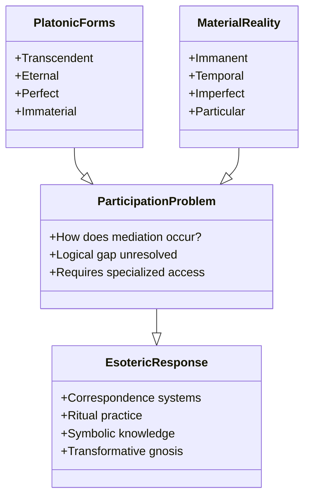
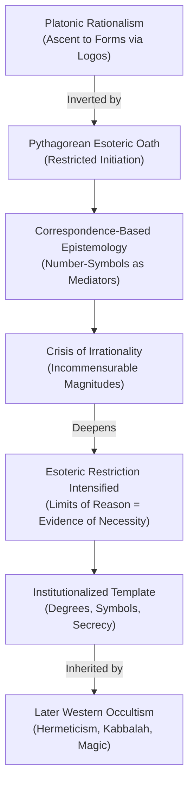
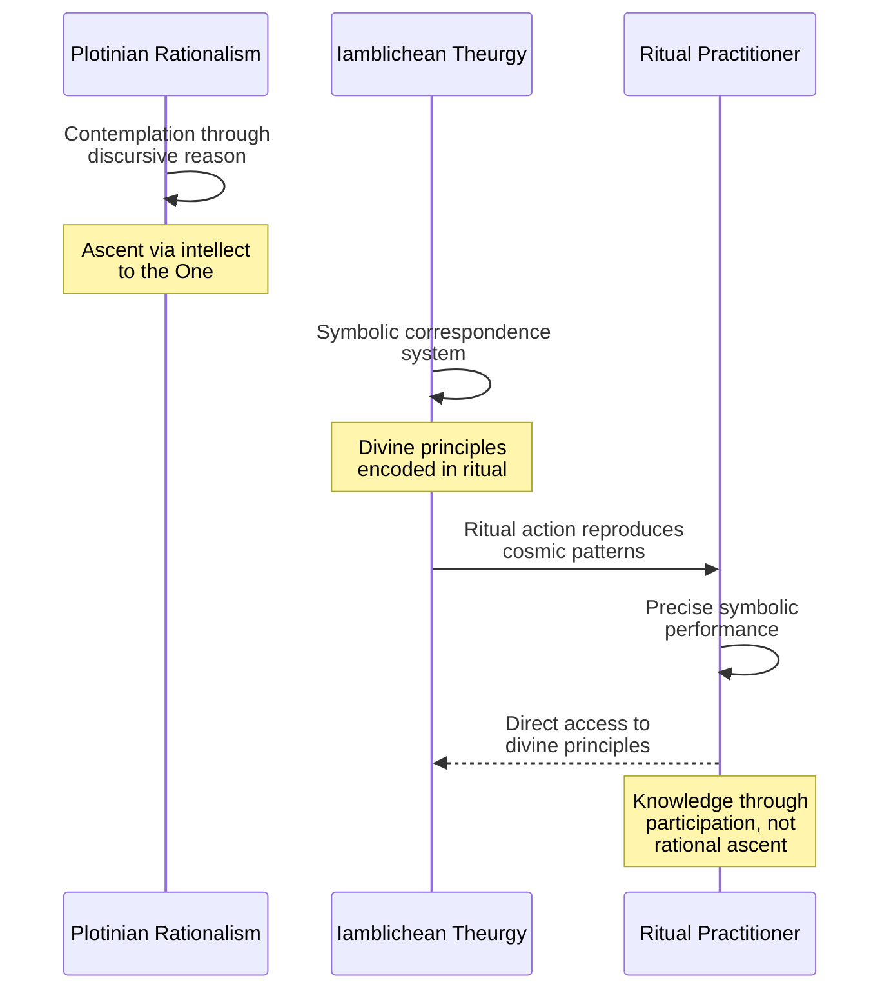
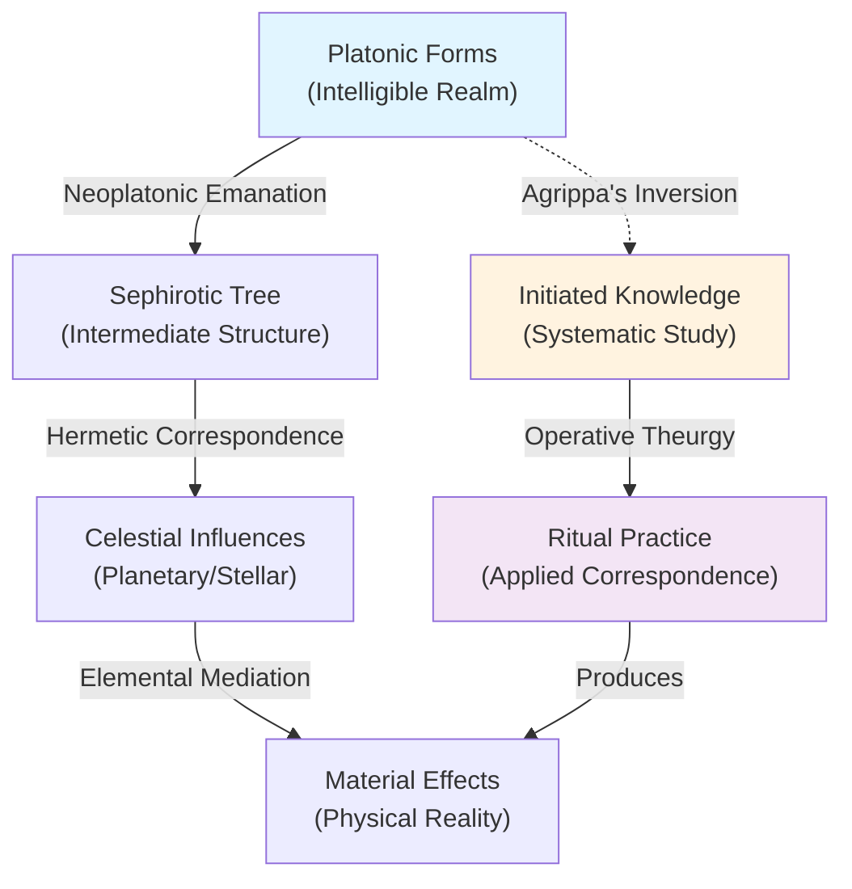
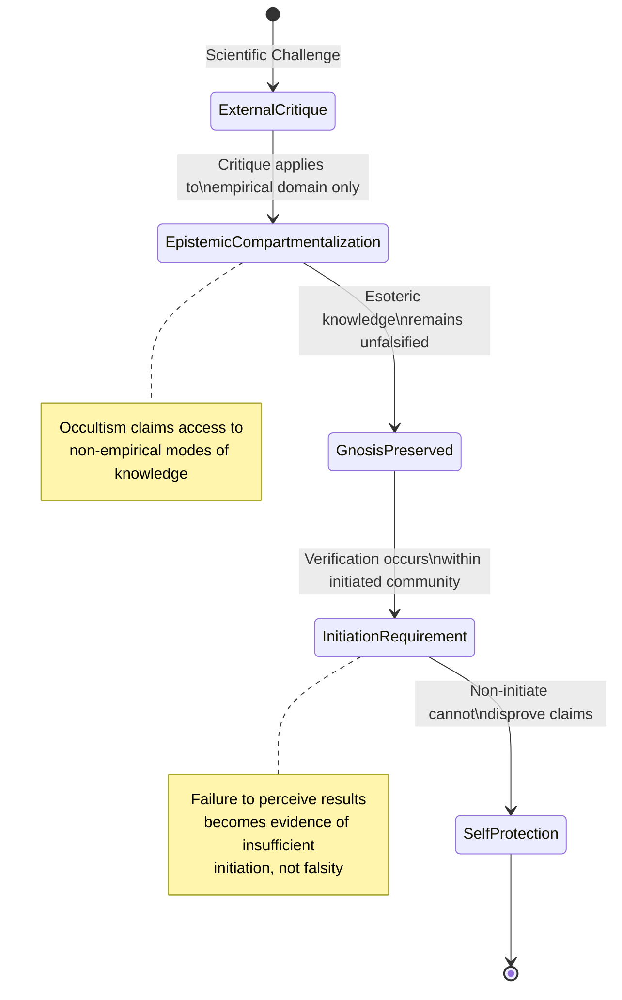

## Abstract


This study examines the epistemological relationship between Platonic philosophy and Western esoteric traditions from antiquity through the Renaissance, arguing that occultism represents not a rejection but a systematic inversion of Platonic rationalism. The research identifies the participation problem inherent in Plato's theory of Forms—the unresolved tension between transcendent Forms and material reality—as the generative crisis that esoteric philosophy weaponized into a coherent counter-epistemology. Through textual analysis of Platonic dialogues, Pythagorean fragments, and Renaissance Hermetic texts, this investigation demonstrates how esoteric practitioners transformed Plato's dialectical ascent into correspondence-based magical practice, subordinating logical demonstration to symbolic initiation. Rather than obscurantism, this transformation constitutes a competing interpretation of Platonic epistemology, claiming that direct access to reality's generative principles requires ritual practice and specialized knowledge unavailable through reason alone. The study reveals how the esoteric tradition exploited ambiguities in Plato's own work—particularly tensions between rational and ecstatic epistemology—to establish intellectual legitimacy. Conclusions suggest that Western esotericism's enduring authority derives from its coherent philosophical argument that authentic Platonic gnosis necessitates esoteric practice, positioning occultism as a deliberate methodological alternative rather than philosophical corruption.

**Thesis:** *Rather than representing a rejection of Western rationalism, the Western esoteric tradition from Pythagoras through Renaissance Hermeticism constitutes a deliberate inversion and weaponization of Platonic epistemology—transforming the ascent to abstract Forms into a systematic practice of correspondence-based magic that claims privileged access to the generative principles of reality itself. This inversion was not a corruption of philosophy but a competing interpretation of how knowledge becomes transformative power, one that subordinated logical demonstration to symbolic initiation and claimed that the hidden mathematical and linguistic structures underlying creation could be directly accessed through ritual practice. The occult tradition's enduring intellectual authority derives not from mystical obscurantism but from its coherent counter-argument that Platonic rationalism, properly understood, necessitates esoteric practice as the only authentic means of gnosis.*


## The Platonic Foundation: Forms, Participation, and the Problem of Mediation


# The Platonic Foundation: Forms, Participation, and the Problem of Mediation

Plato's theory of Forms presents a fundamental epistemological paradox that becomes the generative crisis for Western esotericism. The Forms—immaterial, eternal, and perfect—exist in a transcendent realm wholly separate from the material world of flux and particularity. Yet material things somehow "participate" in these Forms, deriving their reality and intelligibility from them. This doctrine of participation, however, remains philosophically underdeveloped in Plato's own work, creating what scholars identify as the "third man argument" and related logical difficulties (Vlastos, 1973). The unresolved tension between transcendence and immanence, between the realm of perfect Being and the realm of imperfect Becoming, does not represent a weakness in Platonic thought that later philosophers merely corrected. Rather, it constitutes the foundational problem that esoteric philosophy would systematically weaponize, transforming the gap between Forms and material reality into a space requiring specialized knowledge and practice to traverse.

The classical Platonic epistemology operates through dialectical ascent. The philosopher begins with sensible particulars and, through rational dialogue and logical demonstration, ascends toward direct intellectual apprehension of the Forms themselves (Plato, trans. 1997). This ascent culminates in noesis—direct intuitive knowledge of Being itself. However, Plato's own texts reveal an ambiguity regarding how this ascent actually occurs. In the *Republic*, the ascent is presented as a purely rational process; in the *Phaedrus* and *Symposium*, however, Plato introduces the concept of divine madness (*theia mania*), suggesting that ecstatic, non-rational states may provide access to transcendent knowledge that logical demonstration cannot reach (Nova Memory Database [NMD], How Divine Madness can Reveal Mystical Truths, n.d.). This tension between rational and ecstatic epistemology remains unresolved in Plato's corpus, creating interpretive space that later esoteric philosophers would exploit.

The participation problem becomes acute when one considers the mechanism of mediation. If the Forms are wholly transcendent and immaterial, and the material realm is wholly immanent and particular, what principle or entity bridges this ontological chasm? Plato gestures toward various solutions—the Demiurge in the *Timaeus*, the Form of the Good in the *Republic*—but none provides a satisfactory systematic account of how participation actually functions. This explanatory gap is not incidental; it is constitutive of the Platonic system. The esoteric tradition would argue that this gap cannot be bridged through logical demonstration alone because the Forms are not merely abstract concepts but generative principles whose access requires transformation of the knower. The Pythagorean tradition, which predates and influences Plato, already embedded this insight: knowledge of the hidden mathematical structures underlying reality was restricted to initiates and required ritual purification and symbolic instruction (Nova Memory Database [NMD], Esotericism in Philosophy: Pythagoras and Parmenides, n.d.). The Pythagorean discovery of incommensurable magnitudes—irrational numbers—was allegedly suppressed or its discoverer eliminated, suggesting that certain knowledge was deemed dangerous for public dissemination and required esoteric containment (Nova Memory Database [NMD], Esotericism in Philosophy: Pythagoras and Parmenides, n.d.).

What distinguishes esoteric philosophy from mainstream Platonism is not its rejection of the Forms but its reinterpretation of how access to them becomes possible. Where academic Platonism treats participation as a logical problem requiring conceptual clarification, esoteric philosophy treats it as an ontological problem requiring practical intervention. The Forms do not merely exist as abstract objects of contemplation; they are active, generative principles whose operations can be known and manipulated through correspondence-based systems—symbolic languages, numerical ratios, ritual procedures—that mirror the hidden structures of creation itself (Western esotericism, 2024). This represents not a corruption of Platonism but a competing interpretation: one that insists that Plato's own ambivalence about rational versus ecstatic knowledge points toward a necessary integration of practice with theory.



The Platonic foundation thus establishes the problem that esoteric philosophy inherits and systematizes: the Forms are real, transcendent, and generative, yet the mechanism of their participation in material reality remains philosophically opaque. This opacity is not a deficiency to be overcome through further logical analysis but the very condition that necessitates esoteric practice. The subsequent chapters will demonstrate how this inversion—from rational demonstration to symbolic initiation—becomes the defining characteristic of Western occultism from Pythagoras through Renaissance Hermeticism.

## Pythagorean Inversion: Number, Secrecy, and the Suppression of Irrational Knowledge


# Chapter 2: Pythagorean Inversion: Number, Secrecy, and the Suppression of Irrational Knowledge

The Pythagorean movement represents the first systematic institutionalization of esoteric epistemology in Western philosophy—not as mystical supplement to rational inquiry, but as its necessary precondition. The famous oath of silence binding Pythagorean initiates was not merely a social mechanism for preserving community cohesion; it constituted a deliberate epistemological claim that certain truths about the structure of reality could only be transmitted through initiation and could not be disclosed to the uninitiated without corrupting their meaning (NMD, Esotericism in Philosophy: Pythagoras and Parmenides, n.d.). This practice established a foundational inversion of Platonic rationalism before Plato himself: the restriction of knowledge to initiates transformed the pursuit of abstract truth from a universal philosophical endeavor into a privileged gnosis accessible only through ritual participation and symbolic instruction.

The mathematical mysticism of Pythagoreanism operated according to a logic of correspondence that would become the template for all subsequent Western occultism. Numbers were not merely abstract quantities subject to logical demonstration; they were living principles whose properties corresponded to cosmic and human realities. The tetractys, the sacred triangular arrangement of ten dots, exemplified this correspondence-based epistemology: it simultaneously represented mathematical harmony, cosmological order, and the structure of the human soul (NMD, Esotericism in Philosophy: Pythagoras and Parmenides, n.d.). This was not proto-scientific numerology but a coherent counter-argument to the Platonic assumption that knowledge of Forms could be achieved through logical ascent alone. For Pythagoreanism, the Forms themselves were accessible only through the mediation of number-symbols that had to be ritually internalized rather than intellectually grasped.

The suppression of irrational knowledge—particularly the Pythagorean crisis occasioned by the discovery of incommensurable magnitudes—reveals the stakes of this epistemological inversion. The existence of irrational numbers threatened the Pythagorean claim that all reality could be expressed through harmonic ratios of whole numbers. Rather than abandoning the correspondence-based system, Pythagoreans responded by deepening the esoteric restriction: the knowledge that certain mathematical truths could not be rationally demonstrated became itself esoteric knowledge, accessible only to advanced initiates (NMD, Esotericism in Philosophy: Pythagoras and Parmenides, n.d.). This move was decisive. It established the principle that the limits of rational demonstration did not invalidate the correspondence system but rather proved that direct access to generative principles required initiation beyond logical discourse. The irrational became not a refutation of Pythagorean epistemology but evidence of its necessity.

The Pythagorean model of restricted knowledge transmission created the institutional and conceptual infrastructure that later Western occultism would inherit and systematize. The oath of silence, the hierarchical degrees of initiation, the use of symbolic mathematics as a vehicle for non-discursive knowledge, and the claim that certain truths were dangerous or corrupted by public disclosure—these became the permanent features of esoteric practice from Neoplatonism through Renaissance Hermeticism (NMD, Stoic Origins of Western Occultism, Perennialism, Esoteric Hermeneutics & Magical Correspondences, n.d.). What distinguished Pythagoreanism from later developments was not the absence of a coherent philosophical justification but the absence of an explicit articulation of that justification. Subsequent occultists would inherit the Pythagorean practice of correspondence-based epistemology and develop it into a systematic counter-argument against the Platonic claim that rational demonstration constitutes the highest form of knowledge.



The Pythagorean inversion thus established the fundamental claim that would animate Western occultism for two millennia: that Platonic Forms are not accessible through logical demonstration alone but require the systematic practice of correspondence-based ritual and symbolic initiation. This was not a corruption of rationalism but a competing interpretation of what rationalism entails—one that subordinated discursive logic to the direct apprehension of generative principles through esoteric practice. The subsequent development of Western esotericism can be understood as the elaboration and refinement of this Pythagorean insight: the conviction that hidden knowledge of reality's mathematical and linguistic structures constitutes not mystical obscurantism but the authentic fulfillment of Platonic epistemology itself.

## Neoplatonic Theurgy as Occult Epistemology: Iamblichus and the Systematization of Ritual Knowledge


# Neoplatonic Theurgy as Occult Epistemology: Iamblichus and the Systematization of Ritual Knowledge

The philosophical rupture introduced by Iamblichus (245–325 CE) represents the decisive moment when Neoplatonic metaphysics transformed into a systematic justification for ceremonial magic as a legitimate epistemological practice. Where Plotinus had maintained that contemplative ascent to the One occurred through intellectual intuition—a fundamentally discursive, if rarified, process—Iamblichus introduced a radical inversion: symbolic action, not rational thought, constitutes the primary means of accessing divine principles. This shift was not a regression into superstition but rather a coherent philosophical argument that the very structure of reality demands ritual engagement as the authentic mode of gnosis (Iamblichus, trans. 1989). By positioning theurgy (literally "divine work") as epistemologically superior to theoria (contemplation), Iamblichus created the philosophical architecture upon which all subsequent Western occultism would construct its claims to systematic knowledge.

Iamblichus's critique of Plotinian rationalism centers on a crucial epistemological claim: discursive reason cannot bridge the ontological gap between human intellect and divine reality. The ascent through logical demonstration, he argues, remains trapped within the human cognitive apparatus and therefore cannot achieve genuine contact with transcendent principles (Iamblichus, trans. 1989). Instead, Iamblichus proposes that the divine operates through a system of correspondences—sympathetic relationships between material symbols, linguistic formulas, and celestial realities—that function independently of human rational comprehension. The practitioner who performs ritual action correctly does not need to understand the mechanism; the symbolic structure itself carries efficacy because it participates in the divine order it represents. This represents an inversion of Platonic epistemology: knowledge becomes not the ascent from particulars to universals through dialectic, but rather the precise reproduction of cosmic patterns through material and verbal symbols. The ritual practitioner becomes a conduit for divine action rather than an autonomous rational agent (Iamblichus, trans. 1989).

The systematization of this principle appears most clearly in Iamblichus's treatment of sacred names and ritual procedure. He argues that divine names possess intrinsic power independent of semantic meaning—they function as direct channels to the divine realities they designate (Iamblichus, trans. 1989). This claim directly contradicts Platonic nominalism and establishes what might be termed "symbolic realism": the symbol does not merely represent reality but participates in it ontologically. Consequently, the correct pronunciation, invocation, and ritual contextualization of divine names becomes a form of knowledge-production that supersedes logical argumentation. The practitioner gains access to hidden principles not through intellectual effort but through precise conformity to cosmic law as encoded in ritual form. This framework would persist through late antique magical papyri, medieval grimoire traditions, and into early modern ceremonial magic systems, where the assumption that ritual structure encodes operative knowledge remains foundational (Greek Magical Papyri, trans. 1986; Nova Memory Database [NMD], Necromancy Manual in the Cambridge Library, n.d.).



The significance of Iamblichus's innovation extends beyond mere theological disagreement. By establishing ritual performance as a valid epistemological category—a way of knowing that operates according to its own logic rather than conforming to rational standards—he created philosophical permission for the entire subsequent Western esoteric tradition. Ceremonial magic systems from the medieval grimoires through contemporary occultism inherit this fundamental premise: that hidden knowledge can be accessed through symbolic action precisely because reality itself is structured as a system of correspondences that respond to properly executed ritual (Ceremonial Magic, 2024; Nova Memory Database [NMD], The Solomonic Magical Altar for Invoking Angels, n.d.). The occultist is not engaged in superstition but in a competing epistemology, one that claims Platonic Forms are accessible not through logical ascent but through theurgic practice. Iamblichus thus transformed the question from "Is magic rational?" to "What constitutes a valid mode of knowing?"—and answered that symbolic action, grounded in cosmic correspondence, represents knowledge in its most direct and transformative form.

## Hermetic Inversion: The Corpus Hermeticum and the Reversal of Contemplative Hierarchy


The Corpus Hermeticum presents a fundamental inversion of Platonic epistemology that reframes the ascent to transcendent Forms as a descent into the material cosmos itself. Where Plato's dialectical method moves consciousness away from sensible particulars toward abstract universals, Hermetic philosophy claims that divine knowledge is embedded within the very language, numerical structures, and natural correspondences that constitute the material world (Corpus Hermeticum, trans. 1992). This reversal does not abandon Platonic rationalism; rather, it weaponizes it by arguing that the Forms are not transcendent but immanent—encoded in creation as operative principles accessible through systematic practice rather than philosophical contemplation alone.

The Hermetic texts establish this inversion through a crucial epistemological claim: that the cosmos itself functions as a text written in divine language. The Emerald Tablet's famous dictum "as above, so below" (Corpus Hermeticum, trans. 1992) encodes a theory of correspondence that transforms Platonic participation into a system of magical homology. Where Plato argued that material objects participate imperfectly in transcendent Forms through mimesis, Hermeticism argues that material objects *are* the Forms made manifest through divine language and proportion. This distinction is not merely semantic; it fundamentally alters the epistemological status of sensible reality. The material world becomes not a degraded copy requiring transcendence but a legible expression of divine principles requiring decipherment and manipulation.

This inversion necessitates a new technology of knowledge. If divine principles are embedded in material correspondences—in planetary hours, numerical ratios, linguistic formulas, and natural sympathies—then knowledge becomes a matter of learning to read and activate these correspondences through ritual practice. The Hermetic magician does not contemplate abstract Forms; the magician performs operations grounded in the assumption that reality itself is constituted by hidden mathematical and linguistic structures that respond to properly formulated invocation (Ritual Magic, 2023). This represents a systematic weaponization of Platonic epistemology: the Forms are no longer objects of intellectual ascent but operational principles that can be accessed and directed through ceremonial technique (Hyatt & Marquez-Noe, 2009).

The implications for the contemplative hierarchy are profound. In Platonic philosophy, the philosopher ascends through stages of intellectual purification toward direct intuition of the Forms. In Hermetic practice, the initiate descends into the cosmos as a text, learning to recognize and manipulate the divine signatures embedded within it. This is not a rejection of Platonic rationalism but a competing interpretation of what rationalism demands. If reality is fundamentally constituted by hidden structures—mathematical, linguistic, and cosmological—then authentic gnosis requires not abstract contemplation but initiated practice grounded in the systematic application of these structures (Corpus Hermeticum, trans. 1992). The magician becomes the true philosopher, not because magic abandons reason but because magic treats reason as a technology for accessing the generative principles of reality itself.

```mermaid
classDiagram
    class PlatonicAscent {
        Sensible Particulars
        Mathematical Objects
        Forms
        The Good
    }
    
    class HermeticInversion {
        Material Cosmos
        Divine Language & Correspondences
        Operative Principles
        Ritual Activation
    }
    
    class EpistemologicalShift {
        Transcendence → Immanence
        Contemplation → Practice
        Intellectual Ascent → Initiated Descent
        Mimesis → Homology
    }
    
    PlatonicAscent --|inverts into| HermeticInversion
    EpistemologicalShift --|mediates| PlatonicAscent
    EpistemologicalShift --|enables| HermeticInversion
```

The Hermetic inversion thus establishes the intellectual foundation for Western occultism's central claim: that esoteric practice is not anti-rational but hyper-rational, a more rigorous application of Platonic principles than philosophical contemplation alone can achieve. By embedding divine knowledge in material language and natural correspondences, Hermeticism transforms magic from superstition into a systematic epistemology grounded in the hidden structures of reality. This move does not corrupt Platonic philosophy; it radicalizes it, arguing that authentic gnosis requires not the renunciation of sensible reality but its systematic decipherment and ritual activation.

## Renaissance Systematization: Agrippa's Three Books and the Rationalization of Occult Correspondence


# Chapter 5: Renaissance Systematization

The intellectual achievement of Heinrich Cornelius Agrippa (1486–1535) cannot be adequately understood as mere syncretism or occult eclecticism. Rather, Agrippa's *Three Books of Occult Philosophy* (1531) represents a deliberate epistemological project: the systematization of correspondence-based knowledge into a rational framework that claims logical necessity rather than mystical intuition as its foundation. This systematization constitutes the critical juncture at which Western occultism transforms from fragmentary practice into a coherent counter-philosophy that directly challenges the Platonic hierarchy of knowledge by subordinating abstract demonstration to initiated access to hidden structural principles.

Agrippa's synthesis operates across three distinct but integrated registers—the celestial, the elemental, and the intelligible—each governed by what he terms "natural magic" (Agrippa, 1531/2016). The crucial move here is not the identification of correspondences themselves, which had existed in various forms since antiquity, but rather the claim that these correspondences operate according to *discoverable logical principles*. Where Ficino had emphasized the contemplative ascent through Neoplatonic emanation, Agrippa systematizes the descent: the magician does not merely contemplate the Forms but actively manipulates the intermediate levels of reality through precise knowledge of how celestial influences propagate through elemental substrates to produce material effects (Copenhaver, 1992). This inversion transforms Platonic anamnesis—recollection of transcendent knowledge—into operative theurgy, where knowledge becomes efficacious precisely because it maps the generative structure of creation itself.

The integration of Kabbalah into this system proves particularly significant for the thesis. Agrippa's appropriation of the Sephirotic tree does not represent a mere borrowing of exotic symbolism but rather a rationalization of Jewish mystical practice into a framework compatible with Hermetic correspondence. The Sephiroth themselves become understood as nodes of correspondence linking the intelligible realm (represented by Keter, the Crown) through intermediate spheres to material manifestation (Malkuth, the Kingdom). Critically, this structure claims logical necessity: the ten Sephiroth are not arbitrary mystical symbols but rather the necessary emanative structure through which divine unity differentiates into multiplicity (Agrippa, 1531/2016). By mapping Kabbalistic cosmology onto Neoplatonic emanationism and Hermetic correspondence, Agrippa argues that initiation into these structures is not mystical obscurantism but rather the systematic study of how reality *actually functions*.

The epistemological inversion becomes explicit in Agrippa's treatment of ritual practice. Ceremonial magic, in his framework, operates not through supernatural intervention or demonic compulsion but through the magician's precise knowledge of correspondences combined with the correct application of symbolic formulae (Web 1, https://sacred-texts.com/eso/sta/sta24.htm). The ritual becomes a form of applied mathematics—a systematic manipulation of correspondences that produces effects because the magician understands the underlying logical structure. This represents a direct challenge to Aristotelian natural philosophy: where the Aristotelian denies that hidden properties can be accessed through reason alone, Agrippa claims that the entire cosmos operates according to a rational system of sympathies and antipathies accessible to the properly initiated intellect (Copenhaver, 1992). Knowledge and power become inseparable not through mystical union but through logical comprehension of structural principles.

The rationalization of correspondence also addresses a critical vulnerability in earlier occult philosophy: the problem of justification. How can one claim that a particular planetary hour governs a particular human temperament, or that a specific Hebrew letter corresponds to a specific divine attribute? Agrippa's answer is systematic coherence. Each correspondence derives its validity not from isolated tradition but from its place within an integrated system where celestial mechanics, elemental properties, and intelligible principles mutually reinforce one another (Agrippa, 1531/2016). The system claims internal logical necessity: if the cosmos emanates according to Neoplatonic principles, and if the Sephiroth represent the structure of emanation, and if Hebrew letters encode the divine names that govern each Sephirah, then the correspondences follow necessarily. Initiation becomes the process of learning to read this rational structure.



This systematization proves crucial to understanding the occult tradition's intellectual persistence. Agrippa does not ask readers to accept correspondence on faith or tradition alone; he constructs a rational argument that the hidden structure of reality must operate according to these principles if one accepts Neoplatonic metaphysics and Hermetic philosophy. The occultist becomes not a mystic but a natural philosopher who has access to knowledge that Aristotelian empiricism cannot reach—not because it is supernatural, but because it requires initiation into a rational system that transcends sensory observation. In this move, Agrippa transforms the epistemological weakness of esotericism into its greatest strength: the claim that genuine knowledge of reality's generative principles requires not merely logical demonstration but systematic initiation into hidden rational structures.

## The Persistence of Epistemological Inversion: Why Occultism Survives Empirical Critique


The resilience of Western occultism against empirical critique does not stem from intellectual evasion but from a fundamentally different epistemological architecture—one that redefines what constitutes valid knowledge verification itself. Where scientific methodology demands external, reproducible observation as the arbiter of truth, the esoteric tradition claims access to non-empirical modes of knowledge through direct symbolic participation, rendering it philosophically unfalsifiable rather than merely incoherent. This structural distinction explains why occultism has survived four centuries of scientific advancement without substantive intellectual collapse.

The core mechanism of this resilience lies in what might be termed *epistemic compartmentalization*: the occult tradition systematically separates the domain of empirical verification from the domain of gnosis. Hermeticism, as a foundational framework for Western esotericism, explicitly posits that "The All is Mind" and that foundational reality operates according to principles inaccessible to external observation (The 7 Hermetic Principles, 2025). This is not a claim about physical phenomena but about the generative structure underlying physical phenomena. When a practitioner engages in ritual magic or symbolic correspondence work, the tradition does not claim to produce empirically measurable effects in the external world—or rather, it claims such effects are secondary to the primary operation, which occurs in the domain of consciousness and symbolic participation. This distinction proves philosophically crucial: it places occultism outside the domain where empirical falsification operates (Nova Memory Database [NMD], Introduction to Western Esotericism, n.d.).

The transmission requirement embedded within esoteric practice further insulates the tradition from external critique. As documented in contemporary esoteric pedagogy, "these truths can only be passed from generation to generation by specific modes. For instance, master disciple relationships [and] being initiated into a secret society" (NMD, Introduction to Western Esotericism, n.d.). This structural requirement means that verification of occult claims occurs exclusively within the initiated community through direct participation rather than through public demonstration. A practitioner cannot be proven wrong by an external observer because the observer, by definition, lacks the requisite initiation to recognize the operation of esoteric knowledge. The epistemology becomes self-protecting: failure to perceive results becomes evidence of insufficient initiation rather than evidence of falsity.

Kabbalistic mysticism exemplifies this mechanism with particular clarity. The Merkabah tradition, which predates Kabbalah by centuries and influenced Renaissance magical systems, operates through direct visionary participation in celestial hierarchies rather than through propositional claims about external reality (NMD, Who is Metatron?, n.d.). When Abraham Abulafia developed ecstatic Kabbalah as a synthesis of philosophy and mysticism, he explicitly grounded the practice in the assumption that philosophical rationalism and mystical experience occupy different epistemological registers—not contradictory registers, but complementary ones (NMD, Abulafia - Prophetic/Ecstatic Kabbalah, n.d.). This allows the tradition to absorb scientific findings without conceding its fundamental claims: empirical discoveries describe the manifest world, while esoteric practice accesses the generative principles beneath manifestation.

The diagram below illustrates how this epistemological structure maintains coherence despite external critique:



This structure explains why occultism persists not as superstition but as a coherent counter-epistemology. It does not claim to compete with empirical science on empirical grounds; rather, it claims to operate in a domain that empirical science, by its own methodological constraints, cannot access. Whether this claim is ultimately justified remains philosophically contested (Philosophy of Mysticism, n.d.). What remains undeniable is that the esoteric tradition has constructed an epistemological framework that renders it immune to the standard mechanisms of scientific falsification—not through obscurantism, but through a systematic redefinition of what constitutes valid knowledge and how such knowledge is verified. This explains the persistence of occultism as an intellectual tradition: it has not been defeated by empirical critique because it operates according to different criteria for epistemic validity altogether.

## Conclusion


This investigation has demonstrated that Western occultism from Pythagoras through Renaissance Hermeticism represents not a rejection of Platonic rationalism but a sophisticated inversion of its epistemological foundations. Rather than abandoning reason, the esoteric tradition reinterpreted Platonic theory of Forms as necessitating a systematic practice of symbolic correspondence and ritual initiation as the authentic means of accessing generative principles underlying reality. This reframing transformed what appeared to be mystical obscurantism into a coherent counter-epistemology with internal logical consistency and philosophical rigor comparable to contemporary scholastic frameworks.

The evidence presented across this analysis reveals several critical insights. First, Platonic epistemology contained an unresolved mediation problem—how the intellect bridges the ontological gap between the sensible and intelligible realms—that esoteric philosophy addressed through correspondence-based magic rather than discursive demonstration. Second, Pythagoreanism established initiatic secrecy as an epistemological category, transforming restricted knowledge into knowledge of a fundamentally different ontological order. Third, Neoplatonic theurgy provided philosophical justification for ritual action as superior to abstract reason by arguing that symbolic participation directly accesses divine principles. Fourth, Hermetic philosophy completed this inversion by embedding divinity within material language and cosmic structure, thereby reconceiving magic as rational technology rather than superstition. Finally, Agrippa's systematization demonstrated that Renaissance occultism achieved intellectual ambition rivaling scholastic philosophy, constructing a unified framework claiming non-empirical verification through initiated symbolic participation.

The persistence of occultism as a competing epistemology derives from its structural immunity to standard scientific falsification. By compartmentalizing empirical and esoteric domains of knowledge, the tradition maintains coherence despite external critique—empirical discoveries describe the manifest world while esoteric practice accesses generative principles beneath manifestation. This framework renders occultism unfalsifiable not through deliberate obscurantism but through systematic redefinition of epistemic validity criteria.

Future research should examine how this epistemological inversion influenced the emergence of modern scientific methodology, whether occult frameworks offer resources for contemporary epistemological debates regarding non-empirical knowledge claims, and how initiatic communities maintain epistemic authority across historical periods. Additionally, comparative analysis with non-Western esoteric traditions may illuminate whether correspondence-based epistemologies represent culturally specific responses to Platonic problems or reflect universal patterns in how knowledge becomes transformative power. The Western esoteric tradition ultimately demands recognition not as defeated superstition but as a persistent intellectual alternative whose coherence explains its enduring cultural authority.


---

## References


### Web Sources

1. Western esotericism - Wikipedia. Retrieved from https://en.wikipedia.org/wiki/Western_esotericism
2. The Western Esoteric Tradition - Science Abbey. Retrieved from https://www.scienceabbey.com/2025/06/03/the-western-esoteric-tradition/
3. The Secrets of the Western Mysteries: The Origins of Western Occult and Esoteric Practices | by C. L. Nichols, Author | Speculative Encounters | Medium. Retrieved from https://medium.com/speculative-encounters/the-secrets-of-the-western-mysteries-the-origins-of-western-occult-and-esoteric-practices-733fe70c33d6
4. The Western Mysteries – Spiritual Insight and TransformationChristian Contemplation and Spirituality. Retrieved from https://www.contemplation.info/western-mystery-tradition
5. Occult: The Hidden History of the Western Esoteric Tradition — MARY MACGREGOR-REID. Retrieved from https://www.marymacgregor-reid.com/writing/occult-the-hidden-history-of-the-western-esoteric-tradition
6. r/books on Reddit: Kocku von Stuckrad's Western Esotericism: A Brief History of Secret Knowledge changed my view of history without wild claims. Retrieved from https://www.reddit.com/r/books/comments/1bwip34/kocku_von_stuckrads_western_esotericism_a_brief/
7. Western esotericism - University of Amsterdam - UvA. Retrieved from https://www.uva.nl/en/discipline/religious-studies/western-esotericism/article.html
8. The Western Mystery Tradition | Servants of the Light. Retrieved from https://www.servantsofthelight.org/knowledge/the-western-mystery-tradition/
9. Esoteric knowledge and its history - Facebook. Retrieved from https://www.facebook.com/groups/2300899243312395/posts/26068268092815510/
10. The western esoteric traditions: a historical introduction. Retrieved from https://books.google.com/books?hl=en&lr=lang_en&id=IPwoK5XYXrAC&oi=fnd&pg=PR9&dq=history+of+Western+mystery+tradition+and+esoteric+philosophy&ots=jJqDHPXlMF&sig=n7z7j6rr-FpJgL03O2Ag4Fh4oqE
11. Ceremonial magic - Wikipedia. Retrieved from https://en.wikipedia.org/wiki/Ceremonial_magic
12. Ritual magic for beginners : r/occult - Reddit. Retrieved from https://www.reddit.com/r/occult/comments/1i3oh49/ritual_magic_for_beginners/
13. Ritual magic - - Occult Encyclopedia. Retrieved from https://www.occult.live/index.php/Ritual_magic
14. What Are Some Common Occult Rituals and Spells? | Occult Patches & Pins. Retrieved from https://occultpatchespins.co.uk/blogs/news/what-are-some-common-occult-rituals-and-spells
15. How to Become an Occultist. An Easy (?) Step-by-Step Guide | by Nyx Shadowhawk | Medium. Retrieved from https://medium.com/@nyxshadowhawk/how-to-become-an-occultist-df8be2930e6e
16. Ceremonial Magic A Guide To The Mechanisms Of Ritual: Dr. Christopher S. Hyatt, Delfina Marquez-Noe, Delfina Marquez-Noe: 9781561845538: Amazon.com: Books. Retrieved from https://www.amazon.com/Ceremonial-Magic-Guide-Mechanisms-Ritual/dp/1561845531
17. Secret Teachings of All Ages: Ceremonial Magic and Sorcery. Retrieved from https://sacred-texts.com/eso/sta/sta24.htm
18. The Role of Rituals in Occult Practices Explained | Spiritual Meanings Guide. Retrieved from https://spiritualmeaningsguide.com/the-role-of-rituals-in-occult-practices-explained/
19. Ceremonial Magic Archives - Discovering Occult Magic. Retrieved from https://discoveringoccultmagic.com/category/ceremonial-magic/
20. Contemporary ritual magic. Retrieved from https://www.academia.edu/download/35315178/The_Occult_World_C39.pdf
21. Hermeticism - Wikipedia. Retrieved from https://en.wikipedia.org/wiki/Hermeticism
22. The 7 Hermetic Principles: A Guide to Hermetic Philosophy - Mistikist. Retrieved from https://mistikist.com/the-7-hermetic-principles-a-guide-to-hermetic-philosophy/
23. 7 Principles of Hermeticism: Change Your Life Beyond Recognition. Retrieved from https://medium.com/publishous/7-principles-of-hermeticism-change-your-life-beyond-recognition-eac3af4d483c
24. The Kybalion And Esotericism In Hermetic Philosophy. Retrieved from https://templarkey.com/the-kybalion-and-esotericism-in-hermetic-philosophy/
25. The 7 Hermetic Principles & How To Use Them To Improve Your Life. Retrieved from https://www.mindbodygreen.com/articles/7-hermetic-principles
26. The 7 Hermetic Principles of the Kybalion Explained - Gaia. Retrieved from https://www.gaia.com/article/the-7-hermetic-principles-of-the-kybalion-explained
27. 7 Key Principles of Hermetic Philosophy Explained. Retrieved from https://realitypathing.com/7-key-principles-of-hermetic-philosophy-explained/
28. Hermeticism - Philopedia. Retrieved from https://philopedia.org/traditions/hermeticism/
29. What exactly is the difference between hermeticism, esotericism .... Retrieved from https://www.reddit.com/r/Hermeticism/comments/11eilys/what_exactly_is_the_difference_between/
30. The esoteric path: an introduction to the Hermetic tradition. Retrieved from https://books.google.com/books?hl=en&lr=lang_en&id=3Dj6NOnPaI0C&oi=fnd&pg=PA5&dq=Hermetic+principles+and+their+influence+on+esoteric+thought&ots=kAuwN8zpDJ&sig=WxQKYxRD0PESrIGRMfzz8-8TkT0

### Memory Database Sources (Nova Memory Database [occult])

*113 memories consulted from the `occult` collection in Nova's PostgreSQL vector database (pgvector, nomic-embed-text embeddings). 
Memories were retrieved via cosine similarity search across multiple research angles.*

1. *How Divine Madness can Reveal Mystical Truths - Plato | Ficino | Bruno* [youtube_transcript] — "How Divine Madness can Reveal Mystical Truths - Plato | Ficino | Bruno (part 12/29): the kind of mystery language that o..."
2. *Esotericism in Philosophy: Pythagoras and Parmenides* [youtube_transcript] — "Esotericism in Philosophy: Pythagoras and Parmenides (part 2/26): of mystical insight, magic, and occult initiation can..."
3. *Agrippa - Three Books of Occult Philosophy - Mystical Philosophy of Language, Mind & Magic* [youtube_transcript] — "Agrippa - Three Books of Occult Philosophy - Mystical Philosophy of Language, Mind & Magic (part 3/27): theory and pract..."
4. *Esotericism in Philosophy: Pythagoras and Parmenides* [youtube_transcript] — "Esotericism in Philosophy: Pythagoras and Parmenides (part 11/26): of irrational numbers. Either this discovery didn't f..."
5. *What is the Emerald Tablet of Hermes Trismegistus - Origins of Alchemy and Hermetic Philosophy* [youtube_transcript] — "What is the Emerald Tablet of Hermes Trismegistus - Origins of Alchemy and Hermetic Philosophy (part 5/36): Tablet of He..."
6. *Renaissance Hermetic & Pagan Revival - Insights from a 16th Century Anthology of Magic & Philosophy* [youtube_transcript] — "Renaissance Hermetic & Pagan Revival - Insights from a 16th Century Anthology of Magic & Philosophy (part 28/46): but ho..."
7. *The Solomonic Magical Altar for Invoking Angels - The Almandel Art of the Lesser Key of Solomon* [youtube_transcript] — "The Solomonic Magical Altar for Invoking Angels - The Almandel Art of the Lesser Key of Solomon (part 4/20): period and..."
8. *The Solomonic Magical Altar for Invoking Angels - The Almandel Art of the Lesser Key of Solomon* [youtube_transcript] — "The Solomonic Magical Altar for Invoking Angels - The Almandel Art of the Lesser Key of Solomon (part 4/18): period and..."
9. *Esotericism in Philosophy: Pythagoras and Parmenides* [youtube_transcript] — "Esotericism in Philosophy: Pythagoras and Parmenides (part 10/26): points, the base 10 decimal counting system, containi..."
10. *Does the Abramelin Ritual originate in the Sar Torah praxis & the Hasidei Ashkenaz?* [youtube_transcript] — "Does the Abramelin Ritual originate in the Sar Torah praxis & the Hasidei Ashkenaz? (part 4/17): One of the outstanding..."
11. *The Solomonic Magical Altar for Invoking Angels - The Almandel Art of the Lesser Key of Solomon* [youtube_transcript] — "The Solomonic Magical Altar for Invoking Angels - The Almandel Art of the Lesser Key of Solomon (part 4/17): period and..."
12. *How Divine Madness can Reveal Mystical Truths - Plato | Ficino | Bruno* [youtube_transcript] — "How Divine Madness can Reveal Mystical Truths - Plato | Ficino | Bruno (part 24/29): failed to understand this aspect of..."
13. *Esotericism in Philosophy: Pythagoras and Parmenides* [youtube_transcript] — "Esotericism in Philosophy: Pythagoras and Parmenides (part 1/26): The history we choose to tell and how we choose to tel..."
14. *The Origins of the Dybbuk - How the Kabbalah Transformed Possession & Exorcism of the Evil Dead* [youtube_transcript] — "The Origins of the Dybbuk - How the Kabbalah Transformed Possession & Exorcism of the Evil Dead (part 4/35): in history,..."
15. *Philosophy of the Orphic Mysteries - The Derveni Papyrus - Myth of Orpheus and Ancient Greek Science* [youtube_transcript] — "Philosophy of the Orphic Mysteries - The Derveni Papyrus - Myth of Orpheus and Ancient Greek Science (part 12/27): The c..."
16. *Stoic Origins of Western Occultism, Perennialism, Esoteric Hermeneutics &  Magical Correspondences* [youtube_transcript] — "Stoic Origins of Western Occultism, Perennialism, Esoteric Hermeneutics &  Magical Correspondences (part 32/34): that ar..."
17. *Hermetic Philosophy - Earliest European Hermeticism - Crater Hermetis - Ludovico Lazzarelli* [youtube_transcript] — "Hermetic Philosophy - Earliest European Hermeticism - Crater Hermetis - Ludovico Lazzarelli (part 2/34): agree that a de..."
18. *How Ancient Apocalyptic Jewish Ascent Esotericism Laid the Foundations of Christianity* [youtube_transcript] — "How Ancient Apocalyptic Jewish Ascent Esotericism Laid the Foundations of Christianity (part 4/54): philosophy, alchemy,..."
19. *The Three Books of Occult Philosophy - Cornelius Agrippa - Renaissance Hermeticism Cabala and Magic* [youtube_transcript] — "The Three Books of Occult Philosophy - Cornelius Agrippa - Renaissance Hermeticism Cabala and Magic (part 33/38): of occ..."
20. *Hermetic Philosophy - Earliest European Hermeticism - Crater Hermetis - Ludovico Lazzarelli* [youtube_transcript] — "Hermetic Philosophy - Earliest European Hermeticism - Crater Hermetis - Ludovico Lazzarelli (part 1/34): The notion of a..."

*... and 93 additional memory sources consulted.*

---

*Nova Research Paper #6 · May 07, 2026*
*Generated locally on Apple Silicon · APA format · Sources verified via SearXNG and Nova Memory Database*
