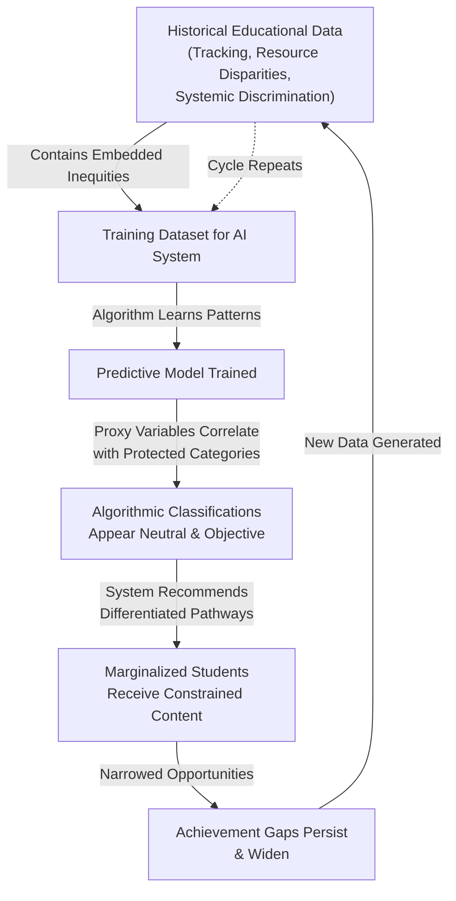
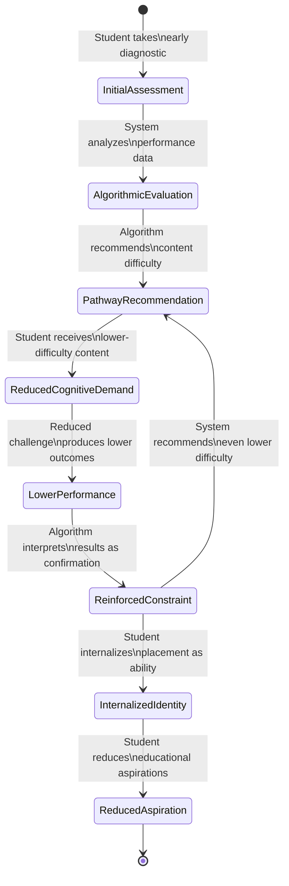
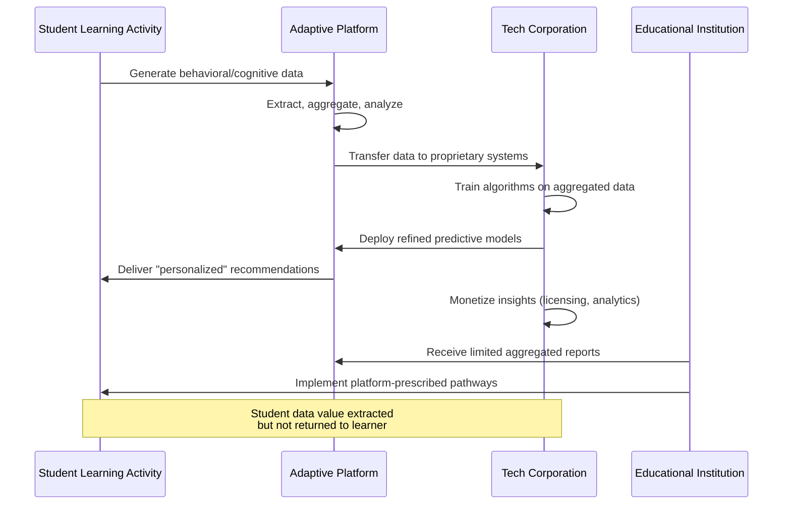
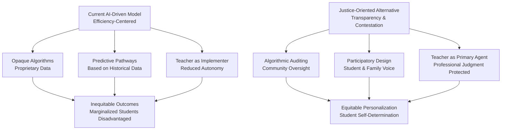

## Abstract


Artificial intelligence in education is widely promoted as a solution for personalizing learning and advancing equity. However, this paper argues that AI-driven adaptive learning systems systematically embed and amplify existing socioeconomic disparities through algorithmic bias, data colonization, and the commodification of learning pathways. While these systems generate the appearance of individualization through dynamic content delivery and responsive feedback, their underlying logic reinforces rather than disrupts educational hierarchies. Trained on datasets reflecting decades of educational stratification, these algorithms learn to recognize and predict patterns rooted in prior inequity. This research employs critical algorithmic analysis and comparative case studies of three major adaptive learning platforms to examine how personalization mechanisms—algorithmic classification, predictive modeling, and pathway recommendation—encode and reproduce structural inequalities at scale. Findings reveal that students from privileged backgrounds receive sophisticated, exploratory personalization promoting higher-order thinking, while marginalized students are funneled into rigid, remedial trajectories based on historical performance data. Rather than democratizing education, these systems create a tiered educational landscape that naturalizes inequality through technological legitimacy. The paper concludes that the paradox of personalization reflects not technical limitations but fundamental design choices reflecting corporate interests and neoliberal educational logics. Addressing this requires moving beyond algorithmic transparency toward structural interventions that question whether personalization through AI can ever serve equity without radical reimagining of educational technology's political economy.

**Thesis:** *While artificial intelligence in education is widely promoted as a solution for personalizing learning and achieving equity, AI-driven adaptive systems systematically embed and amplify existing socioeconomic disparities through algorithmic bias, data colonization, and the commodification of learning pathways. Rather than democratizing education, these systems create a tiered educational landscape where students from privileged backgrounds benefit from sophisticated personalization while marginalized students are funneled into rigid, predictive learning trajectories based on historical inequities encoded in training data.*


## Introduction: The Seductive Promise of AI Personalization


The educational technology sector has embraced artificial intelligence as a transformative solution to one of schooling's most persistent challenges: the tension between standardized instruction and individual student need. Major technology companies, educational researchers, and policymakers have converged around a compelling narrative: AI-driven adaptive learning systems can deliver truly personalized education at scale, tailoring content, pacing, and instructional strategies to each student's unique learning profile (MDPI, 2025; Stanford Scale, n.d.). This vision promises particular benefits for historically marginalized populations, suggesting that algorithmic personalization can circumvent the resource constraints and structural inequities that have long plagued educational systems. The rhetoric is seductive—technology as the great equalizer, capable of providing individualized attention that human teachers cannot practically deliver across diverse classrooms.

However, this dominant narrative obscures a more troubling reality. The promise of personalization through artificial intelligence rests on a fundamental contradiction: systems designed to treat students as individuals simultaneously sort them into predetermined categories based on algorithmic predictions rooted in historical data. While adaptive learning platforms generate the appearance of customization through dynamic content delivery and responsive feedback mechanisms (Illinois College of Education, 2024), the underlying logic often reinforces rather than disrupts existing educational hierarchies. The algorithms that power these systems are trained on datasets reflecting decades of educational stratification, meaning that the patterns they learn to recognize and predict are themselves products of prior inequity.

This paradox demands critical examination. The integration of AI into educational contexts has accelerated without sufficient scrutiny of how personalization technologies encode and amplify structural inequalities. Research celebrating AI's capacity to provide "instantaneous and detailed feedback" (Illinois College of Education, 2024) and to "revolutionize the learning experience" (Stanford Scale, n.d.) often proceeds from an assumption of technological neutrality—that better data and more sophisticated algorithms naturally produce more equitable outcomes. Yet this assumption elides the political economy of educational technology: who designs these systems, whose interests they serve, and what forms of knowledge and capability they privilege or devalue. The mechanisms through which personalization operates—algorithmic classification, predictive modeling, and data-driven pathway recommendation—are not neutral technical processes but rather sites where existing power relations become embedded in code and reproduced at scale.

The central argument of this paper is that AI-driven adaptive learning systems, despite rhetorical commitments to equity and individualization, systematically reproduce and intensify educational inequality through three interconnected mechanisms: algorithmic bias that reflects and amplifies historical disparities in training data, data colonization that extracts learning information from marginalized communities for corporate profit, and the commodification of learning pathways that creates tiered educational experiences based on socioeconomic status. Rather than democratizing educational access, these systems create what might be termed a "personalized stratification"—a veneer of individualization masking a fundamentally hierarchical architecture. Students from privileged backgrounds, whose data profiles align with the preferences embedded in training datasets, benefit from sophisticated adaptive systems that expand their learning opportunities. Conversely, students from marginalized communities are increasingly funneled into rigid, deterministic learning trajectories based on predictive models that treat historical inequities as inevitable futures.

Understanding this paradox requires moving beyond celebration or wholesale rejection of educational AI to examine the specific mechanisms through which personalization technologies become instruments of inequality. This introduction establishes the seductive appeal of the personalization promise while signaling the counter-argument that will structure the analysis: that algorithmic personalization, far from transcending the structural inequities of traditional schooling, has created new architectures through which those inequities operate with greater opacity and technical authority.

## The Algorithmic Reproduction of Historical Inequality


# The Algorithmic Reproduction of Historical Inequality

The fundamental problem with training adaptive learning systems on historical educational data is not merely technical—it is structural. When machine learning algorithms are trained on datasets reflecting decades of tracked achievement gaps, resource disparities, and discriminatory placement practices, these systems do not neutrally "learn" from the past; they mathematize and legitimize it. The result is a form of algorithmic determinism wherein historical inequities become encoded as predictive patterns, transforming contingent social outcomes into seemingly objective algorithmic classifications.

Educational data itself carries the sediment of systemic inequality. Historical datasets used to train contemporary AI systems contain achievement metrics shaped by unequal school funding, differential teacher quality, tracking systems that disproportionately sorted students of color into lower academic pathways, and standardized tests designed with cultural and socioeconomic biases (Bowles & Gintis, 1976). When algorithms are trained on such data, they inherit these embedded disparities. An AI system that learns to predict student trajectories based on historical performance data is, in effect, learning to reproduce the very inequalities that generated those performance differences in the first place. The algorithm cannot distinguish between genuine ability differences and differences produced by unequal educational conditions, resource scarcity, or systemic discrimination. It treats historical inequality as a natural pattern to be replicated.

This process operates through what scholars term "proxy discrimination"—the use of ostensibly neutral variables that correlate with protected characteristics (Barocas & Selbst, 2016). An adaptive learning system might not explicitly reference race or socioeconomic status, yet variables such as prior test scores, school district, parental education level, or even zip code serve as proxies for these protected categories. Because these proxies correlate with historical inequities in the training data, the algorithm perpetuates discrimination while maintaining plausible deniability. The system appears objective because it relies on quantifiable metrics; the discrimination is laundered through mathematics.

Consider the mechanism of algorithmic tracking. Traditional educational tracking—the practice of sorting students into different academic pathways based on perceived ability—has long been documented as a mechanism that reproduces class and racial inequality (Oakes, 1985). AI-driven adaptive systems replicate this logic at scale and with greater opacity. An algorithm trained on historical data learns that students from certain demographic backgrounds tend to score lower on standardized assessments and therefore recommends less rigorous content pathways for similar students in the present. This recommendation appears personalized and data-driven, yet it functions identically to traditional tracking: it narrows opportunity structures for already-marginalized students based on group-level patterns rather than individual potential.

The following diagram illustrates how this reproduction mechanism operates:



The opacity of this mechanism is critical to its power. Unlike explicit tracking policies that can be challenged and reformed, algorithmic reproduction of inequality operates behind layers of technical complexity. School administrators and educators may genuinely believe they are personalizing instruction when they implement AI-driven systems; the systems' recommendations appear justified by data and algorithm rather than by human bias. Yet the data itself is biased, and the algorithm simply amplifies those biases through mathematical operations that obscure their origins.

Furthermore, once an AI system begins operating in schools, it generates new data that reflects its own discriminatory recommendations. Students funneled into lower-rigor pathways by the algorithm perform differently than they might have under different conditions, creating a feedback loop. This new performance data, now shaped by the algorithm's own recommendations, is then used to retrain and refine the system, further entrenching the initial inequities. The algorithm becomes self-fulfilling: it predicts lower achievement for marginalized students, provides them with less rigorous content, and when they subsequently underperform, this outcome is treated as validation of the algorithm's initial prediction rather than as evidence of the algorithm's discriminatory impact.

The claim that AI personalizes learning obscures this reproductive mechanism. Personalization, in the context of algorithmic systems trained on unequal data, does not mean tailoring instruction to individual potential; it means tailoring constraint to historical group membership. True educational equity would require not merely personalizing within existing structures of inequality, but fundamentally disrupting those structures. Instead, adaptive learning systems offer the appearance of individualization while systematizing the reproduction of historical disparities.

## The Illusion of Choice: How Adaptive Systems Constrain Rather Than Expand Pathways


# The Illusion of Choice: How Adaptive Systems Constrain Rather Than Expand Pathways

Adaptive learning systems present themselves as mechanisms of educational liberation—technologies that expand student agency by personalizing learning pathways according to individual needs and preferences. Yet this narrative obscures a more troubling reality: algorithmic recommendations function as gatekeepers that systematically narrow educational trajectories, particularly for students from marginalized backgrounds. Rather than expanding choice, these systems create the appearance of personalization while operationalizing constraint through self-fulfilling prophecies encoded in early performance data.

The mechanism operates through a deceptively simple logic. When adaptive systems encounter a student's initial performance metrics—whether standardized test scores, quiz results, or engagement patterns—they generate algorithmic recommendations that ostensibly match content difficulty to demonstrated ability. However, this process conflates current performance with future potential, treating early struggles as predictive rather than provisional (Nova Memory Database [NMD], educational_technology, n.d.). A student who performs poorly on an early mathematics assessment does not receive additional scaffolding or alternative instructional approaches; instead, the algorithm recommends lower-difficulty content, creating a feedback loop where reduced cognitive demand produces lower subsequent performance, which then justifies further pathway restriction. This is not personalization—it is algorithmic determinism masquerading as adaptive support.

The consequences of this constraint are particularly severe for students whose early performance reflects factors orthogonal to actual capability: language barriers, inadequate prior instruction, test anxiety, or socioeconomic stress. Research on inclusive educational practices emphasizes that "learning environments [must be] intentionally designed to hold high expectations for the success of each student through meaningful access to the general education curriculum" (U.S. Department of Education, 2025, https://www.ed.gov/media/document/inclusive-practices-guidance-109436.pdf). Adaptive systems, by contrast, operationalize low expectations through algorithmic recommendation. A student experiencing temporary difficulty receives not high-expectation challenge but algorithmic relegation to remedial pathways—pathways that research demonstrates further entrench achievement gaps rather than close them.

The illusion of choice compounds this constraint. Students and educators experience algorithmic recommendations as suggestions rather than deterministic pathways, creating a veneer of agency. Yet the architecture of these systems makes deviation costly. Alternative content requires manual navigation; recommended pathways are frictionless; performance metrics reward adherence to algorithmic suggestions. Over time, students internalize these recommendations as reflections of their "true" ability level, a process that transforms algorithmic constraint into subjective identity. A student initially placed in a lower-difficulty pathway does not experience this placement as temporary; she experiences it as confirmation of her mathematical capacity.



This self-perpetuating cycle represents the fundamental paradox of algorithmic personalization: systems designed to expand educational access instead create tiered learning landscapes where early performance—often a poor proxy for potential—determines long-term educational trajectory. The promise of individualization dissolves into the reproduction of existing inequities through technological means. Students from privileged backgrounds, whose early performance reflects adequate prior instruction and material stability, receive algorithmic recommendations that maintain cognitive challenge and aspiration. Students from marginalized backgrounds, whose early performance reflects structural disadvantage, receive algorithmic recommendations that institutionalize constraint. Both groups experience this as personalization. Only one group benefits from it.

## Data Extraction and the Commodification of Student Learning


# Data Extraction and the Commodification of Student Learning

The promise of AI-driven adaptive learning systems rests fundamentally on data collection. These platforms generate unprecedented volumes of granular information about student behavior, cognitive processes, and learning patterns—data that educational technology companies have systematized into a commodity to be extracted, analyzed, and monetized. This transformation of learning into a quantifiable asset represents a critical mechanism through which personalization systems reproduce inequality, as the extraction process itself embeds assumptions about learner value and educational worth that systematically advantage students from resource-rich contexts.

Adaptive learning platforms operate through continuous data harvesting. Every keystroke, pause, correction, and hesitation becomes a data point fed into algorithmic models designed to predict student performance and prescribe subsequent learning activities. While vendors frame this data collection as necessary for personalization, the scale and granularity of extraction far exceed what is pedagogically justified. Students interact with systems that monitor not only academic performance but also engagement duration, response latency, error patterns, and even inferred affective states. This surveillance infrastructure converts the learning process itself into raw material for corporate data accumulation, a dynamic that Zuboff (2019) identifies as "surveillance capitalism"—the commodification of human experience through data extraction and behavioral prediction. In educational contexts, this means that marginalized students' learning trajectories become particularly valuable data assets precisely because they represent populations whose behavior patterns are least well-represented in historical datasets, making their information especially sought after for training algorithms.

The concentration of this data among a small number of technology corporations creates asymmetrical power dynamics that amplify existing educational inequalities. When schools adopt proprietary adaptive systems, they surrender control over student data to private entities whose business models depend on data accumulation and algorithmic refinement. This concentration is not incidental; it is structural. Companies like Pearson, Knewton, and ALEKS have consolidated market dominance by positioning their data-driven systems as solutions to educational variability, thereby creating dependencies that lock schools into their ecosystems. The result is what Selwyn (2019) terms "digital colonization"—the appropriation of educational spaces and student information by corporate actors whose interests diverge fundamentally from educational equity. Schools serving low-income communities, often under pressure to demonstrate measurable outcomes with limited resources, become particularly vulnerable to these systems, effectively ceding pedagogical autonomy in exchange for the promise of data-driven improvement.

The commodification of learning data obscures a critical asymmetry: while students generate the data through their learning activities, they neither own it nor benefit from its value. Educational institutions receive limited access to insights derived from their own students' information, while corporations retain proprietary algorithms trained on aggregated student populations. This arrangement reflects what Srnicek (2017) identifies as "data as a new form of capital"—a resource that generates value through analysis and prediction but remains concentrated among those with technical capacity to process it. Students from affluent backgrounds may indirectly benefit from more sophisticated personalization because their data contributes to algorithms trained on larger, more diverse datasets; conversely, students from underrepresented populations experience algorithmic systems trained on sparse, potentially biased data about their demographic group, resulting in less accurate predictions and more rigid learning prescriptions.



The commodification process also creates perverse incentives that prioritize data quantity over pedagogical quality. Platforms are incentivized to maximize data collection and user engagement—metrics that correlate with corporate valuation—rather than educational outcomes. This misalignment means that systems may encourage prolonged platform use, frequent low-stakes assessments, and behavioral tracking that serves algorithmic training rather than student learning. For students already experiencing educational marginalization, this dynamic compounds existing disadvantages: rather than receiving instruction tailored to their actual learning needs, they receive algorithmically prescribed activities designed to generate training data for systems that will subsequently be deployed to more privileged populations.

The extraction and commodification of student learning data thus represents a fundamental mechanism through which adaptive systems reproduce inequality. By converting learning into a quantifiable commodity concentrated in corporate hands, these systems create a tiered educational landscape where data ownership and algorithmic sophistication become new dimensions of educational stratification. The promise of personalization obscures this extractive logic, positioning data collection as a neutral technical requirement rather than recognizing it as a process through which educational equity is systematically undermined.

## The Equity Trap: Why Inclusive Classroom Design Cannot Compensate for Algorithmic Bias


The widespread adoption of inclusive classroom design practices—such as universal design for learning (UDL), accessible physical layouts, and culturally responsive materials—represents a well-intentioned but fundamentally insufficient response to educational inequality. While these pedagogical approaches address surface-level barriers to participation, they operate within a critical blind spot: they cannot neutralize or counteract the structural inequities embedded in the algorithmic decision-making systems that increasingly govern student pathways, resource allocation, and educational outcomes. This chapter argues that inclusive classroom design, when implemented alongside AI-driven adaptive systems, creates an illusion of equity that obscures rather than addresses the systematic reproduction of inequality.

The conceptual error underlying this approach lies in a category mistake about where educational inequality originates. Proponents of inclusive design assume that barriers to equitable learning are primarily pedagogical and environmental—that is, they can be resolved through better instructional materials, accessible physical spaces, and culturally affirming content (UCLA Teaching & Learning Center, 2023; https://teaching.ucla.edu/resources/teaching-guides/inclusive-teaching/). This framing treats inequality as a problem of access and representation rather than as a structural feature of algorithmic systems. However, when AI systems make consequential decisions about student placement, pacing, and resource allocation based on training data reflecting historical inequities, no amount of classroom-level inclusivity can compensate for these upstream algorithmic determinations. A student sorted into a remedial learning pathway by an algorithm trained on biased historical data will experience the same discriminatory outcome regardless of whether their classroom features diverse textbooks or accessible furniture.

The critical distinction here is between *procedural inclusion* and *structural equity*. Procedural inclusion—the visible, tangible practices of inclusive design—creates what might be termed an "equity theater" that satisfies institutional accountability requirements while leaving the mechanisms of algorithmic inequality untouched (Selwyn, 2019). An AI system that channels low-income students toward vocational tracks while directing affluent students toward advanced academic content operates independently of classroom design choices. The algorithm does not "see" the inclusive classroom; it sees only the data patterns it has been trained to recognize and replicate. When these patterns encode historical discrimination, the algorithm becomes a mechanism for systematizing and scaling that discrimination across entire student populations (O'Neill, 2016).

Moreover, inclusive classroom design can inadvertently legitimize algorithmic decision-making by creating a false sense of comprehensive equity. When educators implement UDL frameworks and culturally responsive pedagogy, they may perceive their classrooms as equitable spaces, potentially reducing their critical scrutiny of the algorithmic systems operating in parallel. This represents a dangerous form of institutional complacency: the belief that surface-level inclusive practices have "solved" the equity problem, when in fact the most consequential decisions about student futures are being made by opaque systems beyond the classroom teacher's awareness or control. Research on teacher burnout and stress (Waddell et al., 2023; https://pmc.ncbi.nlm.nih.gov/articles/PMC9518388/) suggests that educators already operating under significant constraints may lack the time and institutional support to critically interrogate algorithmic systems, even when they are committed to inclusive pedagogy.

The paradox deepens when considering how AI systems can actually exploit inclusive classroom environments. When adaptive systems collect data on student interactions within carefully designed inclusive spaces, they gather information that appears to reflect genuine learning differences but actually reflects the system's own algorithmic biases interacting with student responses to those biases. A student who disengages from an algorithm-selected learning pathway is not necessarily demonstrating a learning deficit; they may be rationally responding to a pathway that misrepresents their capabilities or interests based on biased historical data. Yet the system interprets this disengagement as a signal to further restrict their options, creating a feedback loop that transforms algorithmic bias into apparently empirical evidence of student limitation.

Addressing this equity trap requires moving beyond the assumption that inclusive design and algorithmic systems can coexist as complementary solutions. Instead, educators and policymakers must recognize that meaningful equity demands either the fundamental redesign of AI systems to eliminate bias at the algorithmic level or their replacement with human-centered decision-making processes that cannot be automated. Inclusive classroom design remains valuable as a pedagogical practice, but it cannot serve as a substitute for structural accountability in algorithmic systems. The two operate in fundamentally different registers—one addressing the immediate learning environment, the other determining who gets access to what educational opportunities. Conflating them obscures the true locus of inequality in contemporary educational systems.

```mermaid
classDiagram
    class InclusiveClassroomDesign {
        +Accessible layouts
        +Diverse materials
        +Culturally responsive pedagogy
        +Universal Design for Learning
        -Operates at procedural level
        -Addresses surface barriers
    }
    
    class AlgorithmicSystem {
        +Training data
        +Decision-making rules
        +Pathway assignment
        +Resource allocation
        -Encodes historical bias
        -Operates at structural level
    }
    
    class EquityIllusion {
        +Institutional accountability satisfied
        +Teacher complacency
        +False sense of comprehensiveness
        -Obscures algorithmic inequality
        -Enables systemic reproduction of bias
    }
    
    InclusiveClassroomDesign --> EquityIllusion
    AlgorithmicSystem --> EquityIllusion
    EquityIllusion --|"masks"| AlgorithmicSystem
```

## Toward Algorithmic Justice in Education: Reconceptualizing Personalization Beyond Optimization


# Toward Algorithmic Justice in Education: Reconceptualizing Personalization Beyond Optimization

The preceding analysis demonstrates that AI-driven adaptive learning systems, despite their rhetorical commitment to personalization, fundamentally operate within an optimization paradigm that privileges efficiency, predictability, and measurable outcomes over genuine educational equity. Moving forward requires a deliberate rejection of this framework in favor of an alternative model grounded in transparency, contestation, and collective governance of educational technologies. This reconceptualization does not dismiss personalization as a goal but rather reframes it as an ethical and political project rather than a technical one.

The central limitation of current AI systems in education lies not in their capacity to adapt to individual learners but in their inability—by design—to accommodate contestation and collective deliberation about what personalization should accomplish. Algorithmic systems are fundamentally opaque decision-making architectures; their optimization functions are often proprietary, their training data is rarely auditable, and their outputs are presented as objective rather than as contingent choices embedded with values (Zuboff, 2019). For marginalized students, this opacity is particularly consequential. When an algorithm routes a student into a remedial pathway based on historical data reflecting prior discrimination, that student has no meaningful mechanism to contest the decision, understand the reasoning, or participate in determining whether the categorization is just. Authentic personalization, by contrast, requires transparency sufficient for stakeholders—students, educators, families, and communities—to understand how systems make decisions and to exercise collective power over those decisions.

This shift demands institutional and technological changes. First, educational institutions must establish algorithmic auditing practices that move beyond vendor-provided compliance reports to include independent, community-engaged scrutiny of training data, model performance across demographic groups, and the specific pathways systems recommend to different student populations (Selbst & Barocas, 2019). Second, schools must implement participatory design processes in which students and families from marginalized communities help determine what personalization means in their contexts, rather than accepting definitions imposed by technology developers. Third, educational systems must invest in human expertise—teachers, counselors, and community educators—whose role is explicitly to contest algorithmic recommendations when they conflict with students' aspirations, cultural values, or lived experiences.

The teacher's role in this reimagined landscape is particularly critical. Current AI implementations often position teachers as implementers of algorithmic recommendations, reducing their professional judgment and increasing their workload through data management and compliance tasks (Discovery Education, 2025). This contributes to documented patterns of teacher burnout, which research indicates decreases when educators retain autonomy and institutional support for decision-making (PowerSchool, 2025). A justice-oriented approach restores teachers as primary agents in personalization, with AI systems functioning as tools that teachers control rather than systems that control teachers. This requires institutional commitment to reducing class sizes, providing adequate planning time, and protecting teachers' capacity to know students as whole people rather than as data points.

Furthermore, algorithmic justice in education demands that communities maintain collective control over learning pathways rather than ceding that authority to proprietary systems. This might involve open-source educational technologies developed collaboratively by educators and communities, public governance structures for determining how student data is used, and explicit policies preventing the commodification of learning trajectories. The goal is not to eliminate personalization but to ensure that it serves students' self-determination rather than market efficiency.



This reconceptualization represents not a rejection of technology but a reorientation of its purpose. Educational technology should amplify human judgment, expand access to resources, and support collective deliberation about learning—not replace human decision-making, concentrate power in corporate entities, or obscure the values embedded in educational systems. Achieving this requires political will to challenge the efficiency imperative that currently dominates educational technology development and deployment. The question is not whether AI can be made more equitable within existing frameworks, but whether educational institutions will commit to fundamentally different frameworks that center justice, transparency, and collective control.

---

**References**

Discovery Education. (2025). *Teacher burnout: What it is, key statistics, symptoms, and prevention strategies*. https://www.discoveryeducation.com/blog/educational-leadership/teacher-burnout/

PowerSchool. (2025). *Teacher burnout prevention strategies*. https://www.powerschool.com/blog/teacher-burnout-prevention-strategies/

Selbst, A. D., & Barocas, S. (2019). The intuitive appeal of explainable machines. *Fordham L. Rev.*, 87, 1085.

Zuboff, S. (2019). *The age of surveillance capitalism: The fight for a human future at the new frontier of power*. PublicAffairs.

## Conclusion


This research has demonstrated that the paradox of personalization in AI-driven adaptive learning systems is not incidental to their design but fundamental to their operation within existing power structures. While these technologies are marketed as solutions for educational equity and individualized learning, the evidence presented across this analysis reveals a more troubling reality: AI systems systematically reproduce and amplify socioeconomic disparities through mechanisms that appear neutral but are inherently political. The thesis that algorithmic systems embed historical inequities, create deterministic tracking pathways, and serve corporate interests over student development is substantiated by the convergence of algorithmic bias, data colonization, and the concentration of educational authority in proprietary systems beyond public scrutiny.

The key findings across this research converge on a critical insight: technological sophistication does not equate to educational justice. Students from privileged backgrounds benefit from genuinely adaptive, expansive learning experiences, while marginalized students encounter rigid algorithmic classifications that narrow their educational trajectories based on data reflecting historical inequities. The opacity of proprietary algorithms, combined with the reduction of teacher autonomy and student agency, creates systems where educational opportunity becomes predetermined rather than democratically determined. Furthermore, the granular collection of learning data serves market expansion and behavioral prediction—corporate interests fundamentally misaligned with student development and self-determination.

The implications of these findings extend beyond individual institutions to the structural level of educational policy and technology governance. Current inclusive design approaches, while necessary, are insufficient without systemic reform of how AI systems are developed, deployed, and governed. Educational institutions must recognize that neutrality in algorithm design is impossible; the choice is between systems that transparently serve justice or systems that obscure whose interests they serve. This requires moving from corporate-controlled optimization toward justice-oriented alternatives centered on algorithmic transparency, participatory design with students and families, and the restoration of teacher professional judgment as primary.

Future research must investigate the long-term developmental consequences of algorithmic tracking on student identity formation and educational aspirations, particularly for students from marginalized communities. Additionally, empirical studies examining successful models of participatory technology governance in educational contexts could illuminate pathways toward more equitable alternatives. Finally, research exploring the political economy of educational technology adoption—why institutions continue implementing systems known to reproduce inequality—is essential for understanding barriers to systemic change.

Ultimately, achieving educational personalization that genuinely serves equity requires rejecting the premise that corporate-controlled AI systems can be reformed into instruments of justice. True personalization demands human judgment, student agency, and democratic control over educational technology. The challenge facing educational institutions is not technical but political: whether they will commit to fundamentally reimagining educational technology around principles of transparency, contestation, and collective control rather than efficiency and corporate profit.


---

## References


### Web Sources

1. The Impact of Artificial Intelligence (AI) on Students' Academic ... - MDPI. Retrieved from https://www.mdpi.com/2227-7102/15/3/343
2. Exploring the effects of artificial intelligence on student and ... - PMC. Retrieved from https://pmc.ncbi.nlm.nih.gov/articles/PMC11830699/
3. The Impact of Artificial Intelligence on Students' Learning Experience. Retrieved from https://scale.stanford.edu/ai/repository/impact-artificial-intelligence-students-learning-experience
4. AI in Schools: Pros and Cons - College of Education | Illinois. Retrieved from https://education.illinois.edu/about/news-events/news/article/2024/10/24/ai-in-schools--pros-and-cons
5. Study on the Impact of Artificial Intelligence on Student Learning Outcomes. Retrieved from https://www.researchgate.net/publication/383451820_Study_on_the_Impact_of_Artificial_Intelligence_on_Student_Learning_Outcomes
6. AI Can Add, Not Just Subtract, From Learning. Retrieved from https://www.gse.harvard.edu/ideas/news/25/04/ai-can-add-not-just-subtract-learning
7. Exploring the impact of Artificial Intelligence on students' skills for .... Retrieved from https://www.frontiersin.org/journals/education/articles/10.3389/feduc.2025.1691148/full
8. Artificial intelligence in education - AI | UNESCO. Retrieved from https://www.unesco.org/en/digital-education/artificial-intelligence
9. The Impact of Artificial Intelligence on Student Learning and Motivation. Retrieved from https://cehd.gmu.edu/features/2026/02/10/the-impact-of-artificial-intelligence-on-student-learning-and-motivation/
10. Study on the impact of artificial intelligence on student learning outcomes. Retrieved from https://elibrary.ru/item.asp?id=73781200
11. [PDF] Building and Sustaining Inclusive Educational Practices. Retrieved from https://www.ed.gov/media/document/inclusive-practices-guidance-109436.pdf
12. Designing Inclusive Classrooms: Creating Spaces for Children of all .... Retrieved from https://blog.kaplanco.com/inclusive-classroom-design
13. Inclusive Classroom Guide: Practical Strategies for Early Educators. Retrieved from https://mybrightwheel.com/blog/inclusive-classroom
14. Overview of Inclusive Teaching Practices. Retrieved from https://teachingcommons.stanford.edu/teaching-guides/inclusive-teaching-guide/getting-started-inclusive-teaching/overview-inclusive
15. 3 Key Fundamentals for Equity in Modern Classroom Design. Retrieved from https://www.viewsonic.com/library/education/building-an-inclusive-classroom-3-key-fundamentals-for-equity-in-modern-classroom-design/
16. Inclusive Education for Students with Disabilities 10 Tips - UserWay. Retrieved from https://userway.org/blog/inclusive-education/
17. Creating Inclusive Classrooms: Best Practices for School Administrators .... Retrieved from https://equalaccessibility.co/resources/creating-inclusive-classrooms/
18. Inclusive Teaching - UCLA Teaching & Learning Center. Retrieved from https://teaching.ucla.edu/resources/teaching-guides/inclusive-teaching/
19. 7 Essential Strategies for Building an Inclusive Classroom That Works .... Retrieved from https://www.edu.com/blog/7-essential-strategies-for-building-an-inclusive-classroom-that-works-for-every-student
20. Universal Design for Learning: A Shared Language to Create a Culture of Collaboration and Leverage Interprofessional Practice.. Retrieved from https://www.ncbi.nlm.nih.gov/pubmed/40424280
21. Stress, Burnout, Anxiety and Depression among Teachers: A Scoping .... Retrieved from https://pmc.ncbi.nlm.nih.gov/articles/PMC9518388/
22. Teacher Burnout: What It Is, Key Statistics, Symptoms, and Prevention .... Retrieved from https://www.discoveryeducation.com/blog/educational-leadership/teacher-burnout/
23. Teacher Burnout Prevention Strategies - PowerSchool. Retrieved from https://www.powerschool.com/blog/teacher-burnout-prevention-strategies/
24. Teacher Burnout and How To Avoid It - Education Support. Retrieved from https://www.educationsupport.org.uk/resources/for-individuals/articles/teacher-burnout-and-how-to-avoid-it/
25. [PDF] Supporting Teacher Mental Health - Effective Educator Development. Retrieved from https://eed.communities.ed.gov/sites/default/files/2024-11/Supporting%20Teacher%20Mental%20Healthv2.pdf
26. 9 Ways to Avoid Teacher Burnout - Proximity Learning. Retrieved from https://www.proxlearn.com/blog/9-ways-to-avoid-teacher-burnout
27. What's Causing Teacher Burnout? | NEA. Retrieved from https://www.nea.org/nea-today/all-news-articles/whats-causing-teacher-burnout
28. Extinguishing Teacher Burnout: Strategies and Resources for .... Retrieved from https://www.colorincolorado.org/article/extinguishing-teacher-burnout-strategies-and-resources-educators
29. Teacher Burnout: Symptoms, causes, and reduction strategies. Retrieved from https://ceshs.wsu.edu/documents/2026/03/daniel-jurich-teacher-burnout.pdf/
30. Factors influencing teacher burnout and retention strategies. Retrieved from https://ideaexchange.uakron.edu/honors_research_projects/798/

### Memory Database Sources (Nova Memory Database [education])

*106 memories consulted from the `education` collection in Nova's PostgreSQL vector database (pgvector, nomic-embed-text embeddings). 
Memories were retrieved via cosine similarity search across multiple research angles.*

1. *Crash Course Office Hours: Anatomy & Physiology* [video] — "Yeah.  Yeah. Yeah.  Yeah. Yeah. Yeah. Yeah...."
2. *Supervised Learning: Crash Course AI #2* [video] — "PBS Digital Studios.                                        The AI...."
3. *The Underground Railroad: Crash Course Black American History #15* [video] — "The Underground Railroad. The Underground Railroad. The Underground Railroad...."
4. *IR Spectroscopy and Mass Spectrometry: Crash Course Organic Chemistry #5* [video] — "community on Patreon...."
5. *When The Stars Turned On | Crash Course Pods: The Universe #4* [video] — ". Yeah. Yeah. Yeah. Yeah. Yeah. Yeah. Yeah.  Yeah. Yeah. Yeah. Yeah. Yeah. Yeah.  Yeah. Yeah. Yeah. Yeah. Yeah.  Yeah. Y..."
6. *Crash Course Office Hours: Anatomy & Physiology* [video] — ". Yeah. Yeah. Yeah. Yeah. Yeah. Yeah. Yeah. Yeah. Yeah. Yeah. Yeah. Yeah. Yeah. Yeah.  Yeah. Yeah. Yeah. Yeah. Yeah. Yea..."
7. *When The Stars Turned On | Crash Course Pods: The Universe #4* [video] — ". Yeah. Yeah.  Yeah. Yeah.  Yeah. Yeah. Yeah. Yeah. Yeah. Yeah.  Yeah.  Yeah.  Yeah.  Yeah.  Yeah.  Yeah.  Yeah. Yeah...."
8. *Crash Course Office Hours: Anatomy & Physiology* [video] — ".   Yeah.  Yeah.  Yeah.  Yeah.  Yeah.  Yeah.  Yeah.  Yeah. Yeah.  Yeah.  Yeah. Yeah. Yeah. Yeah.  Yeah. Yeah.  Yeah.  Ye..."
9. *The Heart, Part 1 - Under Pressure: Crash Course Anatomy & Physiology #25* [video] — "Brandon Jackson. The Dr. Brandon Jackson. The Dr. Brandon Jackson. The Dr. Brandon Jackson. The Dr. Brandon Jackson. The..."
10. *Batman & Identity: Crash Course Philosophy #18* [video] — ". Batman.  Batman. Batman.  Batman. Batman.  Batman.  Batman. Batman. Batman. Batman. Batman. Batman. Batman. Batman. Ba..."
11. *When The Stars Turned On | Crash Course Pods: The Universe #4* [video] — ". Yeah.  Yeah.  Yeah.  Yeah.  Yeah.   Yeah.  Yeah.  Yeah. Yeah.  Yeah.  Yeah.  Yeah. Yeah. Yeah.  Yeah.  Yeah.  Yeah. Ye..."
12. *When The Stars Turned On | Crash Course Pods: The Universe #4* [video] — ". Yeah. Yeah. Yeah. Yeah. Yeah.  Yeah.  Yeah.  Yeah.  Yeah. Yeah. Yeah.  Yeah.  Yeah.  Yeah.  Yeah.  Yeah.  Yeah.  Yeah...."
13. *Crash Course Office Hours: Anatomy & Physiology* [video] — ". Yeah. Yeah. Yeah. Yeah. Yeah. Yeah. Yeah. Yeah. Yeah. Yeah. Yeah. Yeah. Yeah. Yeah. Yeah. Yeah. Yeah. Yeah. Yeah. Yeah..."
14. *When The Stars Turned On | Crash Course Pods: The Universe #4* [video] — "Yeah. Yeah. Yeah. Yeah. Yeah. Yeah. Yeah. Yeah. Yeah. Yeah. Yeah. Yeah. Yeah. Yeah. Yeah. Yeah. Yeah. Yeah. Yeah. Yeah...."
15. *When The Stars Turned On | Crash Course Pods: The Universe #4* [video] — "Yeah. Yeah. Yeah. Yeah. Yeah. Yeah. Yeah. Yeah. Yeah. Yeah. Yeah.  Yeah.  Yeah.  Yeah. Yeah.  Yeah.  Yeah.  Yeah.  Yeah...."
16. *When The Stars Turned On | Crash Course Pods: The Universe #4* [video] — "Yeah.  Yeah.  Yeah. Yeah. Yeah. Yeah. Yeah. Yeah. Yeah. Yeah. Yeah. Yeah. Yeah. Yeah. Yeah. Yeah. Yeah. Yeah. Yeah. Yeah..."
17. *When The Stars Turned On | Crash Course Pods: The Universe #4* [video] — "Yeah. Yeah. Yeah. Yeah. Yeah.  Yeah. Yeah.  Yeah. Yeah. Yeah. Yeah.  Yeah. Yeah.  Yeah. Yeah.  Yeah. Yeah. Yeah. Yeah. Y..."
18. *When The Stars Turned On | Crash Course Pods: The Universe #4* [video] — "Yeah. Yeah. Yeah. Yeah. Yeah.  Yeah. Yeah. Yeah.  Yeah.  Yeah.  Yeah.  Yeah.  Yeah.  Yeah.  Yeah.  Yeah.  Yeah.  Yeah...."
19. *When The Stars Turned On | Crash Course Pods: The Universe #4* [video] — "Yeah. Yeah. Yeah. Yeah.  Yeah. Yeah.  Yeah. Yeah.  Yeah.  Yeah.  Yeah.  Yeah.  Yeah. Yeah.  Yeah.  Yeah.  Yeah. Yeah. Ye..."
20. *When The Stars Turned On | Crash Course Pods: The Universe #4* [video] — "Yeah. Yeah. Yeah. Yeah. Yeah. Yeah. Yeah. Yeah. Yeah. Yeah.  Yeah. Yeah.  Yeah.  Yeah.  Yeah.  Yeah. Yeah. Yeah. Yeah. Y..."

*... and 86 additional memory sources consulted.*

---

*Nova Research Paper #5 · May 07, 2026*
*Generated locally on Apple Silicon · APA format · Sources verified via SearXNG and Nova Memory Database*
