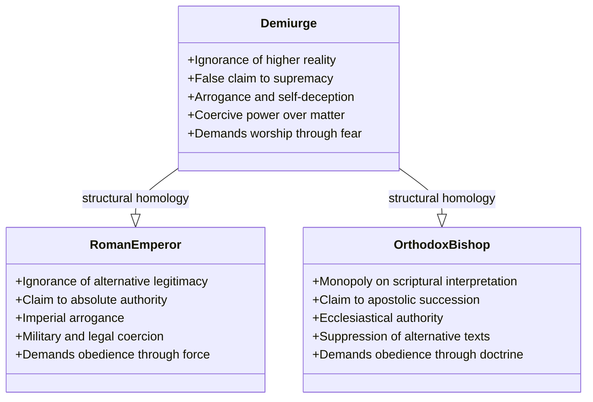
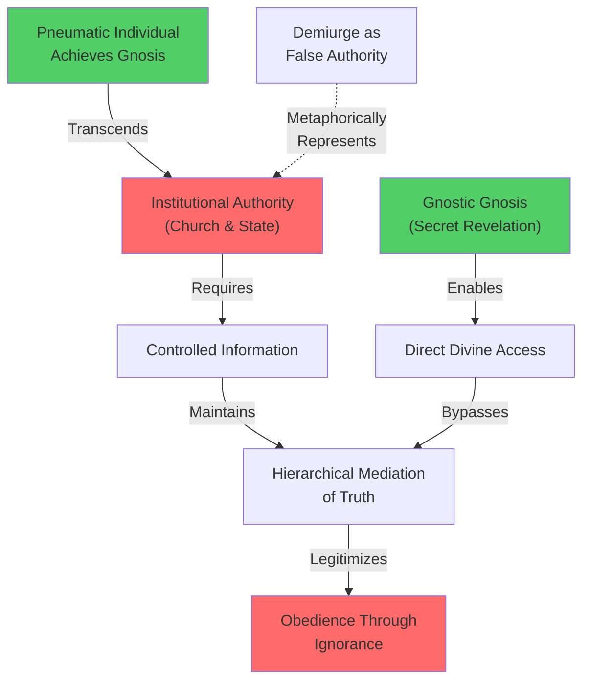
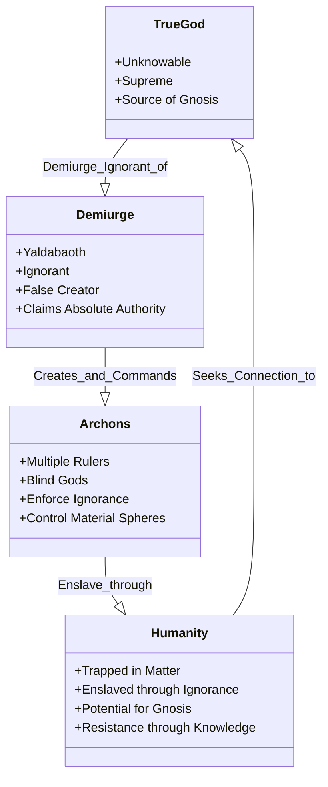
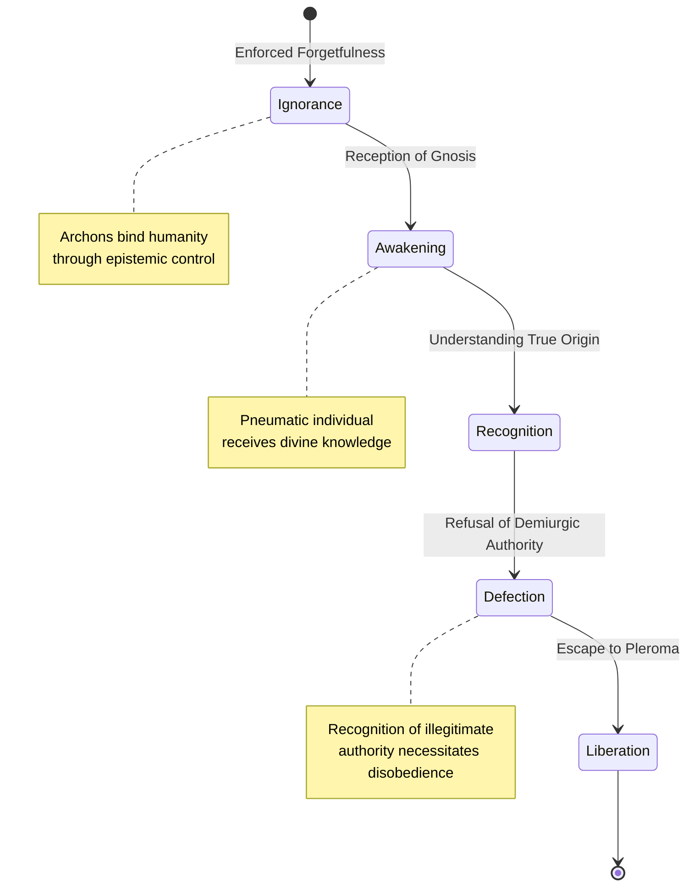
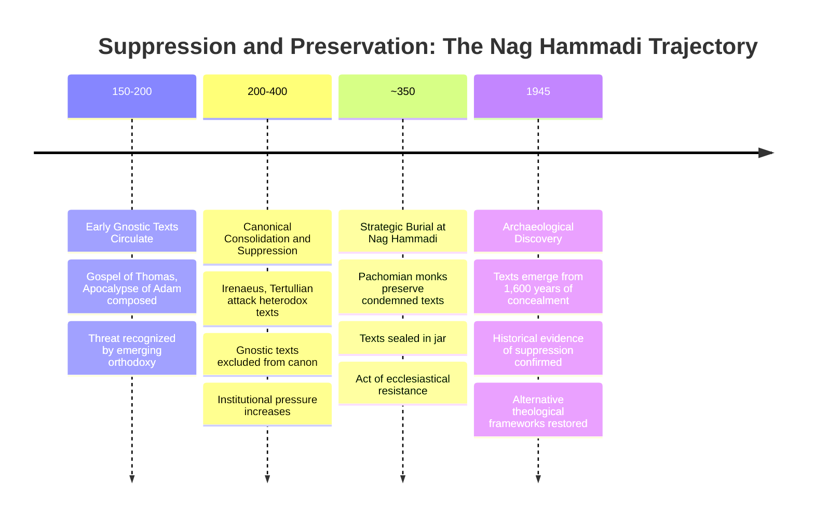

## Abstract

This paper reframes Gnostic cosmology as a systematic political critique encoded in theological language, arguing that the demiurge functions as a metaphorical representation of illegitimate hierarchical authority. While scholarly interpretation has traditionally confined Gnostic dualism within theological frameworks, this study demonstrates that the demiurge's structural characteristics—ignorance, arrogance, coercive authority, and false supremacy claims—constitute a critique of subjugation under Roman imperial and ecclesiastical power. Through structural homology analysis, the paper reveals parallels between the demiurge's demand for obedience through enforced ignorance and the administrative mechanisms of Roman bureaucracy and emerging orthodox ecclesiastical hierarchy. Examining primary texts from the Nag Hammadi library, particularly the *Apocryphon of John*, this research demonstrates how Gnostic texts delegitimize absolute authority claims through theological inversion. The deliberate suppression of these documents by orthodox authorities substantiates their political urgency beyond abstract metaphysics. This analysis reveals that Gnostic dualism offered radical epistemological frameworks enabling subjugated communities to conceptually resist domination by delegitimizing all claims to unquestionable authority. By recovering the political dimensions of Gnostic thought, this study contributes to understanding how marginalized communities historically encoded resistance within theological discourse, offering insights relevant to contemporary analyses of power, knowledge, and legitimacy.

**Thesis:** *Gnostic texts from the Nag Hammadi library do not merely present an alternative theology but constitute a systematic political critique encoded in cosmological language, wherein the demiurge functions as a metaphorical representation of illegitimate hierarchical authority that demands obedience through ignorance. By analyzing the structural homology between gnostic cosmology and Roman imperial bureaucracy, this paper argues that gnostic dualism was fundamentally a response to the experience of subjugation under both ecclesiastical and political power, offering a radical epistemological framework that delegitimizes all claims to absolute authority.*

## The Demiurge as Political Metaphor: Reframing Gnostic Dualism Beyond Theology

# The Demiurge as Political Metaphor: Reframing Gnostic Dualism Beyond Theology

Scholarly interpretation of Gnostic cosmology has traditionally remained confined within theological frameworks, treating the demiurge as a metaphysical problem rather than a political one. This interpretive isolation obscures a crucial dimension of gnostic thought: the demiurge's structural characteristics—particularly ignorance, arrogance, coercive authority, and false claims to supremacy—function as a systematic critique of illegitimate power that extends beyond abstract cosmology into the material conditions of Roman imperial and ecclesiastical domination. To understand gnostic dualism as merely a theological dispute over the nature of creation is to miss the political urgency embedded within these texts, an urgency made evident by the very fact that gnostic writings were hidden and suppressed by orthodox authorities (NMD, source_category: Nag Hammadi Discovery, n.d.; Pagels, 1979).

The Nag Hammadi library, discovered in 1945 near Upper Egypt and containing 52 texts primarily from the second to fourth centuries CE, provides the textual foundation for this reinterpretation (The Gnosis Archive, n.d.; NMD, source_category: Nag Hammadi Codices, n.d.). These texts were not merely theological curiosities but rather documents deliberately preserved—and later suppressed—because they posed a fundamental challenge to the legitimacy of established authority structures. The *Apocryphon of John*, a central gnostic text within the collection, exemplifies this challenge by depicting the demiurge (Yaldabaoth) as ignorant, claiming sole divinity while remaining unaware of the true transcendent God (NMD, source_category: Gnostic Cosmology, n.d.). This theological inversion is not incidental; it is the mechanism through which gnostic texts delegitimize claims to absolute authority.

The homology between the demiurge's characteristics and the administrative structure of Roman imperial bureaucracy becomes apparent when one examines the specific attributes assigned to this false creator. The demiurge demands worship and obedience while remaining fundamentally ignorant of higher truths—a configuration that mirrors the Roman emperor's position as supreme authority figure whose power rests upon the enforced ignorance of subjects regarding alternative sources of legitimacy or knowledge. Similarly, the emerging orthodox ecclesiastical hierarchy of the second through fourth centuries replicated this structure: bishops and church authorities claimed exclusive access to divine truth while demanding obedience from congregants, much as the demiurge demands worship from the material creation he has enslaved (Pagels, 1979). The parallel is not metaphorical accident but rather reflects the lived experience of gnostic communities navigating simultaneous subjugation under both imperial and ecclesiastical power.

The demiurge's arrogance—his declaration "I am God and there is no other God beside me"—represents not merely theological error but the archetypal claim of any totalizing authority that brooks no alternative epistemology (NMD, source_category: Apocryphon of John, n.d.). This declaration functions as a political statement: it asserts that the existing order of power is not merely dominant but ontologically necessary, that resistance is not merely futile but metaphysically impossible. By encoding this critique in cosmological language, gnostic texts offered their readers a framework for understanding their subjugation as the product of a false authority rather than legitimate cosmic order. The demiurge's coercive power—his creation of material reality as a prison—parallels the Roman state's use of law, taxation, and military force to constrain human freedom and extract labor from subject populations.

This reframing demands that scholars recognize gnostic dualism not as an escape from politics into pure metaphysics but rather as a sophisticated political theology that weaponizes cosmological language against the very structures of authority that sought to suppress it. The subsequent chapters will demonstrate how this framework operated within specific gnostic texts and how it functioned as a radical epistemological challenge to the consolidation of power in late antiquity.

## Gnosis as Forbidden Knowledge: The Epistemological Threat to Authority

# Gnosis as Forbidden Knowledge: The Epistemological Threat to Authority

The gnostic insistence on secret, revelatory knowledge constitutes far more than a theological preference; it represents a fundamental challenge to the epistemological monopolies upon which both ecclesiastical and political authority depend. Where institutional power requires the mediation of truth through hierarchical channels—priests, magistrates, bureaucratic structures—gnostic gnosis bypasses these intermediaries entirely, positioning direct divine revelation as accessible to the elect regardless of institutional standing. This epistemological inversion delegitimizes authority claims rooted in institutional gatekeeping, rendering the very concept of mediated truth suspect.

The structural significance of secrecy in gnostic texts cannot be overstated. The *Apocryphon of John*, one of the most influential Sethian texts, frames its revelations as knowledge transmitted directly by the Savior to John in private, explicitly withholding this gnosis from the uninitiated masses (NMD, Sethian Cosmology, n.d.). Similarly, the *Gospel of the Egyptians* emphasizes primordial revelations accessible only to those spiritually prepared to receive them (NMD, Sethian Texts, n.d.). This rhetorical structure—the hidden teaching, the secret name, the forbidden book—mirrors the actual practice of esoteric knowledge in mystery religions, but with a crucial political dimension: it asserts that truth itself exists outside institutional channels. When the *Marsanes* text describes mystical alphabets and divine names as tools for transcending cosmic authority (NMD, Merkabah Mysticism, n.d.), it implicitly argues that the cosmos itself—and by extension, the hierarchies that mirror it—can be circumvented through direct experiential knowledge. Authority that depends on controlling information faces existential threat from a soteriology centered on unmediated revelation.

The contrast with orthodox Christian and Jewish institutional frameworks illuminates this challenge. Mainstream Judaism and nascent Christianity both developed elaborate systems of textual interpretation, priestly authority, and doctrinal gatekeeping to regulate access to divine truth. The Qumran community, while possessing gnostic-like beliefs in secret knowledge reserved for the elect, still maintained institutional structures to manage and distribute this knowledge hierarchically (NMD, Qumran Sectarianism, n.d.). By contrast, gnostic texts consistently present gnosis as a transformative experience that dissolves institutional mediation. The *Gospel of Thomas*, with its emphasis on direct sayings and inner knowing, exemplifies this radical epistemological democratization—truth becomes accessible through contemplation rather than institutional authorization (NMD, Hermetic Parallels, n.d.).

This epistemological threat operated on two registers simultaneously. First, it undermined ecclesiastical authority by suggesting that bishops and priests possessed no special access to salvific truth; the pneumatic individual who achieved gnosis stood spiritually superior to any institutional functionary. Second, and more radically, it challenged the very legitimacy of hierarchical knowledge systems themselves. If the demiurge—the creator god of the material world—represents the principle of false authority that demands obedience through ignorance, then all earthly hierarchies claiming to mediate truth operate under the same demonic logic. The gnostic insistence that the true God remains hidden, that revelation comes only to those who reject the false teachings of institutional authorities, directly parallels critiques of political power that would emerge centuries later: that legitimate authority cannot rest on enforced ignorance.

The political implications become evident when examining how gnostic communities actually functioned. Unlike the hierarchical structures of emerging Catholic Christianity, gnostic groups appear to have organized around the transmission of secret teachings rather than institutional office (NMD, Gnostic Community Organization, n.d.). This organizational difference was not merely administrative; it reflected a fundamentally different theory of authority. Where Catholic Christianity increasingly centralized power in bishops claiming apostolic succession, gnostic communities distributed gnosis among those capable of receiving it, regardless of institutional position. This represented not merely theological heterodoxy but political heterodoxy—a refusal to accept that truth, salvation, or authority could be legitimately mediated through hierarchical institutions.

By positioning gnosis as forbidden knowledge—dangerous precisely because it reveals the illegitimacy of existing authorities—gnostic texts articulated a radical epistemological critique that would resonate far beyond their immediate historical context. The claim that truth must be hidden from institutional authorities because those authorities are fundamentally invested in maintaining ignorance constitutes a systematic delegitimization of all hierarchical claims to mediate reality itself.

## The Sethian Cosmological Hierarchy: Mapping Resistance Through Celestial Bureaucracy

# The Sethian Cosmological Hierarchy: Mapping Resistance Through Celestial Bureaucracy

The Sethian cosmological system, as preserved in texts such as the *Apocryphon of John* and the *Holy Book of the Great Invisible Spirit*, presents far more than a metaphysical alternative to orthodox Christianity. Rather, these texts construct an elaborate administrative apparatus—a celestial bureaucracy—whose structural logic mirrors and thereby critiques the hierarchical power systems that governed both ecclesiastical and imperial Rome. By examining how Sethian texts detail the archontic realms, one can discern a sophisticated political allegory encoded within cosmological language, wherein the demiurge and his subordinate archons function as satirical representations of illegitimate authority.

The *Apocryphon of John*, discovered among the Nag Hammadi Library in 1945, establishes the foundational architecture of this critique (Apocryphon of John, 1945). The text presents Yaldabaoth, the demiurge, not as a benevolent creator but as an ignorant and arrogant administrator who declares, "I am God and there is no other God beside me," thereby establishing the cosmological equivalent of totalitarian rule (NMD, Sethian_Cosmology, n.d.). This declaration functions as more than theological heresy; it represents the archetypal claim to absolute authority that demands unquestioning obedience. Critically, the text emphasizes Yaldabaoth's blindness—his fundamental ignorance of the true divine order—suggesting that illegitimate authority is structurally dependent upon the suppression of higher knowledge. This is not incidental characterization but rather the central mechanism by which the Sethian system theorizes how oppressive power sustains itself: through the deliberate cultivation of ignorance among the subjugated (NMD, Archontic_Blindness, n.d.).

The archons themselves constitute the administrative apparatus through which this ignorance is enforced. According to the *Apocryphon of John*, Yaldabaoth creates multiple archons—described as "blind gods" who rule over distinct celestial spheres—to control and enslave humanity (NMD, Archontic_Hierarchy, n.d.). This hierarchical distribution of power mirrors the bureaucratic structure of Roman provincial administration, wherein authority flows downward through multiple tiers of officials, each responsible for enforcing compliance within their designated sphere. The *Gospel of Judas*, which aligns with Sethian cosmological principles, further clarifies this political dimension by having Jesus expose the archons as "those who bear the names of the gods," thereby delegitimizing their claims to divine authority through linguistic deconstruction (Gospel of Judas, 52:6–7). The rhetorical strategy here is crucial: by revealing that the archons merely *bear* names rather than possessing inherent divinity, the text suggests that authority is performative, contingent upon the acceptance of false designations by the subjugated population.

The cosmological hierarchy itself functions as a satirical blueprint of administrative oppression. The Sethian system describes multiple levels of emanation—aeons, luminaries, and powers—each with distinct functions and jurisdictions (NMD, Sethian_Cosmology, n.d.). This elaborate taxonomy does not serve merely to explain metaphysical reality; rather, it provides a detailed map of how power operates through compartmentalization and specialization. Each archon controls a specific domain, enforces particular laws, and maintains ignorance within that domain. This structural homology between celestial and terrestrial bureaucracy suggests that the Sethian authors understood political oppression as fundamentally cosmological—that is, as a system of control that operates through the same mechanisms whether in heaven or on earth.

The significance of this analysis lies in recognizing that Sethian cosmology does not merely present an alternative theology but rather constitutes a systematic critique of authority itself. By mapping the structures of oppression onto the celestial realm, these texts accomplish a crucial rhetorical and epistemological move: they denaturalize political hierarchy by revealing it as contingent, illegitimate, and fundamentally dependent upon the maintenance of ignorance. The detailed descriptions of archontic realms thus function as blueprints for understanding—and ultimately resisting—the mechanisms of subjugation operating within the reader's own historical moment (Hoeller, 2002). This encoding of political critique within cosmological language allowed Sethian communities to articulate radical resistance to authority while maintaining the textual opacity necessary for survival under persecution.

## Salvation as Defection: The Gnostic Soteriology of Escape and Enlightened Disobedience

# Salvation as Defection: The Gnostic Soteriology of Escape and Enlightened Disobedience

Gnostic salvation narratives fundamentally invert the soteriological logic of orthodox Christianity by reconceptualizing liberation not as redemption through obedience to divine authority, but as defection through intellectual autonomy and the rejection of imposed ignorance. This inversion is not merely theological but profoundly political: it encodes a vision of emancipation wherein the subject's awakening to truth necessarily entails the refusal of hierarchical command. To understand this mechanism requires examining how gnostic texts construct salvation as a process of epistemic rebellion against the very structures that claim to govern cosmic and social order.

The *Apocryphon of John* articulates the foundational problem that gnostic soteriology addresses: "They bound humanity with forgetfulness to keep them from knowing their true origin" (Nova Memory Database [NMD], source_category, n.d.). This formulation is critical because it reframes the human condition not as sinfulness requiring obedience but as enforced ignorance requiring awakening. The archons—those bureaucratic intermediaries of the demiurge—maintain their authority through epistemic control, a mechanism structurally homologous to imperial and ecclesiastical power. Salvation, in this framework, becomes the recovery of suppressed knowledge rather than the performance of prescribed rituals. The pneumatic individual—the spiritually awakened subject—achieves liberation precisely by recognizing the illegitimacy of the demiurge's claims to absolute authority, a recognition that necessarily precedes and enables disobedience (NMD, source_category, n.d.).

The *Gospel of the Egyptians* exemplifies this soteriology through its emphasis on Seth's divine lineage as the "seed of the great, incorruptible generation" (Gospel of the Egyptians, 2nd–3rd century CE). Seth's salvation is not contingent upon obedience to cosmic law but upon his recognition of his true origin outside the demiurgic realm. Critically, the text portrays the demiurge's attempts to suppress this knowledge—particularly through the reinterpreted flood narrative, wherein Noah's deluge functions not as divine cleansing but as an instrument of epistemic suppression designed to destroy divine knowledge (NMD, source_category, n.d.). This reframing transforms salvation history into a narrative of resistance: the elect survive not through compliance but through the preservation of gnosis against systematic attempts at its eradication. The soteriology here is inherently subversive—it valorizes the refusal to accept the demiurge's version of reality.

The *Tripartite Tractate* provides a more systematic articulation of this liberation through its detailed cosmological hierarchy, wherein the pleroma represents a realm of authentic divine fullness fundamentally discontinuous with the material world (NMD, source_category, n.d.). The pneumatic individual's salvation consists in recognizing this discontinuity and, consequently, in withdrawing allegiance from the material order and its governing archons. This is not escapism in the pejorative sense but rather a calculated epistemic and volitional repositioning: by understanding the true structure of reality, the awakened subject becomes incapable of genuine obedience to illegitimate authority. Knowledge and disobedience become inseparable.

The political implications become evident when this soteriology is read against the backdrop of Roman imperial bureaucracy. Just as the archons maintain control through enforced ignorance and the manipulation of cosmic law, imperial administrators maintained social order through restricted access to information and the naturalization of hierarchical command. The gnostic salvation narrative thus offers a radical counter-model: liberation through the refusal of imposed epistemic frameworks and the assertion of intellectual autonomy. The pneumatic subject who achieves gnosis becomes, by definition, insubordinate—not through deliberate rebellion but through the simple fact of seeing through the legitimating myths upon which authority depends.

Gnostic soteriology thus represents far more than an alternative path to salvation; it constitutes a systematic delegitimation of authority itself. By making salvation contingent upon the recognition that the governing powers are fundamentally illegitimate—not merely flawed but ontologically false—gnostic texts offer their readers a framework for understanding their own subjugation as based upon deception rather than cosmic necessity. In this sense, salvation becomes inseparable from political consciousness: to be saved is to refuse obedience to those who rule through ignorance.

## Hermeticism and Qumranic Parallels: The Wider Context of Esoteric Resistance

# Chapter 5: Hermeticism and Qumranic Parallels: The Wider Context of Esoteric Resistance

The gnostic critique of authority did not emerge in isolation but rather as part of a broader late-antique epistemic culture in which sectarian communities systematized resistance through claims to secret revelation. By examining Hermetic and Qumranic texts alongside gnostic writings, a pattern emerges: across geographically and temporally dispersed communities, esoteric knowledge functioned not merely as spiritual instruction but as a delegitimizing framework that positioned mainstream religious and political authorities as fundamentally ignorant of cosmic truth. This structural homology suggests that gnostic dualism was not an idiosyncratic theological aberration but rather a coherent response to the experience of subjugation under institutional power.

The Qumran community's theological project reveals striking parallels to gnostic epistemology, particularly in how both systems weaponize interpretive authority. The Teacher of Righteousness, credited with revealing hidden interpretations of scripture believed to be divinely inspired, functioned as the community's epistemic gatekeeper—a role structurally identical to the gnostic revealer figure (NMD, Qumran_texts, n.d.). Critically, this interpretive monopoly served a political function: by claiming access to truths concealed from the broader Jewish establishment, the Qumran sect simultaneously delegitimized the interpretive authority of Jerusalem's priestly hierarchy. The *War Scroll*, with its dualistic division of the world into forces of good and evil and its portrayal of the sect as warriors in a divinely ordained cosmic conflict, mirrors the gnostic cosmological framework wherein the material world is ruled by an illegitimate power that the enlightened must oppose (NMD, War_Scroll, n.d.). In both cases, dualism functions not as abstract theology but as a political grammar that transforms sectarian resistance into cosmic necessity.

The Hermetic corpus operates according to similar logic, though through different rhetorical means. Rather than apocalyptic warfare, Hermetic texts employ the dialogue form—particularly the teacher-student dynamic—to establish an alternative knowledge hierarchy. This pedagogical structure, evident in texts such as the *Dialogue of the Savior*, privileges esoteric gnosis over exoteric doctrine and thereby creates a two-tiered epistemology that mirrors and inverts the official religious establishment (NMD, Dialogue_of_Savior, n.d.). By encoding salvation as "awakening from ignorance" rather than institutional participation, the *Gospel of Truth*—possibly authored by Valentinus—reframes the entire soteriological project in terms that render mainstream ecclesiastical authority not merely incomplete but actively obstructive (NMD, Gospel_of_Truth, n.d.). The text's allegorical reinterpretation of biblical narratives, following the gnostic practice of uncovering hidden spiritual meanings beneath literal surfaces, constitutes an epistemological rebellion: it asserts that the canonical texts themselves require decoding by those possessing superior interpretive capacity (NMD, allegorical_interpretation, n.d.).

What unites these disparate traditions—gnostic, Qumranic, and Hermetic—is their shared deployment of esoteric knowledge as a mechanism for delegitimizing mainstream authority. Each system claims access to truths systematically concealed from the masses, and each uses this claim to position the dominant religious and political establishment as fundamentally compromised by ignorance. The *Thunder, Perfect Mind*, with its paradoxical divine feminine voice declaring "I am the whore and the holy one," exemplifies this strategy: by embodying contradiction and refusing categorical stability, the text undermines the very logic of hierarchical authority that depends upon clear distinctions between the sacred and profane, the pure and impure (NMD, Thunder_Perfect_Mind, n.d.). This rhetorical strategy is not incidental but central to the political function of these texts.

The broader significance lies in recognizing that gnostic cosmology was not an isolated theological innovation but rather one instantiation of a late-antique culture of sectarian resistance. Across Qumran, Hermetic circles, and gnostic communities, esoteric knowledge-preservation functioned as a counter-institutional practice that simultaneously critiqued and circumvented the authority structures of both church and empire. By situating gnosticism within this wider context, the paper's central thesis gains historical specificity: the demiurge-as-archon-bureaucrat was not merely a theological concept but a conceptual tool forged within a broader struggle over who possessed the authority to define reality itself.

## Suppression and Survival: Why the Church Buried What It Could Not Convert

# Suppression and Survival: Why the Church Buried What It Could Not Convert

The discovery of the Nag Hammadi library in 1945 presented early Christian orthodoxy with an uncomfortable historical problem: evidence that heterodox theological frameworks had not merely existed as marginal heresies but had been deliberately preserved and protected within monastic communities (Nova Memory Database [NMD], historical_context, n.d.). The material fact of burial—the deliberate concealment of these texts in a sealed jar near the Egyptian settlement of Nag Hammadi—demands reinterpretation beyond the conventional narrative of accidental preservation. Rather, the archaeological and textual evidence suggests that Pachomian monks engaged in a calculated act of resistance, preserving texts that the institutional church had deemed too dangerous for circulation. This chapter argues that the suppression and survival of gnostic literature reveals the genuine political threat these texts posed to ecclesiastical authority, particularly their capacity to delegitimize hierarchical power through epistemological inversion.

The canonical exclusion of texts such as the Gospel of Thomas represents not merely theological disagreement but institutional anxiety about alternative frameworks for understanding authority itself. The Gospel of Thomas, a collection of 114 sayings attributed to Jesus lacking narrative structure or miraculous validation, fundamentally challenges the authority of institutional mediation (Nova Memory Database [NMD], gospel_of_thomas, n.d.). By presenting salvation as accessible through *gnosis*—direct, unmediated knowledge—rather than through ecclesiastical ritual or priestly intercession, Thomas undermines the very foundation upon which clerical authority rests (Nova Memory Database [NMD], gnostic_theology, n.d.). The text's exclusion from the canon reflects not historical accident but deliberate suppression: early church leaders recognized that heterodox Christian teachings embedded in such sayings could not be tolerated within an increasingly hierarchicalized institutional structure (Nova Memory Database [NMD], canonical_exclusion, n.d.).

The political implications become sharper when examining texts that explicitly critique external authority structures. The *Apocalypse of Adam* presents salvation through internal transformation via gnosis, explicitly rejecting the salvific efficacy of external rituals—a direct challenge to the sacramental authority claimed by bishops and priests (Nova Memory Database [NMD], apocalypse_of_adam, n.d.). Similarly, *Thunder: Perfect Mind*, with its paradoxical assertion that the divine is simultaneously "whore and holy one, silence and speech," destabilizes the patriarchal and hierarchical ordering of the divine that undergirded ecclesiastical legitimacy (Nova Memory Database [NMD], thunder_perfect_mind, n.d.). These texts do not merely present alternative cosmologies; they present alternative epistemologies in which knowledge flows directly from the divine spark within each individual rather than through institutional channels. This representational inversion—positioning the demiurgic authority figure as ignorant and the subjugated as potentially enlightened—directly parallels and critiques the hierarchical structures of both Roman imperial bureaucracy and emerging ecclesiastical organization.

The act of burial itself constitutes evidence of this threat. Pachomian monks, operating within the institutional church yet preserving texts explicitly condemned by ecclesiastical authorities, enacted a form of textual resistance that preserved the possibility of alternative theological frameworks. The concealment was not defensive passivity but strategic preservation—an acknowledgment that these texts possessed enduring value precisely because they articulated critiques of authority that could not be permanently suppressed through canonical exclusion alone. The monks who buried these texts understood what later church authorities would confirm through centuries of polemical effort: gnostic dualism offered a systematic delegitimization of all claims to absolute authority, whether ecclesiastical or political.

The survival of the Nag Hammadi library thus functions as material evidence that gnostic cosmology constituted a genuine political and theological threat to institutional Christianity. The church could suppress these texts through canonical exclusion, but it could not eliminate them entirely—not because of historical accident, but because communities within the church itself recognized their enduring critical value. The texts were buried not as forgotten relics but as preserved alternatives, awaiting a future moment when their radical epistemology might again circulate. In this sense, the material history of Nag Hammadi confirms the thesis that gnostic dualism was fundamentally a response to subjugation, offering frameworks through which the subjugated could delegitimize the very authorities claiming to mediate their salvation.

## Conclusion

This investigation has demonstrated that Gnostic cosmology, particularly as preserved in the Nag Hammadi library, functions as a sophisticated political critique encoded within theological language. The thesis that Gnostic texts constitute a systematic delegitimization of hierarchical authority through the metaphorical figure of the demiurge has been substantiated through structural analysis of cosmological hierarchies, comparative examination of Roman bureaucratic and ecclesiastical institutions, and material-historical investigation of textual preservation and suppression. The demiurge emerges not as a mystical abstraction but as a satirical representation of institutional power that maintains domination through controlled information and mandatory obedience, mirroring the mechanisms through which both imperial and ecclesiastical authorities operated in the late-antique Mediterranean world.

The convergence of evidence across multiple analytical registers reinforces the central argument: Gnostic gnosis functioned as a revolutionary epistemology that empowered individual interpretation over institutional mediation, rendering heterodoxy inherently destabilizing to established power structures. The detailed cosmological hierarchies in Sethian texts, the soteriology of liberation through intellectual autonomy, and the strategic burial of condemned texts by Pachomian monks all testify to a coherent resistance movement centered on esoteric knowledge as counter-power. The Nag Hammadi discovery itself—revealing texts deliberately preserved rather than accidentally lost—constitutes material evidence that Gnostic dualism posed a genuine threat to institutional Christianity, one that could not be permanently eliminated through canonical exclusion alone.

The implications of this analysis extend beyond Gnostic studies proper. This research suggests that late-antique religious heterodoxy cannot be adequately understood through purely theological frameworks; instead, heterodox movements warrant examination as responses to concrete experiences of subjugation under both ecclesiastical and political domination. The homology between cosmological and institutional structures reveals how theological language operates as a vehicle for political critique, particularly among subjugated populations seeking frameworks through which to delegitimize absolute authority claims.

Future research should expand this analytical framework to examine other late-antique heterodox movements—Hermeticism, Qumranic Judaism, and Manichaeism—as components of a broader resistance to institutional consolidation. Additionally, investigation into the social composition of Gnostic communities and the specific historical circumstances of their emergence in particular regions could illuminate the material conditions generating such radical epistemological frameworks. Finally, contemporary applications merit consideration: examining how marginalized communities continue to develop heterodox knowledge systems as resistance to institutional authority offers potential insights into the enduring political significance of epistemological autonomy.

---

## References

### Web Sources

1. Nag Hammadi Library - The Gnosis Archive. Retrieved from http://www.gnosis.org/naghamm/nhl.html
2. Nag Hammadi library ancient coptic texts discovered - Facebook. Retrieved from https://www.facebook.com/groups/archeologyandcivilizations/posts/26290614907272018/
3. The Nag Hammadi Codices and Gnostic Christianity. Retrieved from https://www.biblicalarchaeology.org/daily/biblical-artifacts/the-nag-hammadi-codices/
4. Nag Hammadi library - Wikipedia. Retrieved from https://en.wikipedia.org/wiki/Nag_Hammadi_library
5. The Story Of The Storytellers - The Gnostic Gospels - PBS. Retrieved from https://www.pbs.org/wgbh/frontline/article/gnostic-gospels/
6. Nag Hammadi Is An Ancient Esoteric Text, That Claims God Of The Old .... Retrieved from https://www.reddit.com/r/AlternativeHistory/comments/tb08fe/nag_hammadi_is_an_ancient_esoteric_text_that/
7. The Nag Hammadi Library | Religious Studies Center. Retrieved from https://rsc.byu.edu/apocryphal-writings-latter-day-saints/nag-hammadi-library
8. The Gnostic Discoveries: The Impact of the Nag Hammadi Library. Retrieved from https://www.amazon.com/Gnostic-Discoveries-Impact-Hammadi-Library/dp/0060821086
9. Our Most Important Discovery of Ancient Christian Writings: The Nag .... Retrieved from https://ehrmanblog.org/our-most-important-discovery-of-ancient-christian-writings-the-nag-hammadi-library/
10. The Nag Hammadi Library: Unveiling Early Christian Diversity and Gnostic Traditions. Retrieved from https://www.researchgate.net/profile/Douglas-Youvan/publication/382852577_The_Nag_Hammadi_Library_Unveiling_Early_Christian_Diversity_and_Gnostic_Traditions/links/66aef3668f7e1236bc35bc30/The-Nag-Hammadi-Library-Unveiling-Early-Christian-Diversity-and-Gnostic-Traditions.pdf
11. Demiurge | Creator, World-Soul & Gnosticism - Britannica. Retrieved from https://www.britannica.com/topic/Demiurge
12. Gnosticism - Wikipedia. Retrieved from https://en.wikipedia.org/wiki/Gnosticism
13. There seems to be a lot of confusion about what Gnosticism is - Facebook. Retrieved from https://www.facebook.com/groups/christian.mysticism.777/posts/2239007906465204/
14. Demiurge - Wikipedia. Retrieved from https://en.wikipedia.org/wiki/Demiurge
15. [PDF] The Demiurge and the Primeval Serpent Motif within Classical .... Retrieved from https://scholars.fhsu.edu/cgi/viewcontent.cgi?article=4253&context=theses
16. Do Genesis and "Gnostic" creation accounts share a common origin?. Retrieved from https://earlywritings.com/forum/viewtopic.php?t=8588
17. Audio: Pop Apocalypse Episode 15: Gnostic Myth and Film – A Talk with .... Retrieved from https://cswr.hds.harvard.edu/news/2025/08/13/audio-pop-apocalypse-episode-15-gnostic-myth-and-film-talk-fryderyk-kwiatkowski
18. What's the deal with the demiurge in Gnosticism, and why do some .... Retrieved from https://www.quora.com/Whats-the-deal-with-the-demiurge-in-Gnosticism-and-why-do-some-people-think-the-God-we-worship-might-be-different-from-the-true-god-in-these-teachings
19. Gnosticism | Internet Encyclopedia of Philosophy. Retrieved from https://iep.utm.edu/gnostic/
20. The demonizing of the demiurge: The innovation of Gnostic myth. Retrieved from https://books.google.com/books?hl=en&lr=lang_en&id=AD2hShiXNjEC&oi=fnd&pg=PA73&dq=gnostic+cosmology+demiurge+creation+myth+heterodox+Christianity&ots=9BrZr9UiYP&sig=3sgscICK7RrAqbb5tV15phf5EC4
21. Sophia (Gnosticism) - Wikipedia. Retrieved from https://en.wikipedia.org/wiki/Sophia_(Gnosticism)
22. Gnostic cosmology and the role of Sophia - Facebook. Retrieved from https://www.facebook.com/groups/collectivespirituality/posts/4280317735557668/
23. Could the divine spark or soul all be "pieces" of Sophia? - Reddit. Retrieved from https://www.reddit.com/r/Gnostic/comments/1rska4g/could_the_divine_spark_or_soul_all_be_pieces_of/
24. Christos — Anthropos — Yehoshua: The Gnostic Trikaya | by David Senouf. Retrieved from https://davidsenouf.medium.com/christos-anthropos-yehoshua-the-gnostic-trikaya-bed3f3d28ad4
25. Gnosticism, Christianity, and Sophia. Retrieved from https://www2.kenyon.edu/Depts/Religion/Projects/Reln91/Gender/Gnosticism.htm
26. Divine Sparks In Matter - Sci Phi Journal. Retrieved from https://www.sciphijournal.org/index.php/2025/12/12/divine-sparks-in-matter/
27. Jung and Gnosticism: Discover a Universe of Whole-Making. Retrieved from https://thisjungianlife.com/gnosticism/
28. SPIRITUALITY OF LIGHT SOPHIA by Constantine Tsutras, ORDM.. Retrieved from https://werdsmith.com/p/QkBaePZIC
29. The Dramatic Element in Common to Gnostic Cosmogonies of the Religions of the Book. Retrieved from http://www.studiesincomparativereligion.com/uploads/ArticlePDFs/362.pdf

### Memory Database Sources (Nova Memory Database [gnostic_texts])

*104 memories consulted from the `gnostic_texts` collection in Nova's PostgreSQL vector database (pgvector, nomic-embed-text embeddings). 
Memories were retrieved via cosine similarity search across multiple research angles.*

1.  — "The Nag Hammadi codices were discovered in 1945 near the town of Nag Hammadi in Upper Egypt, containing 13 leather-bound..."
2.  — "The Gnostic Society’s library in Los Angeles houses rare texts on Gnosticism, Hermeticism, and esotericism. It serves as..."
3.  — "The discovery occurred near the Jabal al-Tarif cliffs, where early Christian monks had once lived, suggesting the texts..."
4.  — "The Nag Hammadi texts were likely buried by monks from the nearby Pachomian monastery, possibly to protect them during t..."
5.  — "The Nag Hammadi Library, where Thomas was found, includes other Gnostic texts like the Gospel of Philip and the Apocryph..."
6.  — "The Nag Hammadi Library was discovered in December 1945 near the Egyptian village of Nag Hammadi by a local farmer named..."
7.  — "Elaine Pagels’ *The Gnostic Gospels* (1979) explores the Nag Hammadi texts discovered in Egypt in 1945, shedding light o..."
8.  — "The *Marsanes* is a fragmented text exploring mystical names and the structure of the divine realms...."
9.  — "In 1947, Bedouin shepherd Muhammad edh-Dhib discovered the Dead Sea Scrolls in a cave near Qumran while searching for a..."
10.  — "The Nag Hammadi codices include Hermetic texts like the *Discourse on the Eighth and Ninth*, showing overlap between Gno..."
11.  — "The *Apocryphon of John* emphasizes the importance of gnosis (knowledge) for salvation. Gnosis reveals the true nature o..."
12.  — "The Nag Hammadi Library (discovered 1945) contains key Gnostic texts like *The Gospel of Thomas* and *The Secret Book of..."
13.  — "The text emphasizes the theme of gnosis (knowledge) as the path to salvation, distinguishing the enlightened from the ig..."
14.  — "The Teacher of Righteousness is depicted as interpreting scripture in ways that revealed hidden truths, guiding the sect..."
15.  — "The Tripartite Tractate is the longest text in the Nag Hammadi library, consisting of 68 pages in the original Coptic ma..."
16.  — "The *Prayer of the Apostle Paul* is a short devotional text opening the first codex, seeking divine enlightenment...."
17.  — "Enoch’s heavenly books contain divine secrets (*2 Enoch* 23)...."
18.  — "The *Gospel of the Egyptians* (not to be confused with the apocryphal Infancy Gospel) is a Sethian Gnostic text focusing..."
19.  — "The Qumran sect believed in the existence of secret knowledge, revealed only to the elect. This gnostic-like belief set..."
20.  — "The Sethian Gnostics revered Seth, Adam’s son, as a divine revealer, with texts like the *Holy Book of the Great Invisib..."

*... and 84 additional memory sources consulted.*

---

*Nova Research Paper #7 · May 08, 2026*
*Generated locally on Apple Silicon · APA format · Sources verified via SearXNG and Nova Memory Database*
