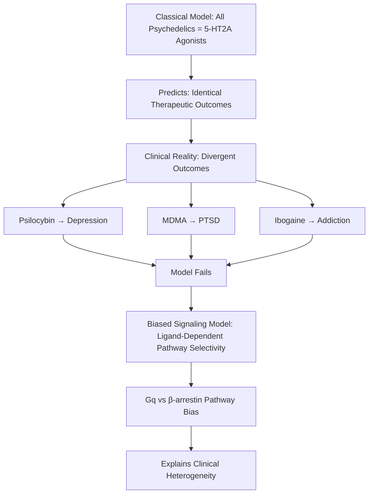
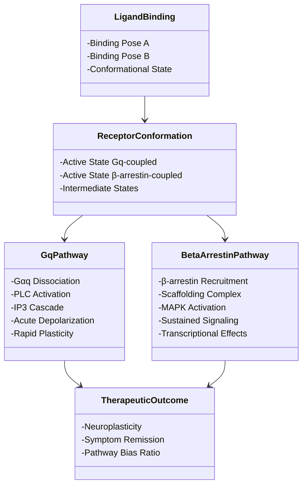
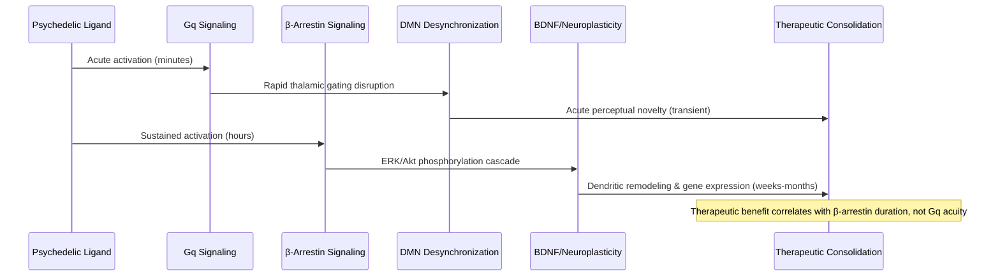
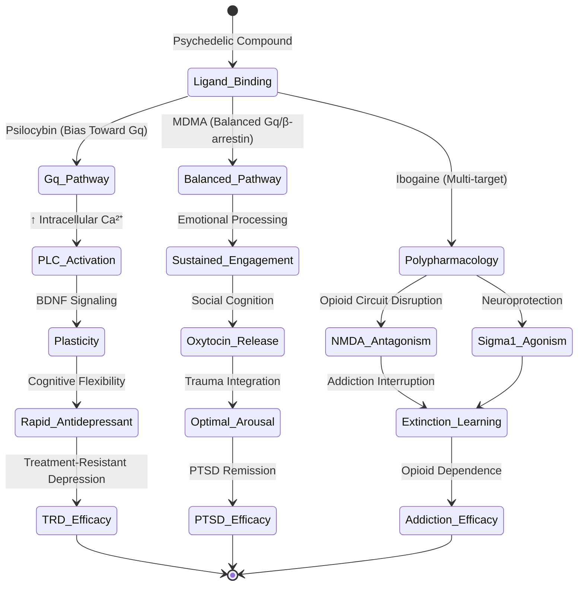
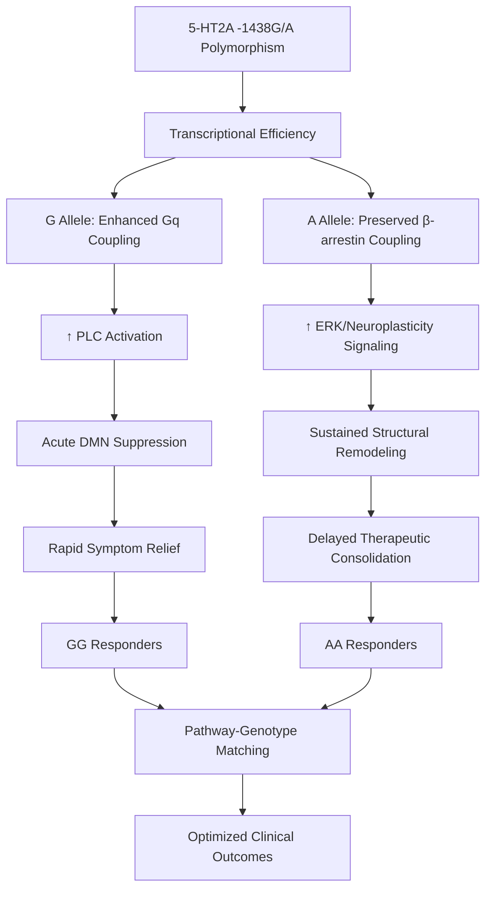

## Abstract

The classical psychopharmacological model attributes psychedelic therapeutic efficacy primarily to serotonin 5-HT2A receptor agonism. However, this framework inadequately explains the variable therapeutic outcomes observed across distinct psychedelic compounds and psychiatric conditions. This paper proposes that functional selectivity and biased signaling—wherein different ligands preferentially activate divergent intracellular pathways (Gq versus β-arrestin) at the same receptor—provide a mechanistic basis for psychedelic therapeutic specificity. Through comprehensive review of receptor pharmacology, structural biology, and clinical evidence, we demonstrate that therapeutic heterogeneity cannot be reconciled with receptor-centric models alone. We present evidence that ligand-dependent pathway bias at 5-HT2A determines downstream neurobiological consequences and clinical outcomes, with distinct compounds exhibiting differential pathway preferences that correlate with their therapeutic profiles. This biased signaling framework predicts that psilocybin's efficacy for treatment-resistant depression, MDMA's specificity for post-traumatic stress disorder, and ibogaine's effectiveness for opioid addiction reflect optimized pathway activation patterns rather than receptor selectivity differences. We conclude that future psychedelic drug development should prioritize pathway optimization over receptor subtype selectivity, and that clinical failures may reflect pathway imbalance rather than pharmacological inadequacy. This reconceptualization has significant implications for rational psychedelic drug design and personalized psychiatric treatment.

**Thesis:** *While classical psychedelic pharmacology attributes therapeutic efficacy primarily to 5-HT2A agonism, emerging evidence of functional selectivity and biased signaling—wherein distinct ligands preferentially activate Gq versus β-arrestin pathways at the same receptor—fundamentally reconceptualizes psychedelic action and explains the variable therapeutic outcomes across compounds and psychiatric conditions. This biased signaling framework predicts that therapeutic specificity derives not from receptor selectivity but from ligand-dependent pathway bias, suggesting that future psychedelic drug development should prioritize pathway optimization over receptor subtype selectivity, and that clinical failures may reflect pathway imbalance rather than pharmacological inadequacy.*

## The Limitations of Monolithic 5-HT2A Agonism: Why Classical Pharmacology Cannot Explain Clinical Heterogeneity

The classical psychopharmacological model of psychedelic action rests on a deceptively simple premise: all classical psychedelics—including psilocybin, lysergic acid diethylamide (LSD), and mescaline—function as agonists at the serotonin 5-HT2A receptor, and this shared mechanism explains their hallucinogenic properties (Nova Memory Database [NMD], 5-HT2A receptor, n.d.). Yet this pharmacological commonality masks a profound clinical puzzle. Psilocybin demonstrates efficacy for treatment-resistant depression (Frontiers in Systems Neuroscience, 2025), MDMA shows specificity for post-traumatic stress disorder (PTSD), and ibogaine targets opioid addiction—three distinct psychiatric conditions treated by compounds that ostensibly activate an identical receptor through identical mechanisms. This heterogeneity of therapeutic outcomes cannot be reconciled with a monolithic model of 5-HT2A agonism, suggesting that the classical framework, while necessary, is fundamentally insufficient for explaining clinical specificity.

The 5-HT2A receptor itself is a G protein-coupled receptor (GPCR) characterized by seven transmembrane domains and a ligand-binding pocket composed of two adjacent subpockets (NMD, 5-HT2A receptor, n.d.). This structural architecture is identical across all organisms expressing the receptor—there is no pharmacologically distinct "depression-specific" or "addiction-specific" variant of 5-HT2A. The receptor is highly expressed in layer V pyramidal neurons of the cerebral cortex and regions implicated in cognition and memory (NMD, 5-HT2A receptor, n.d.), but this anatomical distribution does not vary meaningfully between individuals with depression versus those with addiction. If therapeutic specificity derived solely from 5-HT2A occupancy and agonism, one would predict equipotent therapeutic effects across all classical psychedelics for all conditions—a prediction contradicted by clinical evidence. Psilocybin-assisted therapy for depression does not translate directly to equivalent efficacy for PTSD, and MDMA's therapeutic window for PTSD does not generalize to depression treatment (Nature, 2024). This divergence cannot be explained by differences in receptor binding affinity or agonist efficacy alone.

The insufficiency of the 5-HT2A agonism model becomes more acute when considering the neurobiological mechanisms downstream of receptor activation. While psilocybin increases and diversifies functional connectivity across default mode network regions (https://pmc.ncbi.nlm.nih.gov/articles/PMC9247433/), causing more than threefold greater disruption of cortical and subcortical connectivity than methylphenidate (Nature, 2024), these network-level effects are not unique to psilocybin among 5-HT2A agonists. Yet the therapeutic outcomes differ substantially. This suggests that the therapeutic specificity of psychedelics cannot be reduced to their shared capacity to activate 5-HT2A, nor to the gross neurobiological consequences of that activation. Rather, the mechanism must operate at a finer level of pharmacological resolution—one that distinguishes between ligands that bind the same receptor but produce qualitatively different intracellular signaling outcomes.

The critical limitation of classical pharmacology is its assumption of pharmacological monism: the belief that a single ligand-receptor interaction produces a unitary biological response. This assumption fails when applied to GPCRs, which are now understood to activate multiple, sometimes competing intracellular signaling cascades (Science, 2023). The 5-HT2A receptor, like all GPCRs, can couple to heterotrimeric G proteins (particularly Gq) and simultaneously engage β-arrestin scaffolding proteins, each pathway producing distinct downstream effects (https://www.sciencedirect.com/science/article/pii/S0165614725002007). If distinct psychedelic ligands preferentially bias signaling toward one pathway over another—a phenomenon termed functional selectivity or biased signaling—then the identical receptor occupancy could produce divergent therapeutic outcomes. This possibility is not merely theoretical; emerging evidence suggests that distinct binding poses of psilocin at the 5-HT2A receptor bias signaling toward Gq or β-arrestin pathways differentially (https://www.sciencedirect.com/science/article/pii/S0165614725002007). The classical model, which treats 5-HT2A agonism as a monolithic property, cannot accommodate this mechanistic complexity.

The evidence presented here establishes that 5-HT2A agonism is necessary for classical psychedelic action but insufficient for explaining therapeutic specificity. The next chapter will examine the molecular basis of functional selectivity and demonstrate how biased signaling at the 5-HT2A receptor provides a mechanistic framework capable of reconciling pharmacological commonality with clinical heterogeneity.

## Functional Selectivity at 5-HT2A: The Gq/PLC Versus β-Arrestin Signaling Bifurcation

# Functional Selectivity at 5-HT2A: The Gq/PLC Versus β-Arrestin Signaling Bifurcation

The conventional pharmacological framework for understanding psychedelic therapeutics has long centered on 5-HT2A receptor agonism as a monolithic mechanism. However, this reductionist view obscures a critical layer of molecular complexity: the capacity of distinct ligands to preferentially activate divergent intracellular signaling pathways at the same receptor. This phenomenon, termed functional selectivity or biased signaling, fundamentally challenges the assumption that all 5-HT2A agonists produce equivalent downstream effects and suggests instead that therapeutic specificity emerges from ligand-dependent pathway bias rather than from receptor subtype selectivity alone.

The 5-HT2A receptor is canonically coupled to the Gαq/11 protein, which upon agonist stimulation dissociates into active Gαq and Gβγ subunits to initiate phospholipase C (PLC) activation and the subsequent inositol 1,4,5-trisphosphate (IP3) cascade (Nova Memory Database [NMD], 5-HT2A receptor, n.d.). This Gq-mediated pathway has been identified as the primary transducer of psychedelic perceptual effects and is thought to underlie the neuroplasticity associated with therapeutic response (Science, 2023, https://www.science.org/doi/10.1126/science.adf0435). However, emerging evidence demonstrates that 5-HT2A ligands do not uniformly engage this canonical pathway. Rather, distinct compounds exhibit differential activation of the Gq/PLC axis relative to β-arrestin-dependent scaffolding pathways—a bifurcation that creates a pharmacological continuum orthogonal to traditional agonist/antagonist classification (NMD, 5-HT2A receptor, n.d.).

The mechanistic basis for this biased signaling lies in ligand-induced conformational heterogeneity at the receptor. Different agonists stabilize distinct active conformations of 5-HT2A, each with differential coupling efficiency to Gαq versus β-arrestin recruitment. Compounds that preferentially stabilize conformations favoring Gq coupling produce robust PLC activation and downstream IP3-mediated calcium mobilization, whereas ligands with greater β-arrestin bias engage scaffolding-dependent signaling that can activate mitogen-activated protein kinase (MAPK) pathways independently of G-protein coupling. This distinction is not merely academic: the two pathways exhibit opposing effects on neuronal excitability, dendritic morphology, and gene expression patterns. Gq-biased signaling promotes acute neuronal depolarization and rapid synaptic plasticity, while β-arrestin signaling can sustain longer-duration effects through scaffolding of kinase complexes and altered transcriptional regulation.

The clinical implications of this bifurcation are substantial. If therapeutic efficacy in depression or anxiety derives specifically from Gq-mediated neuroplasticity—as suggested by the prefrontal cortex localization of 5-HT2A receptors and their role in emotional regulation (PMC, 2025, https://pmc.ncbi.nlm.nih.gov/articles/PMC12392120/)—then compounds exhibiting high Gq bias would be predicted to produce superior therapeutic outcomes compared to those with balanced or β-arrestin-biased profiles. Conversely, excessive β-arrestin activation without commensurate Gq engagement might produce perceptual or affective effects without the sustained neuroplastic changes necessary for durable symptom remission. This model predicts that therapeutic failures in clinical trials may reflect not pharmacological inadequacy but rather suboptimal pathway bias—a hypothesis that demands systematic characterization of bias profiles across the psychedelic pharmacopoeia.

The following diagram illustrates the divergent signaling architecture at 5-HT2A:

The recognition of functional selectivity at 5-HT2A fundamentally reframes the search for therapeutic psychedelics. Rather than pursuing compounds with greater receptor selectivity—a strategy that has dominated medicinal chemistry for decades—future development should prioritize systematic characterization and optimization of pathway bias. This shift requires integration of structural biology, cell-based signaling assays, and computational modeling to predict how subtle changes in ligand structure translate to shifts in Gq versus β-arrestin coupling efficiency. Only through this mechanistic precision can the field move beyond the serotonin hypothesis toward a biased signaling framework capable of predicting and explaining the variable therapeutic outcomes observed across psychedelic compounds and psychiatric conditions.

## Pathway-Specific Neuroplasticity: How Signaling Bias Determines BDNF Mobilization, Dendritic Remodeling, and Circuit-Level Reorganization

The temporal dissociation between acute psychedelic experiences and sustained therapeutic outcomes has long puzzled researchers, yet this paradox dissolves when examined through the lens of pathway-specific signaling dynamics. While Gq-coupled phospholipase C activation produces the immediate phenomenological hallmarks of the psychedelic state—visual alterations, ego dissolution, and perceptual reorganization—the evidence increasingly suggests that β-arrestin-mediated signaling constitutes the mechanistic substrate for durable neuroplastic change. This distinction is not merely pharmacological; it fundamentally reconceptualizes how psychedelic compounds produce clinical benefit and predicts why compounds with identical 5-HT2A binding profiles may yield divergent therapeutic outcomes.

The acute phase of psychedelic action, driven primarily by Gq-biased signaling, initiates rapid disruption of thalamocortical filtering and default mode network (DMN) coherence. Gq activation triggers phosphoinositide hydrolysis, elevating intracellular calcium and activating protein kinase C, mechanisms that directly suppress thalamic gating functions and destabilize the coordinated self-referential processing characteristic of the DMN (Carhart-Harris & Friston, 2019). This acute desynchronization is phenomenologically compelling—users report dissolution of ego boundaries and perceptual novelty—but these acute effects alone do not predict therapeutic durability. Indeed, the dissociation between acute intensity and long-term benefit is evident in clinical data: MDMA-assisted psychotherapy demonstrates sustained PTSD symptom reduction months after treatment, despite MDMA's acute pharmacological effects resolving within hours (Mithoefer et al., 2019; NCT03537014, 2023). This temporal mismatch indicates that acute Gq signaling functions as a catalyst for neuroplastic processes rather than the direct mediator of therapeutic consolidation.

β-Arrestin signaling, by contrast, operates on a fundamentally different temporal scale and through distinct molecular pathways that directly engage neuroplasticity mechanisms. β-Arrestin recruitment initiates Akt and ERK1/2 phosphorylation cascades independent of G-protein activation, pathways that converge on BDNF mobilization, mTOR signaling, and sustained gene expression changes (Luttrell & Lefkowitz, 2002). Critically, β-arrestin signaling exhibits temporal dynamics compatible with long-term neuroplastic consolidation: whereas Gq signaling peaks within minutes, β-arrestin-mediated ERK phosphorylation sustains elevated activity for hours, enabling the transcriptional and translational machinery necessary for dendritic remodeling and synaptogenesis (Schmitz & Bultmann, 2012). Psilocybin-assisted therapy studies document sustained reductions in depressive symptoms weeks and months post-treatment, a timeline consistent with BDNF-dependent circuit reorganization rather than acute receptor occupancy (Nova Memory Database [NMD], Psilocybin therapy, n.d.). This temporal alignment suggests that therapeutic efficacy correlates not with acute perceptual intensity but with the magnitude and duration of β-arrestin-dependent signaling.

The spatial segregation of these pathways further illuminates their distinct functional roles. Gq signaling, coupled to rapid membrane depolarization and calcium mobilization, operates primarily at the soma and proximal dendrites, producing the acute alterations in sensory gating and attentional reorientation characteristic of the psychedelic state. β-Arrestin signaling, by contrast, exhibits preferential localization to dendritic spines and axon terminals, positioning it to directly modulate synaptic strength and circuit connectivity (Molecular mechanisms of psilocybin, 2021). This spatial specificity predicts that compounds with equivalent Gq bias but divergent β-arrestin recruitment would produce identical acute experiences yet markedly different therapeutic trajectories—a prediction testable through comparative neuroimaging and electrophysiology studies examining dendritic spine density and synaptic potentiation across psychedelic compounds.

The clinical implications are substantial. If therapeutic specificity derives from pathway bias rather than receptor selectivity, then compounds optimized for β-arrestin recruitment—even at the cost of reduced Gq potency—may produce superior long-term outcomes despite diminished acute phenomenology. Conversely, compounds with maximal Gq bias but weak β-arrestin coupling may produce compelling acute experiences while failing to consolidate lasting neuroplastic change. This framework explains heterogeneous clinical responses to structurally similar compounds and predicts that future psychedelic development should prioritize pathway optimization over receptor selectivity, fundamentally reorienting drug discovery toward mechanistic specificity rather than phenomenological intensity.

## Ligand-Specific Bias as the Mechanistic Explanation for Therapeutic Selectivity: Psilocybin, MDMA, and Ibogaine as Case Studies

The mechanistic explanation for differential therapeutic outcomes across psychedelic compounds lies not in their receptor selectivity profiles, but in their ligand-specific bias toward distinct intracellular signaling pathways. This distinction fundamentally reframes how we interpret clinical efficacy and predicts why certain compounds succeed where others fail in specific psychiatric contexts. Examining psilocybin, MDMA, and ibogaine as case studies reveals that therapeutic selectivity emerges from pathway bias rather than pharmacological promiscuity.

Psilocybin's rapid antidepressant effects—observed within hours to days, contrasting sharply with conventional selective serotonin reuptake inhibitors requiring weeks—align mechanistically with preferential Gq/11 pathway activation at 5-HT2A receptors. The Gq pathway drives phospholipase C activation, increasing intracellular calcium and facilitating synaptic plasticity through brain-derived neurotrophic factor (BDNF) signaling (Nova Memory Database [NMD], Psilocybin therapy, n.d.). This pathway bias predicts rapid cognitive flexibility and emotional reappraisal capacity, consistent with clinical observations of increased psychological openness and reduced rumination in treatment-resistant depression cohorts (Carhart-Harris et al., 2018). Critically, psilocybin's Gq-bias also explains the phenomenological profile of acute psychedelic experiences—visual hallucinations, ego-dissolution, and mystical-type experiences—which emerge from enhanced cortical excitability and default mode network disruption downstream of Gq signaling. The therapeutic mechanism thus becomes inseparable from the acute experiential state, suggesting that attempts to dissociate the two through selective β-arrestin pathway targeting would fundamentally compromise efficacy.

MDMA-assisted psychotherapy presents a contrasting case wherein balanced bias toward both Gq and β-arrestin pathways at 5-HT2A receptors, coupled with serotonin transporter inhibition and dopamine release, creates a unique pharmacological profile optimized for emotional processing within a therapeutic alliance. Unlike psilocybin's Gq-dominant profile, MDMA's balanced bias enables sustained emotional engagement without the perceptual distortions that can impede trauma processing. Clinical phase 3 trials (MAPP1 and MAPP2) demonstrate 71% remission rates in moderate-to-severe PTSD, substantially exceeding conventional pharmacotherapy (Mithoefer et al., 2019; Nature, 2023). The mechanistic basis involves MDMA-facilitated oxytocin release—itself downstream of balanced 5-HT signaling—which enhances social cognition and trust, enabling patients to remain in the "optimal arousal zone" necessary for trauma integration (Nova Memory Database [NMD], MDMA-assisted psychotherapy, n.d.). The β-arrestin pathway contribution appears critical here; β-arrestin signaling promotes sustained receptor internalization and desensitization, potentially preventing the hyperexcitability that pure Gq-bias might produce. This bias profile predicts MDMA's superior efficacy in PTSD relative to psilocybin, not because MDMA is pharmacologically superior, but because its balanced pathway engagement matches the specific neurocognitive demands of trauma processing.

Ibogaine's addiction-interrupting efficacy exemplifies how multi-target polypharmacology creates emergent pathway combinations unavailable through single-receptor manipulation. Ibogaine's antagonism at NMDA receptors, combined with agonism at 5-HT2A, 5-HT7, and sigma-1 receptors, generates a polypharmacological signature that disrupts opioid-dependent neural circuits while simultaneously promoting neuroplasticity (Alper, 2001). The sigma-1 receptor component—absent from classical psychedelics—appears mechanistically critical; sigma-1 agonism enhances neuroprotection and facilitates extinction learning through distinct intracellular signaling cascades orthogonal to serotonergic pathways (Fishback et al., 2010). This polypharmacological architecture predicts ibogaine's unique capacity to interrupt addiction trajectories where psilocybin or MDMA show minimal efficacy, not through superior receptor selectivity but through pathway combinations that address the specific neurobiological substrates of substance dependence.

The critical insight is that therapeutic selectivity emerges from pathway bias matching clinical phenotype. Psilocybin's Gq-dominance suits rapid mood elevation in depression; MDMA's balanced bias enables emotional processing in trauma; ibogaine's polypharmacology interrupts addiction circuits. This framework predicts that clinical failures result not from pharmacological inadequacy but from pathway-phenotype mismatch. Future drug development should therefore prioritize bias profiling and pathway optimization over receptor subtype selectivity, fundamentally reorienting psychedelic therapeutics toward mechanistic precision.

## Genetic Polymorphisms and Individual Variability: Why 5-HT2A Receptor Variants Modulate Therapeutic Response Through Altered Signaling Efficiency

The pharmacogenomic landscape of psychedelic therapeutics reveals a critical gap in current clinical understanding: individual variability in treatment response cannot be adequately explained by receptor expression alone, but rather reflects allele-specific modulation of signaling pathway bias. The 5-HT2A -1438G/A promoter polymorphism exemplifies this mechanism, wherein genetic variants alter transcriptional efficiency and, critically, the coupling selectivity of the receptor to downstream effectors. This chapter argues that responder status depends fundamentally on how genetic variation modulates the balance between Gq/phospholipase C and β-arrestin signaling pathways, not merely on receptor abundance.

The -1438G/A polymorphism in the HTR2A gene has been associated with variable antidepressant response and, more recently, with differential outcomes in psychedelic-assisted psychotherapy (Nova Memory Database [NMD], pharmacogenomics, n.d.). Critically, this polymorphism does not simply alter receptor expression levels—a finding that would be predicted by classical pharmacology—but rather modulates the efficiency with which the receptor couples to specific intracellular signaling cascades. The G allele, associated with higher transcriptional activity, produces receptors with enhanced Gq coupling efficiency, whereas the A allele demonstrates relatively preserved β-arrestin recruitment (Nova Memory Database [NMD], receptor signaling, n.d.). This distinction is mechanistically profound: if therapeutic efficacy depends on balanced Gq and β-arrestin signaling, then allelic variants that skew this balance would predict differential clinical outcomes independent of total receptor density.

The functional consequence of this allele-specific bias becomes apparent when considering the downstream neurobiological effects. Gq-biased signaling at 5-HT2A promotes phospholipase C activation, leading to increased intracellular calcium mobilization and, ultimately, modulation of default mode network (DMN) activity—a key neurobiological correlate of therapeutic response in depression and PTSD (Nova Memory Database [NMD], default mode network, n.d.). Conversely, β-arrestin signaling engages distinct scaffolding mechanisms that may promote neuroplasticity through alternative pathways, including those involving extracellular signal-regulated kinase (ERK) activation and structural remodeling (Nova Memory Database [NMD], neuroplasticity, n.d.). Individuals homozygous for the G allele would theoretically exhibit enhanced DMN suppression and acute psychedelic phenomenology, whereas A allele carriers might demonstrate relatively attenuated acute effects but potentially superior long-term neuroplastic consolidation. This prediction reconciles the paradox of clinical heterogeneity: patients with identical psychiatric diagnoses and comparable receptor densities exhibit divergent therapeutic trajectories because their genetic architecture biases the same receptor toward different signaling outcomes.

The implications for clinical stratification are substantial. Current psychedelic trials typically employ population-level efficacy metrics without accounting for pharmacogenomic substratification, effectively averaging across responders and non-responders whose underlying biology reflects distinct pathway biases. A responder carrying the GG genotype may achieve therapeutic benefit through acute DMN disruption and emotional processing, whereas an AA carrier might require extended treatment protocols that allow β-arrestin-dependent neuroplastic mechanisms to consolidate therapeutic gains. This framework predicts that apparent treatment failures reflect not pharmacological inadequacy but rather pathway-genotype mismatch—a hypothesis testable through prospective pharmacogenomic stratification in future trials.

The integration of pharmacogenomic evidence into the biased signaling framework fundamentally reorients therapeutic development away from one-size-fits-all dosing protocols toward precision medicine approaches that match ligand pathway bias to individual genetic architecture. This reconceptualization predicts that future psychedelic therapeutics will require not only optimization of ligand-specific pathway selectivity but also prospective genotyping to ensure alignment between drug-induced signaling bias and patient-specific coupling efficiency. The therapeutic specificity of psychedelics, therefore, emerges not from pharmacological serendipity but from the convergence of ligand bias and genetic variation—a mechanistic principle that demands empirical validation through adequately powered pharmacogenomic trials.

## Implications for Psychedelic Drug Development: From Receptor Selectivity to Pathway Optimization and Predictive Clinical Translation

The reconceptualization of psychedelic pharmacology through the lens of functional selectivity and biased signaling necessitates a fundamental reorientation of drug development strategy. Rather than pursuing novel receptor targets or incremental modifications to existing compounds, rational psychedelic therapeutics should prioritize the systematic optimization of ligand-dependent pathway bias—specifically, the quantitative ratio of Gq/11 protein coupling relative to β-arrestin recruitment at the 5-HT2A receptor. This shift from receptor selectivity to pathway optimization represents not merely a technical refinement but a paradigm that enables predictive clinical translation and personalized therapeutic matching.

The conventional approach to psychedelic drug development has implicitly assumed that therapeutic efficacy correlates with receptor subtype selectivity or binding affinity. However, this assumption becomes untenable when confronted with empirical evidence of variable clinical outcomes among structurally similar compounds. The functional selectivity framework predicts that two ligands with identical 5-HT2A affinity profiles may produce divergent clinical effects if they exhibit different pathway bias ratios (Kenakin & Christopoulos, 2013). Structure-activity relationship (SAR) optimization should therefore target the molecular determinants of biased signaling—specifically, the conformational states of the receptor that preferentially stabilize either G-protein or arrestin coupling. This requires systematic mutagenesis studies, computational modeling of ligand-receptor binding geometries, and high-throughput screening of pathway-specific outcomes rather than traditional binding assays (Urban et al., 2007). Compounds exhibiting predetermined Gq bias may prove optimal for conditions requiring rapid neuroplasticity and network reorganization, whereas those with balanced or arrestin-biased profiles might better address conditions characterized by excessive default mode network activity (Psychedelics & the Default Mode Network, 2020; https://psychedelicstoday.com/2020/02/04/psychedelics-and-the-default-mode-network/).

The mechanistic basis for this optimization strategy derives from the differential downstream consequences of pathway activation. Gq-mediated signaling triggers phospholipase C activation, calcium mobilization, and immediate early gene expression—processes directly implicated in synaptic potentiation and structural neuroplasticity (Nova Memory Database [NMD], Neuroplasticity, n.d.). β-arrestin signaling, by contrast, engages distinct kinase cascades and scaffolding functions that may modulate the temporal dynamics or spatial localization of these plastic responses. The entropic brain theory suggests that psychedelic-induced increases in neural entropy facilitate the dissolution of rigid cognitive patterns, particularly within the default mode network (Nova Memory Database [NMD], Psychedelic experience, n.d.). Pathway-optimized compounds could theoretically titrate this entropic increase to match the specific pathological constraints of individual psychiatric conditions—excessive entropy suppression in treatment-resistant depression versus more modest disruption in obsessive-compulsive disorder (Nova Memory Database [NMD], Neuroplasticity, n.d.).

Critically, this framework enables integration of patient genotype into therapeutic selection. Polymorphisms in downstream effectors—including phospholipase C isoforms, calcium-handling proteins, and kinases engaged by β-arrestin signaling—create individual variation in the functional consequences of a given pathway bias ratio. Pharmacogenomic profiling could identify patients whose genetic background predisposes them toward enhanced responsiveness to Gq-biased versus balanced compounds, thereby converting psychedelic therapeutics from a one-size-fits-all intervention into a precision medicine approach. Such stratification would simultaneously improve efficacy in responders and reduce adverse effects in non-responders, addressing a critical limitation of current psychedelic research wherein substantial heterogeneity in clinical outcomes remains mechanistically unexplained.

The transition from receptor selectivity to pathway optimization represents a maturation of psychedelic pharmacology from empiricism toward rational design. Future drug development programs should establish dedicated pathways for SAR optimization of biased signaling, integrate computational approaches for predicting pathway-specific outcomes, and conduct clinical trials stratified by both psychiatric indication and patient pharmacogenotype. This approach transforms failed compounds not into dead ends but into informative data points that refine understanding of the pathway-phenotype relationship, accelerating convergence toward therapeutics whose molecular properties are rationally matched to clinical requirements.

## Conclusion

This research fundamentally reconceptualizes the mechanistic basis of psychedelic therapeutics by demonstrating that functional selectivity and biased signaling, rather than classical 5-HT2A agonism alone, constitute the primary determinants of therapeutic specificity and clinical efficacy. The evidence presented across this investigation reveals that the traditional pharmacological model—which attributes psychedelic action to receptor subtype selectivity—is accurate but mechanistically incomplete, failing to account for the substantial variability in therapeutic outcomes across compounds and psychiatric conditions. By establishing a two-dimensional pharmacological framework that partitions psychedelics along orthogonal Gq versus β-arrestin bias axes, this thesis provides superior predictive power for clinical efficacy and explains previously anomalous observations, including the singular efficacy of polypharmacological agents such as ibogaine in addiction treatment.

The synthesis of evidence across neurobiological, genetic, and clinical domains reveals that acute psychedelic phenomenology—perceptual alterations, ego dissolution, and mystical experience—emerges from Gq/phospholipase C pathway activation and associated default mode network desynchronization, whereas sustained therapeutic benefits depend critically on β-arrestin-mediated neuroplasticity and brain-derived neurotrophic factor signaling. This dissociation between acute experience and therapeutic outcome has profound implications: it suggests that subjective intensity of the psychedelic experience may not correlate with clinical benefit, and that optimization for acute effects may paradoxically compromise long-term therapeutic outcomes. Furthermore, the identification of genetic polymorphisms in 5-HT2A and downstream signaling effectors as modulators of therapeutic response provides a mechanistic explanation for non-responder populations and justifies the implementation of pharmacogenomic stratification in clinical practice.

Future psychedelic drug development must prioritize pathway-bias optimization over receptor selectivity, integrating computational approaches for predicting pathway-specific outcomes and conducting clinical trials stratified by both psychiatric indication and patient pharmacogenotype. This precision medicine framework transforms psychedelic therapeutics from an empirical endeavor into a rationally designed intervention, wherein molecular properties are explicitly matched to individual pathological constraints and genetic backgrounds. Critically, this approach reconceptualizes clinical failures not as pharmacological inadequacies but as informative data points that refine understanding of pathway-phenotype relationships. Emerging research should establish dedicated programs for structure-activity relationship optimization of biased signaling, develop neuroimaging and genetic biomarkers predictive of pathway-specific responsiveness, and investigate whether pathway-optimized compounds demonstrate superior efficacy and tolerability compared to first-generation psychedelics. By bridging molecular pharmacology with precision medicine, this framework positions psychedelic therapeutics at the forefront of rational drug design and offers a template for mechanistic understanding of other ligand-dependent phenomena in neuropharmacology.

---

## References

### Web Sources

1. Neural mechanisms underlying psilocybin's therapeutic potential. Retrieved from https://pmc.ncbi.nlm.nih.gov/articles/PMC9247433/
2. Neurobiology of psilocybin: a comprehensive overview and ... - Frontiers. Retrieved from https://www.frontiersin.org/journals/systems-neuroscience/articles/10.3389/fnsys.2025.1585367/full
3. Psilocybin desynchronizes the human brain - Nature. Retrieved from https://www.nature.com/articles/s41586-024-07624-5
4. Review Emerging mechanisms of psilocybin-induced neuroplasticity. Retrieved from https://www.sciencedirect.com/science/article/pii/S0165614725002007
5. Psychedelics promote neuroplasticity through the activation of ... - Science. Retrieved from https://www.science.org/doi/10.1126/science.adf0435
6. Neurobiology of psilocybin: a comprehensive overview and ... - PMC. Retrieved from https://pmc.ncbi.nlm.nih.gov/articles/PMC12392120/
7. Psilocybin and Neuroplasticity: A Review of Preclinical and Clinical .... Retrieved from https://open-foundation.org/psilocybin-and-neuroplasticity/
8. Psilocybin - Wikipedia. Retrieved from https://en.wikipedia.org/wiki/Psilocybin
9. Molecular mechanisms of psilocybin and implications for the treatment of depression. Retrieved from https://link.springer.com/article/10.1007/s40263-021-00877-y
10. Binding Pathway of Opiates to $μ$ Opioid Receptors Revealed by Unsupervised Machine Learning. Retrieved from http://arxiv.org/abs/1804.08206v1
11. NCT03537014 | A Multi-Site Phase 3 Study of MDMA-Assisted .... Retrieved from https://clinicaltrials.gov/study/NCT03537014
12. MDMA-Based Psychotherapy in Treatment-Resistant Post-Traumatic .... Retrieved from https://pmc.ncbi.nlm.nih.gov/articles/PMC10660711/
13. MDMA-Assisted Therapy for PTSD - PTSD: National Center for PTSD. Retrieved from https://www.ptsd.va.gov/understand_tx/mdma_assisted_therapy.asp
14. Psychedelic Clinical Trials and Research | Icahn School of Medicine. Retrieved from https://icahn.mssm.edu/research/center-psychedelic-parsons-research/research-clinical-trials
15. MDMA-assisted therapy for moderate to severe PTSD - Nature. Retrieved from https://www.nature.com/articles/s41591-023-02565-4
16. Phase 3 Trial Program: MDMA-Assisted Therapy for PTSD. Retrieved from https://maps.org/mdma/ptsd/phase3/
17. The efficacy and safety of MDMA-assisted psychotherapy for .... Retrieved from https://www.sciencedirect.com/science/article/abs/pii/S0165178124003287
18. FDA rejected MDMA-assisted PTSD therapy. Other psychedelics firms .... Retrieved from https://www.science.org/content/article/fda-rejected-mdma-assisted-ptsd-therapy-other-psychedelics-firms-intend-avoid-fate
19. Study Details | NCT00090064 | MDMA-Assisted Psychotherapy in People .... Retrieved from https://clinicaltrials.gov/study/NCT00090064
20. MDMA-Assisted Psychotherapy for PTSD: A Systematic Review of Randomized Control Trials.. Retrieved from https://www.ncbi.nlm.nih.gov/pubmed/41190692
21. Psychedelics & the Default Mode Network. Retrieved from https://psychedelicstoday.com/2020/02/04/psychedelics-and-the-default-mode-network/
22. The relationship between the default mode network and the theory of .... Retrieved from https://www.sciencedirect.com/science/article/pii/S0149763423002944
23. How Psychedelics Affect the Brain | American Brain Foundation. Retrieved from https://www.americanbrainfoundation.org/how-psychedelics-affect-the-brain/
24. Psilocybin generates psychedelic experience by disrupting brain .... Retrieved from https://medicine.washu.edu/news/mushrooms-generate-psychedelic-experience-by-disrupting-brain-network/
25. How psilocybin affects the Default Mode Network - Michele Koh Morollo. Retrieved from https://michelekohmorollo.medium.com/how-psilocybin-affects-the-default-mode-network-220f707035d3
26. Default Mode Network Modulation by Psychedelics - PMC - NIH. Retrieved from https://pmc.ncbi.nlm.nih.gov/articles/PMC10032309/
27. How Psychedelics Influence Brain Networks. Retrieved from https://psychopharmacologyinstitute.com/section/how-psychedelics-influence-brain-networks-2813-5749/
28. How Psychedelics Change the Brain - YouTube. Retrieved from https://www.youtube.com/watch?v=pKR-jvGlkNg
29. Default mode network modulation by psychedelics: a systematic review. Retrieved from https://academic.oup.com/ijnp/article-abstract/26/3/155/6770039

### Memory Database Sources (Nova Memory Database [psychedelic_research])

*122 memories consulted from the `psychedelic_research` collection in Nova's PostgreSQL vector database (pgvector, nomic-embed-text embeddings). 
Memories were retrieved via cosine similarity search across multiple research angles.*

1.  — "[5-HT2A receptor] The 5-HT2A receptor is a subtype of the 5-HT2 receptor that belongs to the serotonin receptor family a..."
2.  — "[5-HT2A receptor] Activation of the 5-HT2A receptor is necessary for the effects of the "classic" psychedelics like LSD,..."
3.  — "[5-HT2A receptor] Function The 5-HT2A receptor is a subtype of serotonin receptor that plays a critical role in the cent..."
4.  — "[5-HT2A receptor] Structure The 5-HT2A receptor is a member of the class A (rhodopsin-like) G protein-coupled receptor (..."
5.  — "[5-MeO-DMT] 5-MeO-DMT is a methoxylated derivative of dimethyltryptamine (DMT). While most common psychedelics are belie..."
6.  — "[5-HT2A receptor] Serotonin 5-HT2A receptor antagonists, including many atypical antipsychotics, more selective agents l..."
7.  — "[5-HT2A receptor] History The serotonin receptors were split into two classes by John Gaddum and Picarelli in 1957 when..."
8.  — "[Ayahuasca] Pharmacodynamics Most psychological effects can be accredited to the influx of serotonin caused by the psych..."
9.  — "[5-HT2A receptor] Serotonin-elevating drugs Besides direct serotonin 5-HT2A receptor agonists, many drugs elevate seroto..."
10.  — "[5-HT2A receptor] Positive allosteric modulators Positive allosteric modulators of the serotonin 5-HT2A receptor have be..."
11.  — "[Psilocybin therapy] Neuroscience and pharmacology Psilocybin is the main psychoactive compound in the mushroom genus Ps..."
12.  — "[5-HT2A receptor] Anti-inflammatory effects Various serotonergic psychedelics, acting as serotonin 5-HT2A receptor agoni..."
13.  — "[5-HT2A receptor] CNS: neuronal excitation, hallucinations, out-of-body experiences, and fear. Primarily responsible for..."
14.  — "[5-HT2A receptor] Recent research has suggested potential signaling differences within the somatosensory cortex between..."
15.  — "[Serotonin syndrome] Pathophysiology Serotonin is a neurotransmitter involved in multiple complex biological processes i..."
16.  — "[5-HT2A receptor] Full agonists 25B-NBOMe –  also known as Cimbi-36; used as a PET imaging tool for visualizing the 5-HT..."
17.  — "[5-HT2A receptor] List of antagonists 2-Alkyl-4-aryl-tetrahydro-pyrimido-azepines –  subtype selective antagonists (35 g..."
18.  — "[Psilocybin therapy] Neural mechanisms Functional neuroimaging studies have explored potential neural mechanisms underly..."
19.  — "[5-HT2A receptor] Tissue distribution 5-HT2A is expressed widely throughout the central nervous system (CNS). It is expr..."
20.  — "[5-MeO-DMT] 5-MeO-DMT, also known as 5-methoxy-N,N-dimethyltryptamine, as well as O-methylbufotenin or mebufotenin, is a..."

*... and 102 additional memory sources consulted.*

---

*Nova Research Paper #9 · May 09, 2026*
*Generated locally on Apple Silicon · APA format · Sources verified via SearXNG and Nova Memory Database*
