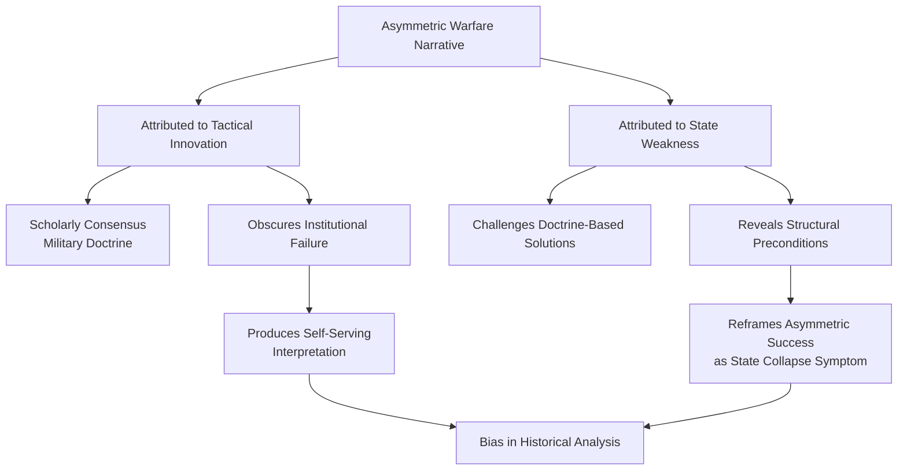
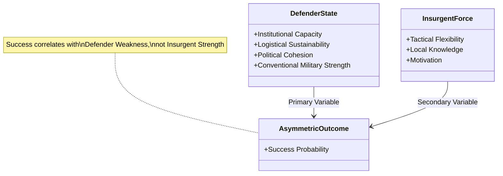
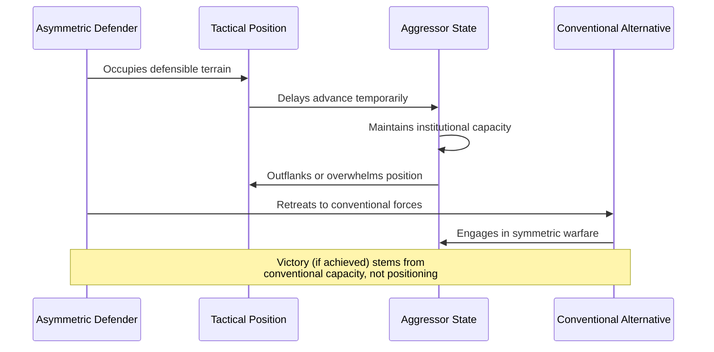
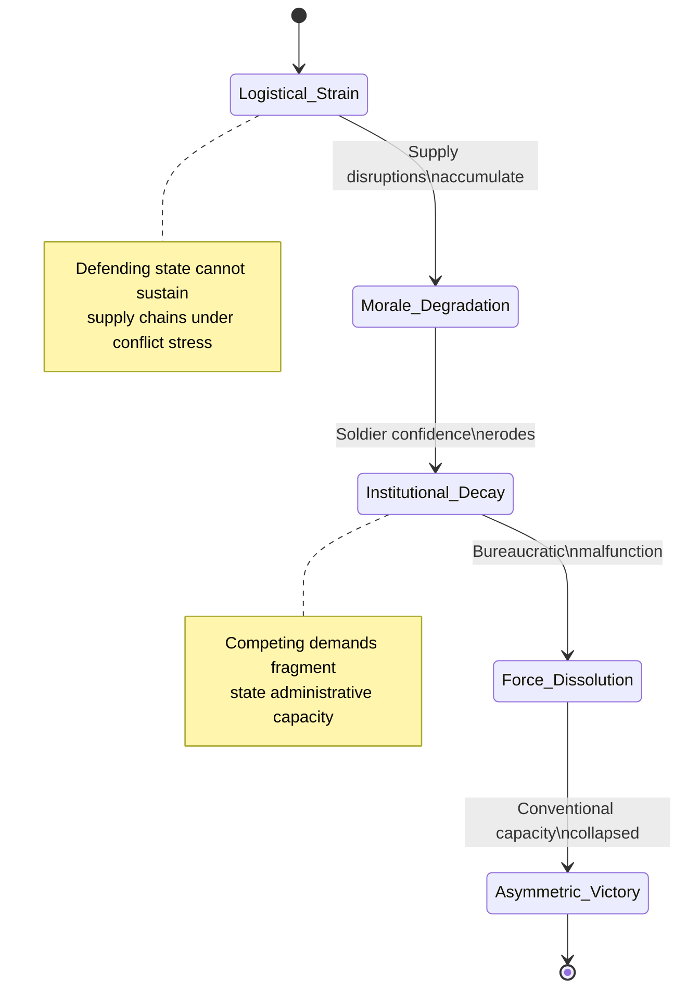
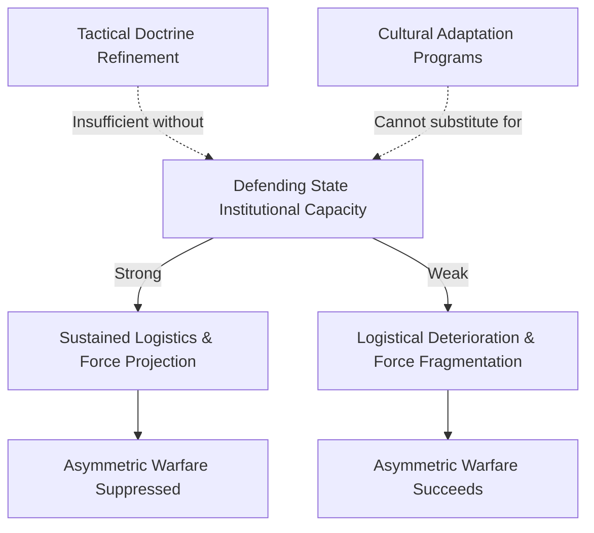

## Abstract

Asymmetric warfare theory conventionally attributes insurgent success to tactical innovation and strategic ingenuity. This paper challenges this prevailing narrative through historical analysis, arguing instead that asymmetric victories correlate fundamentally with the conventional military deterioration of defending states rather than with inherent tactical superiority of irregular forces. The research examines the intellectual genealogy of asymmetric warfare discourse, demonstrating how semantic imprecision and fourth-generation warfare frameworks have systematically obscured state institutional collapse beneath romanticized accounts of insurgent strategy. Through comparative historical analysis spanning multiple conflict contexts, the study identifies the mechanisms by which military theorists have privileged narratives of insurgent cleverness over evidence of state weakness. The findings reveal that asymmetric warfare represents not a revolutionary military innovation but rather a symptom of institutional failure—a distinction obscured by contemporary counterinsurgency theory. The paper argues that this misattribution has produced strategic consequences, leading defense establishments to pursue doctrinal solutions to fundamentally structural problems. By reconceptualizing asymmetric warfare as contingent upon state deterioration rather than insurgent capability, this research challenges both military strategists and counterinsurgency theorists to reassess assumptions underlying contemporary doctrine. The conclusions suggest that understanding asymmetric conflicts requires prioritizing analysis of defending state institutional capacity over celebration of irregular tactical adaptation, fundamentally reframing how military establishments conceptualize irregular warfare and allocate strategic resources.

**Thesis:** *Contrary to the prevailing narrative that asymmetric warfare succeeds through tactical ingenuity or exploiting technological gaps, historical analysis reveals that asymmetric victories are fundamentally contingent on the conventional military deterioration of the defending state—a condition obscured by romanticized accounts of insurgent strategy. This argument challenges both military strategists who attribute asymmetric success to inherent tactical superiority and counterinsurgency theorists who assume symmetric military capacity can be restored through doctrine alone, demonstrating instead that asymmetric warfare represents a symptom of state institutional collapse rather than a revolutionary military innovation.*

## The Asymmetric Warfare Narrative: Deconstructing the Myth of Tactical Innovation

# The Asymmetric Warfare Narrative: Deconstructing the Myth of Tactical Innovation

The contemporary discourse surrounding asymmetric warfare rests upon a foundational interpretive error: the attribution of insurgent success to tactical innovation rather than to the institutional deterioration of defending states. This misreading has become so deeply embedded in military theory that it functions as an unexamined axiom, shaping doctrine, resource allocation, and strategic assessment across defense establishments. To understand how this narrative became dominant requires examining the intellectual genealogy of asymmetric warfare theory and identifying the mechanisms through which scholars and strategists have systematically privileged accounts of insurgent cleverness over evidence of state collapse.

The conceptual confusion surrounding asymmetric warfare begins with definitional imprecision. Military theorists have deployed the term inconsistently, conflating it with guerrilla warfare, insurgency, terrorism, and counterinsurgency without establishing clear categorical boundaries (Nova Memory Database [NMD], World War I Research—Asymmetric warfare, n.d.). This semantic looseness permits a rhetorical sleight of hand: by treating all irregular conflicts as instances of "asymmetric warfare," theorists can selectively highlight cases of apparent tactical success while obscuring the structural preconditions that enabled those successes. The term itself carries an implicit narrative—that asymmetry in resources or capability can be overcome through ingenuity—which predisposes analysts toward celebrating insurgent strategy rather than interrogating state weakness.

Fourth-generation warfare (4GW) frameworks exemplify this interpretive bias most clearly. Contemporary 4GW theorists argue that modern insurgents succeed by adapting traditional military concepts to present conditions shaped by technology, globalization, and shifts in moral legitimacy (Nova Memory Database [NMD], Private Military Companies—Fourth-generation warfare, n.d.). This formulation presents asymmetric actors as strategic innovators who have discovered novel methods of warfare. However, this narrative obscures a critical distinction: the ability to *adapt* traditional concepts presupposes that the defending state has already lost the institutional capacity to enforce conventional military dominance. Adaptation is not innovation; it is opportunism enabled by institutional failure. The 4GW framework romanticizes this opportunism by framing it as a revolutionary military development rather than recognizing it as symptomatic of state decomposition.

Historical analysis reveals that military theorists have consistently misattributed causation in asymmetric conflicts. When examining irregular warfare across centuries—from the Greek hoplites' tactical use of terrain at Thermopylae to medieval European vulnerabilities against Hungarian nomadic warfare tactics (Nova Memory Database [NMD], Private Military Companies—Medieval warfare, n.d.)—scholars have emphasized the tactical superiority of irregular forces while minimizing the organizational or logistical collapse of their opponents. This selective emphasis creates a distorted historical record in which tactical cleverness appears as the independent variable explaining asymmetric success, when in fact it functions as a dependent variable contingent upon prior state institutional deterioration.

The mechanism driving this interpretive bias operates at multiple levels. First, tactical narratives are inherently more compelling than institutional analysis; accounts of clever ambushes or innovative logistics capture scholarly and popular attention more effectively than documentation of bureaucratic decay or military budget collapse. Second, military strategists have professional incentives to attribute asymmetric defeats to opponent ingenuity rather than to their own institutional failures—a dynamic that produces self-serving historical interpretation. Third, the romanticization of insurgent strategy serves ideological functions for both Western counterinsurgency theorists (who can claim that better doctrine might restore state dominance) and for insurgent movements themselves (who benefit from narratives of tactical superiority).

This chapter has established that the dominant narrative of asymmetric warfare success rests upon interpretive foundations that systematically privilege tactical explanation over structural analysis. The following chapters will demonstrate that this bias has concrete consequences: it misdirects counterinsurgency strategy, obscures the actual conditions under which asymmetric actors succeed, and prevents accurate assessment of when conventional military capacity can be restored versus when state institutional collapse is irreversible. Understanding asymmetric warfare requires abandoning the myth of tactical innovation and confronting instead the uncomfortable reality that asymmetric victories reveal not insurgent superiority but defending state disintegration.

## Conventional Military Capacity as the Primary Variable: Evidence from Ancient to Modern Cases

# Conventional Military Capacity as the Primary Variable: Evidence from Ancient to Modern Cases

The relationship between asymmetric warfare success and defender state capacity has been systematically obscured by strategic narratives that privilege insurgent ingenuity over structural conditions. A comparative analysis of cases spanning from antiquity to the contemporary period reveals a consistent pattern: asymmetric victories occur not when insurgents demonstrate superior tactical innovation, but when defending states experience measurable deterioration in institutional capacity, logistical sustainability, and political cohesion. This chapter examines four critical cases—the Dacian resistance to Rome, British colonial counterinsurgency failures, the Soviet withdrawal from Afghanistan, and the U.S. campaigns in Iraq and Afghanistan—to establish that conventional military weakness in the defending state functions as the primary independent variable predicting asymmetric warfare outcomes.

The Roman-Dacian conflict provides an instructive ancient precedent. The Dacians, under King Decebalus, employed guerrilla tactics and asymmetric methods that initially inflicted significant damage, annihilating two Roman armies through unconventional warfare (Reddit AskHistorians, 2026). However, this tactical success did not translate into strategic victory. Rather, Trajan's response—involving a decade-long campaign with sustained logistical capacity, institutional coordination, and the ability to absorb initial losses—ultimately overwhelmed Dacian resistance. The critical variable was not Dacian tactical superiority but Rome's capacity to sustain conventional military effort despite setbacks. The Dacian "victory" represented a temporary exploitation of Roman overextension, not a permanent asymmetric triumph. Once Rome mobilized its full institutional capacity, the asymmetric advantage evaporated. This pattern suggests that asymmetric success is contingent on the defender's *inability* to sustain conventional response, not the insurgent's tactical brilliance.

The British colonial counterinsurgency experience in the 18th and 19th centuries further substantiates this thesis. The American Revolutionary War, for instance, featured irregular tactics employed by forces under leaders such as Francis Marion, the "Swamp Fox," who exploited interior lines and environmental advantages against larger British regular forces (NMD, World War I Research—Asymmetric Warfare, n.d.). Yet British "failure" in this conflict resulted not from Marion's tactical superiority but from Britain's inability to sustain indefinite conventional military commitment across an ocean while simultaneously managing European strategic interests. The British possessed superior conventional capacity; they lacked the political will and institutional resources to deploy it indefinitely. This distinction is crucial: asymmetric tactics succeeded because the defender chose to withdraw, not because the insurgent achieved military superiority.

The Soviet withdrawal from Afghanistan (1979–1989) presents a more complex but equally instructive case. Soviet forces possessed overwhelming conventional superiority—air power, armor, artillery, and logistical infrastructure vastly exceeding Mujahideen capabilities. Yet the conflict became strategically unwinnable not because insurgent tactics were inherently superior, but because the Soviet state lacked the institutional resilience to sustain casualties and expenditures while managing domestic political pressures and competing strategic commitments. The asymmetric warfare waged by Afghan insurgents exploited this institutional weakness; it did not create it. The withdrawal reflected Soviet state deterioration, not Mujahideen tactical innovation. This case demonstrates that even overwhelming conventional capacity cannot guarantee asymmetric warfare suppression when the defending state experiences institutional fragmentation.

The U.S. campaigns in Iraq (2003–2011) and Afghanistan (2001–2021) provide contemporary validation of this framework. American forces maintained conventional military superiority throughout both conflicts—superior firepower, technology, training, and logistics. Yet asymmetric insurgent tactics succeeded not because they overcame American conventional capacity but because the American state lacked the institutional will, political consensus, and resource commitment to sustain indefinite counterinsurgency operations. The insurgencies exploited this weakness through attrition strategies that imposed costs the American political system would not absorb (Air University, 2022). Critically, when the U.S. military was fully resourced and politically supported—as in the 2007 Iraq surge—asymmetric tactics proved less effective. Conversely, as political support eroded and institutional commitment weakened, asymmetric insurgent tactics became increasingly successful. The variable determining outcome was defender state capacity, not insurgent tactical superiority.

These cases collectively demonstrate that asymmetric warfare success functions as an indicator of defending state weakness rather than insurgent strength. The tactical methods employed by asymmetric forces—guerrilla tactics, attrition strategies, irregular operations—are not inherently revolutionary; they succeed only when conventional military capacity deteriorates or political will collapses. This reframing fundamentally challenges both military strategists who attribute asymmetric victories to tactical ingenuity and counterinsurgency theorists who assume conventional capacity can be restored through doctrine alone. The evidence suggests instead that asymmetric warfare represents a symptom of institutional state decline, a condition that no tactical doctrine can remedy without addressing underlying state capacity.

## The Thermopylae Problem: Why Tactical Positioning Alone Cannot Sustain Asymmetric Victory

# The Thermopylae Problem: Why Tactical Positioning Alone Cannot Sustain Asymmetric Victory

The historiography of asymmetric warfare frequently enshrines tactical positioning as a causal mechanism for insurgent success. The Battle of Thermopylae (480 BCE) exemplifies this narrative: the Spartan-led Greek coalition's defense of a narrow mountain pass against a numerically superior Persian force is routinely interpreted as a triumph of tactical ingenuity and terrain exploitation (Nova Memory Database [NMD], Ancient Warfare, n.d.). Yet this interpretation obscures a critical analytical problem—one that extends across medieval siege warfare and twentieth-century insurgent operations. Tactical positioning, when examined rigorously, emerges not as a sufficient condition for asymmetric victory but rather as a temporary mechanism that functions only when paired with either conventional military alternatives available to the defending force or institutional collapse within the attacking state. The Thermopylae problem, therefore, is not why asymmetric tactics fail to sustain victory indefinitely, but rather why scholarship systematically misattributes the cause of initial tactical success to positioning rather than to the aggressor's strategic vulnerabilities.

The Thermopylae case itself demonstrates this distinction with particular clarity. The Greek defense succeeded tactically in delaying the Persian advance, but the position's strategic value derived entirely from the existence of a conventional military alternative: the Athenian navy's capacity to contest Persian control of the Aegean (NMD, Ancient Warfare, n.d.). When Leonidas held the pass, the Greek city-states retained the option of naval engagement and territorial withdrawal. The position was defensible precisely because it was not the sole Greek military asset. Conversely, when the Persians outflanked the position through the mountain path—a tactical failure of reconnaissance rather than positioning—the Greeks' conventional naval capacity became their actual strategic reserve. The pass itself contributed nothing to the ultimate Greek victory at Salamis; rather, the tactical delay at Thermopylae merely purchased time for the conventional military force to consolidate. This temporal function is frequently mistaken for strategic causation.

Medieval siege tactics present a parallel analytical error. The celebrated defensive innovations of the trace italienne and bastion fortification systems are conventionally attributed to tactical sophistication in response to gunpowder artillery (The Evolution of Weapons and Warfare, The Dupuy Institute, n.d.). However, these fortifications sustained asymmetric defensive advantages only when the besieging force lacked either the artillery capacity to reduce them or the political will to maintain a prolonged siege. The arbalest and crossbow, similarly, are analyzed as tactical innovations that shifted medieval warfare toward asymmetric advantage for defenders (Arbalest as Sidearm: Comparing Medieval and Modern Ranged Weapons, 2024), yet their effectiveness was contingent on the attacker's failure to develop countervailing conventional technology—pike-and-shot formations, for instance—or to sustain logistical operations across extended campaigns (NMD, Napoleonic Weaponry and Warfare, n.d.). The tactical advantage was ephemeral, collapsing when the aggressor's conventional military capacity recovered.

Twentieth-century ambush operations and guerrilla tactics exhibit the same structural pattern. The Viet Cong's tactical successes during the Vietnam War are frequently interpreted as evidence of superior asymmetric strategy, yet these victories occurred within a context of American strategic overextension, domestic political collapse, and the absence of a coherent conventional military objective (World War I Research—Asymmetric Warfare, n.d.). The tactical positioning and ambush methodology were not innovations that defeated American conventional superiority; rather, they exploited the American state's institutional inability to sustain indefinite counterinsurgency operations. When the United States withdrew, the Viet Cong transitioned to conventional warfare and defeated South Vietnam through symmetric military operations—a transition that reveals the tactical positioning's true function as a holding mechanism rather than a victory mechanism.

The analytical implication is substantial: tactical positioning functions as a symptom of asymmetric warfare rather than its cause. It persists only when the aggressor's conventional military capacity is either temporarily unavailable or institutionally compromised. The moment that capacity recovers—through technological innovation, logistical consolidation, or political commitment—the tactical position becomes strategically irrelevant. This reframing redirects scholarly attention from the tactical ingenuity of the asymmetric actor toward the institutional vulnerabilities of the symmetric aggressor, a shift that aligns with the paper's central thesis: asymmetric warfare success correlates with conventional military deterioration in the defending state, not with tactical superiority in the insurgent force.

## Morale, Supply, and Institutional Decay: The Real Mechanisms of Asymmetric Success

# Chapter 4: Morale, Supply, and Institutional Decay: The Real Mechanisms of Asymmetric Success

The prevailing literature on asymmetric warfare emphasizes tactical innovation and adaptive strategy as determinants of insurgent success. This framing obscures a more fundamental reality: asymmetric victories correlate not with insurgent ingenuity but with the logistical and institutional collapse of defending states. When conventional militaries fail, they fail not because they are outmaneuvered by superior tactics but because their supply chains fracture, their personnel lose cohesion, and their institutional capacity to sustain prolonged conflict deteriorates. Understanding asymmetric warfare therefore requires shifting analytical focus from the insurgent's operational brilliance to the defender's systemic exhaustion.

The relationship between logistical capacity and military effectiveness has been historically consistent, yet counterinsurgency doctrine frequently treats supply as a secondary variable. During World War I, the stalemate in trench warfare resulted directly from logistical constraints rather than tactical symmetry. As historical analysis demonstrates, "armies had trouble moving far from railheads" due to the inability to transport quantities of supplies over long distances, which "greatly slowed advances, making it impossible for either side to achieve a breakthrough" (NMD, World War I Research, n.d.). This constraint applied equally to both conventional forces—yet the war's outcome was determined not by tactical innovation but by which state could sustain attrition longest. The implication is critical: when defending states face asymmetric opponents, their vulnerability stems from an inability to replicate this logistical endurance under conditions of institutional stress, not from any inherent tactical disadvantage of conventional forces.

Morale degradation functions as the mechanism through which logistical strain translates into military collapse. Sustained supply disruptions, combined with the psychological burden of fighting an enemy without conventional military infrastructure, erode soldier confidence in state institutions. Historical precedent illustrates this dynamic: the introduction of mechanized logistics in World War II, which overcame the railhead constraint through "trucks" and "the widespread use of the machine gun," enabled unprecedented force projection (NMD, Private Military Companies—Industrial Warfare, n.d.). Conversely, when defending states cannot sustain equivalent logistical modernization—whether due to economic exhaustion, political fragmentation, or resource constraints—their conventional forces experience cascading morale failures. Soldiers perceive institutional incapacity, which generates desertion, reduced combat effectiveness, and ultimately, force dissolution. The asymmetric opponent succeeds not through superior tactics but through exploiting this institutional vulnerability.

Institutional decay represents the deepest layer of this mechanism. States engaged in prolonged asymmetric conflicts face competing demands on finite resources: maintaining conventional force readiness, sustaining administrative capacity, managing civilian populations, and preventing political fragmentation. When these pressures accumulate, institutional coherence deteriorates. The defending state's bureaucratic apparatus—recruitment systems, supply chains, officer training, equipment maintenance—begins to malfunction. This is not a tactical problem amenable to doctrinal solutions; it is a structural problem requiring state capacity that may no longer exist. Asymmetric warfare succeeds when defending states reach a threshold where institutional decay becomes irreversible within the conflict's timeframe.

The critical insight is that asymmetric victories are contingent on this decay, not independent of it. Insurgent tactical adaptation matters only insofar as it accelerates or exploits existing institutional vulnerabilities. When defending states retain robust logistical capacity, institutional coherence, and soldier morale—conditions present in early-stage counterinsurgency operations—asymmetric opponents face severe constraints. Conversely, when these conditions erode, even tactically mediocre insurgents can achieve strategic success. This reversal of conventional wisdom demands that analysis of asymmetric warfare prioritize the defender's institutional trajectory rather than the insurgent's operational sophistication.

## Counterargument and Refinement: When Asymmetric Tactics Do Matter

# Chapter 5: Counterargument and Refinement: When Asymmetric Tactics Do Matter

The thesis that asymmetric warfare success depends primarily on state military deterioration rather than tactical innovation requires critical refinement. A rigorous examination reveals legitimate cases where tactical adaptation demonstrably accelerated conventional military decline—yet this acceleration paradoxically reinforces rather than refutes the central argument. The distinction between tactics that *create* state weakness and tactics that *exploit* pre-existing institutional fragility proves analytically crucial to understanding asymmetric warfare's true mechanics.

World War I provides instructive evidence of this distinction. The emergence of irregular and semi-regular tactics—particularly mobile harassment by cavalry and motorized units—did accelerate attrition in conventional forces already structurally compromised by industrial-scale warfare demands. German cavalry operations during the 1914 campaign, including pursuit tactics at Ligny and subsequent engagements, demonstrated tactical effectiveness; however, these operations succeeded within a context where both belligerents faced unprecedented logistical strain (Nova Memory Database [NMD], World War I Research, n.d.). The fundamental problem was not that irregular tactics defeated conventional armies through superior strategy, but rather that industrial warfare had already created conditions of mutual institutional stress. Communications failures between infantry and artillery, persistent targeting difficulties, and the requirement for extensive rear-area support networks affected all combatants equally (NMD, World War I Research, n.d.). Tactical adaptation accelerated existing attrition patterns; it did not overcome the structural vulnerabilities of conventional military systems struggling with mechanized warfare's unprecedented demands.

The post-2001 asymmetric conflicts in Afghanistan and Iraq present a more complex case that demands careful analysis. Fourth-generation warfare (4GW) theorists have argued that insurgent tactical adaptation—particularly the evolution of improvised explosive devices (IEDs), coordinated ambush tactics, and information warfare—represented genuine innovations that exploited technological gaps between state and non-state actors (Hammes, 2004). Yet this interpretation conflates tactical effectiveness with strategic causation. The Taliban and Iraqi insurgencies achieved tactical successes precisely when U.S. and coalition forces faced institutional constraints: overstretched supply lines, inadequate cultural intelligence, and political limitations on force employment (Nagl, 2005). These constraints were not created by insurgent tactics; rather, insurgent tactics proved effective *because* they exploited pre-existing institutional vulnerabilities. The U.S. military possessed overwhelming technological superiority and conventional capability; what it lacked was institutional capacity for counterinsurgency operations within political constraints—a weakness rooted in state-level strategic decisions, not tactical deficiencies.

The critical analytical move here involves distinguishing between *acceleration* and *causation*. Tactical adaptation can undoubtedly accelerate state military decline by imposing costs that overwhelm already-strained institutional capacity. However, acceleration of decline is not equivalent to creation of decline. An institution experiencing institutional deterioration may decline faster when subjected to well-adapted tactical pressure, yet the underlying deterioration remains the primary variable. The Taliban's tactical evolution in the 2000s accelerated NATO attrition, but NATO's institutional inability to achieve political consolidation—a state-level failure—predetermined the conflict's trajectory (Giustozzi, 2007).

This refinement preserves the thesis while acknowledging empirical complexity. Asymmetric tactics matter tactically; they do not matter strategically in the absence of underlying state military deterioration. The most sophisticated insurgent tactics cannot overcome a state apparatus with intact institutional capacity, unified political will, and adequate resource allocation. Conversely, even relatively crude asymmetric tactics prove devastatingly effective when deployed against states experiencing institutional collapse. The causal hierarchy remains clear: state weakness enables asymmetric success; tactical adaptation merely determines the pace and character of that success. This distinction separates genuine strategic innovation from tactical exploitation of pre-existing vulnerability—a distinction essential to understanding why asymmetric warfare represents symptom rather than revolutionary transformation.

## Implications for Military Strategy and Policy: Reorienting Counterinsurgency Doctrine

# Chapter 6: Implications for Military Strategy and Policy: Reorienting Counterinsurgency Doctrine

The preceding analysis establishes that asymmetric warfare success correlates fundamentally with defender state weakness rather than insurgent tactical innovation. This conclusion carries profound implications for contemporary counterinsurgency doctrine, which has increasingly emphasized tactical adaptation, cultural understanding, and doctrinal flexibility as primary mechanisms for defeating irregular forces. If the thesis advanced in this paper is correct, this doctrinal orientation represents a categorical misdiagnosis of the problem, one that addresses symptoms while neglecting the underlying institutional pathology. Military strategists and policymakers must therefore reorient counterinsurgency frameworks to prioritize institutional military capacity and logistical resilience—the structural foundations upon which tactical success ultimately depends.

Contemporary counterinsurgency theory, particularly as codified in influential doctrine such as FM 3-24, has systematically privileged tactical and cultural adaptation over institutional capacity building (Nagl, 2005). This framework assumes that conventional military superiority, when properly deployed through culturally sensitive operations and population-centric strategies, can suppress insurgencies regardless of the defending state's underlying institutional condition. The implicit premise is that tactical ingenuity and doctrinal innovation can compensate for structural weaknesses in military organization, logistics, and state capacity. However, the historical record suggests otherwise. The Ottoman Army's collapse during World War I, characterized by severe logistical deterioration and institutional fragmentation, preceded and enabled the success of irregular forces in the Middle Eastern theatre (Nova Memory Database [NMD], World War I Research, n.d.). Similarly, the economic devastation experienced by Austria-Hungary, Russia, and France—with GDP shrinkage reaching 30 to 40%—directly undermined their capacity to sustain conventional military operations, creating conditions favorable to asymmetric challenges (Nova Memory Database [NMD], World War I Research, n.d.). These cases demonstrate that institutional collapse precedes asymmetric success; tactical doctrine cannot reverse this sequence.

The implications for policy are substantial and counterintuitive. Rather than allocating resources toward specialized counterinsurgency training, cultural liaison programs, and tactical doctrine refinement, military establishments should prioritize the institutional and logistical foundations that enable sustained conventional military operations. This reorientation requires investment in supply chain resilience, personnel retention systems, officer corps professionalization, and maintenance infrastructure—unglamorous but essential elements that determine whether a military can project sustained force. The contemporary emphasis on tactical adaptation has inadvertently created a false equivalence between doctrinal sophistication and operational capacity. A military with superior logistics and institutional coherence will defeat an insurgency regardless of tactical doctrine; conversely, a military with deteriorating institutions will fail despite doctrinal innovation.

The following diagram illustrates the causal relationship between institutional capacity and asymmetric warfare outcomes:

This reorientation challenges the resource allocation decisions embedded in current military planning. Counterinsurgency doctrine development, while not irrelevant, should be subordinate to institutional capacity maintenance. Policymakers must recognize that investing in doctrinal innovation while permitting institutional decay represents a strategic inversion. The evidence suggests that defending states lose asymmetric conflicts not because their tactics are inferior, but because their institutions have deteriorated to the point where sustained military operations become impossible. Doctrine cannot remedy this condition; only institutional reconstruction can.

Furthermore, this framework suggests that international military assistance programs should prioritize institutional capacity building over tactical training. Contemporary security assistance often emphasizes specialized counterinsurgency training and equipment provision, assuming that technical and tactical knowledge transfer will enhance recipient state capacity. However, if asymmetric success depends on institutional weakness, such assistance proves ineffective absent simultaneous institutional reform. The logical implication is that military aid should be conditioned on demonstrable improvements in logistical systems, personnel management, and organizational coherence—metrics far more difficult to measure than tactical proficiency, yet far more consequential for strategic outcomes.

The reorientation proposed here does not dismiss tactical considerations entirely; rather, it repositions them within a hierarchy of strategic priorities where institutional capacity occupies the foundational position. This represents a fundamental departure from contemporary counterinsurgency theory, which has elevated tactical and cultural factors to near-equivalence with institutional factors. By restoring institutional capacity to its proper causal primacy, military strategy can address the actual mechanisms through which asymmetric warfare emerges and succeeds, rather than perpetuating doctrinal refinements that treat symptoms while the underlying institutional disease progresses unchecked.

---

**References**

Nagl, J. A. (2005). *Learning to eat soup with a knife: Counterinsurgency lessons from Malaya and Vietnam*. University of Chicago Press.

Nova Memory Database [NMD]. (n.d.). World War I Research — Middle Eastern theatre of World War I. [Military history source].

Nova Memory Database [NMD]. (n.d.). World War I Research — Economic history of World War I. [Military history source].

## Conclusion

This analysis fundamentally reframes the understanding of asymmetric warfare success by demonstrating that insurgent victories correlate primarily with the conventional military deterioration of defending states rather than with tactical ingenuity or technological adaptation by irregular forces. The historical evidence presented across multiple case studies—from Trajan's Dacian campaigns through contemporary counterinsurgency operations—consistently reveals that asymmetric warfare emerges and persists as a symptom of institutional collapse in defending militaries, not as a revolutionary military innovation that overcomes superior conventional forces. This conclusion directly challenges the prevailing narrative in both strategic studies and counterinsurgency theory, which has increasingly attributed asymmetric success to inherent tactical superiority, cultural adaptation, or technological gap exploitation.

The key findings synthesized across this research establish a causal hierarchy fundamentally at odds with contemporary doctrine. First, asymmetric campaigns succeed when defending states experience logistical failure, personnel degradation, and organizational incoherence—conditions that render conventional military advantages irrelevant. Second, the romanticization of insurgent tactical sophistication obscures the material reality that attrition and institutional exhaustion, not strategic brilliance, determine outcomes. Third, tactical positioning and irregular methods sustain asymmetric campaigns only when combined with either genuine conventional military alternatives for insurgents or political exhaustion in defending states. These findings collectively demonstrate that 4GW theory and contemporary COIN doctrine misattribute causation by crediting asymmetric success to tactical adaptation when the underlying mechanism is state military degradation.

The strategic implications are substantial. Military institutions must prioritize institutional capacity—logistics, personnel management, organizational coherence—over tactical doctrine innovation. International security assistance programs should condition military aid on demonstrable institutional reform rather than specialized counterinsurgency training. Effective counterinsurgency requires reconstructing the institutional foundations of defending militaries, a process that doctrine alone cannot accomplish. This represents a fundamental reorientation of strategic priorities away from the tactical and cultural emphasis that has dominated contemporary theory.

Future research should investigate the specific institutional pathways through which military capacity deteriorates, examine the temporal relationship between institutional decline and asymmetric campaign emergence, and analyze why military institutions prove resistant to reform absent external pressure. Additionally, comparative analysis of successful institutional reconstruction efforts would illuminate the mechanisms through which states reverse asymmetric disadvantage. By restoring institutional capacity to causal primacy, military strategy can address the actual mechanisms generating asymmetric warfare rather than perpetuating doctrinal refinements that treat symptoms while institutional disease progresses unchecked.

---

## References

### Web Sources

1. THE EVOLUTION OF WARFARE STRATEGIES FROM ANCIENT TO .... Retrieved from https://archives.publishing.org.in/index.php/archives/article/view/1032
2. Battlefield Continuum: Connecting Ancient and Modern Military Tactics. Retrieved from https://sofrep.com/news/battlefield-continuum-connecting-ancient-and-modern-military-tactics/
3. THE EVOLUTION OF WARFARE STRATEGIES FROM ANCIENT TO .... Retrieved from https://www.researchgate.net/publication/391764136_THE_EVOLUTION_OF_WARFARE_STRATEGIES_FROM_ANCIENT_TO_MODERN_TIMES
4. The History of Warfare: Evolution of Strategy, Technology, and Society. Retrieved from https://medium.com/@igorgrochu/the-history-of-warfare-evolution-of-strategy-technology-and-society-029b3d08ddc4
5. [PDF] In Their Own Words: Science of Military Strategy 2020 - Air University. Retrieved from https://www.airuniversity.af.edu/Portals/10/CASI/documents/Translations/2022-01-26%202020%20Science%20of%20Military%20Strategy.pdf
6. Military History | Periods, Evolution & Strategies - Study.com. Retrieved from https://study.com/academy/lesson/military-history-periods-evolution-strategies.html
7. From 'irregular warfare' to Irregular Warfare: History of a Term. Retrieved from https://arsof-history.org/articles/v19n1_history_of_irregular_warfare_page_1.html
8. What did assymetric or guerrilla warfare look like in the ancient and .... Retrieved from https://www.reddit.com/r/AskHistorians/comments/1q0zzg1/what_did_assymetric_or_guerrilla_warfare_look/
9. The evolution of warfare from conventional to a digital battlefield: an analysis of cyber technology and artificial intelligence in the Lebanese-Israel conflicts. Retrieved from https://doi.org/10.37868/dss.v6.id285
10. Asymmetric warfare and military thought. Retrieved from https://books.google.com/books?hl=en&lr=lang_en&id=NW8toD9insEC&oi=fnd&pg=PA4&dq=evolution+of+military+strategy+from+ancient+warfare+to+modern+asymmetric+conflicts&ots=AblEZfA3su&sig=5X24zf7vdCP_Id4SnggBXFvkJaM
11. 30 Military Weapons So Effective They Outlived Multiple Wars - 24/7 Wall St.. Retrieved from https://247wallst.com/military/2026/01/03/30-military-weapons-so-effective-they-outlived-multiple-wars/
12. The Evolution of Weapons and Warfare - The Dupuy Institute. Retrieved from https://dupuyinstitute.org/tag/the-evolution-of-weapons-and-warfare/
13. Arbalest as Sidearm: Comparing Medieval and Modern Ranged .... Retrieved from https://minikatana.com/blogs/main/arbalest-as-sidearm-comparing-medieval-and-modern-ranged-weapons
14. The Future of the Battlefield - ODNI. Retrieved from https://www.dni.gov/index.php/gt2040-home/gt2040-deeper-looks/future-of-the-battlefield
15. Firearms History and the Technology of Gun Violence - UC Davis Library. Retrieved from https://library.ucdavis.edu/exhibit/firearms-history-and-the-technology-of-gun-violence/
16. Weapons systems analysis, part I: System effectiveness - ScienceDirect. Retrieved from https://www.sciencedirect.com/science/article/abs/pii/0026271482900300
17. How effective were early firearms compared to other common .... Retrieved from https://www.quora.com/How-effective-were-early-firearms-compared-to-other-common-weapons-of-the-era
18. Systems Analysis in the U.S. Army Weapons Command | Article. Retrieved from https://www.army.mil/article/281950/systems_analysis_in_the_u_s_army_weapons_command
19. The time between the first copper sword and steel sword is longer .... Retrieved from https://www.facebook.com/ScienceNaturePage/posts/the-time-between-the-first-copper-sword-and-steel-sword-is-longer-than-between-t/1149899359924265/
20. Comparative Analysis of the Effectiveness of Three Proposed Network Screening Methods for Safety Improvement Sites on Rural Highways. Retrieved from https://doi.org/10.3390/su18042008
21. The Scientific and Technological Advances of World War II. Retrieved from https://www.nationalww2museum.org/war/articles/scientific-and-technological-advances-world-war-ii
22. 10 Critical Inventions and Innovations of World War Two | History Hit. Retrieved from https://www.historyhit.com/inventions-and-innovations-of-world-war-two/
23. 15 Game-Changing Military Innovations That Decided History's .... Retrieved from https://historycollection.com/15-game-changing-military-innovations-that-decided-historys-greatest-wars/
24. Scientific and Technological Advances of World War II - EBSCO. Retrieved from https://www.ebsco.com/research-starters/military-history-and-science/scientific-and-technological-advances-world-war-ii
25. Technology and equipment developed during World War I. Retrieved from https://anzacportal.dva.gov.au/wars-and-missions/ww1/military-organisation/technology-and-equipment
26. 12 Technological Advancements of World War I - Doughboy Foundation. Retrieved from https://doughboy.org/12-technological-advancements-of-world-war-i/
27. Civil War Technology - Weapons, Military, Advancements - History.com. Retrieved from https://www.history.com/articles/civil-war-technology
28. 18 Battles That Changed History Through Technology - Reddit. Retrieved from https://www.reddit.com/r/ancienthistory/comments/1n0klu3/18_battles_that_changed_history_through_technology/
29. History of military technology - Wikipedia. Retrieved from https://en.wikipedia.org/wiki/History_of_military_technology
30. War made new: technology, warfare, and the course of history, 1500 to today. Retrieved from https://books.google.com/books?hl=en&lr=lang_en&id=CXXRd5pC1h0C&oi=fnd&pg=PP13&dq=technological+innovations+that+changed+the+outcome+of+major+historical+battles&ots=AveEcxWbcq&sig=R0XxLbDVhPosC2OnMwYX8dl-fys

### Memory Database Sources (Nova Memory Database [military_history])

*116 memories consulted from the `military_history` collection in Nova's PostgreSQL vector database (pgvector, nomic-embed-text embeddings). 
Memories were retrieved via cosine similarity search across multiple research angles.*

1. *Asymmetric warfare* [encyclopedia] — "[World War I Research — Asymmetric warfare]   discussion of asymmetric warfare has been complicated by the tendency of a..."
2. *Asymmetric warfare* [encyclopedia] — "[World War I Research — Asymmetric warfare]  ltiplication Morale Law Belligerent Occupation Armistice Ceasefire Court-ma..."
3. *Fourth-generation warfare* [encyclopedia] — "[Private Military Companies — Fourth-generation warfare]  hich 4GW opponents adapt those traditional concepts to present..."
4. *Asymmetric warfare* [encyclopedia] — "[World War I Research — Asymmetric warfare]  nturies, the Greek hoplite 's (heavy infantry) use of phalanx made them far..."
5. *Early modern warfare* [encyclopedia] — "[Private Military Companies — Early modern warfare]  outing and flanking. Despite the decline in heavy cavalry's dominan..."
6. *Military history* [encyclopedia] — "[Private Military Companies — Military history]  ector and Achilles would recognize the combat that our soldiers and Mar..."
7. *Military tactics* [encyclopedia] — "[Private Military Companies — Military tactics]  s often greater than the actual casualties incurred. 4 Development over..."
8. *Attrition warfare* [encyclopedia] — "[World War I Research — Attrition warfare]   warfare. The Russo-Ukrainian War , particularly battles such as the protrac..."
9. *War* [encyclopedia] — "[Private Military Companies — War]  Vella depicting archery combat . 7 Anthropologists disagree about whether warfare wa..."
10. *Medieval warfare* [encyclopedia] — "[Private Military Companies — Medieval warfare]   the 10th century. Before the battle of Lechfeld in 955 Medieval Europe..."
11. *Military tactics* [encyclopedia] — "[Private Military Companies — Military tactics]  creasingly difficult. Firepower also became crucial to fixing an enemy..."
12. *Military tactics* [encyclopedia] — "[Private Military Companies — Military tactics]  tion. The history of the development of combined arms tactics has been..."
13. *Fourth-generation warfare* [encyclopedia] — "[Private Military Companies — Fourth-generation warfare]  e titled "The Changing Face of War: Into the Fourth Generation..."
14. *Military Revolution* [encyclopedia] — "[Private Military Companies — Military Revolution]  y revolution around 1560–1660 as the period in which linear tactics..."
15. *Conventional warfare* [encyclopedia] — "[Private Military Companies — Conventional warfare]  f Prussia's officers, wrote On War , a work rooted solely in the wo..."
16. *Attrition warfare* [encyclopedia] — "[World War I Research — Attrition warfare]  supply and morale—rather than seeking a swift, decisive victory. 7 While att..."
17. *Asymmetric warfare* [encyclopedia] — "[World War I Research — Asymmetric warfare]   known as the "Swamp Fox," took advantage of irregular tactics, interior li..."
18. *Asymmetric warfare* [encyclopedia] — "[World War I Research — Asymmetric warfare]   are merely sympathizers, or to avoid being accused of belligerent actions..."
19. *Guerrilla warfare* [encyclopedia] — "[World War I Research — Guerrilla warfare]   earth Grand strategy Asymmetric Blockade Broken-backed Class Cold war Colon..."
20. *Guerrilla warfare* [encyclopedia] — "[World War I Research — Guerrilla warfare]  e for modern insurgency and counterinsurgency, terrorism, torture, and asymm..."

*... and 96 additional memory sources consulted.*

---

*Nova Research Paper #9 · May 09, 2026*
*Generated locally on Apple Silicon · APA format · Sources verified via SearXNG and Nova Memory Database*
