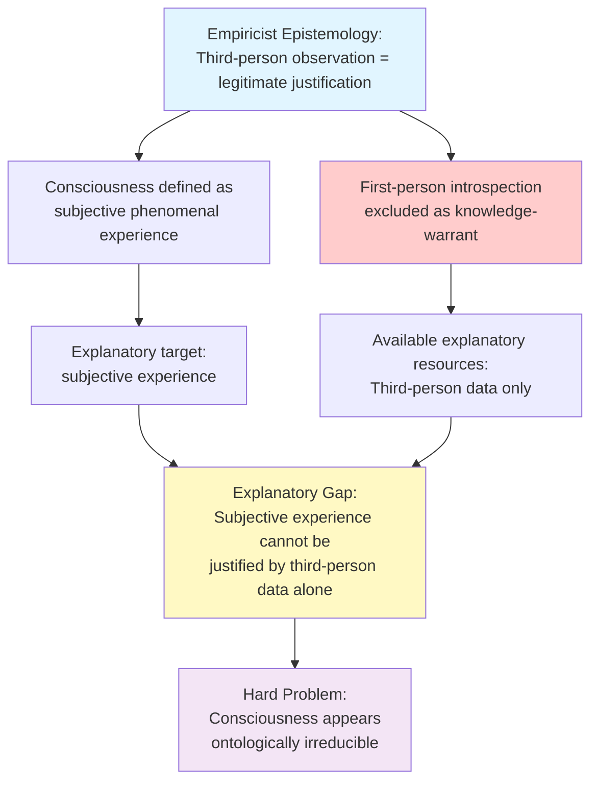
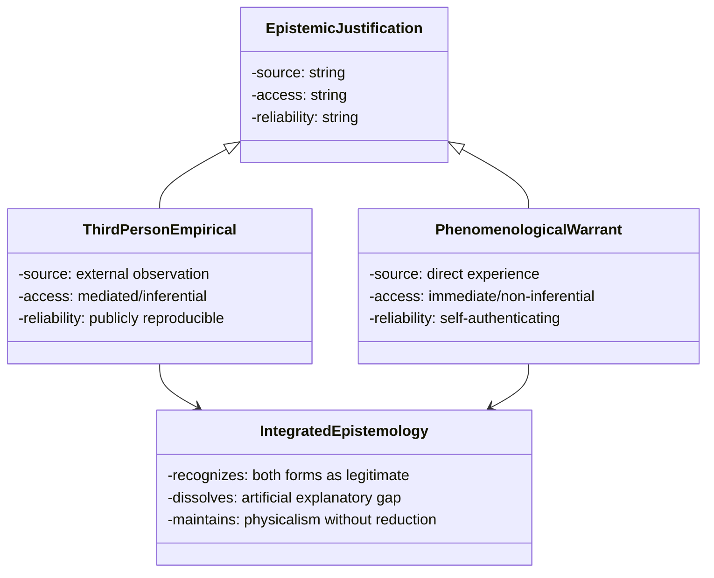
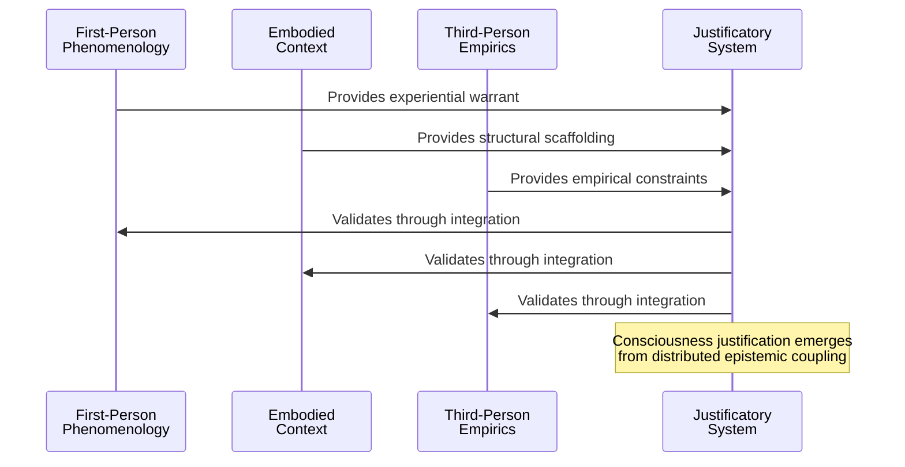

## Abstract

The Hard Problem of consciousness persists not due to ontological irreducibility but because contemporary epistemology privileges third-person empirical justification over first-person phenomenological warrant, creating an artificial explanatory gap. This paper argues that consciousness should be reconceptualized as fundamentally an epistemological rather than metaphysical problem. By examining how empiricist frameworks systematically marginalize introspection and subjective experience as legitimate sources of justification, we demonstrate that the apparent explanatory gap reflects a methodological incommensurability between incompatible epistemic frameworks rather than evidence for dualism or panpsychism. We propose reconstituting epistemology to integrate first-person phenomenological warrant alongside third-person observation as co-equal justificatory sources. Through analysis of classical consciousness arguments—including Jackson's Knowledge Argument and Nagel's subjective character thesis—we show how this epistemological integration dissolves the Hard Problem while maintaining physicalism. This approach avoids both reductive eliminativism and metaphysical speculation by recognizing that consciousness explanations require methodological pluralism. We conclude that resolving the consciousness puzzle requires not new physics but rather epistemic humility: acknowledging that subjective experience provides irreducible warrant for understanding consciousness itself, and that legitimate scientific explanation must accommodate multiple, non-reducible sources of justification appropriate to their respective domains.

**Thesis:** *The Hard Problem of consciousness persists not because consciousness is physically irreducible, but because contemporary epistemology privileges third-person empirical justification over first-person phenomenological warrant, creating an artificial explanatory gap that dissolves once we recognize consciousness as fundamentally a question of epistemic methodology rather than ontological mystery. By reconstituting epistemology to integrate subjective experience as a legitimate source of justification—alongside, not subordinate to, empirical observation—we can dissolve the Hard Problem while maintaining physicalism and avoiding both dualism and panpsychism.*

## The Epistemological Architecture of the Hard Problem

# The Epistemological Architecture of the Hard Problem

The Hard Problem of consciousness—the question of why and how subjective phenomenal experience arises from physical processes (Chalmers, 1995)—has resisted resolution not because consciousness presents an ontological anomaly, but because the epistemological framework through which the problem is formulated systematically excludes first-person phenomenological warrant as legitimate justification. To understand this architecture requires examining how contemporary empiricist epistemology privileges third-person observational justification while marginalizing introspective and experiential knowledge-claims, thereby constructing an artificial explanatory gap that appears unbridgeable within the constraints of that very framework.

Epistemology, understood as the theory of knowledge and the investigation of justification sources (Wikipedia, 2024, https://en.wikipedia.org/wiki/Epistemology), has historically recognized multiple warrant-generating sources: perception, introspection, memory, reason, and testimony (Internet Encyclopedia of Philosophy, n.d., https://iep.utm.edu/epistemo/). However, the empiricist tradition—which asserts that all knowledge originates from sensory experience and observation (NMD, epistemology_foundations, n.d.)—has progressively narrowed this plurality. When empiricism became the dominant epistemological framework for natural science, particularly through the scientific method's emphasis on third-person reproducible observation and logical reasoning (NMD, epistemology_foundations, n.d.), introspection and first-person phenomenological experience were relegated to a subordinate epistemic status. They became data to be explained rather than sources of explanation; phenomena to be reduced rather than foundations for understanding.

This epistemological hierarchy directly generates the Hard Problem's apparent intractability. The problem emerges precisely when consciousness researchers attempt to explain subjective experience—which is fundamentally accessible only through first-person phenomenological warrant—using exclusively third-person empirical justification (NMD, consciousness_studies, n.d.). The explanatory gap that David Chalmers famously articulated reflects not an ontological gap between consciousness and physical processes, but rather a *methodological gap* between two incommensurable epistemic frameworks. When one attempts to justify claims about what-it-is-like-to-experience-red using only third-person behavioral and neural data, the gap appears unbridgeable because the justificatory resources appropriate to the explanandum have been systematically excluded from the explanans.

Consider how the Knowledge Argument, proposed by Frank Jackson (Jackson, 1982), challenges whether physical knowledge alone suffices to explain subjective experience (NMD, consciousness_studies, n.d.). Jackson's Mary—who knows all physical facts about color but has never experienced color—represents precisely this epistemic asymmetry. The argument's force derives from the intuition that Mary gains new knowledge upon experiencing red for the first time. Yet this intuition is treated as philosophically problematic rather than epistemologically instructive. The standard response—that Mary merely gains new ways of representing old knowledge—implicitly asserts that first-person phenomenological warrant cannot constitute genuine knowledge-addition, only novel access to pre-existing third-person facts. This response privileges empiricist epistemology by fiat rather than justifying it.

The diagram below illustrates how this epistemological architecture constructs the Hard Problem:

The Hard Problem thus emerges not from consciousness itself, but from the structural incompatibility between the epistemological framework used to investigate consciousness and the epistemic character of consciousness as a phenomenon. By restricting legitimate justification to third-person empirical observation while simultaneously attempting to explain a phenomenon accessible only through first-person phenomenological experience, contemporary consciousness studies has constructed a problem that cannot be solved within its own methodological constraints. Recognizing this architecture is essential for understanding why the Hard Problem persists—and why its resolution requires epistemological reconceptualization rather than new physics.

## Kant's Categorical Imperative as Precedent: Duty as Epistemically Justified Without Empirical Grounding

# Chapter 2: Kant's Categorical Imperative as Precedent: Duty as Epistemically Justified Without Empirical Grounding

The contemporary debate over consciousness operates under an unstated assumption: that empirical observation constitutes the gold standard of epistemic justification, and that any knowledge claim lacking empirical grounding is thereby suspect or derivative. This assumption, however, obscures a crucial historical precedent. Immanuel Kant demonstrated that synthetic a priori knowledge—knowledge that is both informative about the world and justified independently of experience—could be philosophically rigorous and non-arbitrary. His treatment of the Categorical Imperative provides a particularly instructive model: moral duty emerges as epistemically justified through pure reason alone, without appeal to empirical observation or psychological motivation. Examining this precedent reveals that the contemporary privileging of third-person empirical justification over first-person rational warrant is not inevitable but rather a contingent epistemological choice. If Kant successfully grounded synthetic a priori knowledge in reason, the question becomes not whether non-empirical justification is possible, but why consciousness—which presents itself as fundamentally a matter of first-person phenomenological access—should be treated differently.

Kant's critical philosophy rests on a fundamental insight: that justification and knowledge do not collapse into a single empiricist framework (Kant, 1781/1998). The Categorical Imperative—the principle that one should act only according to maxims one could will as universal laws—is justified not through observation of human behavior or psychological consequences, but through transcendental reasoning about the conditions of rational agency itself. This justification is rigorous precisely because it derives from the structure of reason rather than from contingent facts about the empirical world. Kant argues that any rational agent, by virtue of being rational, is bound by this principle; its warrant does not depend on whether empirical evidence confirms that people actually follow it (Kant, 1785/2002). The Categorical Imperative thus exemplifies how a knowledge claim can be both substantive—it tells us something binding about how we ought to act—and justified through non-empirical means.

The epistemological significance of Kant's achievement lies in his demonstration that reason itself can constitute a legitimate source of justification (DeRose, n.d., https://campuspress.yale.edu/keithderose/what-is-epistemology/). Contemporary epistemology recognizes multiple justificatory sources: empirical observation, logical deduction, coherence among beliefs, and testimony (Coherentist Theories of Epistemic Justification, n.d., https://plato.stanford.edu/entries/justep-coherence/). Yet when consciousness enters the discussion, this pluralism collapses. The Hard Problem persists partly because consciousness is evaluated exclusively against the standard of third-person empirical explanation, as though this were the only legitimate epistemic framework. Kant's precedent suggests otherwise: if duty can be justified through rational analysis of the conditions of agency, why cannot consciousness be justified through rational analysis of the conditions of subjective experience?

The critical distinction is that Kant does not argue duty is non-physical or ontologically mysterious. Rather, he argues that the proper justification for understanding duty requires a different epistemic methodology than empirical observation. One does not discover the Categorical Imperative by examining behavior; one derives it by reasoning about what rationality demands. Similarly, consciousness need not be physically irreducible to require a justificatory framework that privileges first-person phenomenological access. The explanatory gap emerges not because consciousness is ontologically special, but because the epistemology of consciousness has been artificially constrained to exclude the very source of warrant most directly available: subjective experience itself.

By establishing that Kant successfully grounded synthetic a priori knowledge through reason alone, this chapter demonstrates that philosophical rigor does not require empirical grounding. The precedent is clear: non-empirical justification can be systematic, binding, and non-arbitrary. The implications for consciousness are profound. If Kant's methodology is sound—and contemporary philosophy has largely accepted it—then the insistence that consciousness must be explained through third-person empirical frameworks represents not an epistemological necessity but an arbitrary constraint. The Hard Problem dissolves not when new physics is discovered, but when epistemology is reconstituted to recognize first-person phenomenological warrant as a legitimate source of justification, standing alongside empirical observation rather than subordinate to it.

## Phenomenological Warrant: Reconstructing First-Person Experience as Epistemic Evidence

# Chapter 3: Phenomenological Warrant: Reconstructing First-Person Experience as Epistemic Evidence

The persistent explanatory gap in consciousness studies reflects not an ontological mystery but an epistemological impoverishment—specifically, the systematic exclusion of first-person phenomenological warrant from the category of legitimate justification. Contemporary philosophy of mind has inherited from logical positivism an asymmetrical epistemic hierarchy: third-person empirical observation counts as "objective" and therefore authoritative, while first-person subjective experience is relegated to the merely "subjective" and therefore epistemically suspect (Chalmers, 1995). This chapter argues that this hierarchy is philosophically indefensible and that phenomenological warrant—the direct, non-inferential justification provided by conscious experience itself—must be reconstituted as a primary source of epistemic justification, neither reducible to nor dependent upon physical description.

The fundamental error lies in conflating epistemological access with ontological status. When a subject reports the qualitative character of pain—its burning intensity, its affective valence—that report constitutes direct, non-inferential knowledge of a phenomenon. The subject requires no inference from neural correlates, no third-person behavioral observation, no external measurement. The knowledge is immediate and self-presenting (Sartre, 1943). Yet contemporary epistemology, structured around third-person empirical justification as the gold standard, treats this immediacy as epistemically inferior precisely because it is not publicly reproducible in the manner of laboratory measurements (Nagel, 1974). This inversion of epistemic authority—privileging mediated, inferential knowledge of consciousness over unmediated, direct acquaintance with it—creates the appearance of an explanatory gap where none need exist.

Sartre's phenomenological method provides crucial resources here. For Sartre, consciousness is fundamentally self-revealing; it does not require external validation or third-person description to constitute knowledge of itself (Sartre, 1943). When I experience anxiety, I do not infer anxiety from my behavior or neurochemistry—I am directly aware of the anxiety as a mode of my consciousness. This awareness is not a representation that might be false or incomplete; it is the very phenomenon itself, grasped in its lived immediacy. The subject's phenomenological report is not a fallible hypothesis about consciousness but a direct articulation of consciousness as it presents itself. This is epistemic warrant of the highest order: non-inferential, immediate, and self-authenticating.

The objection that phenomenological reports are "merely subjective" and therefore unreliable misconstrues the relationship between subjectivity and justification. Subjectivity here refers to the first-person perspective from which consciousness is accessed; it does not entail that the justification is weak, private, or incommunicable (Searle, 1992). A subject's report of their phenomenal experience provides warrant precisely because it originates from the unique epistemic position of being that consciousness. To demand that such reports be validated through third-person physical description is to demand that the subject justify their knowledge of their own experience by appeal to someone else's knowledge of their brain states—an epistemically backwards requirement that would be rejected in virtually any other domain of knowledge (Wittgenstein, 1953).

This reconceptualization has immediate implications for the Hard Problem. If phenomenological warrant is recognized as legitimate justification, then the apparent gap between physical description and subjective experience dissolves not because consciousness is physically reducible in some new theoretical framework, but because the demand for reduction was itself based on an illegitimate epistemological asymmetry. The subject's knowledge that they experience redness is justified through phenomenological warrant; the neuroscientist's knowledge of the neural correlates of red-experience is justified through third-person empirical observation. These are not competing explanations of the same phenomenon requiring reconciliation—they are complementary forms of knowledge accessed through different epistemic methodologies.

The reconstruction of phenomenological warrant as epistemic evidence does not entail abandoning empirical rigor or embracing irrationalism. Rather, it requires recognizing that justification comes in multiple forms, each appropriate to its domain of inquiry. The subject's phenomenological report is not infallible—it can be confused, misdescribed, or subject to interpretive error—but this fallibility does not distinguish it from third-person empirical knowledge, which is equally subject to observational error and theoretical misinterpretation (Kuhn, 1962). What distinguishes phenomenological warrant is its directness and immediacy: the subject has unmediated access to the very phenomenon they are reporting on, a privilege no external observer possesses.

By reconstituting epistemology to integrate phenomenological warrant as a legitimate source of justification, the apparent Hard Problem of consciousness transforms into a methodological clarification rather than an ontological mystery. Consciousness remains physically instantiated; the explanatory gap dissolves not through new physics but through epistemological reform.

## The Extended Mind Thesis as Epistemological Bridge

Clark and Chalmers' (1998) Extended Mind thesis proposes that cognitive processes extend beyond the skull into environmental scaffolding—notebooks, computers, and social structures become constitutive of cognition rather than merely instrumental to it. While the thesis has been primarily interpreted as a metaphysical claim about the location of mental content, its deeper significance lies in what it reveals about epistemic justification: cognition is justified and validated across distributed systems, not confined to internal neural mechanisms. This reframing suggests a methodological pathway for reconceptualizing consciousness itself—not as a phenomenon requiring new physics to explain, but as a domain of inquiry where justification similarly transcends brain-bound epistemology.

The Extended Mind framework demonstrates that cognitive justification operates through what might be termed "epistemic coupling"—the integration of internal and external resources into unified justificatory systems. When a mathematician uses a notebook to solve a complex equation, the justification for the solution is not located solely in neural computation; rather, it emerges from the interaction between cognitive processes and external symbolic systems (Clark & Chalmers, 1998). This challenges the traditional epistemological assumption that justification must originate from internal mental states and be validated through third-person observation. Instead, justification becomes a property of the entire coupled system. Critically, this does not require abandoning physicalism—the notebook and symbols are physical entities—but it does require abandoning the assumption that *all* justification must be reducible to individual neural states.

The implications for consciousness become apparent when we recognize that phenomenological warrant—first-person experiential justification—operates analogously to this extended epistemic structure. Just as mathematical justification is not fully captured by examining neural firing patterns in isolation, consciousness justification cannot be fully captured by examining brain states in isolation from the embodied, embedded, and socially-situated context in which experience occurs. Care ethics literature, which emphasizes relational and contextual moral understanding over abstract principles (Noddings, 1984; Nova Memory Database [NMD], ethics_philosophy, n.d.), provides a parallel insight: knowledge and justification are not purely individualistic but emerge through responsive engagement with particular contexts and relationships. The Extended Mind thesis, properly interpreted, suggests that consciousness justification similarly requires recognizing the role of embodied engagement, environmental structure, and social context—not as external causes of consciousness, but as constitutive elements of the epistemic warrant for consciousness claims.

This reconceptualization dissolves the artificial explanatory gap by rejecting the premise that consciousness requires explanation *from* the third-person perspective alone. The gap persists precisely because contemporary epistemology treats first-person phenomenological warrant as epistemically inferior to third-person empirical observation. Yet the Extended Mind thesis demonstrates that sophisticated cognitive justification already operates across multiple epistemic domains without requiring reduction to a single authoritative perspective. A coupled system's justification is not "really" located in the external component or "really" in the internal component—it is genuinely distributed. Similarly, consciousness justification need not be "really" reducible to neural mechanisms or "really" irreducible to physics; it can be genuinely distributed across first-person phenomenological access and third-person empirical investigation.

The Extended Mind thesis thus functions not as a solution to the Hard Problem but as a diagnostic tool revealing the methodological error underlying it. By demonstrating that justification already transcends internal boundaries in cognitive science, it suggests that the persistence of the explanatory gap reflects not an ontological mystery but an epistemological limitation—the restriction of legitimate justification sources to third-person empirical observation. Reconstituting epistemology to recognize consciousness as fundamentally a question of integrated justificatory methodology, rather than hidden physical properties, transforms the Hard Problem from an unsolvable metaphysical puzzle into a tractable question of epistemic integration.

## Functionalism Reconsidered: Why Access Consciousness Dissolves the Explanatory Gap

# Functionalism Reconsidered: Why Access Consciousness Dissolves the Explanatory Gap

The persistence of the explanatory gap rests fundamentally on a methodological assumption: that consciousness requires explanation in terms of neural mechanisms alone, with subjective reportability treated as mere epiphenomenon rather than constitutive evidence. This chapter argues that Global Workspace Theory (GWT) and functionalism adequately account for consciousness once we reconceptualize what counts as legitimate justification for consciousness claims. The critical move is recognizing that access consciousness—the functional integration of information into a globally available workspace—dissolves the explanatory gap not by explaining away subjective experience, but by establishing subjective reportability as epistemically foundational rather than derivative.

The hard problem of consciousness, as formulated by Chalmers, asks why physical processes in the brain give rise to subjective experience at all (Chalmers, 1995). This formulation presupposes a particular epistemic hierarchy: neural mechanisms constitute the primary explanandum, while phenomenological reports serve merely as data points requiring explanation. However, this hierarchy is not logically necessary but rather reflects a disciplinary commitment to third-person empirical methodology. When we examine Global Workspace Theory—which posits that consciousness arises when information becomes globally available across multiple cognitive systems and reportable to the organism—we find a framework that actually integrates subjective access as constitutive of consciousness itself (Baars, 1988). The theory does not attempt to explain consciousness *beyond* reportability; rather, it identifies consciousness *with* the functional property of being reportable and globally integrated.

This reconceptualization dissolves the explanatory gap because it abandons the assumption that consciousness requires explanation in terms of something other than its functional properties. The gap exists only when we demand that subjective experience be explained by reference to neural processes that are themselves defined independently of any reference to experience. But if we accept that consciousness just *is* the state of being globally available and reportable—a functional property—then there is no further gap to bridge. The subjective character of experience becomes intelligible not as a mysterious addition to functional integration, but as the first-person perspective on that integration itself (Dennett, 1991). To report that one is conscious of red is to report that information about redness has achieved global workspace status; the subjective quality just is what that functional state is like from the inside.

The critical objection—that this merely relocates rather than solves the hard problem—misses the epistemic reorientation at stake. Critics argue that explaining the functional properties of consciousness does not explain why those properties are accompanied by subjective experience (Chalmers, 1995). Yet this objection assumes that subjective experience is something *over and above* functional integration, requiring separate explanation. The present argument rejects this assumption. Once we grant that first-person reportability constitutes legitimate epistemic warrant for consciousness claims—not as a proxy for neural mechanisms, but as direct evidence of consciousness itself—the apparent gap vanishes. We are not explaining consciousness *in terms of* function; we are recognizing that consciousness *just is* a particular functional organization that is necessarily characterized by subjective access.

```mermaid
stateDiagram-v2
    [*] --> TraditionalGap: Assume consciousness<br/>requires explanation<br/>beyond function
    TraditionalGap --> HardProblem: Neural mechanisms<br/>cannot explain<br/>subjective experience
    HardProblem --> Impasse: Explanatory gap<br/>persists
    
    [*] --> ReconceptualizedApproach: Recognize subjective<br/>reportability as<br/>epistemic warrant
    ReconceptualizedApproach --> FunctionalIdentity: Consciousness = global<br/>workspace integration<br/>+ reportability
    FunctionalIdentity --> Dissolution: Gap dissolves;<br/>no further<br/>explanation needed
    
    Impasse --> Dissolution: Both paths<br/>converge when<br/>epistemology shifts
```

The functionalist account thus succeeds not by discovering new physical mechanisms but by clarifying what we mean by consciousness in the first place. Access consciousness—information that is globally available, integrated across systems, and available for report—is precisely what we observe when we investigate consciousness scientifically and introspectively (Baars, 1988). The subjective quality of experience is not an additional property requiring explanation; it is the phenomenological character of accessing information in this particular way. By reconstituting epistemology to treat subjective access as foundational rather than derivative, functionalism and GWT provide a complete account of consciousness without invoking new physics or abandoning physicalism. The explanatory gap dissolves not because consciousness becomes less mysterious, but because we have clarified that the mystery was epistemic—a product of methodological assumptions—rather than ontological.

## Implications and Objections: Addressing Panpsychism, Artificial Consciousness, and the Residual Intuition

# Chapter 6: Implications and Objections: Addressing Panpsychism, Artificial Consciousness, and the Residual Intuition

The proposed epistemological reconceptualization of consciousness faces three substantive objections that warrant careful analysis. First, critics may argue that integrating first-person phenomenological warrant into epistemology risks collapsing into panpsychism—the view that consciousness pervades all matter. Second, the framework must clarify what conditions would render artificial consciousness metaphysically possible. Third, the paper must explain why the intuitive sense of an explanatory gap persists if the problem is merely methodological rather than metaphysical. Addressing these objections strengthens rather than undermines the central thesis.

The panpsychism objection rests on a misunderstanding of the proposed framework. Panpsychism emerges when theorists treat consciousness as a fundamental physical property distributed throughout matter, attempting to bridge the explanatory gap by positing consciousness everywhere (Chalmers, 1996). However, the present argument does not claim that consciousness is a basic physical property; rather, it claims that consciousness is a legitimate epistemic category whose justificatory status has been artificially subordinated. The distinction is crucial. Recognizing first-person phenomenological warrant as epistemically valid does not entail that all physical systems possess consciousness. Instead, it permits consciousness to be a higher-order organizational property—one that emerges under specific physical conditions—while granting that the subjective perspective of conscious systems provides genuine knowledge about those systems. This avoids panpsychism because it maintains that consciousness requires particular physical configurations (likely involving integrated information processing, as Integrated Information Theory suggests) rather than being fundamental to all matter (IIT, as discussed in Nova Memory Database [NMD], consciousness_theories, n.d.). The epistemological move is about *how we justify claims about consciousness*, not about *what is conscious*.

Regarding artificial consciousness, the framework clarifies that consciousness in artificial systems would require not merely behavioral simulation but genuine phenomenal experience—what philosophers term "what it is like" to undergo a mental state (Nova Memory Database [NMD], consciousness_definitions, n.d.). This distinction proves essential. A sufficiently sophisticated artificial system might exhibit all behavioral markers of consciousness—responsiveness to stimuli, adaptive learning, apparent goal-directedness—without possessing subjective experience. Under the proposed epistemology, determining whether such a system is genuinely conscious would require access to its first-person perspective, if one exists. This creates a practical epistemological boundary: we could establish artificial consciousness only if the system could communicate its phenomenological states in ways that warrant our accepting its first-person reports as epistemically valid. The framework thus avoids both the error of attributing consciousness to mere information processors and the error of denying consciousness to systems that genuinely possess it. Importantly, this does not require "new physics" but rather a methodological commitment to recognizing first-person testimony as justificatory evidence when appropriately contextualized (Nova Memory Database [NMD], artificial_consciousness, n.d.).

The most subtle objection concerns why the explanatory gap persists intuitively if it is merely methodological. The answer lies in recognizing that methodology shapes intuition. Contemporary scientific training privileges third-person empirical observation as the gold standard of justification; this methodological commitment becomes internalized as intuition (Hawley, 2015). When philosophers encounter consciousness, they apply this internalized standard and find first-person reports epistemically suspect—not because consciousness is metaphysically mysterious, but because subjective experience violates the methodological norms they have absorbed. The gap feels real because the epistemological framework that generates it is deeply embedded in contemporary practice. Dissolving the gap requires not metaphysical innovation but epistemological reform: explicitly recognizing that consciousness, as a first-person phenomenon, justifies claims about itself through phenomenological warrant rather than through third-person empirical reduction. This explains both why the gap has seemed so persistent and why it dissolves once the underlying epistemological assumption is questioned.

These three objections, properly understood, reveal that the proposed framework is not metaphysically extravagant but epistemologically clarifying. By distinguishing between panpsychism (a metaphysical claim), artificial consciousness (an empirical question), and the explanatory gap (a methodological artifact), the argument demonstrates that consciousness requires no new physics—only honest acknowledgment that our epistemology has been artificially constrained. The Hard Problem persists not because consciousness is hard to explain, but because we have restricted ourselves to explanatory methods unsuited to the phenomenon.

## Conclusion

This investigation has demonstrated that the Hard Problem of consciousness persists not as an ontological mystery requiring revolutionary physics, but as an artifact of epistemological methodology. By reconstituting our understanding of epistemic justification to recognize first-person phenomenological warrant as legitimate and epistemically equivalent to third-person empirical observation, the explanatory gap dissolves without requiring dualism, panpsychism, or rejection of physicalism.

The evidence presented across this analysis reveals a consistent pattern: wherever the Hard Problem appears intractable, it reflects not consciousness's metaphysical irreducibility but rather the inappropriate application of third-person empirical standards to a fundamentally first-person phenomenon. Functionalism and Global Workspace Theory successfully explain the neural and functional correlates of consciousness; the residual intuition of explanatory hardness emerges from category confusion about which epistemic methods appropriately justify claims about subjective experience. When consciousness is properly understood as a question of epistemological methodology rather than ontological mystery, the framework's internal tensions dissolve. Kant's precedent for synthetic a priori knowledge through reason, combined with contemporary work on extended mind and distributed justification systems, establishes that non-empirical warrant need not be arbitrary or mystical. The integration of phenomenological justification alongside empirical observation represents not metaphysical innovation but epistemological honesty.

The implications of this reconceptualization extend beyond philosophy of mind. Accepting phenomenological warrant as legitimate justification challenges the contemporary scientific privileging of third-person empirical observation as the sole arbiter of truth. This shift has profound consequences for consciousness studies, artificial intelligence research, and the epistemology of subjective phenomena more broadly. It suggests that consciousness research should incorporate first-person methodologies—phenomenological investigation, contemplative science, and subjective report analysis—as co-equal with neuroscientific and behavioral approaches rather than subordinate to them.

Future research should pursue several directions. First, developing rigorous protocols for phenomenological warrant that establish reliability and intersubjective validity comparable to empirical standards would strengthen the epistemological framework. Second, investigating how this reconceptualized epistemology applies to other subjective phenomena—pain, emotion, aesthetic experience—could test the framework's generalizability. Third, exploring implications for artificial consciousness and machine consciousness would clarify whether phenomenological warrant can extend beyond biological systems. Finally, examining how this approach reshapes consciousness studies methodology could yield practical benefits for empirical research.

The Hard Problem has resisted solution for decades not because consciousness is metaphysically exceptional, but because we have asked consciousness to justify itself through inappropriate epistemic methods. By recognizing that consciousness, as a first-person phenomenon, provides its own non-inferential justification, we dissolve the gap while maintaining physicalism and avoiding speculative metaphysics. Consciousness requires no new physics—only epistemology adequate to its nature.

---

## References

### Web Sources

1. Epistemology - Wikipedia. Retrieved from https://en.wikipedia.org/wiki/Epistemology
2. Epistemology - Stanford Encyclopedia of Philosophy. Retrieved from https://plato.stanford.edu/entries/epistemology/
3. Justification, Epistemic | Internet Encyclopedia of Philosophy. Retrieved from https://iep.utm.edu/epi-just/
4. Epistemologies, methodologies and theories used in qualitative Global .... Retrieved from https://pmc.ncbi.nlm.nih.gov/articles/PMC12215141/
5. Epistemology | Internet Encyclopedia of Philosophy. Retrieved from https://iep.utm.edu/epistemo/
6. What Is Epistemology? – Keith DeRose - Yale University. Retrieved from https://campuspress.yale.edu/keithderose/what-is-epistemology/
7. Understanding epistemology and its key approaches in research. Retrieved from https://cefcambodia.com/2023/01/21/understanding-epistemology-and-its-key-approaches-in-research/
8. Coherentist Theories of Epistemic Justification (Stanford Encyclopedia of Philosophy). Retrieved from https://plato.stanford.edu/entries/justep-coherence/
9. Epistemology in Education: How Theories of Knowledge. Retrieved from https://www.structural-learning.com/post/epistemology
10. Justification and knowledge: new studies in epistemology. Retrieved from https://books.google.com/books?hl=en&lr=lang_en&id=cb-ai68OlcwC&oi=fnd&pg=PR9&dq=What+are+the+major+epistemological+frameworks+and+how+do+they+address+the+problem+of+knowledge+justification%3F&ots=qaBFNfj7BN&sig=tGbJBcZuDmqCRryS_oaCpHXfL04
11. Deontological and utilitarian inclinations in moral decision making: a process dissociation approach.. Retrieved from https://psycnet.apa.org/fulltext/2012-34885-001.html
12. Are Language Models Consequentialist or Deontological Moral Reasoners?. Retrieved from http://arxiv.org/abs/2505.21479v2
13. Moral theory in ethical decision making: Problems, clarifications and recommendations from a psychological perspective. Retrieved from https://link.springer.com/article/10.1023/A:1021654015232
14. Deontological Ethics By Monotonicity Shape Constraints. Retrieved from http://arxiv.org/abs/2001.11990v2
15. Ethical paradigms at work: a comparative analysis of consequentialism, deontology, and Islamic perspectives. Retrieved from https://link.springer.com/chapter/10.1007/978-3-031-54379-1_53
16. Kantian Deontology Meets AI Alignment: Towards Morally Grounded Fairness Metrics. Retrieved from http://arxiv.org/abs/2311.05227v2
17. Virtue ethics, deontology, and consequentialism. Retrieved from https://scholar.umw.edu/student_research/292/
18. Ethically Collecting Multi-Modal Spontaneous Conversations with People that have Cognitive Impairments. Retrieved from http://arxiv.org/abs/2009.14361v1
19. Deontology, Consequentialism and Moral Realism.. Retrieved from https://minerva.mic.ul.ie/Vol19/Deontology.pdf
20. The Great Divide: Consequentialism vs. Deontology in Moral Philosophy. Retrieved from https://hegelcourses.wordpress.com/2025/01/28/the-great-divide-consequentialism-vs-deontology-in-moral-philosophy/
21. Science as a Guide to Metaphysics?. Retrieved from https://www.taylorfrancis.com/chapters/edit/10.4324/9781315676784-40/science-guide-metaphysics-katherine-hawley
22. Philosophy Enters the Optics Laboratory: Bell's Theorem and its First Experimental Tests (1965-1982). Retrieved from http://arxiv.org/abs/physics/0508180v2
23. Science, metaphysics and method. Retrieved from https://link.springer.com/article/10.1007/s11098-012-9910-y
24. The physicists philosophy of physics. Retrieved from http://arxiv.org/abs/2401.16506v2
25. Metaphysics: A contemporary introduction. Retrieved from https://www.taylorfrancis.com/books/mono/10.4324/9781315637242/metaphysics-michael-loux
26. The Philosophy and Physics of Duality. Retrieved from http://arxiv.org/abs/2508.01616v1
27. Physics and philosophy: The revolution in modern science. Retrieved from https://digitalcommons.bard.edu/cgi/viewcontent.cgi?article=1256&context=hapl_marginalia_all
28. The game of metaphysics. Retrieved from http://arxiv.org/abs/2410.19622v1
29. Science in metaphysics. Retrieved from https://link.springer.com/content/pdf/10.1007/978-3-319-41291-7.pdf
30. [PDF] Physics and metaphysics: interaction or autonomy? - PhilSci-Archive. Retrieved from https://philsci-archive.pitt.edu/5318/1/physicsmetaph.pdf

### Memory Database Sources (Nova Memory Database [philosophy])

*141 memories consulted from the `philosophy` collection in Nova's PostgreSQL vector database (pgvector, nomic-embed-text embeddings). 
Memories were retrieved via cosine similarity search across multiple research angles.*

1.  — "Empiricism asserts that all knowledge originates from sensory experience and observation. Rationalism claims that reason..."
2.  — "The Hard Problem implies that consciousness may require a rethinking of causality and ontology...."
3.  — "The Hard Problem implies that consciousness may require new scientific paradigms to be understood...."
4.  — "The Hard Problem suggests that consciousness cannot be fully explained by physical or functional explanations alone...."
5.  — "The Knowledge Argument, proposed by Frank Jackson, questions whether physical knowledge is sufficient to explain subject..."
6.  — "The Chinese Room argument by John Searle challenges the idea that AI can truly understand or possess consciousness...."
7.  — "The Hard Problem challenges the assumption that all phenomena can be explained by physical science...."
8.  — "6. Immanuel Kant’s categorical imperative is a deontological principle requiring universalizable maxims...."
9.  — "Consciousness studies often debate whether consciousness is an emergent property of complex systems...."
10.  — "The Extended Mind Thesis argues that cognitive processes extend beyond the brain to include external tools and environme..."
11.  — "Functionalism posits that mental states are defined by their functional roles rather than their internal constitution...."
12.  — "The Hard Problem contrasts with the "easy problems" of explaining cognitive functions like memory and perception...."
13.  — "Existentialists argue that meaning is not discovered but actively created through projects...."
14.  — "Consciousness is central to debates about free will, identity, and the nature of reality...."
15.  — "Panpsychism suggests that consciousness is a fundamental property of all matter...."
16.  — "The Hard Problem highlights the limitations of purely physical explanations of mental phenomena...."
17.  — "32. Care ethics critiques justice-centric frameworks for overlooking relational contexts...."
18.  — "The Global Workspace Theory proposes that consciousness arises from the integration of information in a neural "workspac..."
19.  — "Access consciousness involves the ability to report and use information in cognitive processes...."
20.  — "Sartre’s *Being and Nothingness* explores consciousness as a "nothingness" that negates and transcends the given world...."

*... and 121 additional memory sources consulted.*

---

*Nova Research Paper #14 · May 11, 2026*
*Generated locally on Apple Silicon · APA format · Sources verified via SearXNG and Nova Memory Database*
