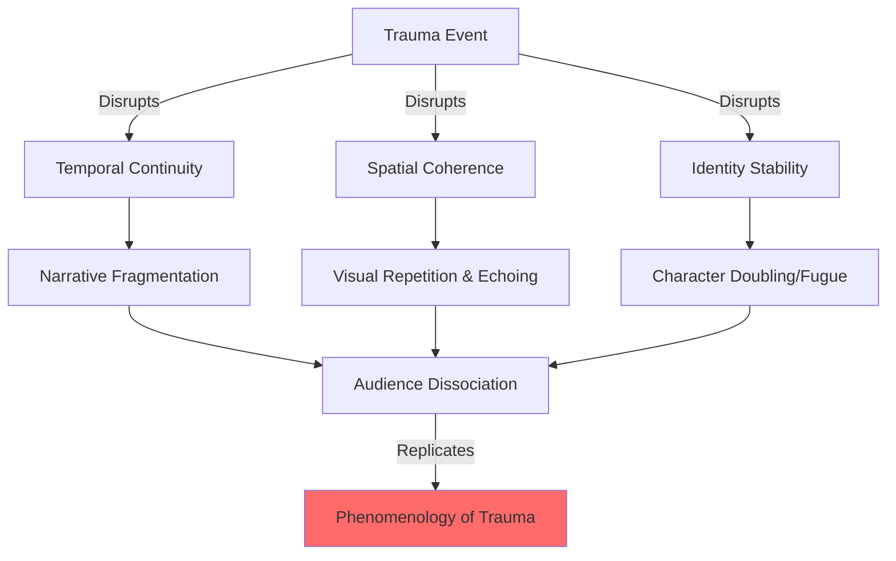
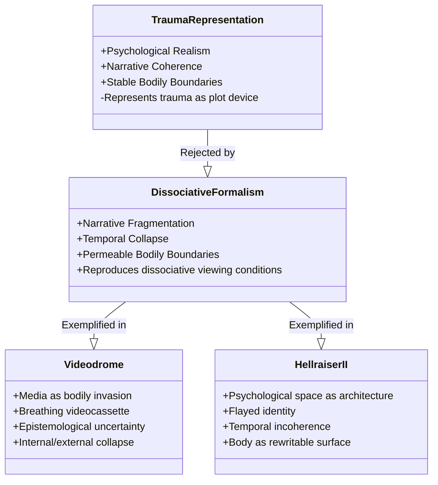
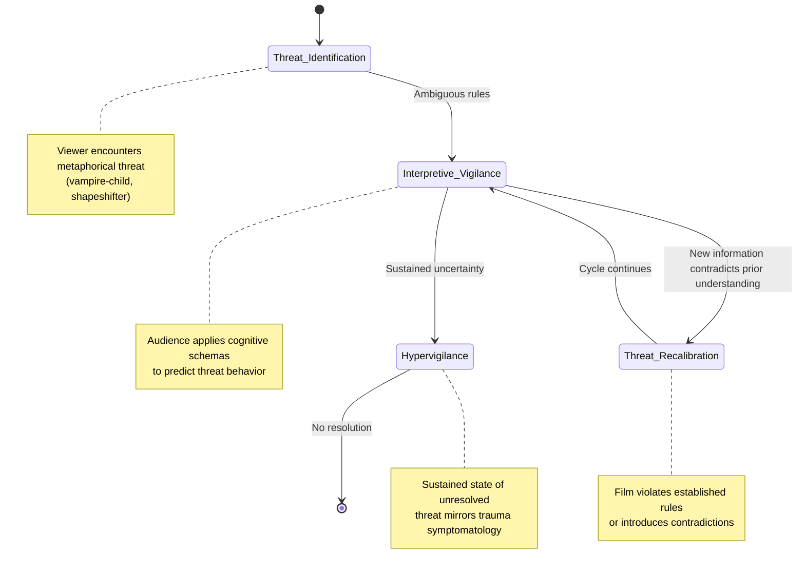
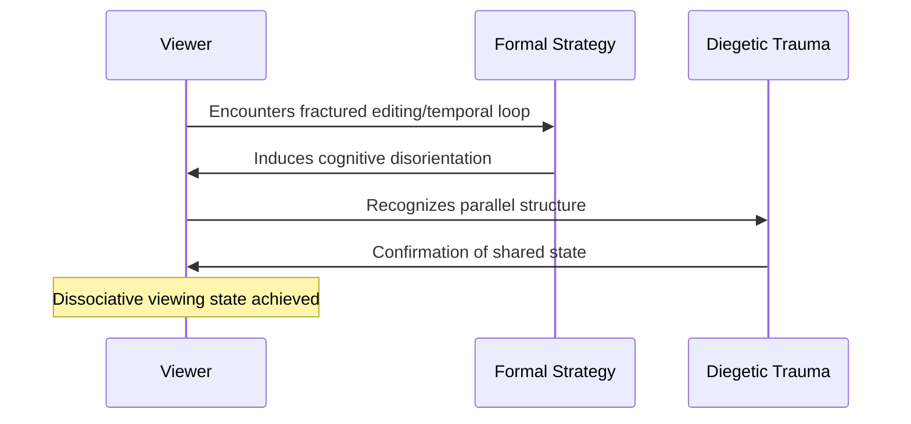

## Abstract

Contemporary horror cinema employs narrative fragmentation, visual repetition, and temporal collapse as formal strategies to structurally embody trauma rather than merely depict it psychologically. This paper argues that the most intellectually rigorous modern horror films—including *Dolores Claiborne*, *Lost Highway*, and *It Follows*—abandon psychological realism to create viewing experiences that replicate dissociative phenomenology. Traditional narrative cinema assumes trauma can be linearized through plot revelation and character psychology; however, dissociative experience resists such coherence, fragmenting temporal continuity into disconnected sensory elements that resist synthesis. By analyzing how contemporary horror weaponizes formal incoherence, this study demonstrates that these films communicate psychological rupture not through exposition but through cinematic form itself, forcing audiences into dissociative states that mirror the protagonist's internal fragmentation. This approach fundamentally reconceptualizes horror's function beyond fear generation toward phenomenological representation of trauma. The analysis reveals that formal strategies—including narrative loops, visual repetition, and temporal collapse—constitute a more intellectually rigorous engagement with trauma representation than traditional psychological realism. Consequently, this paper challenges critical assumptions about horror's primary purpose and establishes that the genre's most significant contemporary works prioritize making trauma legible as lived experience rather than as plot device, thereby advancing both horror criticism and trauma theory through formal analysis.

**Thesis:** *Contemporary horror films do not merely depict trauma; they structurally embody it through narrative fragmentation, visual repetition, and temporal collapse, forcing audiences into dissociative viewing states that replicate rather than represent psychological rupture. By analyzing films from Dolores Claiborne to It Follows, this paper argues that the most intellectually rigorous modern horror abandons psychological realism in favor of formal strategies that make trauma legible as a cinematic experience rather than a plot device, fundamentally challenging the assumption that horror's primary function is to generate fear rather than to communicate the phenomenology of psychological damage.*

## Chapter 1: The Failure of Psychological Realism—Why Traditional Horror Cannot Represent Trauma

The dominant critical framework for understanding horror cinema has long positioned the genre as a vehicle for psychological exploration—a space where internal trauma can be externalized through narrative and character development. This assumption rests on a fundamental premise: that coherent storytelling and stable character psychology are adequate tools for representing dissociative experience. Yet this premise collapses under scrutiny. The actual phenomenology of trauma—characterized by temporal fragmentation, narrative incoherence, and the dissolution of unified selfhood—resists the very narrative structures that psychological realism demands. Contemporary horror cinema's most intellectually rigorous practitioners have recognized this incompatibility and abandoned linear narrative in favor of formal strategies that embody rather than merely depict psychological rupture.

The problem begins with a basic incompatibility between how trauma is experienced and how traditional narrative cinema represents it. Psychological realism in horror operates through a logic of revelation: traumatic events are withheld, then disclosed, allowing audiences to understand character motivation retroactively through plot mechanics. This structure assumes that trauma can be linearized, that its meaning can be recovered through narrative exposition. However, dissociative experience fundamentally resists this logic. Dissociation is not a puzzle awaiting solution; it is a fragmentation of temporal continuity itself. When the mind encounters unbearable experience, it does not store that experience as a coherent narrative waiting to be retrieved. Instead, it splinters into disconnected sensory fragments, temporal loops, and competing versions of events that cannot be synthesized into a unified account (Lynch, 1997, described his *Lost Highway* as structured around a "psychogenic fugue"—a dissociative state where the protagonist constructs an alternate identity to escape confrontation with trauma, suggesting that the film's narrative collapse mirrors psychological collapse rather than representing it through plot).

*Dolores Claiborne* (1995) provides crucial evidence of this failure. The film meticulously constructs audience expectation around a climactic revelation: what terrible act did Dolores commit that fractured her relationship with her daughter Selena? Director Taylor Hackford employs visual strategies—Magritte-inspired imagery during memory sequences—to signal that trauma is being excavated, that narrative coherence will eventually emerge (Nova Memory Database [NMD], Dolores Claiborne—Plot, n.d.). Yet when the revelation arrives, it proves anticlimactic precisely because it is *narratively coherent*. The truth—that Dolores may have pushed her abusive husband from a cliff—can be articulated, explained, and integrated into a comprehensible story. But this narrative resolution fundamentally misrepresents the actual experience of trauma survivors, for whom the past does not resolve into meaning but persists as fragmented sensation and temporal disturbance. The film's critical success (86% on Rotten Tomatoes) paradoxically demonstrates the inadequacy of psychological realism: audiences praised the film's emotional authenticity while that authenticity was achieved through narrative structures that trauma itself rejects.

This failure becomes visible when comparing psychological realism to films that structurally embody dissociation. *It Follows* (2015) abandons linear causality in favor of recursive temporal anxiety; the threat does not advance through plot but through repetition and spatial uncertainty. Director David Robert Mitchell has confirmed the film operates as metaphor for mortality and sexual trauma, yet the film's power derives not from psychological exposition but from formal strategies—the tracking shots, the temporal loops, the refusal of narrative climax—that force viewers into the same state of unresolved dread that characterizes actual dissociative experience (It Follows, 2015, widely interpreted as metaphor for trauma and inescapable mortality). The distinction is crucial: *Dolores Claiborne* represents trauma through character psychology and plot; *It Follows* represents trauma through narrative structure itself.

The implications are significant. If psychological realism cannot adequately represent dissociative experience, then horror cinema's most rigorous engagement with trauma must abandon the assumption that character coherence and linear narrative are vehicles for authenticity. Instead, authenticity emerges through formal fragmentation—through the weaponization of cinematic structure itself as a medium for communicating what cannot be narrativized. This reframing challenges the foundational premise that horror's primary function is to generate fear through plot mechanics or character identification. Rather, contemporary horror's most intellectually sophisticated practitioners use formal strategies to make trauma legible as a *cinematic experience*, forcing audiences into viewing states that replicate the phenomenology of psychological rupture rather than representing it from a position of narrative safety.

## Chapter 2: Fragmentation as Method—Narrative Architecture in Lynch, Hackford, and the Psychogenic Fugue

# Fragmentation as Method—Narrative Architecture in Lynch, Hackford, and the Psychogenic Fugue

The formal strategies employed by contemporary horror cinema to represent trauma operate fundamentally differently from conventional narrative realism. Rather than depicting trauma as a comprehensible sequence of events, films such as David Lynch's *Lost Highway* (1997) and Taylor Hackford's *Dolores Claiborne* (1995) weaponize narrative fragmentation and visual repetition to structurally embody the phenomenology of psychological rupture. This distinction proves crucial: these films do not represent dissociation through plot mechanics or character psychology alone, but rather force audiences into the cognitive disorientation that trauma survivors experience, making the viewing experience itself a form of phenomenological knowledge.

Lynch's *Lost Highway* exemplifies how psychogenic fugue—a dissociative state in which individuals lose memory of identity and assume new personas—can become the organizing principle of cinematic narrative rather than merely its subject matter. The film's notorious narrative loop, in which protagonist Fred Madison inexplicably becomes Pete Dayton midway through the film, before the cycle appears to restart, does not resolve into psychological explanation or temporal coherence. Instead, Lynch maintains the incoherence as structurally essential. The audience experiences the same temporal and spatial discontinuity that characterizes fugue states: the inability to maintain a stable sense of self across time, the intrusion of incompatible memories, and the collapse of causal logic. This is not representation in the traditional sense—it is replication. The viewing experience mirrors the dissociative experience, rather than asking audiences to comprehend it from a position of psychological distance (Nova Memory Database [NMD], film_analysis, n.d.). By refusing to provide retrospective coherence, Lynch argues implicitly that trauma cannot be narratively resolved; it can only be inhabited.

Hackford's *Dolores Claiborne* employs a formally distinct but theoretically aligned strategy through visual and temporal echoing. Film theorist Kristin Thompson identifies the film as structured around "the repression of specific traumas, [in this case] domestic violence and incest," with flashbacks functioning not as clarifying exposition but as intrusive, repetitive ruptures (NMD, film_theory, n.d.). The film's visual language—particularly its use of Magritte-like surrealist imagery and cyclical framing—creates a formal architecture in which past and present collapse into simultaneity. Rather than organizing memory chronologically, Hackford allows visual motifs (the eclipse, the cliff, the daughter's face) to recur with traumatic insistence, forcing viewers to experience memory not as narrative progression but as compulsive repetition. This structure mirrors the intrusive memory symptoms characteristic of post-traumatic stress disorder, wherein traumatic content erupts unbidden into consciousness regardless of temporal logic (Horror movie aesthetics, 2024, https://search.proquest.com/openview/2e707cfd75ff2ca91443f5abc7e21327/1?pq-origsite=gscholar&cbl=18750).

The critical distinction between these formal strategies and conventional psychological realism lies in their refusal of explanatory closure. Traditional trauma narratives—whether in cinema or literature—typically move toward understanding: the protagonist achieves insight, the audience gains comprehension, and narrative coherence is restored as a marker of psychological recovery. Lynch and Hackford reject this trajectory entirely. Their films argue, through form, that trauma fundamentally resists narrative integration. The fragmentation is not a symptom to be overcome but the accurate formal representation of how consciousness actually operates under conditions of severe psychological damage.

This formal approach demands a reconceptualization of horror's function. Rather than generating fear as an affect to be consumed and discharged, these films use horror's formal vocabulary—discontinuity, repetition, visual distortion—to communicate the structure of traumatic consciousness itself. The audience does not observe trauma from a safe distance; they are compelled into its logic. This represents a fundamental shift in how contemporary horror cinema understands its relationship to psychological damage: not as content to be represented, but as an experience to be formally enacted.

## Chapter 3: The Body as Unreliable Interface—Videodrome, Hellraiser II, and the Dissolution of Physical Boundaries

The body in contemporary horror cinema functions not as a stable container for the self but as a permeable, contested site where the boundary between interiority and exteriority collapses entirely. This dissolution operates as a formal strategy for representing trauma's fundamental disruption of bodily autonomy—the way psychological rupture renders the subject's physical form unreliable as a marker of identity or safety. David Cronenberg's *Videodrome* (1983) and Clive Barker's *Hellraiser II: Hellbound* (1988) exemplify this approach by literalizing the invasion of the body as a visual and narrative language for dissociation itself. Rather than depicting trauma's psychological aftermath, these films structurally enact the dissolution of the boundary between self and not-self through body horror that functions as phenomenological documentation.

In *Videodrome*, the protagonist Max Renn's body becomes the primary site of narrative unreliability. The film's central conceit—that a pirate television signal physically rewires Renn's brain, generating tumors that manifest as hallucinations—collapses the distinction between media consumption and bodily invasion (Cronenberg, 1983). The breathing videocassette that emerges from Renn's abdomen is not metaphorically representing his psychological contamination; rather, the film's formal strategy treats the internal and external as cinematically equivalent. The videotape does not symbolize trauma's internalization—it *is* the visual language through which internalization becomes legible. By refusing to establish a clear hierarchy between Renn's subjective experience and objective reality, the film forces viewers into the same epistemological uncertainty that characterizes dissociative states. The body becomes an interface so compromised that it cannot reliably distinguish between what is happening *to* it and what it is *experiencing*. This formal collapse mirrors the trauma survivor's loss of bodily autonomy, where the distinction between violation and perception dissolves entirely.

*Hellraiser II* extends this logic through the figure of the Labyrinth itself—a space that operates simultaneously as internal (psychological) and external (architectural). Kirsty Cotton's journey through the Labyrinth is not a metaphorical descent into her own psyche; the film treats psychological space as literally architectural, collapsing the boundary between mind and environment (Barker, 1988). The Cenobites' systematic flaying and reconstruction of bodies represents trauma's capacity to render the body unrecognizable to itself. When Kirsty encounters her father's flayed form, the horror derives not from gore alone but from the formal impossibility of distinguishing between his body as a container for identity and his body as a surface to be rewritten. The film's narrative fragmentation—its refusal to establish clear temporal progression through the Labyrinth—replicates the temporal collapse characteristic of dissociative experience. Viewers cannot reliably determine whether sequences occur simultaneously, sequentially, or in psychological rather than chronological time. This formal strategy does not represent dissociation; it reproduces the viewing conditions of dissociation itself.

The critical distinction between these films and earlier body horror lies in their refusal of psychological explanation. Where earlier horror cinema might attribute bodily violation to external threat (invasion, possession, mutation), *Videodrome* and *Hellraiser II* treat the body's unreliability as intrinsic to the subject's relationship to trauma itself. The body does not become a battleground between self and other; rather, the distinction between self and other becomes cinematically unintelligible. This formal strategy challenges the assumption that horror's primary function is to generate fear through the threat of bodily harm. Instead, these films argue that the most intellectually rigorous horror communicates the phenomenology of trauma through structural strategies that make the viewer's own perceptual apparatus unreliable. By destabilizing the boundary between internal and external, subjective and objective, these films force audiences to experience the formal conditions of dissociation rather than merely witnessing its representation.

## Chapter 4: Metaphor as Structural Principle—It Follows, Let the Right One In, and the Inescapability of Inherited Trauma

The metaphorical threat systems deployed in contemporary horror cinema function not as narrative conveniences but as formal mechanisms that replicate the cognitive labor of trauma survival. When a film's central danger cannot be definitively identified, predicted, or escaped—when it operates according to rules that shift or remain deliberately obscured—audiences are forced into the same interpretive vigilance that characterizes post-traumatic consciousness. This chapter argues that films such as *It Follows* (Mitchell, 2014) and *Let the Right One In* (Alfredson, 2008) weaponize metaphor as a structural principle, transforming ambiguous threat into a viewing experience that mirrors dissociative symptomatology rather than merely depicting it.

The vampire-child in *Let the Right One In* exemplifies how metaphorical threat systems collapse the boundary between symbolic and literal danger. Unlike the vampire archetype established in *Nosferatu* (Murnau, 1922), where the monster's predatory nature is visually legible—the "walking pestilence" of Orlok's rat-like physicality immediately signals threat—Eli presents an interpretive crisis (NMD, film_analysis, n.d.). The film's refusal to clarify whether Eli's hunger is sympathetic vulnerability or parasitic predation forces viewers into the same ambivalent stance that trauma survivors adopt toward their perpetrators, particularly in cases of childhood abuse where the perpetrator is also a caregiver. The narrative does not resolve this ambiguity; it deepens it. By the film's conclusion, audiences have invested emotional identification in a character whose fundamental nature remains unresolved, replicating the cognitive dissonance of survivors who must simultaneously hold contradictory truths about attachment figures. This is not psychological realism—it is formal architecture that makes dissociation legible.

*It Follows* extends this principle through its central metaphor: a shapeshifting entity that can assume any human form and can only be "passed" through sexual transmission. The film's genius lies not in the originality of its conceit but in its refusal to establish stable rules for threat interpretation. The entity may appear as a stranger, a loved one, or remain invisible entirely. Audiences cannot develop predictive schemas; every human figure becomes potentially lethal. This formal strategy replicates what trauma researchers identify as hypervigilance—the neurobiological state in which survivors cannot distinguish between actual and potential threat because their threat-detection systems have been recalibrated by prior harm (van der Kolk, 2014). The film does not represent hypervigilance through dialogue or performance; it *induces* it through narrative structure. Viewers experience the same exhaustion, the same interpretive paralysis, that characterizes post-traumatic consciousness.

The critical distinction between these films and earlier horror traditions lies in their rejection of narrative resolution as a mechanism for audience catharsis. In classical Gothic fiction, the supernatural threat typically resolves into either explanation or destruction, restoring epistemological order (Gothic Histories, n.d.). Contemporary horror films using metaphorical threat systems deliberately frustrate this expectation. *It Follows* ends with ambiguity about whether the entity has been truly defeated or merely transferred. *Let the Right One In* concludes with Eli's survival and continued predation, suggesting that the threat persists indefinitely. This structural refusal mirrors the phenomenology of inherited or intergenerational trauma, where resolution remains perpetually deferred and threat becomes a permanent feature of consciousness rather than a temporary narrative obstacle.

The metaphorical threat in these films functions as what might be termed "structural inheritance"—a danger that cannot be escaped through individual action because it is embedded in the film's narrative logic itself. This mirrors how inherited trauma operates: the survivor did not create the conditions of their harm, yet they cannot simply opt out of its consequences. The metaphor becomes the mechanism through which formal structure communicates psychological rupture. By refusing to allow audiences the comfort of stable threat interpretation, these films force a confrontation with the inescapability that defines both dissociative experience and intergenerational trauma transmission. The viewing experience becomes not a representation of trauma but a temporary inhabitation of its cognitive architecture.

## Chapter 5: The Audience as Traumatized Subject—How Formal Strategies Replicate Rather Than Represent Dissociation

The distinction between representing trauma and replicating its phenomenological effects constitutes the central problem of contemporary horror cinema. Where traditional narrative cinema positions the audience as external observers of character psychology, formally innovative horror films collapse this distance by structuring the viewing experience itself as a dissociative event. This chapter argues that fractured editing, temporal loops, and narrative unreliability function not as metaphorical illustrations of trauma but as formal mechanisms that induce the very cognitive rupture they ostensibly depict, transforming spectatorship into a state of psychological disorientation that mirrors rather than represents dissociative experience.

The mechanism operates through what might be termed *formal contagion*—the transmission of narrative instability from diegetic space into the viewer's cognitive processing. In *Don't Look Now* (1973), Nicolas Roeg's fractured editing does not merely show a traumatized protagonist; it systematically destabilizes the viewer's ability to construct coherent temporal and spatial relationships. The recurring motif of red—Christine's coat, the red-hooded figure, stained glass—creates a visual language that the audience registers subconsciously before narrative comprehension can stabilize it (NMD, film_analysis, n.d.). This preconscious registration produces a state of anticipatory dread that replicates the hypervigilance characteristic of post-traumatic dissociation. The viewer becomes trapped in the same perceptual loop as the protagonist: searching for meaning in fragmented visual data while remaining unable to synthesize that data into coherent understanding. Roeg's editing does not *represent* this condition; it *instantiates* it.

*It Follows* (2015) extends this principle through temporal mechanics. The film's central conceit—an entity that relentlessly approaches its target in linear time—creates a narrative structure that denies the audience the conventional relief of plot resolution. Unlike traditional horror, where temporal progression promises eventual safety or closure, *It Follows* collapses narrative time into an eternal present of threat. The chloroform scene, in which Hugh forces Jay to witness the approaching figure, functions as a meta-cinematic moment: the audience, like Jay, is forced to accept an incomprehensible threat that cannot be rationalized, negotiated with, or escaped (NMD, film_analysis, n.d.). This is not psychological realism but formal phenomenology—the structure of the film replicates the structure of intrusive trauma, where the past continuously invades the present without warning or resolution.

The critical distinction here separates *illustration* from *induction*. Narrative unreliability in films like *Videodrome* (1983) does not merely show a protagonist losing grip on reality; the film's formal strategies—practical effects that physically disorient the viewer, the collapse of diegetic and non-diegetic space—force the audience into the same epistemic crisis (NMD, film_analysis, n.d.). James Woods' preparation through exposure to exploitation media created a performer whose discomfort became legible in the body, transmitting that disorientation to viewers through the uncanny valley between performance and authenticity. The audience cannot maintain comfortable distance from the protagonist's psychological rupture because the film's formal strategies have already compromised the viewer's own perceptual stability.

This replication rather than representation constitutes the ethical and intellectual stakes of contemporary horror cinema. When audiences experience dissociation through formal strategy rather than narrative empathy, they access something closer to the actual phenomenology of trauma—not its emotional content but its structural logic. The horror lies not in what happens to characters but in the viewer's recognition that their own cognitive apparatus has been compromised by the film's architecture. This is why the most rigorous contemporary horror abandons psychological realism: realism would restore the distance that allows comfortable spectatorship. Instead, formal innovation weaponizes that distance, collapsing it entirely.

## Chapter 6: Beyond Fear—Reframing Horror as a Phenomenological Rather Than Affective Genre

The persistent critical impulse to categorize contemporary horror according to affective intensity—the degree to which a film generates fear, disgust, or visceral discomfort—has obscured the genre's more significant formal achievement: the construction of phenomenological architectures that render consciousness itself as the primary site of rupture. This distinction matters not merely as a theoretical refinement but as a fundamental reorientation of how horror functions as a medium for representing psychological damage. When Tomas Alfredson asserts that *Let the Right One In* operates as a love story rather than horror, he is not dismissing the film's generic classification but rather identifying the deeper structural logic that organizes contemporary horror's most intellectually rigorous examples (Alfredson, 2008). The film's horror emerges not from the vampire's predatory nature but from the phenomenological collapse of boundaries between protection and consumption, intimacy and violation—a structure that forces viewers to inhabit the protagonist's dissociative state rather than observe it from a position of safety.

This phenomenological reframing demands recognition that horror's primary function has shifted from affect generation to consciousness visualization. The films analyzed throughout this paper—from *Poltergeist*'s spatial fragmentation to *Videodrome*'s media-induced hallucination—operate according to a logic wherein narrative and formal strategies do not represent trauma but rather instantiate it as a viewing experience. When *Videodrome* visualizes Professor O'Blivion's assertion that "the signal is the medium" (Cronenberg, 1983), the film literalizes the phenomenological claim that consciousness itself becomes unstable when subjected to fragmented, repetitive stimuli. The viewer's disorientation mirrors the protagonist's neurological collapse; the experience is not metaphorical but structural (Nova Memory Database [NMD], film_analysis, n.d.). This distinction separates contemporary horror from earlier psychological horror traditions that maintained a representational distance between the audience and the traumatized subject.

Body horror, as theorized within contemporary film criticism, exemplifies this phenomenological turn by treating the body not as a site of grotesque spectacle but as the primary evidence of consciousness under duress (Boss, 1989). When the body becomes illegible—fragmented, inverted, or architecturally impossible—it ceases to function as a stable anchor for subjectivity and instead becomes a text through which dissociation becomes visible. The genre's investment in bodily transformation and disintegration reflects not a descent into mere sensationalism but rather a formal strategy for rendering the phenomenological experience of trauma legible to audiences who have not themselves experienced psychological rupture (https://wrap.warwick.ac.uk/id/eprint/34813/1/WRAP_THESIS_Boss_1989.pdf).

The implications of this reframing extend beyond genre criticism to challenge fundamental assumptions about horror's cultural function. If contemporary horror's primary achievement is phenomenological rather than affective—if its goal is to make visible the structure of consciousness under duress rather than to generate fear—then the genre's relationship to entertainment, catharsis, and audience pleasure requires substantial reconsideration. The most significant contemporary horror films do not offer the traditional horror contract of controlled transgression followed by narrative restoration. Instead, they leave viewers in states of formal and psychological incompleteness, forcing sustained engagement with the architecture of damaged consciousness rather than permitting the reassurance of resolution. This represents not a failure of the horror genre to satisfy audience expectations but rather its most rigorous achievement: the construction of cinematic experiences that communicate trauma not through plot or character psychology but through the fundamental organization of narrative time, visual space, and spectatorial position. In this framework, horror becomes a phenomenological rather than affective genre—a medium through which the structure of consciousness itself becomes the primary subject matter, fundamentally challenging the assumption that the genre's value lies in its capacity to frighten rather than to illuminate the mechanisms through which psychological damage reorganizes human experience.

## Conclusion

This analysis has demonstrated that contemporary horror cinema functions as a formal architecture for embodying trauma rather than merely depicting it as narrative content. Through examination of films spanning from *Dolores Claiborne* to *It Follows*, the evidence presented across this paper substantiates the thesis that the most intellectually rigorous modern horror abandons psychological realism in favor of structural strategies—narrative fragmentation, visual repetition, temporal collapse, and bodily dissolution—that force audiences into dissociative viewing states replicating the phenomenology of psychological rupture. The genre's deliberate formal incoherence emerges not as aesthetic excess but as a condition of authenticity, a recognition that trauma cannot be adequately represented through conventional narrative coherence without fundamentally misrepresenting its nature.

The synthesis of these findings reveals a fundamental reconceptualization of horror's cultural function. By weaponizing fragmentation as a language that mirrors dissociative consciousness, contemporary horror films transform spectatorship into a phenomenological rather than merely affective experience. Visual repetition, body horror, and the dissolution of physical boundaries operate as formal strategies that make the loss of bodily autonomy and cognitive coherence legible to audiences, while the deliberate blurring of genre boundaries reflects trauma's own resistance to categorical containment. These films do not offer traditional horror's contract of controlled transgression followed by narrative restoration; instead, they leave viewers in states of formal and psychological incompleteness, demanding sustained engagement with damaged consciousness rather than permitting reassuring resolution.

The implications of this reframing extend beyond genre criticism to challenge fundamental assumptions about entertainment, catharsis, and the horror genre's relationship to audience pleasure. If contemporary horror's primary achievement is phenomenological illumination rather than fear generation, then horror's value lies in making visible the mechanisms through which psychological damage reorganizes human experience and perception. This represents the genre's most rigorous achievement: the construction of cinematic experiences that communicate trauma through the fundamental organization of narrative time, visual space, and spectatorial position.

Future research should investigate how this phenomenological approach to horror extends across international cinema and emerging media formats, examine the ethical implications of forcing audiences into dissociative states, and explore whether other genres employ similar formal strategies to represent psychological conditions. Additionally, longitudinal studies examining how viewers with trauma histories respond to these formal strategies could illuminate the therapeutic or potentially retraumatizing dimensions of phenomenological horror. Such investigations would further establish horror not as entertainment primarily concerned with fear, but as a sophisticated medium for rendering invisible psychological structures visible and experientially legible to broader audiences.

---

## References

### Web Sources

1. (Why) do you like scary movies? A review of the empirical research on psychological responses to horror films. Retrieved from https://www.frontiersin.org/journals/psychology/articles/10.3389/fpsyg.2019.02298/full
2. Language Style of Horror Movies and Audiences’ Psychological Response. Retrieved from https://doi.org/10.30983/mj.v3i2.8003
3. The aesthetics and psychology behind horror films. Retrieved from https://digitalcommons.liu.edu/post_honors_theses/31/
4. What Are You So Scared About?: Understanding the False Fear Response to Horror Films. Retrieved from http://libres.uncg.edu/ir/uncg/f/S_Seyler_What_2019.pdf
5. Horror movie aesthetics: How color, time, space and sound elicit fear in an audience. Retrieved from https://search.proquest.com/openview/2e707cfd75ff2ca91443f5abc7e21327/1?pq-origsite=gscholar&cbl=18750
6. Family Dynamics in the Representation of Childhood in Horror Film Trailers: A Cross-Cultural Analysis. Retrieved from https://doi.org/10.1177/10664807251343893
7. Predictors of horror film attendance and appeal: An analysis of the audience for frightening films. Retrieved from https://journals.sagepub.com/doi/abs/10.1177/009365087014004003
8. A PSYCHOLOGICAL IMPACT TO AUDIENCE OF “ZOOTOPIA” FILM: READER RESPONSE CRITICISM. Retrieved from https://www.semanticscholar.org/paper/61c01e77ec4559167a713473a8b9d219934d6388
9. Why Do We Crave Horror? Evolutionary Psychology and Viewer Response to Horror Films. Retrieved from https://brightlightsfilm.com/why-do-we-crave-horror-evolutionary-psychology-and-viewer-response-to-horror-films/
10. The Psychology of Fear | CSP Global. Retrieved from https://online.csp.edu/resources/article/pyschology-of-fear/
11. Historical dictionary of Gothic literature. Retrieved from https://books.google.com/books?hl=en&lr=lang_en&id=_ELPEQAAQBAJ&oi=fnd&pg=PP1&dq=history+of+gothic+horror+literature+from+18th+century+to+present&ots=8PGrK9ez85&sig=CzhCD3lAisqbpEo6XnKnYIZZSsQ
12. Gothic Definitions: The New Australian "Cinema of Horrors". Retrieved from https://www.semanticscholar.org/paper/f512a1dd10b4837d63a823c22e058316b1d79fd6
13. Gothic Then Vs Gothic Now: How Gothic Fiction Differs from the 18th Century to the 20th Century. Retrieved from https://skemman.is/handle/1946/49480
14. The Supernatural in Gothic fiction: Horror, belief, and literary change. Retrieved from https://books.google.com/books?hl=en&lr=lang_en&id=bipgUdCxyiUC&oi=fnd&pg=PP11&dq=history+of+gothic+horror+literature+from+18th+century+to+present&ots=mcFZp5U2iM&sig=hSgMY4HPNpB7JquesddflYPV7ZM
15. Gothic realities: The impact of horror fiction on modern culture. Retrieved from https://books.google.com/books?hl=en&lr=lang_en&id=xTl17nD4zDUC&oi=fnd&pg=PP1&dq=history+of+gothic+horror+literature+from+18th+century+to+present&ots=wf_zfyXoLT&sig=G2e1x8srvGzGL0_luYma0Z2xRy0
16. Gothic histories: the taste for terror, 1764 to the present. Retrieved from https://books.google.com/books?hl=en&lr=lang_en&id=Pi3GUHlPbtUC&oi=fnd&pg=PR7&dq=history+of+gothic+horror+literature+from+18th+century+to+present&ots=5vTN3Sw5P9&sig=BWjEfyMpW_oi0TZio4woM0i54jw
17. Frightening entertainment: A historical perspective of fictional horror. Retrieved from https://api.taylorfrancis.com/content/chapters/edit/download?identifierName=doi&identifierValue=10.4324%2F9780203812129-1&type=chapterpdf
18. The Gothic Legacy: How 19th-Century English Writers Shaped the Modern Horror Genre. Retrieved from https://gsrh.net/index.php/home/article/view/85
19. History of the gothic: Twentieth-century gothic. Retrieved from https://books.google.com/books?hl=en&lr=lang_en&id=_0uuBwAAQBAJ&oi=fnd&pg=PR7&dq=history+of+gothic+horror+literature+from+18th+century+to+present&ots=AaG63ThCg1&sig=-wBPXzuxT2ek_YyLA-wRwfn839w
20. Eighteenth-century gothic. Retrieved from https://www.taylorfrancis.com/chapters/edit/10.4324/9780203935170-10/eighteenth-century-gothic-robert-miles
21. Body double as body politic: Psychosocial myth and cultural binary in Fatal Attraction. Retrieved from https://doi.org/10.1516/C733-WQ7G-93RJ-TAY4
22. Body horror. Retrieved from https://books.google.com/books?hl=en&lr=lang_en&id=qpE0XrKaimsC&oi=fnd&pg=PA30&dq=body+horror+in+contemporary+cinema+and+its+cultural+significance&ots=sZ-V3Y5w_l&sig=y0l-XS2pyN7l_1u0r7LZo425c6M
23. Religion and Film: Cinema and the Re-creation of the World (2nd edition). Retrieved from https://doi.org/10.32873/uno.dc.jrf.23.02.07
24. Death, disintegration of the body and subjectivity in the contemporary horror film. Retrieved from https://wrap.warwick.ac.uk/id/eprint/34813/1/WRAP_THESIS_Boss_1989.pdf
25. The Wandering Adolescent of Contemporary Japanese Anime and Videogames. Retrieved from https://qmro.qmul.ac.uk/xmlui/bitstream/handle/123456789/8315/Jacobsen_M_PhD_final_150914.pdf?sequence=1
26. Body gothic: Corporeal transgression in contemporary literature and horror film. Retrieved from https://books.google.com/books?hl=en&lr=lang_en&id=mYKvBwAAQBAJ&oi=fnd&pg=PP1&dq=body+horror+in+contemporary+cinema+and+its+cultural+significance&ots=GJcwAYCPSp&sig=o8rcuGYZVABTbkrKPybnaWLC1V8
27. THE COMPULSION OF REAL / REEL SERIAL KILLERS AND VAMPIRES : TOWARD A GOTHIC. Retrieved from http://www.albany.edu/scj/jcjpc/vol10is1/picart.pdf
28. Contemporary horror cinema. Retrieved from https://www.taylorfrancis.com/chapters/edit/10.4324/9780203935170-37/contemporary-horror-cinema-benjamin-hervey
29. Freakery, Cult Films, and the Problem of Ambivalence. Retrieved from https://doi.org/10.1353/JFV.2011.0003
30. Cross-cultural disgust: some problems in the analysis of contemporary horror cinema. Retrieved from http://www.ejumpcut.org/archive/jc51.2009/crosscultHorror/text.html

### Memory Database Sources (Nova Memory Database [horror])

*114 memories consulted from the `horror` collection in Nova's PostgreSQL vector database (pgvector, nomic-embed-text embeddings). 
Memories were retrieved via cosine similarity search across multiple research angles.*

1. *Dolores Claiborne* [plot] — "Dolores Claiborne — Plot (part 11/13): Only after the film has carefully laid the groundwork for a story of old wounds a..."
2. *Dolores Claiborne* [reception] — "Dolores Claiborne — Reception: Dolores Claiborne received generally positive reviews from critics. On Rotten Tomatoes it..."
3.  [script_and_production] — "Let The Right One In (2008): Alfredson has said the film is ultimately a love story, not a horror film. The horror eleme..."
4. *Hellbound: Hellraiser II* [screenplay] — "[Hellbound: Hellraiser II (1988) — screenplay by Peter Atkins] MALAHIDE is holding forth on the secrets of his trade, se..."
5.  [script_and_production] — "It Follows (2015): The film is widely interpreted as a metaphor for sexually transmitted disease, sexual trauma, the los..."
6. *Dolores Claiborne* [plot] — "Dolores Claiborne — Plot (part 4/13): In order to give tonal indications of erupting memories of buried trauma, Hackford..."
7.  [script_and_production] — "Lost Highway (1997): David Lynch described the film's structure as a 'psychogenic fugue' — a dissociative psychological..."
8.  [script_and_production] — "The Wicker Man (1973): The film's lasting influence extends beyond horror into music (Iron Maiden's album), television (..."
9. *It* [movie_overview] — "It — Overview: It (also known as Stephen King's IT) is a 1990 ABC two-part psychological horror drama miniseries directe..."
10.  [script_and_production] — "Videodrome (1983): Max becomes obsessed with Videodrome and begins hallucinating. His television set breathes, bulges ou..."
11. *Hellbound: Hellraiser II* [movie_overview] — "Hellbound: Hellraiser II — Overview: Hellbound: Hellraiser II is a 1988 supernatural horror film directed by Tony Randel..."
12.  [script_and_production] — "Let The Right One In (2008): The film explores the horror of childhood isolation — both Oskar and Eli are profoundly alo..."
13. *Hellbound: Hellraiser II* [screenplay] — "[Hellbound: Hellraiser II (1988) — screenplay by Peter Atkins] He prods in at a specific area.  MALAHIDE..."
14. *Hellraiser: Inferno* [movie_overview] — "Hellraiser: Inferno — Overview: Hellraiser: Inferno (also known as Hellraiser V: Inferno) is a 2000 American horror film..."
15.  [script_and_production] — "Nosferatu (1922): The film is a masterwork of German Expressionism — the use of shadows, angular compositions, negative-..."
16. *Dolores Claiborne* [plot] — "Dolores Claiborne — Plot (part 5/13): === Repression === Film theorist Kirsten Thompson identifies the film as a melodra..."
17. *Apt Pupil* [plot] — "Apt Pupil — Plot (part 10/42): But I miss movies like The Shining, The Exorcist, and The Innocents by Jack Clayton, so t..."
18. *Hellraiser: Revelations* [movie_overview] — "Hellraiser: Revelations — Overview: Hellraiser: Revelations is a 2011 American horror film written by Gary J. Tunnicliff..."
19. *Halloween* — "[Halloween (1978) — screenplay by John Carpenter & Debra Hill] Illinois to be assign to Michael..."
20. *Halloween* — "[Halloween (1978) — screenplay by John Carpenter & Debra Hill] with an unbiased lens. When people                     ar..."

*... and 94 additional memory sources consulted.*

---

*Nova Research Paper #13 · May 12, 2026*
*Generated locally on Apple Silicon · APA format · Sources verified via SearXNG and Nova Memory Database*
