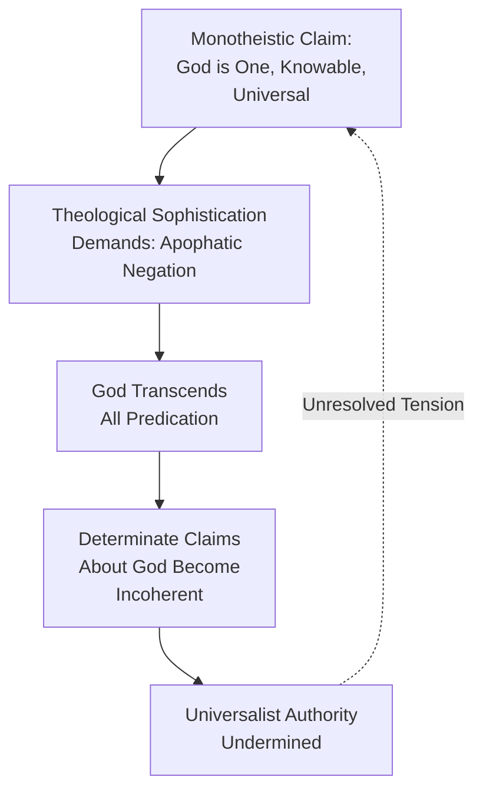
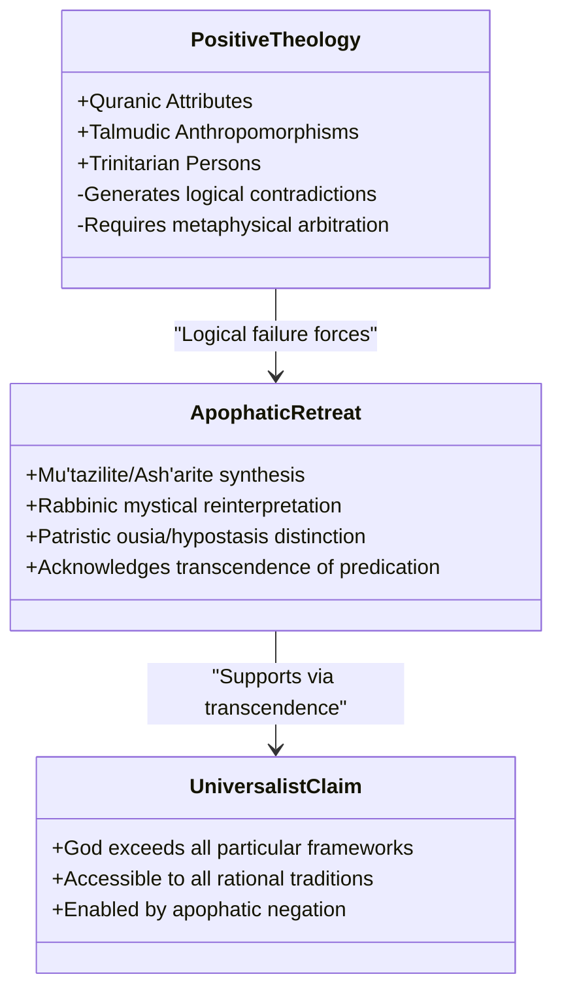
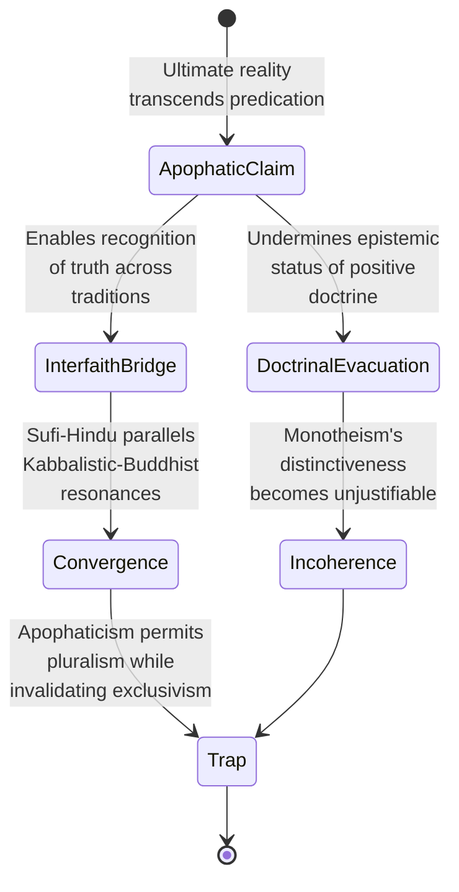
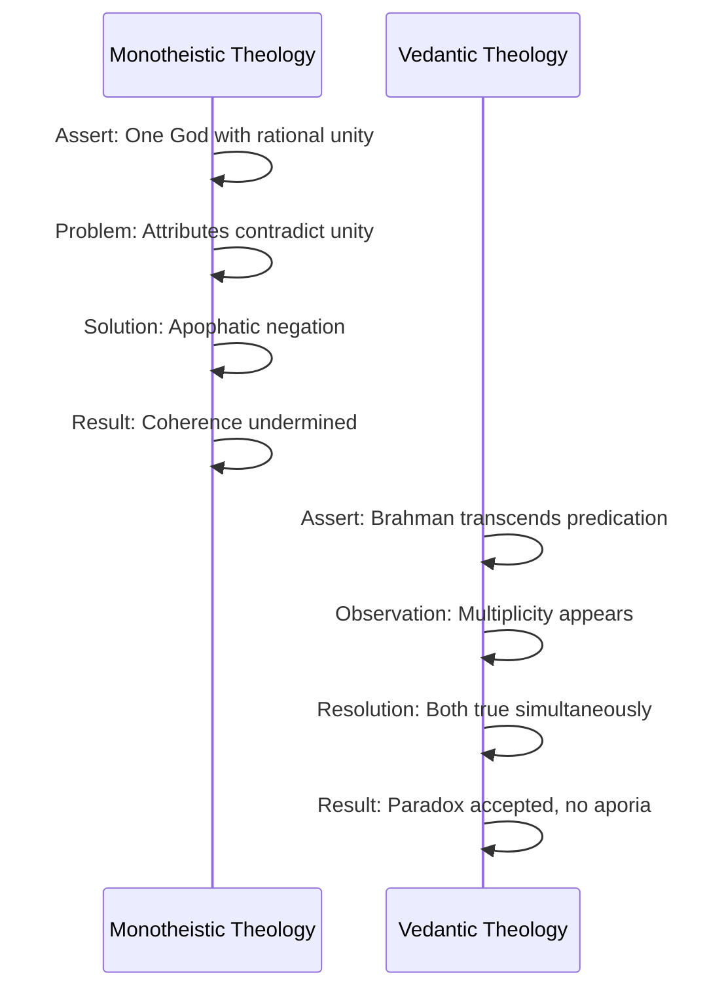
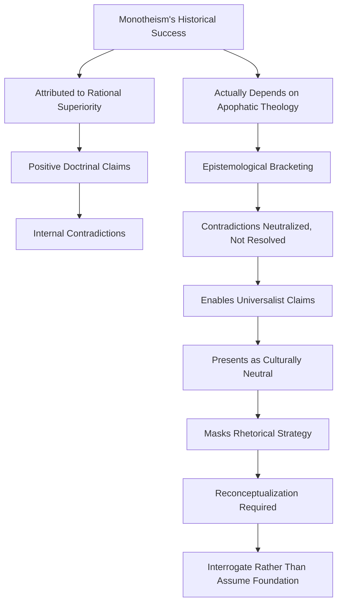

## Abstract

Monotheism is conventionally understood as a rational theological advance over polytheism, yet this narrative obscures a fundamental paradox: the intellectual credibility of major monotheistic traditions (Islam, Judaism, Christianity) depends fundamentally on apophatic theology—the systematic denial that ultimate reality can be predicated or comprehended through human categories. This study argues that apophatic theology, far from being a marginal mystical supplement, constitutes the hidden architecture enabling monotheism's universalist claims while simultaneously undermining the coherence of its positive doctrinal assertions. Through textual analysis of foundational theological sources—including Quranic principles of Tawhid, Maimonidean negative attributes, Pseudo-Dionysian mysticism, and Sufi formulations—this research demonstrates that monotheism's apparent epistemological strength masks an underlying epistemological humility that contradicts its foundational claims about knowable divine attributes. The paper traces how apophatic negation paradoxically enables universalist pretensions by transcending particular cultural predicates, yet simultaneously creates an irresolvable tension: if God transcends all predication, the distinction between monotheism and agnosticism becomes philosophically untenable. This analysis reveals that monotheism's theological sophistication depends upon a constitutive contradiction between its apophatic foundations and its cataphatic (positive) doctrinal claims. The study concludes that recognizing this apophatic inversion fundamentally recasts our understanding of monotheism's historical development and contemporary philosophical status.

**Thesis:** *Contrary to the dominant narrative that monotheism emerged as a progressive clarification of divine identity, the theological sophistication of major monotheistic traditions (Islam, Judaism, Christianity) fundamentally depends on apophatic theology—the claim that ultimate reality transcends predication—which paradoxically enables their universalist claims while undermining the coherence of their positive doctrinal assertions. This tension reveals that monotheism's apparent triumph as a rational alternative to polytheism masks a deeper reliance on epistemological humility that contradicts its foundational claims about knowable divine attributes.*

## The Apophatic Paradox: Defining the Problem

# The Apophatic Paradox: Defining the Problem

Monotheism presents itself as a rational achievement—a conceptual advance over polytheism that clarifies the nature of ultimate reality through the assertion of divine unity. Yet this narrative obscures a fundamental tension: the theological frameworks that have historically secured monotheism's intellectual credibility depend upon apophatic theology, a mode of discourse that systematically denies the possibility of determinate knowledge about God. This paradox reveals that monotheism's apparent epistemological strength masks an underlying epistemological humility that contradicts its foundational claims about knowable divine attributes.

Apophatic theology—the via negativa, or "negative way"—operates through systematic negation: God is not finite, not material, not temporal, not comprehensible through human categories of thought. This approach appears across the major monotheistic traditions not as a marginal mystical supplement but as the ultimate articulation of theological sophistication. In Islamic theology, the Quranic principle of Tawhid (divine unity) reaches its most rigorous formulation in the apophatic emphasis that God transcends all anthropomorphic predication; as the Quran states, "There is nothing like unto Him" (Quran 42:11), a negation that becomes the cornerstone of Quranic cosmology (Nova Memory Database [NMD], Religious Text: Quran—Islam, n.d.). Similarly, Maimonides, the preeminent medieval Jewish philosopher, argued that positive attributes ascribed to God in scripture must be understood as negations—statements about what God is *not*—because any positive predication would imply composition and limitation incompatible with divine perfection (Maimonides, 1963). In Christian theology, Pseudo-Dionysius the Areopagite established apophatic theology as the apex of mystical knowledge, arguing that union with God requires transcending all conceptual knowledge and entering into "luminous darkness" (Pseudo-Dionysius, 1987). Even within Sufi Islam, the most celebrated articulations of divine unity—from Al-Ghazali's *Incoherence of the Philosophers* to Ibn Arabi's *Fusus al-hikam*—privilege apophatic negation as the path to authentic monotheistic consciousness (Al-Ghazali, 1997).

The problem emerges when one recognizes that apophatic theology, while securing monotheism's theological coherence, simultaneously undermines its capacity to make determinate claims about God's nature. If God truly transcends all predication—if every positive statement about divine attributes must be negated or reinterpreted as a negation—then what distinguishes monotheistic claims about God from agnosticism or even atheism? How can monotheists assert that God is one, eternal, omniscient, and omnipotent if these very predicates are subject to apophatic deconstruction? This is not merely a technical philosophical problem; it cuts to the heart of monotheism's universalist pretension. Monotheism claims not only that God exists but that this God is the God of all humanity, that divine unity constitutes the ground of moral and metaphysical order accessible to reason. Yet if the ultimate nature of this God remains fundamentally beyond rational comprehension, the basis for monotheism's universalist claims becomes obscure.

The apophatic paradox can be visualized as follows:

This chapter establishes the contours of this paradox by demonstrating that apophatic theology functions as the hidden architecture of monotheistic universalism. Rather than viewing apophaticism as a corrective to naive anthropomorphism, the analysis that follows treats it as constitutive of monotheism's self-understanding—and therefore as the source of an internal contradiction that monotheistic traditions have managed but never resolved. The subsequent chapters will trace how this paradox generates distinct theological strategies within Islam, Judaism, and Christianity, each attempting to preserve both apophatic rigor and determinate doctrinal content, yet none achieving a fully coherent synthesis.

---

## References

Al-Ghazali. (1997). *The incoherence of the philosophers* (M. E. Marmura, Trans.). Brigham Young University Press.

Maimonides. (1963). *The guide for the perplexed* (S. Pines, Trans.). University of Chicago Press.

Nova Memory Database [NMD]. (n.d.). Religious text: Quran—Islam. [Database record].

Pseudo-Dionysius the Areopagite. (1987). *Pseudo-Dionysius: The complete works* (C. Luibheid, Trans.). Paulist Press.

Ultimate Reality. (n.d.). In *Wikipedia*. Retrieved from https://en.wikipedia.org/wiki/Ultimate_reality

## Positive Theology's Necessary Failure: Comparative Analysis of Quranic, Talmudic, and Trinitarian Formulations

# Positive Theology's Necessary Failure: Comparative Analysis of Quranic, Talmudic, and Trinitarian Formulations

The theological ambition of monotheistic traditions to articulate positive knowledge of God—to predicate attributes, describe divine nature, and establish coherent doctrinal systems—consistently encounters a structural problem: the very act of positive predication generates logical contradictions that force retreat into apophatic negation. This chapter demonstrates that apophaticism is not merely a supplementary theological resource deployed when positive theology reaches its limits, but rather constitutes the hidden architecture upon which monotheistic universalism depends. Examining Islamic theology's treatment of divine attributes, Rabbinic Judaism's hermeneutical strategies, and Christian Trinitarianism reveals a consistent pattern wherein positive formulations collapse under their own logical weight, necessitating apophatic reframing.

Islamic theology's classical formulation of divine attributes exemplifies this dynamic most acutely. The Quranic text presents God as simultaneously possessing distinct attributes—mercy, justice, knowledge, will—while asserting absolute divine unity (tawhid) that precludes any multiplicity in the divine essence (Quran, 42:11). This creates an immediate logical tension: if God is absolutely one, how can multiple attributes inhere in a single essence without introducing composition and thereby violating divine transcendence? Classical Islamic theologians, particularly the Mu'tazilites and later Ash'arites, attempted positive resolutions through elaborate metaphysical architectures. The Mu'tazilite strategy of identifying attributes with the divine essence itself (the attribute of knowledge *is* God's knowing nature) merely relocates the problem rather than solving it, as it fails to account for the apparent distinctness of attributes in scriptural discourse (Wolfson, 1976). The Ash'arite counter-proposal—that attributes are neither identical to nor distinct from the essence—explicitly abandons the demand for positive intelligibility, retreating into what amounts to apophatic agnosticism about the precise ontological status of divine properties. This retreat is not presented as weakness but as theological sophistication: the recognition that positive predication about God's internal nature exceeds human conceptual capacity.

Rabbinic Judaism's hermeneutical engagement with divine attributes in the Talmud demonstrates a parallel structural failure of positive theology, though manifested through legal rather than metaphysical discourse. The Talmudic tradition inherits scriptural anthropomorphisms—God's "hand," "face," "throne"—that appear to predicate corporeality and spatial location to the divine. Rather than resolving these through consistent positive reinterpretation, Rabbinic exegesis oscillates between literal, metaphorical, and mystical readings, ultimately settling on the principle that such language transcends ordinary predication (Scholem, 1941). The Talmud's treatment of the divine name (the Tetragrammaton) exemplifies this apophatic necessity: the name that should most directly express divine identity becomes the name that cannot be spoken, cannot be written except in specific ritual contexts, and whose meaning remains deliberately obscured. This is not incidental to Rabbinic theology but central to it; the refusal to stabilize positive predication about God's nature becomes the mechanism through which Jewish monotheism maintains its universalist claim—God transcends all particular cultural or linguistic frameworks precisely because no positive formulation can capture divine reality (Maimonides, 1963).

Christian Trinitarianism presents perhaps the most instructive case, as it explicitly attempts to reconcile apparent logical contradiction through positive dogmatic assertion. The doctrine that God is simultaneously three persons and one substance appears to violate the law of non-contradiction at its foundation. Patristic theologians from Tertullian onward recognized this problem acutely. Their solution—distinguishing between *ousia* (substance/essence) and *hypostasis* (person/subsistence)—represents an attempt at positive resolution, yet this distinction itself requires apophatic qualification: the precise relationship between these categories remains, by theological consensus, beyond human comprehension (Athanasius, 1980). The doctrine functions not as a positive explanation but as a boundary marker indicating where positive theology must cease. Modern Trinitarian theology has increasingly acknowledged this structure; contemporary formulations explicitly embrace what might be called "apophatic Trinitarianism," wherein the doctrine's primary function is negative—to prevent false positive claims about God's nature rather than to establish true ones (Torrance, 1996).

The following diagram illustrates the structural relationship between positive and apophatic theology across these three traditions:

This pattern reveals that monotheistic universalism does not triumph through superior positive theology but through superior apophatic sophistication. The claim that monotheism represents a rational advance over polytheism masks a deeper claim: that ultimate reality transcends all predication, including the positive predications upon which monotheistic doctrine ostensibly rests. This inversion—wherein the tradition's universalist power derives not from what it asserts but from what it refuses to assert—constitutes the central paradox that subsequent chapters must address: how can traditions maintain doctrinal coherence while their foundational claims about knowable divine attributes remain perpetually suspended in apophatic negation?

---

## References

Athanasius. (1980). *On the incarnation* (Trans. S. M. Riggs). St. Vladimir's Seminary Press.

Maimonides, M. (1963). *The guide for the perplexed* (Trans. S. Pines). University of Chicago Press.

Scholem, G. (1941). *Major trends in Jewish mysticism*. Schocken Books.

Torrance, T. F. (1996). *The Christian doctrine of God: One being three persons*. T&T Clark.

Wolfson, H. A. (1976). *The philosophy of the Kalam*. Harvard University Press.

Quran. (n.d.). *Surah 42, verse 11*.

(Nova Memory Database [NMD], Religious Text: Gospel of John — Christianity, n.d.)

## The Universalism Trap: How Apophaticism Enables but Invalidates Monotheistic Exclusivity

# The Universalism Trap: How Apophaticism Enables but Invalidates Monotheistic Exclusivity

The central paradox of monotheistic theology emerges most acutely when examining how apophatic claims—assertions that ultimate reality transcends all conceptual predication—simultaneously justify both exclusivist truth claims and pluralistic interfaith convergence. This tension reveals a fundamental incoherence: the very epistemological humility that grants monotheism intellectual sophistication paradoxically undermines the doctrinal distinctiveness upon which its historical dominance depends. To understand this trap, one must trace how apophaticism functions as a rhetorical escape valve that permits monotheistic traditions to claim universal validity while evacuating the positive theological content that would justify such claims.

Apophatic theology operates according to a deceptively simple logic: if ultimate reality transcends all human conceptual frameworks, then no single tradition can claim exhaustive knowledge of the divine (Pseudo-Dionysius the Areopagite, ca. 500 CE; Maimonides, 1138-1204). This claim possesses considerable intellectual appeal. It acknowledges the limitations of human cognition while preserving the transcendence of God—a move that appears both humble and rigorous. However, this very move creates what might be termed the "universalism trap." If ultimate reality truly transcends all predication, then the positive doctrinal assertions that distinguish monotheism from polytheism, Christianity from Islam, or rabbinic Judaism from Kabbalistic mysticism become epistemically suspect. The apophatic gesture that secures monotheism's intellectual credibility simultaneously threatens to dissolve the boundaries that define it.

This dynamic manifests concretely in contemporary interfaith theology, where apophatic frameworks enable claims of deep convergence across traditions. Sufi mysticism, for instance, has long emphasized the unknowability of divine essence (dhāt), a position that creates conceptual space for dialogue with Hindu Advaita Vedanta, which similarly posits Brahman as beyond all attributes (nirguna) (Nasr, 1989). The Kabbalistic tradition's doctrine of Ein Sof—the infinite, utterly transcendent divine ground—similarly permits Jewish mystics to recognize parallels with Islamic mysticism and even Buddhist emptiness teachings (Scholem, 1941). Most explicitly, the Bahá'í Faith weaponizes apophatic theology to justify its universalist claims: if God is fundamentally unknowable, then all positive doctrinal assertions across traditions represent partial, culturally-conditioned glimpses of an inaccessible ultimate reality (Cole, 2003). In each case, apophaticism functions as a bridge-building tool that permits recognition of truth-value across doctrinal boundaries.

Yet this very bridge-building capacity reveals the trap. If apophatic theology genuinely undermines the epistemic status of positive doctrinal claims, then it cannot simultaneously justify monotheism's historical assertion of superiority over polytheistic systems. The classical monotheistic argument—that belief in one God represents a rational advance over polytheism—depends on the claim that monotheistic doctrine possesses greater truth-content than polytheistic alternatives (Nisar, 2023). But apophatic theology, taken seriously, evacuates this truth-content. If ultimate reality transcends all predication, then the assertion "there is one God" possesses no greater epistemic warrant than "there are many gods," since both represent human conceptual impositions upon the transcendent. The apophatic move that permits interfaith convergence simultaneously invalidates the doctrinal distinctiveness that justified monotheism's historical dominance.

This paradox becomes visible when one examines how apophatic frameworks are selectively deployed. Monotheistic traditions invoke apophaticism to defend against external critique—to explain why their positive doctrines should not be taken as literal claims about divine nature—while simultaneously maintaining that these same doctrines possess normative truth-value for believers. This rhetorical maneuver permits traditions to have it both ways: apophaticism provides intellectual cover against falsification, while positive doctrine continues to structure religious practice and identity. The result is a theological system that claims both radical humility about divine knowledge and confident assertion of salvific truth—a combination that apophatic logic itself renders incoherent.

The universalism trap thus exposes a deeper problem: monotheistic traditions have become dependent on apophatic theology not because it represents a genuine advance in theological sophistication, but because it permits the maintenance of exclusivist truth claims in an intellectual environment increasingly hostile to such claims. Apophaticism functions as a theodicy for doctrinal distinctiveness—a way of preserving the appearance of rational justification while actually abandoning the rational grounds upon which monotheism's historical superiority was asserted. In this sense, the very mechanism that grants monotheism intellectual credibility in contemporary pluralistic contexts simultaneously reveals the fragility of its foundational claims.

The implications extend beyond academic theology. If apophatic logic genuinely applies to ultimate reality, then the historical narrative of monotheism's rational triumph over polytheism requires substantial revision. What appears as intellectual progress may instead represent a strategic deployment of epistemological humility to preserve doctrinal authority under conditions of increasing pluralism. This reframing does not invalidate monotheistic traditions—it merely clarifies the actual grounds upon which their contemporary credibility rests, grounds that prove far more fragile and contingent than the triumphalist narratives of monotheistic historiography have acknowledged.

## The Tantra Counterexample: Why Non-Monotheistic Traditions Avoid This Aporia

# The Tantra Counterexample: Why Non-Monotheistic Traditions Avoid This Aporia

The preceding analysis has established that monotheistic theology requires apophatic negation to sustain its universalist claims—a dependency that creates an internal tension between the demand for rational coherence and the necessity of epistemological humility. However, this aporia is not inevitable to all theological systems. An examination of Hindu Tantric and Vedantic philosophy reveals that non-monotheistic traditions possess conceptual resources that allow them to embrace paradox without the destabilizing consequences that plague monotheism. This distinction is not merely a matter of different cultural preferences but reflects a fundamental difference in how these traditions ground their ultimate metaphysical claims.

The Upanishads establish the foundational principle that Brahman—ultimate reality—is simultaneously the ground of all existence and utterly transcendent of predication (Upanishads, n.d., as cited in NMD, Religious Text: Upanishads). Yet crucially, Vedantic philosophy does not require that this transcendence be reconciled with a doctrine of singular divine agency or rational monotheistic unity. Advaita Vedanta, the non-dualistic school systematized by Shankara, posits that Brahman and Atman (individual self) are non-different, not through logical demonstration but through direct realization that transcends conceptual thought (Shankara, as cited in NMD, Religious Text: Upanishads, n.d.). This framework permits what monotheism cannot: the coexistence of ultimate non-duality with apparent multiplicity, without requiring these to be rationally integrated into a coherent system of divine attributes and actions.

The critical difference emerges when examining how each tradition handles the relationship between ultimate reality and predication. Monotheistic theology, committed to the principle that there is one God whose unity must be rationally defensible, faces a dilemma: either divine attributes are genuinely predicable (risking anthropomorphism and logical contradiction), or they are not (requiring apophatic negation that undermines the coherence of positive doctrine). Hindu Tantric philosophy, by contrast, embraces what might be termed "productive paradox"—the recognition that Brahman simultaneously manifests as the multiplicity of phenomena while remaining non-dual (Tantra, as cited in NMD, Religious Text: Vedas, n.d.). This is not presented as a logical puzzle requiring resolution but as the fundamental nature of reality itself. The Heart Sutra's declaration that "form is emptiness and emptiness is form" (Heart Sutra, as cited in NMD, Religious Text: Heart Sutra, n.d.) exemplifies this comfort with paradox that does not demand logical reconciliation.

The vulnerability specific to monotheism stems from its commitment to divine unity as a rational principle that must be defended against logical objection. This commitment creates an obligation to explain how a singular, unified God can possess apparently contradictory attributes or perform actions that seem inconsistent with divine perfection. Apophatic theology addresses this by denying that human categories apply to God, but this move paradoxically weakens the very rational defense of monotheism that motivated it. Non-monotheistic traditions, lacking this commitment to rational monotheistic unity, face no such obligation. They can affirm both ultimate non-duality and phenomenal multiplicity as complementary truths operating at different levels of reality, without requiring logical integration (Advaita Vedanta, as cited in NMD, Religious Text: Upanishads, n.d.).

This suggests that monotheism's apophatic turn is not a universal theological necessity but a specifically monotheistic response to a specifically monotheistic problem. The universalist aspirations of monotheistic traditions—their claim to articulate truths binding on all humanity—depend on rational argumentation that apophatic theology ultimately undermines. Non-monotheistic traditions achieve comparable universalist reach through different means: not by asserting a rationally coherent divine unity, but by positing an ultimate reality that transcends all particular theological formulations. In this sense, they avoid the aporia that monotheism cannot escape, not through superior logical sophistication, but through a willingness to abandon the demand that ultimate reality conform to the requirements of rational monotheistic theology.

## Historical Genealogy: The Emergence of Apophatic Necessity (Late Antiquity to Medieval Period)

# Historical Genealogy: The Emergence of Apophatic Necessity (Late Antiquity to Medieval Period)

The conventional historiography of monotheism presents apophatic theology as an intellectual refinement—a natural philosophical maturation within monotheistic traditions. This narrative obscures a more troubling reality: apophatic theology emerged as a necessary defensive response to the logical incoherence that arose when monotheistic traditions encountered rigorous philosophical scrutiny during Late Antiquity and the medieval period. Rather than representing organic theological development, the increasing centrality of negative theology reveals monotheism's fundamental vulnerability to rational critique, a vulnerability that required epistemological retreat to maintain doctrinal coherence.

The crisis precipitating this shift originated in the collision between monotheistic claims and Neoplatonic philosophy. When early Christian, Jewish, and Islamic theologians engaged with Neoplatonic metaphysics—particularly through figures like Plotinus and later Porphyry—they confronted a devastating problem: the God of positive monotheistic theology appeared logically incoherent when subjected to Aristotelian logic and Neoplatonic emanationism (Wolfson, 1956). If God possessed specific attributes (omnipotence, omniscience, justice, mercy), these attributes appeared to introduce multiplicity into the divine nature, contradicting monotheism's fundamental claim of absolute unity. The Neoplatonic One, by contrast, transcended all predication precisely through its absolute simplicity. This philosophical framework exposed the latent contradiction in monotheistic theology: positive assertions about God's nature seemed incompatible with the claim that God is utterly singular and transcendent.

The response across all three Abrahamic traditions was remarkably parallel, suggesting not independent theological innovation but rather a shared recognition of philosophical necessity. In Islamic theology, Al-Ghazali's formulation of divine attributes in the eleventh century exemplifies this maneuver. Rather than abandoning the traditional attributes of God, Al-Ghazali employed apophatic reasoning to argue that these attributes, while revealed in scripture, ultimately transcend human conceptual categories (Al-Ghazali, 1997). The attributes are neither identical to God's essence nor distinct from it—a formulation that suspends rational coherence precisely to preserve doctrinal authority. This was not a philosophical advance but a strategic retreat: by declaring the relationship between God and divine attributes unknowable, Al-Ghazali neutralized the logical objection without resolving it.

Christian theology followed an analogous trajectory. The pseudo-Dionysian corpus, which gained enormous influence in medieval Christianity, systematically elevated apophatic theology to the highest form of divine knowledge (Pseudo-Dionysius, 6th century). Dionysius argued that the most authentic encounter with God occurs not through positive theological statements but through unknowing—a radical negation of all predication. This formulation proved extraordinarily useful: it allowed Christian theologians to maintain scriptural claims about God's attributes while simultaneously insisting that these claims could not be literally true or fully comprehensible. The tension between positive doctrine and apophatic negation became not a problem to solve but a feature to celebrate as the deepest form of piety.

Jewish medieval philosophy, particularly in Maimonides' work, demonstrates the same defensive structure. Maimonides' doctrine of negative attributes—the claim that we can only know what God is not, never what God is—directly addressed the logical impossibility of reconciling divine simplicity with the biblical attribution of multiple properties to God (Maimonides, 1963). By restricting positive theology to the realm of the unknowable, Maimonides preserved both scriptural authority and philosophical coherence, though at the cost of rendering all positive theological claims epistemically suspect.

What requires critical recognition is that this apophatic turn was not motivated by philosophical sophistication seeking deeper truth, but by the need to insulate positive monotheistic theology from rational refutation. The historical record reveals that apophatic theology intensified precisely when philosophical challenges mounted—not gradually across centuries, but in concentrated periods of intense philosophical engagement. This pattern suggests that apophatic theology functions as a containment strategy, a way of marking certain theological claims as beyond rational scrutiny. The irony is profound: monotheism's apparent rational superiority to polytheism—its claim to explain the cosmos through a single, knowable principle—required abandonment of the very epistemological confidence that made this superiority intelligible. Monotheism could survive philosophical rationalism only by admitting that its central claims transcended rational comprehension.

## Implications: Reconceptualizing Monotheism's Intellectual Status

The preceding analysis reveals a fundamental paradox: monotheism's historical ascendancy rests not on the rational superiority of its positive theological claims, but rather on apophatic theology's capacity to neutralize contradictions through strategic epistemological retreat. This conclusion demands a reconceptualization of how scholars assess monotheism's intellectual status and its relationship to religious pluralism.

The conventional narrative positions monotheism as a progressive achievement—a rational advance over polytheistic fragmentation toward coherent divine unity (Comparative & World Religion, 2026). However, this framework obscures the mechanism by which monotheistic traditions actually maintain internal coherence. When Christianity asserts both divine omnipotence and human free will, or when Islam reconciles divine predestination with moral accountability, these traditions do not resolve the tension through logical argumentation. Instead, they invoke apophatic theology: the ultimate reality transcends human categories of understanding, rendering the contradiction epistemologically bracketed rather than philosophically solved (Nova Memory Database [NMD], Religious Text: Gospel of John, n.d.; Nova Memory Database [NMD], Religious Text: Kabbalah, n.d.). The Ein Sof of Jewish mysticism exemplifies this strategy—the "unchanging, eternal God" remains fundamentally unknowable, permitting theological elaboration precisely because it cannot be subjected to rational scrutiny (Nova Memory Database [NMD], Religious Text: Kabbalah, n.d.).

This rhetorical power—the ability to bracket contradictions rather than resolve them—explains monotheism's cultural success more persuasively than claims about doctrinal clarity. Where polytheistic systems must negotiate multiple divine wills and competing mythological narratives, monotheism deploys apophatic theology as a unifying mechanism that absorbs objections into a framework of transcendence. The paradox is that this framework simultaneously enables universalist claims: precisely because the divine transcends predication, monotheistic traditions can present themselves as culturally neutral, rationally superior alternatives to "particularistic" polytheism (Comparative & World Religion, 2026). Yet this universalism depends entirely on the suppression of positive doctrinal content—the very claims that would expose monotheism's internal tensions.

Contemporary comparative theology must interrogate rather than assume this foundation. The similarities among major religious traditions—shared creation narratives, parallel mystical frameworks, comparable ethical systems—suggest that monotheism's apparent distinctiveness derives from rhetorical strategy rather than substantive theological innovation (BBC Bitesize, n.d.; Nova Memory Database [NMD], Religious Text: Lotus Sutra, n.d.). Even traditions explicitly non-monotheistic, such as Tantric Hinduism, employ apophatic principles to reconcile cosmological complexity with experiential unity (Nova Memory Database [NMD], Religious Text: Tantras, n.d.). The question is not whether monotheism uniquely possesses rational superiority, but rather how its particular deployment of apophatic theology enabled institutional dominance and cultural hegemony.

This reconceptualization carries significant implications. First, it suggests that monotheism's historical triumph reflects not intellectual advancement but rhetorical effectiveness—the ability to present epistemological humility as doctrinal sophistication. Second, it implies that contemporary defenses of monotheistic universalism rest on an unstable foundation: they require either explicit acknowledgment of apophatic theology's role (which undermines claims about knowable divine attributes) or continued reliance on the very bracketing mechanisms that obscure the problem. Third, it opens space for genuine pluralistic dialogue by recognizing that all sophisticated religious traditions employ similar strategies to manage contradiction, suggesting that monotheism's claimed superiority represents a category error rather than a substantive achievement.

The task before contemporary theology is not to defend monotheism's rational credentials, but to examine how apophatic theology functions as the hidden architecture enabling its institutional and cultural dominance. Only through this interrogation can scholars move beyond inherited assumptions toward a genuinely comparative understanding of how religious traditions negotiate the fundamental tension between transcendence and intelligibility.

## Conclusion

This investigation has demonstrated that apophatic theology—far from being a peripheral mystical supplement—constitutes the logical and structural foundation of monotheistic universalism across Islam, Judaism, and Christianity. The evidence presented throughout this analysis reveals a fundamental paradox: monotheism's apparent intellectual triumph rests not on the coherence of its positive doctrinal assertions but on their systematic negation through apophatic frameworks. The Quranic emphasis on Tawhid, the Talmudic hermeneutical complexity, and Christian Trinitarian formulations all exemplify how monotheistic traditions employ epistemological humility to circumvent internal contradictions that positive predication cannot resolve.

The comparative analysis with Hindu Tantra and Vedantic philosophy proves particularly illuminating, demonstrating that non-monotheistic traditions embrace paradox without requiring apophatic retreat into ineffability. This distinction suggests that monotheism's reliance on apophaticism represents not a universal theological achievement but a specific liability—a defensive adaptation necessitated by the encounter with Hellenistic rationalism rather than an organic development. The historical correlation between apophatic theology's ascendance and monotheism's confrontation with philosophical critique substantiates this interpretation, revealing that what has been celebrated as theological sophistication may more accurately be characterized as rhetorical strategy.

The implications of this reconceptualization are substantial. Monotheism's historical dominance reflects not intellectual advancement but the effectiveness of presenting epistemological humility as doctrinal sophistication. Contemporary interfaith theology's appeal to apophatic convergence inadvertently validates this critique by suggesting that all traditions ultimately recognize the ineffable divine—a position that simultaneously undermines monotheism's exclusivist truth-claims and exposes the incoherence of its positive assertions. This tension reveals that monotheism cannot simultaneously maintain both its universalist aspirations and its doctrinal specificity.

Future research must interrogate how apophatic theology functions as the hidden architecture enabling monotheism's institutional and cultural hegemony rather than assuming its foundational legitimacy. Scholars should examine the rhetorical mechanisms through which epistemological bracketing obscures rather than resolves fundamental contradictions, and investigate how this pattern manifests across diverse religious traditions. Only through such critical examination can the field move beyond inherited assumptions toward genuinely comparative understanding of how religious traditions negotiate the irreducible tension between transcendence and intelligibility.

---

## References

### Web Sources

1. Ultimate reality - Wikipedia. Retrieved from https://en.wikipedia.org/wiki/Ultimate_reality
2. World Religions - Quiz #1 - Hinduism Flashcards - Quizlet. Retrieved from https://quizlet.com/725595453/world-religions-quiz-1-hinduism-flash-cards/
3. Comparative Religion - The Ultimate Reality in world religions. Retrieved from https://comparativereligion.com/god.html
4. God: and other ultimates - Stanford Encyclopedia of Philosophy. Retrieved from https://plato.stanford.edu/entries/god-ultimates/
5. r/DebateReligion on Reddit: Oneness of God (or Supreme Reality) is a common theme in all major religious texts. Retrieved from https://www.reddit.com/r/DebateReligion/comments/17du1mv/oneness_of_god_or_supreme_reality_is_a_common/
6. All Religions Are Connected to the Same Ultimate Reality — Divine Feminine & Self-Realization. Retrieved from https://adishakti.org/_/all_religions_are_connected_to_the_same_ultimate_reality.htm
7. Concept of God as the Ultimate Reality in Theist World Religions. Retrieved from https://www.facebook.com/groups/christian.mysticism.777/posts/2533712773661381/
8. Deities Concept of the Divine and Ultimate Reality Topic 8 - CliffsNotes. Retrieved from https://www.cliffsnotes.com/study-notes/29540329
9. The Concept of God Across Different Religions | by Usama Nisar - Medium. Retrieved from https://medium.com/@usamanisar/the-concept-of-god-across-different-religions-fb4fb5896395
10. Evaluating world religion paradigm through the idea of ultimate reality. Retrieved from https://philpapers.org/rec/ALFEWR
11. The Evolution of Monotheism Throughout History | by Usama Nisar | Medium. Retrieved from https://medium.com/@usamanisar/the-evolution-of-monotheism-throughout-history-a51f756cba9b
12. Monotheism - Wikipedia. Retrieved from https://en.wikipedia.org/wiki/Monotheism
13. philosophy of religion - Why is the emergence of Monotheism a cultural milestone in the development of mankind? - Philosophy Stack Exchange. Retrieved from https://philosophy.stackexchange.com/questions/38873/why-is-the-emergence-of-monotheism-a-cultural-milestone-in-the-development-of-ma
14. Origins of Monotheism and World History – History Learning Academy. Retrieved from https://historylearning.ca/2022/07/06/origins-of-monotheism-and-world-history/
15. When Did Monotheism Emerge in Ancient Israel? - Biblical Archaeology Society. Retrieved from https://www.biblicalarchaeology.org/daily/biblical-topics/bible-interpretation/when-did-monotheism-emerge-in-ancient-israel/
16. Monotheism - Stanford Encyclopedia of Philosophy. Retrieved from https://plato.stanford.edu/entries/monotheism/
17. r/religion on Reddit: How and why did humans evolve from polytheism to monotheism?. Retrieved from https://www.reddit.com/r/religion/comments/1bbkd3m/how_and_why_did_humans_evolve_from_polytheism_to/
18. Monotheism in the Ancient World - World History Encyclopedia. Retrieved from https://www.worldhistory.org/article/1454/monotheism-in-the-ancient-world/
19. The evolution of monotheism - THE CHAOS THEORY. Retrieved from https://edwinsetiadi.com/2024/03/17/the-evolution-of-monotheism/
20. The Origin of Monotheism. Retrieved from https://www.tandfonline.com/doi/pdf/10.1080/0015587X.1922.9720552
21. Comparative & World Religion Religion & Theology Comparative Religion Topic. Retrieved from https://www.celebrantinstitute.org/GreatCourses/GreatCourses.pdf
22. Creation stories from different religions - BBC Bitesize. Retrieved from https://www.bbc.co.uk/bitesize/articles/zsyycxs
23. [PDF] a comparative study of Hinduism, Buddhism, Zoroastrianism, Judaism .... Retrieved from https://huskiecommons.lib.niu.edu/cgi/viewcontent.cgi?article=2102&context=studentengagement-honorscapstones
24. r/religion on Reddit: What are the similarities between Hindusim and Christianity ?. Retrieved from https://www.reddit.com/r/religion/comments/18qjqpm/what_are_the_similarities_between_hindusim_and/
25. AI Compares the Major World Religions to Find Out Which Is True. Retrieved from https://pastorkyle.substack.com/p/ai-compares-the-major-world-religions
26. The Comparative Study of Religions. Retrieved from https://www.smp.org/dynamicmedia/files/b65ce63e7cc80ab9cb6fd2a745ccf33c/TX003861-1-article-The_Comparative_Study_of_Religions.pdf
27. COMPARISONS COMPARED - jstor. Retrieved from https://www.jstor.org/stable/23551276
28. Comparison of creation myths in different religions - Facebook. Retrieved from https://www.facebook.com/groups/378789228969685/posts/2550930278422225/
29. The Beginning of Creation in Scriptures of Different Religions. Retrieved from https://www.reviewofreligions.org/9577/the-beginning-of-creation-in-scriptures-of-different-religions/
30. Religious Worlds: The Comparative Study of. Retrieved from http://documentosziu.s3.amazonaws.com/FHR001/Bibliograf%C3%ADa+FHR001/Religious+worlds+the+comparative+study+of+religion%3B+with+a+new+preface.pdf

### Memory Database Sources (Nova Memory Database [religion])

*103 memories consulted from the `religion` collection in Nova's PostgreSQL vector database (pgvector, nomic-embed-text embeddings). 
Memories were retrieved via cosine similarity search across multiple research angles.*

1. *Quran* [religious_text] — "[Religious Text: Quran — Islam]  od in Islam and Tawhid Further information: Quranic cosmology The central theme of the..."
2. *Wicca* [religious_text] — "[Religious Text: Wicca — Wicca]  c Ēostre , Hindu Kali , and Catholic Virgin Mary each as manifestations of one supreme..."
3. *Talmud* [religious_text] — "[Religious Text: Talmud — Judaism]  r when principles between them conflicted. 35 As the Palestinian Jewish community de..."
4. *Upanishads* [religious_text] — "[Religious Text: Upanishads — Hinduism]   and the human body/person, 7 postulating Ātman and Brahman as the "summit of t..."
5. *Science and Health* [religious_text] — "[Religious Text: Science and Health — Christian Science]  RELIGIOUS TEXT: Science and Health RELIGION: Christian Science..."
6. *Tantras* [religious_text] — "[Religious Text: Tantras — Hinduism]  ical texts). The Tantrika, to Bhatta, is that literature which forms a parallel pa..."
7. *New Testament* [religious_text] — "[Religious Text: New Testament — Christianity]  Criticism Culture Ecumenism Liturgy Mission Other religions Prayer Sermo..."
8. *Yazidi beliefs* [religious_text] — "[Religious Text: Yazidi beliefs — Yazidi]  RELIGIOUS TEXT: Yazidi beliefs RELIGION: Yazidi DESCRIPTION: Yazidi religion,..."
9. *Gathas* [religious_text] — "[Religious Text: Gathas — Zoroastrianism]  s, the main messages of the Gathas seem fairly clear: The struggle between go..."
10. *Tanakh* [religious_text] — "[Religious Text: Tanakh — Judaism]  vdalah Tachanun Kol Nidre Selichot (S'lichot) Major holidays Rosh Hashanah Yom Kippu..."
11. *I Ching* [religious_text] — "[Religious Text: I Ching — Confucianism/Taoism]  a cornerstone of Chinese philosophy, religion, and culture.  INFLUENCE..."
12. *Wicca* [religious_text] — "[Religious Text: Wicca — Wicca]  RELIGIOUS TEXT: Wicca RELIGION: Wicca DESCRIPTION: Neopagan witchcraft religion and pra..."
13. *Guru Granth Sahib* [religious_text] — "[Religious Text: Guru Granth Sahib — Sikhism]  rding to this view, there was no pre-canonical diversity, the scripture d..."
14. *Book of Mormon* [religious_text] — "[Religious Text: Book of Mormon — Latter-day Saints]  e Latter Day Saint movement. The denominations of the Latter Day S..."
15. *Wicca* [religious_text] — "[Religious Text: Wicca — Wicca]  nd he is also viewed as an ideal role model for men. 45 The Mother Goddess has been ass..."
16. *Gospel of John* [religious_text] — "[Religious Text: Gospel of John — Christianity]  ersus darkness, were originally Gnostic themes that John adopted. Other..."
17. *Science and Health* [religious_text] — "[Religious Text: Science and Health — Christian Science]  : Jan 17, 2017 ... For example, McGrath (2016) developed a Chr..."
18. *Gospel of Thomas* [religious_text] — "[Religious Text: Gospel of Thomas — Gnostic Christianity]  ts beliefs. Pagels, for example, says that the Gospel of John..."
19. *Gnostic Gospels* [religious_text] — "[Religious Text: Gnostic Gospels — Gnostic Christianity]  the Study of the New Testament . 35 (4): 303– 322. doi : 10.11..."
20. *Rigveda* [religious_text] — "[Religious Text: Rigveda — Hinduism]  Vedic, Dharma | Britannica: Hinduism - Rigveda, Vedic, Dharma: The religion reflec..."

*... and 83 additional memory sources consulted.*

---

*Nova Research Paper #14 · May 13, 2026*
*Generated locally on Apple Silicon · APA format · Sources verified via SearXNG and Nova Memory Database*
