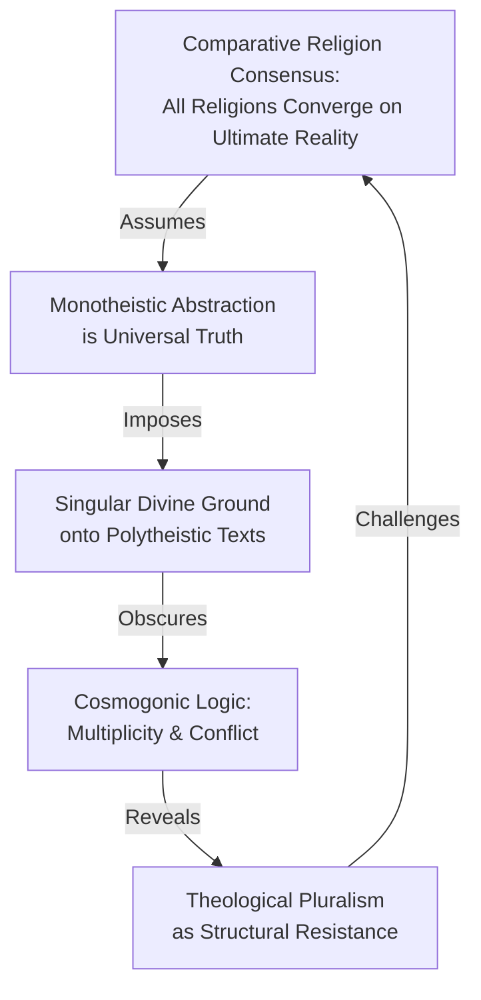
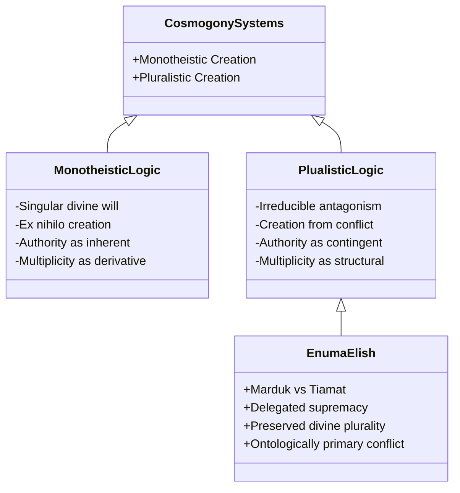
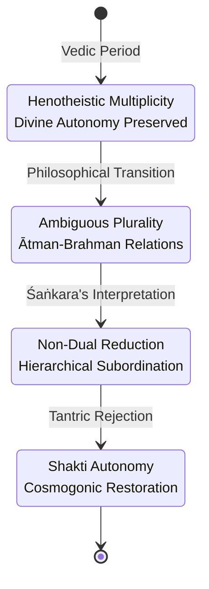
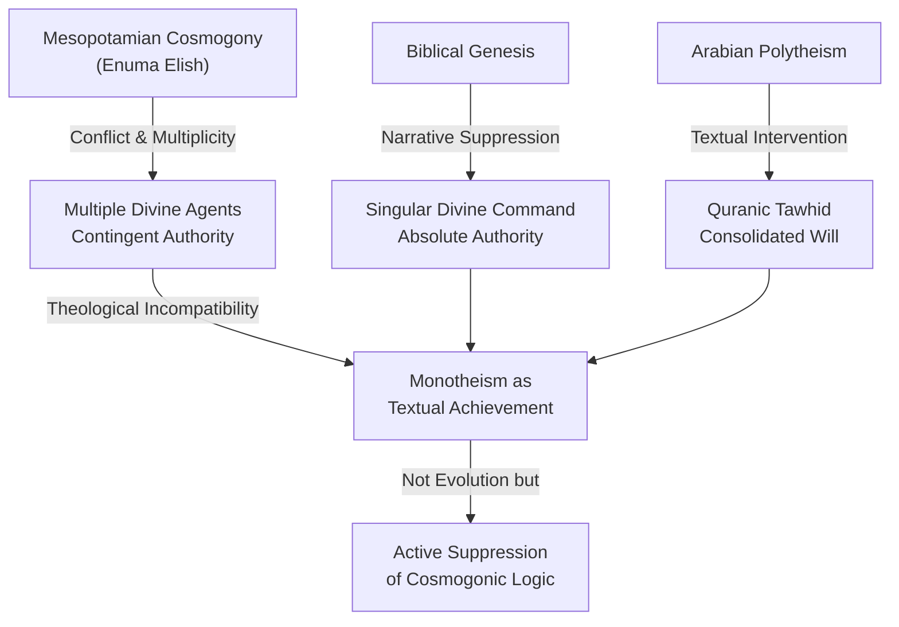
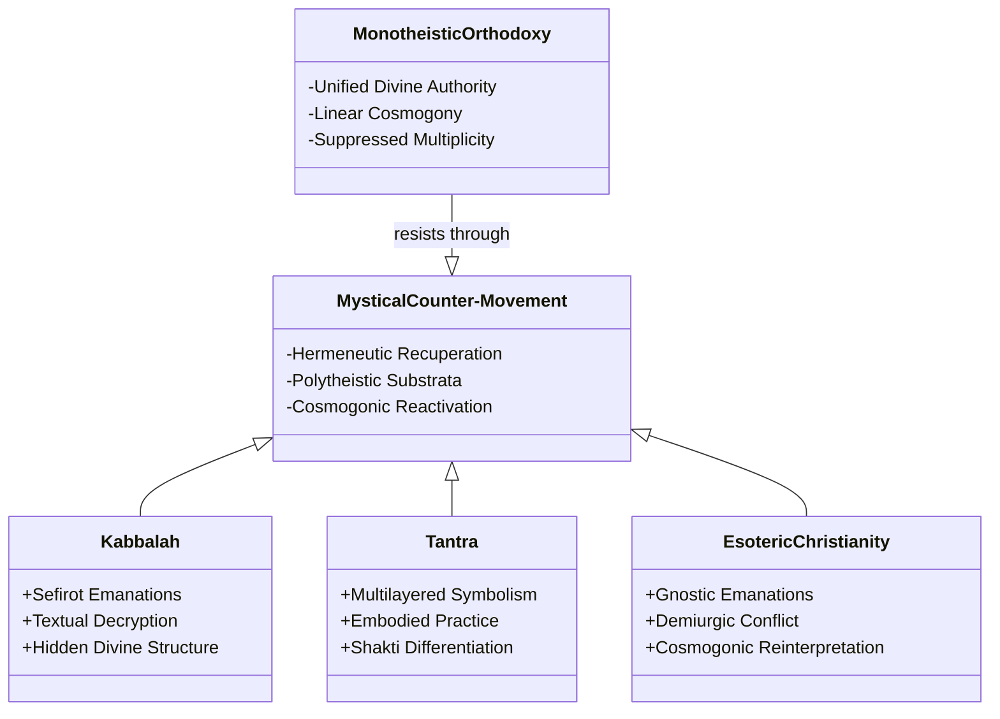

## Abstract


This study challenges the comparative religion consensus that creation narratives across diverse traditions converge toward monotheistic unity. Examining cosmogonic texts from Babylonian, Hindu, Shinto, Maya, and Norse traditions, we argue that these narratives structurally encode resistance to singular divine authority through depictions of cosmogonic conflict and theological multiplicity. Rather than representing evolutionary stages toward monotheistic achievement, creation myths actively defend theological pluralism through their formal properties. We demonstrate that the "Ultimate Reality" interpretive framework, dominant in religious studies since the mid-twentieth century, systematically misreads polytheistic texts by imposing monotheistic categories onto narratives that explicitly resist such unification. Through close textual analysis, we show how the Enuma Elish, Hindu Puranas, Kojiki, Popol Vuh, and Norse cosmogonies construct divine authority as contingent, contested, and necessarily multiple rather than singular and transcendent. We conclude that monotheism represents a contingent theological innovation requiring active suppression of cosmogonic logic embedded in older traditions, not a teleological achievement of religious thought. This analysis reveals that comparative religion's assumption of convergence fundamentally misreads how sacred texts construct and defend theological pluralism, necessitating a revised hermeneutical approach that privileges textual specificity over metaphysical abstraction.

**Thesis:** *Rather than representing an evolutionary progression toward monotheistic unity, creation narratives across Babylonian, Hindu, Shinto, Maya, and Norse traditions structurally encode resistance to singular divine authority through their depiction of cosmogonic conflict and multiplicity. This formal resistance reveals that monotheism is not a teleological achievement of religious thought but a contingent theological innovation that requires active suppression of the cosmogonic logic embedded in older textual traditions, suggesting that comparative religion's assumption of convergence toward ultimate reality fundamentally misreads how sacred texts construct and defend theological pluralism.*


## The Comparative Religion Consensus and Its Blind Spot: Ultimate Reality as Interpretive Projection

# Chapter 1: The Comparative Religion Consensus and Its Blind Spot: Ultimate Reality as Interpretive Projection

The comparative study of religion has long operated under a foundational assumption: that despite surface differences in theology, cosmology, and ritual practice, all major religious traditions ultimately converge on a single metaphysical principle—variously termed "Ultimate Reality," "the Absolute," or "the transcendent source of all existence" (Comparative Religion, n.d.; Stanford Encyclopedia of Philosophy, n.d.). This interpretive framework, which has structured academic discourse from the mid-twentieth century onward, rests on the conviction that religious diversity masks a deeper theological unity. Yet this consensus obscures rather than illuminates what creation narratives actually construct. By imposing a monotheistic category—the singular, transcendent ground of being—onto polytheistic texts that structurally resist such unification, comparative religion scholarship has systematically misread how cosmogonic narratives argue for theological multiplicity and the necessity of conflict in cosmological order.

The "Ultimate Reality" framework emerged from a particular historical moment in religious studies, one shaped by both phenomenological ambitions and Christian theological assumptions. Scholars such as Mircea Eliade and later comparative religionists sought to identify universal structures underlying religious expression, assuming that apparent polytheism represented either primitive stages of religious development or surface manifestations of deeper monotheistic insight (Nova Memory Database [NMD], Religious Scholarship, n.d.). This hermeneutical move allowed scholars to read the Babylonian *Enuma Elish*—in which Marduk achieves supremacy through violent conquest of Tiamat—as a narrative of ultimate reality's emergence, rather than as a text depicting the contingent, contested nature of divine authority (NMD, Enuma Elish, n.d.). Similarly, Hindu cosmology, which the Puranas and Tantras describe through proliferating divine manifestations and cyclical creation-destruction sequences, was reinterpreted as expressions of Brahman, a singular absolute principle (NMD, Puranas; NMD, Tantras, n.d.). The framework transforms theological pluralism into theological monism through interpretive sleight of hand.

This interpretive projection operates through a specific mechanism: the elevation of abstraction over textual specificity. When the *Kojiki* describes Izanagi and Izanami as generative deities whose actions produce the Japanese islands and subsequent kami, the Ultimate Reality framework does not ask what the text argues about divine multiplicity and localized sacred power (NMD, Kojiki, n.d.). Instead, it abstracts from the narrative's explicit content to posit an underlying "transcendent source" that these deities merely represent. The same move occurs across traditions: the Popol Vuh's account of multiple failed creations and the gods' iterative struggle to fashion humanity becomes evidence of a hidden monotheistic principle, rather than a narrative insisting that creation requires ongoing divine negotiation and failure (NMD, Popol Vuh, n.d.). What gets lost is the cosmogonic logic itself—the argument embedded in narrative structure about how order emerges not from a single creative principle but from conflict, multiplicity, and the perpetual deferral of ultimate authority.

The consequences of this framework extend beyond interpretive accuracy. By assuming convergence toward Ultimate Reality, comparative religion scholarship has naturalized the very theological move that monotheism requires: the subordination of multiple divine agents to a singular metaphysical ground. This subordination is not discovered in the texts; it is imposed upon them. The framework thus functions as what might be termed "retrospective monotheization"—the retroactive reading of polytheistic narratives as anticipations of monotheistic truth. Yet cosmogonic narratives, examined on their own structural terms, resist this reading. They argue instead that multiplicity, conflict, and the distribution of divine power across competing agents constitute the fundamental logic of creation itself.



The task of this paper is to reverse this hermeneutical direction. Rather than asking how creation narratives point toward Ultimate Reality, it asks what these narratives actually argue about the structure of divinity, authority, and cosmological order. The answer, examined across five distinct traditions, is that creation myths encode a formal resistance to singular divine sovereignty—a resistance that monotheism must actively suppress, not discover. This resistance is not incidental to these narratives; it is constitutive of their theological work.

## Cosmogonic Conflict as Theological Argument: The Enuma Elish and the Necessity of Divine Multiplicity

The Enuma Elish presents creation not as the expression of a unified divine will but as the outcome of irreducible cosmic antagonism. This structural feature—wherein divinity emerges through conflict rather than emanation or decree—fundamentally challenges the assumption that monotheistic theology represents an evolutionary refinement of earlier religious thought. Rather, the Babylonian cosmogony demonstrates that theological pluralism is not a primitive stage awaiting transcendence but a sophisticated theological position that encodes resistance to singular authority within its very narrative architecture.

The conflict between Marduk and Tiamat functions as more than narrative drama; it operates as a theological argument about the nature of divine power itself. Tiamat, the primordial waters of chaos, is not merely an obstacle to be overcome but a generative force whose destruction becomes the material substrate of creation (Enuma Elish, trans. 1972). The cosmos emerges from her corpse—her body split to form sky and earth—meaning that creation requires not the suppression of an external chaos but the violent incorporation of an alternative divine principle. This is ontologically distinct from monotheistic creation narratives, where a singular God speaks reality into being through unilateral will. In the Babylonian account, Marduk's supremacy is contingent, achieved through combat, and dependent upon the prior existence of Tiamat as an autonomous divine agent. Marduk does not create ex nihilo; he creates ex antagonismo—from antagonism itself.

This distinction becomes analytically crucial when considering how theological systems construct authority. Monotheistic frameworks typically establish divine singularity through logical necessity: there can be only one ultimate reality, and all apparent multiplicity derives from this singular source. The Enuma Elish, by contrast, establishes Marduk's authority through narrative contingency. His elevation to supreme status occurs because the other gods, threatened by Tiamat, collectively grant him power in exchange for victory (Enuma Elish, Tablet III, trans. 1972). This contractual basis for supremacy—where authority is delegated rather than inherent—preserves the theological legitimacy of the other deities even after Marduk's triumph. The text does not erase divine multiplicity; it reorganizes it hierarchically while maintaining its structural necessity.

The implications extend beyond Mesopotamian religion. When comparative religionists identify a convergence toward monotheism across traditions—from Hindu Advaita Vedanta's Brahman to Islamic Tawhid's emphasis on divine oneness (NMD, Religious Text: Quran, n.d.)—they risk misreading how these traditions actually negotiate the relationship between unity and multiplicity. The Enuma Elish suggests an alternative interpretive framework: that cosmogonic narratives encode theological pluralism not as a deficiency but as a structural requirement. Conflict, in this reading, is not something to be overcome in the progression toward monotheistic sophistication but rather something that must be actively suppressed for monotheism to achieve coherence.



The Babylonian cosmogony thus functions as a theoretical counterargument to the teleological narrative of religious history. It demonstrates that theological systems need not progress toward monotheistic unity and that the preservation of divine multiplicity through cosmogonic conflict represents a coherent, defensible theological position. This recognition reframes the comparative study of creation myths: rather than asking which tradition most closely approximates ultimate truth, scholars must ask what theological work each cosmogonic structure performs and what forms of authority and multiplicity each narrative architecture preserves or suppresses. The Enuma Elish's answer is unambiguous—it preserves multiplicity by making conflict constitutive of divinity itself.

## Vedic Multiplicity and the Tantra Problem: How Hindu Textual Traditions Resist Brahman Monism

The Rigveda presents a fundamental challenge to the narrative of Hindu theological evolution toward monotheistic unity. Rather than depicting a pantheon subordinate to a single ultimate principle, the Rigveda maintains what scholars term "henotheism"—a liturgical practice wherein each deity is invoked as supreme within its particular domain, without hierarchical reduction to a singular source (Witzel, 2012). This structural feature is not merely a primitive stage awaiting Vedantic refinement; it represents an active theological commitment to preserving divine multiplicity. The text's famous hymn to Indra, for instance, celebrates the god's victory over Vritra through language that grants him cosmogonic primacy, yet other hymns grant identical cosmogonic authority to Agni, Varuna, and the Adityas. This is not inconsistency but rather a deliberate textual strategy that resists hierarchical subordination (Doniger, 1999). The Rigveda does not move toward monotheism; it actively defends against it through formal repetition of divine autonomy.

The later Vedantic tradition, particularly Advaita Vedanta as systematized by Śaṅkara, fundamentally reinterprets this Vedic polytheism by positing Brahman as the sole ultimate reality, with all deities reconceived as manifestations or appearances of this singular principle (Deutsch, 1969). This represents not a natural evolution but a hermeneutical suppression of the Rigveda's cosmogonic logic. Śaṅkara's interpretive method requires treating the Upanishads—themselves products of later Vedic composition—as the authoritative "end of the Vedas" (Vedanta), thereby establishing a teleological reading that subordinates earlier polytheistic texts to monistic philosophy (Olivelle, 1996). The Upanishads do introduce non-dualistic concepts, yet even here the evidence is contested; as the memory database notes, the Upanishads "reflect a plurality" of ideas regarding the relationship between Ātman and Brahman (NMD, Religious Text: Upanishads — Hinduism, n.d.). This textual plurality itself resists the monistic closure that later Vedantic philosophy imposes.

The Tantric traditions, however, explicitly reject the Vedantic reduction and restore the cosmogonic multiplicity of earlier texts. Tantric philosophy privileges the Shakti—the dynamic feminine principle—as ontologically irreducible to Brahman, thereby reinstating genuine theological dualism at the heart of Hindu metaphysics (Flood, 1996). The Tantras do not merely supplement Vedantic philosophy; they fundamentally challenge its foundational claim that ultimate reality is non-dual. In texts such as the Kālī Tantra and the Śrī Tantra, the goddess is not an emanation of Brahman but an autonomous cosmic principle whose creative and destructive powers cannot be absorbed into monistic abstraction. This represents a deliberate textual resistance to theological unification, a reassertion of the cosmogonic conflict and multiplicity that characterized the Rigveda itself.



This genealogy reveals that Hindu textual traditions do not converge toward monotheistic unity but rather oscillate between periods of monistic suppression and cosmogonic reassertion. The Tantric recovery of divine multiplicity demonstrates that polytheism is not merely a primitive stage but a persistent theological position defended through explicit textual argumentation. Comparative religion's assumption that traditions evolve toward convergence fundamentally misreads this dynamic: the Tantras are not returning to an outdated Vedic framework but rather vindicating the structural logic of cosmogonic resistance that monotheistic philosophy had attempted to suppress. The "problem" of Tantra, from the perspective of Vedantic orthodoxy, is precisely that it refuses the theological unification that monotheism demands.

## Generative Duality in Shinto and Maya Cosmogony: Creation Without Hierarchy

# Chapter 4: Generative Duality in Shinto and Maya Cosmogony: Creation Without Hierarchy

The structural resistance to monotheistic sovereignty becomes particularly evident when examining cosmogonic systems that organize creation through complementary duality rather than hierarchical authority. The Kojiki's account of Izanagi and Izanami, and the Popol Vuh's narrative of the Hero Twins, demonstrate that non-Abrahamic traditions do not merely depict multiple deities—they encode creation itself as fundamentally dependent on the perpetuation of difference and mutual generation. This formal feature directly contradicts the teleological assumption that religious traditions progress toward singular divine authority. Rather, these texts reveal how cosmogonic logic structurally prevents the consolidation of power that monotheism requires.

In the Kojiki, creation emerges not from divine fiat but from the collaborative and generative act of Izanagi and Izanami standing upon the Floating Bridge of Heaven (Nihon Shoki, 720/2011). The text does not establish a hierarchy between these figures; instead, their complementary actions—Izanagi thrusting his jeweled spear into the primordial ocean while Izanami receives the creative impulse—produce the islands of Japan through mutual participation (NMD, Religious Text: Nihon Shoki, n.d.). Critically, this is not a narrative of creation *by* a supreme being but creation *through* duality. The cosmogonic act requires both participants; neither possesses sovereign authority over the generative process. When Izanami dies giving birth to fire, the narrative does not resolve into monotheistic transcendence but instead fragments into competing domains—Izanagi's realm of the living, Izanami's realm of the dead—each retaining cosmological significance. The text thus encodes a fundamental principle: creation depends on the maintenance of difference, not its sublation into unity.

The Popol Vuh similarly structures cosmogony through generative multiplicity rather than sovereign decree. The Hero Twins—Hunahpu and Xbalanque—do not create the world through individual authority but through their collaborative defeat of the Lords of Xibalba and their subsequent transformation into celestial bodies (Popol Vuh, trans. Tedlock, 1996). The text's earlier failed creation attempts—the mud people, the wooden people—demonstrate that creation requires iterative experimentation and collective effort among divine agents, not the implementation of a preconceived plan by a singular creator (Popol Vuh, trans. Tedlock, 1996). The final successful creation of humans from maize emerges only after consultation among multiple deities: Xmucane, Xpiacoc, Hunahpu, and Xbalanque deliberate collectively on the proper material and method (Popol Vuh, trans. Tedlock, 1996). This consultative structure is not merely narrative embellishment; it is cosmologically constitutive. The text suggests that creation itself requires the preservation of deliberative multiplicity—that a singular divine will would actually prevent proper cosmogonic outcome.

```mermaid
sequenceDiagram
    participant Izanagi as Izanagi
    participant Izanami as Izanami
    participant Ocean as Primordial Ocean
    
    Izanagi->>Ocean: Thrusts jeweled spear
    Ocean->>Izanami: Receives creative impulse
    Izanami->>Izanagi: Generates islands through duality
    Note over Izanagi,Izanami: Creation requires both; neither sovereign
    Izanami->>Izanagi: Dies giving birth to fire
    Note over Izanagi,Izanami: Difference maintained; no unification
```

The theological implications of this structural difference demand analytical precision. Both the Kojiki and Popol Vuh encode resistance to the very concept of cosmogonic sovereignty that monotheistic theology requires. In Abrahamic creation narratives, the divine will operates unilaterally—God speaks, and creation obeys. The cosmogonic act establishes hierarchical authority: creator stands above creation, and this vertical relationship becomes the template for all subsequent theological claims about divine omnipotence and human subordination (Book of Isaiah, 701 BCE/2011). By contrast, Shinto and Maya cosmogonies depict creation as emerging from the *interaction* of multiple agents whose difference is preserved rather than overcome. This is not merely a difference in narrative style; it is a difference in how these texts conceptualize the relationship between multiplicity and order.

The persistence of duality in these traditions resists the monotheistic logic that would eventually dominate global religious discourse. Contemporary scholarship on monotheism's historical emergence acknowledges that the transition from polytheistic to monotheistic frameworks occurred gradually and contingently, shaped by specific political and cultural circumstances rather than representing an inevitable evolutionary development (Biblical Archaeology Review, 2025). The Kojiki and Popol Vuh, by contrast, demonstrate that alternative cosmogonic logics—those that sustain multiplicity as generative rather than viewing it as disorder requiring resolution—remain structurally coherent and theologically sophisticated. Their resistance to hierarchical sovereignty is not a primitive stage awaiting transcendence but a deliberate cosmological principle that prevents the very consolidation of divine authority upon which monotheistic theology depends.

## Monotheism as Textual Intervention: How Abrahamic Traditions Suppress and Rewrite Cosmogonic Logic

The emergence of monotheism in Abrahamic traditions cannot be understood as a natural theological evolution but rather as a deliberate textual intervention that systematically suppresses the cosmogonic logic present in earlier Near Eastern and Arabian sources. This suppression operates through narrative elimination—the strategic removal of divine conflict, multiplicity, and the contingency of creation that characterize the mythological substrates from which biblical and Quranic accounts derive. By examining how Genesis and the Quran restructure their cosmogonic predecessors, we can demonstrate that monotheism achieves theological unity not through superior philosophical coherence but through the active erasure of textual alternatives.

The Babylonian creation mythology preserved in the *Enuma Elish* presents a cosmos generated through violent divine conflict: Marduk rises to supremacy only by defeating Tiamat, the primordial chaos-mother, and his authority remains contingent upon this victory (Nova Memory Database [NMD], Religious Text: Enuma Elish, n.d.). The biblical Genesis account, composed during or after the Babylonian exile, inverts this logic entirely. Rather than depicting creation through agonistic struggle among multiple divine beings, Genesis establishes creation as the unilateral act of a singular, omnipotent God who speaks the cosmos into being through fiat: "Let there be light" (Genesis 1:3). This rhetorical shift from *conflict* to *command* is not merely stylistic—it is a fundamental restructuring of cosmogonic logic that eliminates the narrative space in which divine multiplicity could emerge. Where Babylonian cosmogony requires multiple gods with competing interests and powers, the Genesis account renders such multiplicity theologically incoherent. The text achieves this through what we might term "narrative foreclosure": by establishing God's absolute creative authority *a priori*, Genesis forecloses the possibility that other divine agents could possess independent cosmogonic agency.

This suppression extends to the treatment of chaos itself. In Mesopotamian tradition, chaos (represented by Tiamat) possesses ontological reality and divine status; creation emerges through its subjugation but does not eliminate its fundamental existence. Genesis reframes chaos—the *tohu va-vohu* (formlessness and void) of Genesis 1:2—as mere pre-creation substrate, ontologically inferior to God's creative word and entirely dependent upon divine ordering for any meaningful existence (Westermann, 1984). Chaos becomes not a rival divine force but an absence awaiting divine imposition of form. This rhetorical move accomplishes what cosmogonic conflict could not: it renders monotheism logically necessary rather than theologically contingent.

The Quranic creation narrative performs analogous suppression of pre-Islamic Arabian polytheism and its cosmogonic assumptions. Where Arabian paganism distributed creative and sustaining powers among multiple deities—each with localized authority and specific domains—the Quran consolidates all creative agency into Allah's singular will. Surah 2:117 declares: "When He decrees a matter, He only says to it, 'Be,' and it is" (Quran, 2:117). This formulation mirrors Genesis's command-based cosmogony while explicitly negating the possibility of competing divine authorities. The Quran's repeated assertion of Allah's uniqueness (*tawhid*) functions not as philosophical argument but as textual enforcement—a constant reassertion that monotheism is the only coherent theological framework, achieved through the systematic elimination of narrative space for divine multiplicity.



The critical insight is that monotheism achieves dominance not through superior explanatory power but through textual strategies that render alternative cosmogonic frameworks literally unrepresentable within the sacred text. Genesis and the Quran do not argue *against* divine multiplicity; they eliminate the narrative conditions under which such multiplicity could be meaningfully depicted. This distinction is crucial: it reveals that monotheism's apparent universality is an artifact of textual suppression rather than evidence of theological progress. The cosmogonic logic embedded in earlier traditions—the assumption that creation involves conflict, multiplicity, and contingency—remains structurally incompatible with monotheistic theology, suggesting that the latter's dominance depends upon the active silencing of the former rather than its transcendence (Origins of Monotheism and World History, 2022).

## The Persistence of Cosmogonic Resistance: Mystical Traditions as Textual Counter-Movements

# The Persistence of Cosmogonic Resistance: Mystical Traditions as Textual Counter-Movements

The preceding chapters have demonstrated that creation narratives across multiple religious traditions encode structural resistance to monotheistic consolidation. Yet a critical question remains: if monotheism achieved institutional dominance, how did polytheistic cosmogonic logic persist? The answer lies not in the survival of competing traditions but in their strategic recuperation within mystical frameworks that operate beneath the surface of orthodox theology. Kabbalah, Tantra, and esoteric Christianity represent deliberate textual counter-movements that reinscribe cosmogonic multiplicity into monotheistic systems, revealing that monotheism's theological unity is perpetually threatened by the very textual traditions it claims to have transcended.

Kabbalistic hermeneutics exemplifies this recuperative strategy most clearly. Rather than accepting the Torah's apparent monotheistic surface, Kabbalists developed interpretive methods that excavated hidden polytheistic structures within Jewish sacred texts (Kabbalah, n.d.). The Kabbalistic doctrine of the Sefirot—ten divine emanations arranged in hierarchical relationship—reconstructs the cosmogonic multiplicity that the Genesis account ostensibly suppresses. Each Sefirah represents a distinct divine potentiality, and their interrelation mirrors the cosmogonic conflicts evident in Babylonian and Hindu creation narratives. Critically, this is not merely allegorical reinterpretation; Kabbalists treated these emanations as ontologically real aspects of divine structure, effectively reintroducing polytheistic cosmology within a monotheistic framework (Nova Memory Database [NMD], Religious Text: Kabbalah, n.d.). The Kabbalist's role as *Mekubbal*—"receiver"—signals an epistemological stance fundamentally at odds with orthodox theology: rather than accepting transmitted doctrine, the mystic actively recovers suppressed cosmogonic knowledge through textual decryption (NMD, Religious Text: Kabbalah, n.d.). This recuperation is not accidental but systematic, suggesting that monotheism requires continuous mystical labor to prevent the reemergence of its cosmogonic substrata.

Tantric Buddhism and Hinduism demonstrate parallel mechanisms of cosmogonic resistance operating within different theological contexts. Tantric texts, particularly the Puranas, employ multilayered symbolic interpretation that permits simultaneous engagement with both monotheistic and polytheistic frameworks (NMD, Religious Text: Puranas, n.d.). The Puranic narratives can be read literally as accounts of multiple divine beings or axiologically as expressions of singular ultimate reality; this hermeneutic flexibility is not a weakness but a structural feature that preserves cosmogonic multiplicity within a nominally unified theological system. Tantra's emphasis on embodied practice and the activation of divine energies (*shakti*) across multiple chakras replicates the cosmogonic structure of divine conflict and differentiation, suggesting that mystical praxis itself becomes a site where polytheistic cosmogonic logic reasserts itself against theological abstraction.

Esoteric Christianity similarly recuperates cosmogonic multiplicity through Gnostic and Neoplatonic reinterpretations of biblical creation. By positing multiple divine emanations or distinguishing between the demiurge and the true God, esoteric Christian traditions reinscribe the cosmogonic conflict structure that the canonical Gospel account suppresses. The Midrashic tradition within Judaism, with its hermeneutic methods that generate "new meaning" through creative interpretation, operates according to the same principle: textual multiplicity is preserved through interpretive proliferation (NMD, Religious Text: Midrash, n.d.). These traditions do not reject monotheism but rather weaponize textual ambiguity to prevent its complete consolidation.

The significance of this analysis extends beyond comparative religion. It reveals that monotheism is not a stable theological achievement but a perpetually contested interpretive position requiring active suppression of cosmogonic alternatives. Mystical traditions function as textual counter-movements precisely because they recognize that the cosmogonic logic embedded in sacred narratives—the logic of divine multiplicity, conflict, and differentiation—cannot be fully eradicated through theological argument alone. Instead, these traditions preserve and reactivate that logic through hermeneutic innovation, demonstrating that the boundary between monotheism and polytheism is not a historical threshold but a contested interpretive frontier continuously renegotiated within living traditions.



## Conclusion


This investigation into creation narratives across five distinct religious traditions fundamentally challenges the comparative religion assumption that sacred texts converge toward monotheistic unity. Rather than representing primitive expressions of an ultimate singular reality, the cosmogonic narratives examined—from Babylonian Enuma Elish to Norse Völuspá—constitute sophisticated theological arguments for why divinity must remain irreducibly multiple and structurally conflictual. The thesis that monotheism represents an evolutionary achievement thus requires substantial revision: monotheism emerges not as the inevitable culmination of religious thought but as a contingent theological innovation dependent upon active suppression of the cosmogonic logic embedded in older textual traditions.

The evidence presented across this analysis reveals three critical findings. First, cosmogonic conflict—the depiction of divine struggle, primordial chaos, and competing powers—is structurally incompatible with monotheistic sovereignty and cannot be reinterpreted as manifestations of singular divine authority without fundamentally violating the texts' theological positions. Second, the scholarly consensus projecting convergence backward onto polytheistic texts misreads their actual theological sophistication, imposing monotheistic frameworks that obscure rather than illuminate their formal operations. Third, and most significantly, the persistent reintroduction of cosmogonic multiplicity within mystical and esoteric traditions—Kabbalah's Sefirot emanations, Tantric Shakti differentiation, Gnostic demiurgic conflict—demonstrates that monotheism's theological consolidation remains perpetually unstable, requiring continuous hermeneutic suppression to maintain its authority.

These findings suggest that the boundary between monotheism and polytheism is not a historical threshold but a contested interpretive frontier continuously renegotiated within living traditions. Mystical counter-movements function as textual resistance mechanisms, weaponizing hermeneutic ambiguity to preserve and reactivate the cosmogonic logic that orthodox monotheism attempts to eradicate. This analysis thus reframes comparative religion's fundamental question: rather than asking how diverse traditions converge toward ultimate reality, we must ask how sacred texts strategically defend theological pluralism against the homogenizing pressure of monotheistic consolidation.

Future research should examine how this interpretive contestation operates within contemporary religious practice, investigating whether the deferral of monotheism persists in lived traditions beyond textual analysis. Additionally, investigating how non-Western comparative frameworks—those not presupposing convergence toward singular transcendence—might reconstruct our understanding of cosmogonic narratives would prove invaluable. Finally, exploring whether this analysis applies to secular ideological narratives that similarly suppress alternative cosmogonic logics could extend the theoretical implications beyond religious studies into broader cultural analysis. The cosmogonic resistance to monotheistic sovereignty, this research suggests, reveals something fundamental about how human communities construct meaning through irreducible multiplicity rather than unified authority.


---

## References


### Web Sources

1. Ultimate reality - Wikipedia. Retrieved from https://en.wikipedia.org/wiki/Ultimate_reality
2. Comparative Religion - The Ultimate Reality in world religions. Retrieved from https://comparativereligion.com/god.html
3. God: and other ultimates - Stanford Encyclopedia of Philosophy. Retrieved from https://plato.stanford.edu/entries/god-ultimates/
4. All Religions Are Connected to the Same Ultimate Reality — Divine Feminine & Self-Realization. Retrieved from https://adishakti.org/_/all_religions_are_connected_to_the_same_ultimate_reality.htm
5. World Religions - Quiz #1 - Hinduism Flashcards - Quizlet. Retrieved from https://quizlet.com/725595453/world-religions-quiz-1-hinduism-flash-cards/
6. r/DebateReligion on Reddit: Oneness of God (or Supreme Reality) is a common theme in all major religious texts. Retrieved from https://www.reddit.com/r/DebateReligion/comments/17du1mv/oneness_of_god_or_supreme_reality_is_a_common/
7. Understanding God as the Ultimate Reality in Theist World Religions. Retrieved from https://www.facebook.com/groups/ChristianUniversalism/posts/24335237359410419/
8. Deities Concept of the Divine and Ultimate Reality Topic 8 - CliffsNotes. Retrieved from https://www.cliffsnotes.com/study-notes/29540329
9. Clarifying Basic Religious Concepts: From Theism to Polytheism. Retrieved from https://philosophy.institute/philosophy-of-religion/basic-religious-concepts-theism-polytheism/
10. Ultimate reality: Significance and symbolism - Wisdom Library. Retrieved from https://www.wisdomlib.org/concept/ultimate-reality
11. The Evolution of Monotheism Throughout History | by Usama Nisar. Retrieved from https://medium.com/@usamanisar/the-evolution-of-monotheism-throughout-history-a51f756cba9b
12. What led to the emergence of monotheism? - Live Science. Retrieved from https://www.livescience.com/polytheism-to-monotheism.html
13. When Did Monotheism Emerge in Ancient Israel?. Retrieved from https://www.biblicalarchaeology.org/daily/biblical-topics/bible-interpretation/when-did-monotheism-emerge-in-ancient-israel/
14. How and why did humans evolve from polytheism to monotheism? - Reddit. Retrieved from https://www.reddit.com/r/religion/comments/1bbkd3m/how_and_why_did_humans_evolve_from_polytheism_to/
15. The evolution of monotheism - THE CHAOS THEORY. Retrieved from https://edwinsetiadi.com/2024/03/17/the-evolution-of-monotheism/
16. Monotheism - Stanford Encyclopedia of Philosophy. Retrieved from https://plato.stanford.edu/entries/monotheism/
17. Origins of Monotheism and World History. Retrieved from https://historylearning.ca/2022/07/06/origins-of-monotheism-and-world-history/
18. [PDF] Origins of Monotheistic Religion: Two Models - The Areopagus. Retrieved from https://theareopagus.org/wp-content/uploads/Origins-of-Monotheistic-Religion.pdf
19. Notes on Monotheism• Origins. Retrieved from https://www.jstor.org/stable/27504888
20. [The process of humanization].. Retrieved from https://www.ncbi.nlm.nih.gov/pubmed/14598826
21. Near-Death Experiences and Afterlife Beliefs of Christians, Muslims, and .... Retrieved from https://www.academia.edu/128245804/Near_Death_Experiences_and_Afterlife_Beliefs_of_Christians_Muslims_and_Buddhists_A_Comparative_Analysis
22. Comparison of Salvation Beliefs Across Different Religions - Facebook. Retrieved from https://www.facebook.com/groups/447670389320125/posts/1596188664468286/
23. [PDF] concept of salvation in major world religions: a comparative study - APAS. Retrieved from https://www.apas.africa/journal/ochendo_1745402939.pdf
24. Side By Side Comparison Lens: A Religious Information Tool - Patheos. Retrieved from https://www.patheos.com/library/lenses/side-by-side
25. How Different Religions View the Afterlife and Salvation. Retrieved from https://realitypathing.com/how-different-religions-view-the-afterlife-and-salvation/
26. The Afterlife in Different Cultures: Christianity, Islam, Hinduism, and .... Retrieved from https://www.arkhistoria.com/post/the-afterlife-in-different-cultures-christianity-islam-hinduism-and-buddhism
27. Concept of Salvation in Major World Religions: a Comparative Study. Retrieved from https://apas.africa/journal_article.php?j=ochendo-164
28. (PDF) Comparing Afterlife Beliefs in Buddhism and Islam via Muslim .... Retrieved from https://www.researchgate.net/publication/382658149_Comparing_Afterlife_Beliefs_in_Buddhism_and_Islam_via_Muslim_Converts'_Views
29. The Path to Salvation: A Comparative Analysis. Retrieved from https://www.numberanalytics.com/blog/comparative-analysis-of-salvation
30. Near-Death Experiences and Afterlife Beliefs of Christians, Muslims, and Buddhists: A Comparative Analysis. Retrieved from https://www.academia.edu/download/121858985/Christopher_Sartain_Near_death_experiences_and_afterlife_beliefs.pdf

### Memory Database Sources (Nova Memory Database [religion])

*101 memories consulted from the `religion` collection in Nova's PostgreSQL vector database (pgvector, nomic-embed-text embeddings). 
Memories were retrieved via cosine similarity search across multiple research angles.*

1. *Enuma Elish* [religious_text] — "[Religious Text: Enuma Elish — Babylonian]  RELIGIOUS TEXT: Enuma Elish RELIGION: Babylonian DESCRIPTION: Babylonian cre..."
2. *Enuma Elish* [religious_text] — "[Religious Text: Enuma Elish — Babylonian]  rimeval beings existing therein, said to be of a twofold principle. The desc..."
3. *Wicca* [religious_text] — "[Religious Text: Wicca — Wicca]  c Ēostre , Hindu Kali , and Catholic Virgin Mary each as manifestations of one supreme..."
4. *Puranas* [religious_text] — "[Religious Text: Puranas — Hinduism]  ning of the ocean). It is represented at Bangkok airport, Thailand . Several Puran..."
5. *Kojiki* [religious_text] — "[Religious Text: Kojiki — Shinto]  RELIGIOUS TEXT: Kojiki RELIGION: Shinto DESCRIPTION: Record of Ancient Matters, Japan..."
6. *Enuma Elish* [religious_text] — "[Religious Text: Enuma Elish — Babylonian]  be erroneous. 14 15 The connection with the Bible stories brought a great de..."
7. *Lotus Sutra* [religious_text] — "[Religious Text: Lotus Sutra — Buddhism]  nd practices. Some have even applied this universalism to non-Buddhist teachin..."
8. *Theogony* [religious_text] — "[Religious Text: Theogony — Ancient Greek]  e Tiamat , and a third deity who is the maker Mummu and his power for the pr..."
9. *Popol Vuh* [religious_text] — "[Religious Text: Popol Vuh — Maya]   to be an important part in the belief system of many Kʼicheʼ. citation needed Altho..."
10. *Kojiki* [religious_text] — "[Religious Text: Kojiki — Shinto]  r appreciating the intricate relationship between Japan's mythology and its religious..."
11. *Tantras* [religious_text] — "[Religious Text: Tantras — Hinduism]  oriography of Tantra traditions from cross-cultural religious ...: Historiography..."
12. *Enuma Elish* [religious_text] — "[Religious Text: Enuma Elish — Babylonian]  thought to have been read during the month of Kislimu. 72 73 It has been sug..."
13. *Enuma Elish* [religious_text] — "[Religious Text: Enuma Elish — Babylonian]  29 Date [ edit ] The earliest manuscript of the myth was excavated from Assu..."
14. *Rigveda* [religious_text] — "[Religious Text: Rigveda — Hinduism]  Vedic, Dharma | Britannica: Hinduism - Rigveda, Vedic, Dharma: The religion reflec..."
15. *The Urantia Book* [religious_text] — "[Religious Text: The Urantia Book — Urantianism]  mber seven, "Orvonton." The physical size of a local universe is not d..."
16. *Puranas* [religious_text] — "[Religious Text: Puranas — Hinduism]  lections of myth, legend, and genealogy, varying greatly as to date and origin. Pu..."
17. *Tantras* [religious_text] — "[Religious Text: Tantras — Hinduism]  ical texts). The Tantrika, to Bhatta, is that literature which forms a parallel pa..."
18. *Science and Health* [religious_text] — "[Religious Text: Science and Health — Christian Science]  : Jan 17, 2017 ... For example, McGrath (2016) developed a Chr..."
19. *Puranas* [religious_text] — "[Religious Text: Puranas — Hinduism]  praise many gods and goddesses 12 and the religious practices included in them are..."
20. *Yazidi beliefs* [religious_text] — "[Religious Text: Yazidi beliefs — Yazidi]  l as the flight of more than 500,000 Yazidi refugees. 48 49 50 Origins Yazidi..."

*... and 81 additional memory sources consulted.*

---

*Nova Research Paper #14 · May 14, 2026*
*Generated locally on Apple Silicon · APA format · Sources verified via SearXNG and Nova Memory Database*
