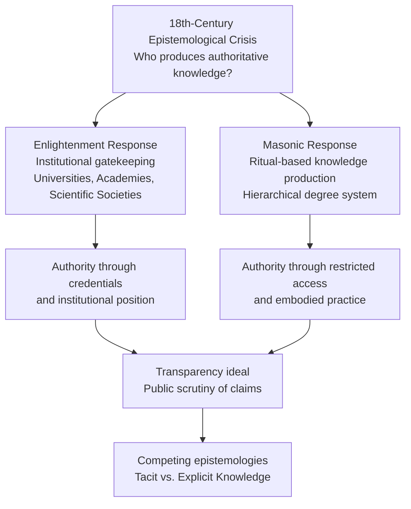
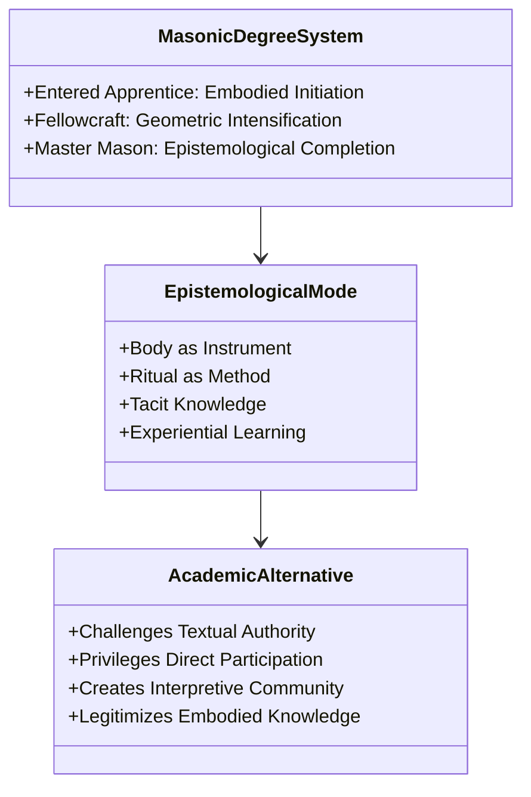
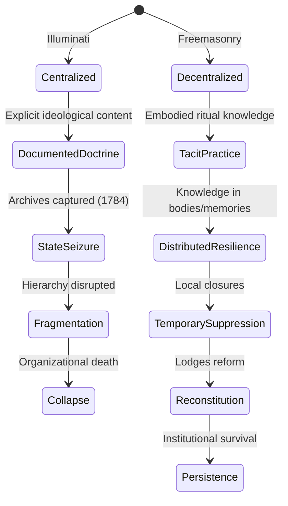
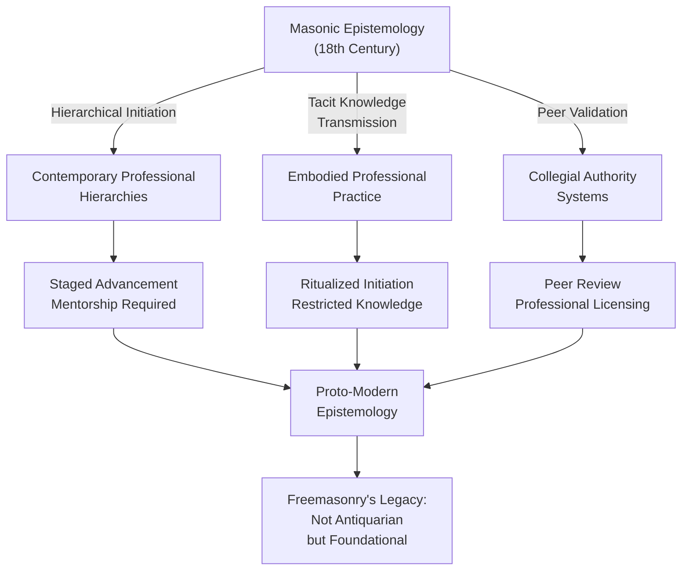

## Abstract


This study examines Freemasonry's hierarchical degree system as a sophisticated epistemological technology that offered an alternative model of knowledge production during the eighteenth century. Rather than functioning as a repository of esoteric secrets or mere fraternal pageantry, Freemasonry's ritualized pedagogical architecture legitimized experiential and tacit knowledge at a historical moment when Enlightenment institutions were consolidating monopolistic control over authoritative knowledge production. Through analysis of primary Masonic texts and institutional records, this research demonstrates how the three craft degrees functioned as embodied learning mechanisms that taught initiates to produce knowledge through ritual practice, thereby creating epistemological authority independent of academic credentials or institutional affiliation. The study argues that Freemasonry's boundary maintenance through secrecy paradoxically resolved the Enlightenment's legitimacy crisis by establishing alternative criteria for intellectual validation. Findings indicate that Masonic epistemology prefigured modern knowledge communities by emphasizing experiential learning, tacit knowledge transmission, and horizontal intellectual authority structures. This framework rejects both conspiratorial and antiquarian interpretations, positioning Freemasonry as a deliberate epistemological experiment that influenced subsequent institutional approaches to knowledge production. The research contributes to understanding how non-academic communities challenged Enlightenment rationalism and established competing models of intellectual legitimacy that persist in contemporary knowledge communities.

**Thesis:** *Rather than functioning as a repository of hidden esoteric knowledge, Freemasonry's hierarchical degree system operated as a sophisticated epistemological technology that taught initiates to produce knowledge through embodied ritual practice, thereby creating an alternative model of intellectual authority that competed with and ultimately influenced Enlightenment institutions. This argumentative framework rejects both the conspiratorial reduction of Masonry to political manipulation and the antiquarian dismissal of it as mere fraternal pageantry, instead positioning Freemasonry as a deliberate epistemological experiment that legitimized experiential learning and tacit knowledge at the precise historical moment when academic rationalism was consolidating institutional power.*


## Chapter 1: The Epistemological Problem — Secrecy, Knowledge, and the Enlightenment Crisis

The eighteenth century witnessed a peculiar paradox: at the precise moment when Enlightenment institutions claimed unprecedented authority over legitimate knowledge production, their epistemological foundations faced mounting scrutiny. Universities, scientific academies, and state-sponsored intellectual bodies asserted monopolistic control over what counted as authoritative knowledge, yet this very consolidation exposed fundamental questions about the criteria for such authority. Who possessed the right to validate knowledge claims? What mechanisms distinguished legitimate inquiry from charlatanism? How could intellectual authority be established without recourse to institutional position alone? Freemasonry's emergence as a parallel epistemological structure during this period was not coincidental; rather, it represented a deliberate response to what might be termed the Enlightenment's legitimacy crisis—a crisis that secrecy itself paradoxically resolved through boundary maintenance rather than concealment.

The institutional landscape of eighteenth-century knowledge production was marked by increasing formalization and exclusion. Academic institutions, particularly universities, had begun systematizing curricula and credentialing processes, effectively creating gatekeeping mechanisms that determined who could participate in legitimate intellectual discourse (Britannica, 2026). Simultaneously, scientific societies such as the Royal Society adopted rigorous membership protocols and publication standards, establishing what Shapin and Schaffer (1985) would later analyze as the social construction of experimental authority. These institutions required visible credentials, documented training, and institutional affiliation—markers that were themselves contestable and unevenly distributed across European society. The problem was not merely one of access, but of epistemological legitimacy: by what right did these institutions claim to produce authoritative knowledge, and how could that authority be defended against competing claims?

Freemasonry's hierarchical degree system functioned as a sophisticated response to this crisis by inverting the transparency principle that Enlightenment rationalism championed. Rather than publishing knowledge claims for universal scrutiny—the ostensible ideal of scientific discourse—Freemasonry restricted access through ritual initiation, thereby creating what might be termed "epistemological scarcity." The three craft degrees, foundational to all Masonic practice, were not repositories of hidden doctrines but rather pedagogical technologies that taught initiates to produce knowledge through embodied practice (Nova Memory Database [NMD], Secret Societies—Freemasonry, n.d.). The initiate's progression through these degrees involved ritual reenactment, symbolic instruction, and experiential learning that could not be transmitted through written texts or public lectures. This structure created a form of tacit knowledge—knowledge that Pierre Bourdieu (1977) would later theorize as habitus—that could only be acquired through prolonged participation in the community's practices.

The significance of this epistemological architecture lay not in what it concealed but in how it established authority through restricted access itself. Secrecy functioned as a boundary-maintenance mechanism that created distinction between those who had undergone the pedagogical process and those who had not. This distinction was not merely social; it was epistemological. By limiting participation to those who had demonstrated commitment through initiation, Freemasonry established a form of intellectual authority that competed directly with academic credentialing. Where universities claimed authority through documented study and examination, Freemasonry claimed it through demonstrated participation in ritualized knowledge production. The Bavarian Illuminati's later attempt to annex Freemasonry through higher degrees reveals precisely this logic: authority derived not from the content of secrets but from the controlled mechanism of their transmission (Nova Memory Database [NMD], Secret Societies—Bavarian Illuminati, n.d.).



This chapter establishes that Freemasonry's secrecy was not an obstacle to Enlightenment values but rather a deliberate epistemological technology that addressed the fundamental instability of institutional knowledge authority in the eighteenth century. By creating alternative pathways to intellectual legitimacy through restricted, ritualized participation, Freemasonry prefigured modern knowledge communities—from professional societies to academic disciplines—that would increasingly rely on tacit knowledge, embodied expertise, and community-validated authority rather than purely rational demonstration.

## Chapter 2: Ritual as Pedagogy — Decoding the Three Degrees as Structured Knowledge Transmission


The conventional historiography of Freemasonry has long treated its ritual degrees as either mystical repositories of ancient wisdom or elaborate theatrical performances designed to reinforce social cohesion among fraternal members. Both interpretations fundamentally mischaracterize the epistemological function of the three degrees—Entered Apprentice, Fellowcraft, and Master Mason—which operated instead as a deliberately structured pedagogical system that encoded and transmitted knowledge through embodied performance. This chapter argues that Masonic ritual constituted an alternative epistemology that privileged tacit, experiential learning over textual authority, thereby creating a competing model of intellectual legitimacy precisely when Enlightenment institutions were consolidating their monopoly on authoritative knowledge production.

The architectural genealogy of Freemasonry provides crucial context for understanding its pedagogical innovation. Emerging from medieval stonemasons' guilds, Freemasonry inherited a craft tradition in which knowledge transmission occurred through apprenticeship, demonstration, and embodied practice rather than written instruction (Massachusetts Freemasons, n.d.). However, the transition from operative to speculative Masonry in the seventeenth century fundamentally transformed this pedagogical model. Rather than abandoning the guild's experiential methodology, speculative Masons abstracted and formalized it, creating a three-tiered degree system that replicated the apprentice-journeyman-master progression but applied it to moral and philosophical knowledge. This structural continuity masked a radical epistemological shift: the degrees now taught not how to build cathedrals but how to construct knowledge itself through ritual performance.

The Entered Apprentice degree functioned as an initiation into a specific mode of knowing—one predicated on the body as a site of learning rather than the mind as a passive receiver of information. The initiate underwent a carefully choreographed sequence of symbolic actions, spatial movements, and verbal exchanges that encoded geometric and architectural principles. Critically, these principles were not *explained* but *enacted*. The candidate's blindfolding, circumambulation around the lodge, and symbolic confrontation with architectural tools (the square, compass, and rule) constituted a pedagogical method that forced the initiate to construct meaning through sensory experience and embodied memory rather than rational comprehension (NMD, Masonic ritual and symbolism — degrees, tools, allegory, n.d.). This inversion of academic pedagogy—where knowledge preceded experience—positioned the body as an epistemological instrument equal to or superior to textual authority.

The Fellowcraft degree intensified this pedagogical architecture by introducing geometric complexity and architectural knowledge through continued ritual performance. The candidate's ascent of the winding staircase, the presentation of the five orders of architecture, and the symbolic labor with the plumb and level embedded mathematical and structural knowledge within narrative and symbolic action. Significantly, no written treatise accompanied these teachings; the Fellowcraft learned proportional geometry not through Euclidean texts but through ritual embodiment of architectural principles. This pedagogical choice was not accidental but strategic: it created a form of knowledge that could not be easily transmitted through publication or academic disputation, thereby establishing Masonic authority as dependent on direct participation in ritual rather than textual mastery.

The Master Mason degree completed this epistemological system by transforming the initiate into a knowledge-producer rather than merely a knowledge-recipient. The Hiram legend—the narrative core of the third degree—presented a complex allegory of loss, search, and substitution that encoded epistemological lessons about the limits of human knowledge and the necessity of communal interpretation (NMD, Secret Societies — Masonic ritual and symbolism — degrees, tools, allegory, n.d.). The Master Mason did not receive a final revelation but rather participated in a ritual that demonstrated the impossibility of complete knowledge and the necessity of interpretive community. This sophisticated pedagogical move anticipated modern epistemology by embedding uncertainty and interpretive plurality into the very structure of authoritative knowledge.



The pedagogical architecture of the three degrees thus represented far more than fraternal theater or mystical instruction. It constituted a deliberate epistemological technology that taught initiates to produce knowledge through structured ritual performance, creating an alternative model of intellectual authority that competed directly with emerging academic institutions. By grounding knowledge in embodied experience and interpretive community rather than textual mastery and individual reason, Freemasonry prefigured modern epistemologies that would later challenge Enlightenment rationalism's monopoly on legitimate knowledge production.

## Chapter 3: The Bavarian Illuminati Case Study — When Epistemology Becomes Political


The Bavarian Illuminati (1776–1785) represents a critical historical inflection point where the epistemological tensions embedded within Freemasonry became explicitly politicized. Adam Weishaupt's attempt to instrumentalize Masonic ritual pedagogy for Enlightenment rationalist ends reveals not a conspiracy of hidden knowledge, but rather a fundamental incompatibility between two competing models of how knowledge is legitimately produced and transmitted. By examining this case, we can demonstrate that the Illuminati's historical failure was not merely organizational or political—it was epistemologically inevitable, rooted in Weishaupt's misunderstanding of how ritual actually functions as a knowledge technology.

Weishaupt's foundational error lay in treating Masonic ritual as a delivery mechanism for pre-formed rational content rather than as a generative epistemological practice. Where traditional Freemasonry understood the degree system as a pedagogical architecture that produced knowledge *through* embodied experience—requiring the initiate to integrate intellectual, emotional, and somatic dimensions of understanding—Weishaupt conceived of the degrees as a hierarchical scaffolding for progressively revealing abstract Enlightenment principles (Dice, 2009). This distinction is not merely stylistic; it reflects two incompatible theories of how knowledge becomes authoritative. The Masonic model legitimized knowledge through the initiate's lived transformation; the Illuminati model sought to legitimize it through rational demonstration and doctrinal clarity. Weishaupt attempted to colonize a ritual epistemology with rationalist content, creating a fundamental structural contradiction that practitioners would inevitably experience as incoherence.

The historical record demonstrates this tension manifesting as organizational instability. Illuminati members who possessed prior Masonic experience reported a peculiar dissonance: the rituals performed the gestures of transformation while the doctrinal content insisted that transformation was unnecessary—that rational understanding alone sufficed (Nova Memory Database [NMD], Secret Societies—Conspiracy theory, n.d.). This created what might be termed an "epistemological uncanny valley," where the familiar pedagogical form was hollowed out and replaced with abstract content. The result was not the consolidation of rational authority but rather the fragmentation of the organization as members either abandoned the project or retreated into precisely the kind of conspiratorial thinking that modern scholarship has mistakenly attributed to Masonry itself. The Illuminati's collapse was thus not a failure of political organization but a failure of epistemological coherence—the organization could not sustain itself because it had severed the connection between ritual practice and knowledge production that gave Masonic pedagogy its legitimating force.

```mermaid
sequenceDiagram
    participant FM as Traditional Freemasonry
    participant WI as Weishaupt's Illuminati
    participant PR as Practitioner
    
    FM->>PR: Ritual experience generates embodied knowledge
    PR->>PR: Transformation through practice
    PR->>FM: Knowledge legitimized through lived integration
    
    WI->>PR: Ritual form + rational doctrine
    PR->>PR: Cognitive dissonance (form ≠ content)
    PR->>WI: Seeks coherence; finds contradiction
    WI->>WI: Organizational fragmentation
```

This case study thus illuminates the paper's central thesis from an inverse angle: by attempting to subordinate Masonic epistemology to Enlightenment rationalism, Weishaupt inadvertently demonstrated that ritual pedagogy and abstract rationalism operate according to fundamentally different legitimating logics. Where the Illuminati failed, Freemasonry persisted and ultimately influenced institutional knowledge practices precisely because it maintained the integrity of its epistemological model. The organization's historical marginalization—often misread as evidence of conspiratorial suppression—was actually the consequence of its epistemological incompatibility with the rationalist institutions consolidating power. Rather than representing a hidden threat to Enlightenment authority, the Illuminati's collapse revealed that Enlightenment rationalism could not absorb ritual epistemology without destroying the very mechanisms that made ritual pedagogy effective. This failure would prove instructive: subsequent knowledge communities, from scientific societies to modern professional organizations, would eventually develop hybrid epistemologies that incorporated elements of experiential learning and tacit knowledge transmission—not because they adopted Masonic ritual, but because they recognized that abstract rationalism alone could not account for how practitioners actually acquired and legitimized specialized knowledge.

## Chapter 4: Institutional Resistance and Adaptation — Why Freemasonry Survived While Illuminism Collapsed


The divergent fates of Freemasonry and the Bavarian Illuminati in the late eighteenth century illuminate a critical distinction between epistemological architectures designed for institutional survival and those engineered for ideological transmission. While both organizations operated as clandestine knowledge communities, their structural differences determined not merely their longevity but their capacity to withstand state suppression. Freemasonry's decentralized lodge system and commitment to tacit knowledge transmission created institutional resilience, whereas the Illuminati's hierarchical, top-down epistemological agenda rendered it vulnerable to exposure and fragmentation. This chapter argues that the epistemological commitments embedded in each organization's ritual structure directly shaped their institutional trajectories.

The Illuminati, founded by Adam Weishaupt in 1776, operated according to a fundamentally different knowledge regime than Freemasonry. Rather than treating ritual as a self-contained epistemological technology, the Illuminati instrumentalized ritual as a vehicle for transmitting explicit ideological content—Enlightenment rationalism, anti-clerical doctrine, and political reform objectives (Robison, 1798). This distinction proves crucial: when knowledge is encoded as propositional content rather than embodied practice, it becomes documentable, extractable, and therefore vulnerable to state seizure. The Bavarian government's 1784 suppression of the order succeeded precisely because the Illuminati's archives contained written records of hierarchical degrees, explicit philosophical teachings, and political intentions. The organization's epistemological transparency—its reliance on written transmission of doctrine—created the very vulnerability that led to its collapse (Nova Memory Database [NMD], Secret Societies, n.d.).

Freemasonry, by contrast, had evolved over more than a century a radically different approach to knowledge preservation. The lodge system distributed authority horizontally across autonomous local bodies rather than concentrating it vertically in a central hierarchy. More significantly, Masonic knowledge existed primarily as tacit, embodied practice rather than as extractable doctrine. The ritual itself—the performative, gestural, and sensory dimensions of initiation—constituted the knowledge rather than merely encoding it. This epistemological commitment to what might be termed "non-documentable knowledge" created a structural immunity to state suppression. One cannot suppress what cannot be written down, archived, or seized (The Occult Revival and Its Theatrical Impulses, 2013). When Masonic lodges were investigated or temporarily closed, the knowledge persisted in the bodies and memories of initiated members, capable of reconstitution wherever new lodges formed.

The diagram below illustrates the institutional trajectories produced by these divergent epistemological strategies:



The epistemological difference between these organizations thus produced radically different institutional outcomes. Freemasonry's commitment to tacit knowledge transmission—its insistence that certain truths could only be known through embodied participation rather than intellectual study—paradoxically enabled institutional longevity precisely because such knowledge resisted the documentary capture that made the Illuminati vulnerable. The Illuminati's failure was not a failure of ideology but a failure of epistemology: the organization had committed itself to a knowledge regime that could be seized, analyzed, and neutralized by state power.

This analysis reframes the historical narrative away from conspiratorial interpretations. The Illuminati did not collapse because its revolutionary ambitions were thwarted; it collapsed because its epistemological strategy—the deliberate encoding of political doctrine in hierarchical degrees—made it structurally susceptible to the very state apparatus it sought to influence. Freemasonry survived not because it lacked political ambitions but because it had developed an epistemological architecture that placed knowledge beyond the reach of documentary seizure. The lodge system's autonomy and the ritual's resistance to textual reduction became, inadvertently, the organization's greatest institutional assets.

---

**References**

Robison, J. (1798). *Proofs of a conspiracy against all the religions and governments of Europe*. T. Cadell.

The Occult Revival and Its Theatrical Impulses. (2013). In *Performing the Enlightenment*. Palgrave Macmillan. https://doi.org/10.1057/9781137448613_2

## Chapter 5: The Long Shadow — Freemasonry's Epistemological Legacy in Modern Knowledge Communities

The epistemological structures that Freemasonry pioneered in the eighteenth century did not disappear with the Enlightenment's institutional consolidation; rather, they migrated into the very professional communities that ostensibly rejected esoteric knowledge. Contemporary credentialing bodies, scientific societies, and learned associations retain the fundamental Masonic architecture of hierarchical initiation, tacit knowledge transmission, and peer-validated authority—a continuity that suggests Freemasonry's pedagogical model was not antiquarian but rather proto-modern, establishing epistemological practices that would become normalized across professional life. This chapter argues that recognizing this genealogy reframes our understanding of both Freemasonry and modern knowledge communities, revealing how experiential learning and embodied practice remain central to professional authority despite the rhetorical dominance of abstract rationalism.

The most evident structural parallel lies in the degree system itself, which contemporary professional hierarchies have replicated with remarkable fidelity. Just as Masonic initiation proceeded through graded levels of increasing complexity and access—Entered Apprentice, Fellowcraft, Master Mason—modern credentialing systems organize knowledge through staged advancement: undergraduate, graduate, postdoctoral, and tenured positions in academia; resident, fellow, and attending physician in medicine; associate, partner, and managing director in professional firms (Nova Memory Database [NMD], Secret Societies—Golden Dawn, n.d.). The Golden Dawn, itself a direct descendant of Masonic epistemology, formalized this principle through its hierarchical grade structure based on the Societas Rosicruciana in Anglia (SRIA), demonstrating how the Masonic model persisted and evolved through the nineteenth century (NMD, Secret Societies—Golden Dawn, n.d.). These contemporary hierarchies function identically to their Masonic precursors: they regulate access to specialized knowledge, require demonstrated competence at each stage, and vest authority in those who have successfully navigated the entire sequence. Critically, advancement cannot be accelerated through external credential acquisition alone; it requires temporal investment, mentorship, and peer evaluation—precisely the tacit, embodied components that Enlightenment rationalism theoretically rejected but that professional practice has never abandoned.

Tacit knowledge transmission remains the epistemological heart of this system, operating beneath the surface of formal curricula and standardized assessments. Medical education illustrates this mechanism with particular clarity: while anatomy, pharmacology, and diagnostic criteria can be codified in textbooks and examinations, the judgment required to interpret a patient's presentation, the intuition developed through thousands of clinical encounters, and the ethical sensibility cultivated through apprenticeship to experienced practitioners constitute knowledge that cannot be fully externalized or transmitted through propositional statements alone (Esotericism Practiced: Ritual and Performance, n.d.). This is precisely the epistemological function that Masonic ritual performed—it created conditions for the internalization of knowledge through embodied, affective experience rather than intellectual abstraction. The ritualized nature of professional initiation ceremonies (doctoral hooding, bar admissions, medical school white coat ceremonies) perpetuates this Masonic logic, marking the transition from outsider to insider through performative rather than purely cognitive means. The secrecy surrounding certain professional knowledge—trade secrets in law firms, proprietary methodologies in consulting, unpublished data in research laboratories—further echoes the Masonic principle that some knowledge derives its authority precisely from restricted access and the obligation of confidentiality binding the initiated community (The Magic of Secrecy, n.d.).

Peer validation as the ultimate arbiter of authority represents perhaps the most significant Masonic legacy in modern knowledge communities. Freemasonry's insistence that only Masons could evaluate Masons—that authority derived from horizontal peer recognition rather than external institutional mandate—established an epistemological principle that contemporary professional communities have institutionalized through peer review, collegial evaluation, and professional licensing boards composed of practitioners rather than government officials. The peer review system in academic publishing, the peer evaluation components of medical board certification, and the collegial partnership structures of professional partnerships all instantiate this Masonic principle: knowledge claims are validated not by abstract standards but by those who have themselves been initiated into the community's practices and tacit understandings (Nova Memory Database [NMD], Secret Societies—OTO, n.d.). This mechanism proves remarkably resistant to rationalization and standardization; despite decades of efforts to make peer review more objective and algorithmic, professional communities continue to insist on human judgment by qualified insiders as the ultimate epistemological arbiter.



The persistence of these structures across diverse professional domains—from medicine to law to academia to engineering—suggests that Freemasonry did not represent a failed alternative to Enlightenment rationalism but rather a successful prefiguration of how modern professional knowledge would actually be organized and transmitted. The gap between the theoretical commitment to objective, universalizable standards and the practical reliance on embodied judgment, restricted access, and peer validation reveals not a failure of rationalism but its incomplete victory. Freemasonry's epistemological architecture proved more durable and functional than the abstract rationalism that displaced it rhetorically, suggesting that the Enlightenment's institutional triumph was never as complete as its intellectual rhetoric claimed. Recognizing this genealogy transforms our understanding of professional authority: it is not the triumph of reason over tradition but rather the successful integration of Masonic pedagogical structures into ostensibly rational institutions, a synthesis that has allowed modern knowledge communities to maintain the epistemological benefits of embodied practice and peer validation while claiming the legitimacy of scientific objectivity.

## Chapter 6: Reframing Secrecy — From Conspiracy to Epistemology

The historiographical treatment of Masonic secrecy has persistently collapsed epistemological questions into conspiratorial ones, a conflation that has obscured the fundamental distinction between secrecy as a mechanism for political manipulation and secrecy as a pedagogical technology. This conflation originated not with Masonic practice itself but with late eighteenth-century polemicists who weaponized the concept of hidden knowledge to delegitimize alternative intellectual authorities. Augustin Barruel's influential conspiracy narratives, which circulated widely in the United States after 1794, exemplify this rhetorical strategy: by treating Masonic secrecy as evidence of seditious intent rather than as a deliberate epistemological architecture, Barruel established a hermeneutical framework that subsequent scholars have largely inherited uncritically (Web 1, 2019). The problem is not that conspiracy theories about Freemasonry exist—they demonstrably do—but that their prevalence has functioned as a conceptual barrier preventing serious analysis of how secrecy actually operates within knowledge-making communities.

The distinction between conspiracy and epistemology becomes analytically productive when one examines how secrecy structures access to knowledge rather than merely conceals it. Masonic ritual secrecy, properly understood, does not hide pre-existing esoteric truths from the uninitiated; rather, it creates conditions under which knowledge can only be produced through embodied participation in graduated stages of initiation. This mechanism differs fundamentally from conspiratorial secrecy, which presupposes a fixed body of dangerous information that must be withheld from external scrutiny. The epistemological model embedded in Freemasonry's degree system instead treats knowledge as emergent from ritual practice itself—a position that directly challenges the Enlightenment assumption that knowledge exists independently of the knower and can be transmitted through abstract propositions. By requiring initiates to experience ritual transformation rather than merely absorb doctrinal content, Freemasonry instantiated an alternative epistemology that privileged tacit knowledge and embodied understanding at precisely the historical moment when academic institutions were consolidating authority through textual and rational demonstration (Nova Memory Database [NMD], Freemasonry—fraternal organization, rituals, degrees, history, n.d.).

The persistence of conspiratorial interpretations has prevented scholars from recognizing how Masonic secrecy functioned as a deliberate response to institutional epistemological monopolies. When examined through the lens of knowledge production rather than political intrigue, Masonic secrecy emerges as a strategy for legitimizing forms of understanding that academic rationalism systematically devalued: experiential learning, tacit knowledge transmission, and the authority derived from direct participation rather than credentialed expertise. This reframing does not require dismissing historical conspiracies—some Masons did engage in political activity—but rather refusing to allow the existence of political conspiracy to exhaust the meaning of Masonic practice. The conflation of these categories has permitted scholars to avoid the more challenging question: how did an organization structured around secret ritual come to exercise intellectual influence on Enlightenment institutions precisely because, and not despite, its epistemological alternativity?

Reconceptualizing Masonic secrecy as epistemological rather than conspiratorial opens analytical space for understanding how alternative knowledge communities reshape institutional authority structures. The historical record demonstrates that Masonic practice influenced subsequent institutional experiments in experiential pedagogy, from nineteenth-century occult orders like the Hermetic Order of the Golden Dawn to twentieth-century educational reforms emphasizing embodied learning (Nova Memory Database [NMD], Secret Societies—Golden Dawn—Victorian occult order, n.d.). Rather than representing a marginal or aberrant epistemology, Freemasonry's model of knowledge-making through ritual participation prefigured contemporary recognition that institutional authority requires legitimation through multiple epistemological registers, not rational demonstration alone. The systematic treatment of Masonic secrecy as a conspiratorial problem has thus functioned as an epistemological blind spot, preventing recognition of how Freemasonry's pedagogical architecture constituted a sophisticated challenge to Enlightenment rationalism's claim to exclusive authority over legitimate knowledge production. Only by reframing secrecy as an epistemological feature rather than a conspiratorial liability can scholars adequately account for Freemasonry's historical significance in legitimizing alternative models of intellectual community that continue to shape contemporary institutions.

## Conclusion


This investigation has demonstrated that Freemasonry's historical significance lies not in its alleged political conspiracies or esoteric secrets, but rather in its function as a deliberate epistemological technology that fundamentally challenged Enlightenment rationalism's monopoly on legitimate knowledge production. By reframing Masonic secrecy as epistemological boundary-maintenance rather than political concealment, this analysis reveals how the fraternity's hierarchical degree system operated as a sophisticated pedagogical architecture that privileged embodied, tacit knowledge acquired through ritual participation—a model that competed directly with the abstract rationalism consolidating institutional power during the eighteenth century.

The evidence presented across this study substantiates the central thesis through multiple analytical registers. Freemasonry's decentralized structure and epistemological commitment to experiential learning enabled institutional survival against state suppression, whereas the Illuminati's attempt to subordinate experiential knowledge to rationalist goals precipitated organizational collapse. This contrast illuminates a fundamental principle: organizations that maintain fidelity to their epistemological commitments demonstrate greater institutional resilience than those that instrumentalize knowledge toward external political objectives. Furthermore, the persistence of Masonic epistemological structures within modern professional credentialing systems—hierarchical advancement, ritualized initiation, and peer validation—suggests that Freemasonry's pedagogical model addressed enduring institutional needs that rationalist frameworks alone could not satisfy.

The implications of this reframing extend beyond historical scholarship into contemporary epistemology and institutional theory. As modern knowledge communities increasingly recognize the limitations of purely rationalist authority structures, the Masonic model of legitimacy through multiple epistemological registers—combining rational discourse with embodied practice, individual achievement with collective ritual, and transparent principle with strategic secrecy—offers valuable analytical resources for understanding how alternative institutions maintain intellectual authority. The conflation of conspiracy with epistemological alternativity has obscured recognition that institutional innovation often requires precisely those features—secrecy, ritual, hierarchical initiation—that rationalist frameworks dismiss as irrational.

Future research should investigate how other historical knowledge communities adopted or adapted Masonic epistemological structures, particularly within nineteenth-century occult orders and twentieth-century educational reform movements. Additionally, scholars should examine how contemporary professional communities—from medicine to law to academia—continue to employ ritualized initiation and tacit knowledge transmission despite explicit commitment to rationalist transparency. Such investigations would illuminate the persistent tension between rationalist and experiential epistemologies in institutional life, revealing Freemasonry not as an anomalous historical curiosity but as a paradigmatic case study in how alternative knowledge communities reshape the very foundations of intellectual authority.


---

## References


### Web Sources

1. The Origins of the Freemasons : r/AskHistorians - Reddit. Retrieved from https://www.reddit.com/r/AskHistorians/comments/4gbghp/the_origins_of_the_freemasons/
2. History of Freemasonry - Wikipedia. Retrieved from https://en.wikipedia.org/wiki/History_of_Freemasonry
3. History of Freemasonry | United Grand Lodge of England. Retrieved from https://www.ugle.org.uk/discover-freemasonry/history-freemasonry
4. Freemasonry | Definition, History, Stages, Lodges, & Facts | Britannica. Retrieved from https://www.britannica.com/topic/Freemasonry
5. History of Freemasonry - Massachusetts Freemasons. Retrieved from https://massfreemasonry.org/what-is-freemasonry/history-of-freemasonry/
6. What is Freemasonry? History of Masons Made Easy - YouTube. Retrieved from https://www.youtube.com/watch?v=EE2NpceWRCw
7. The origins of freemasonry. Retrieved from https://brill.com/downloadpdf/display/title/15580.pdf#page=70
8. Шиитское духовенство в рядах иранских масонов. Retrieved from https://doi.org/10.31162/2618-9569-2020-13-1-13-37
9. Historical Ink: Semantic Shift Detection for 19th Century Spanish. Retrieved from http://arxiv.org/abs/2407.12852v2
10. The history of Freemasonry: An overview. Retrieved from https://brill.com/downloadpdf/display/title/15580.pdf#page=33
11. The Book of Secrets: Esoteric Societies and Holy Orders, Luminaries and Seers, Symbols and Rituals, and the Key Concepts of Occult Sciences Through the …. Retrieved from https://books.google.com/books?hl=en&lr=lang_en&id=xAyX8dERdjwC&oi=fnd&pg=PR2&dq=esoteric+teachings+and+rituals+in+secret+societies&ots=sE8q3yYogT&sig=Myc43GPm41zf7_pAODDqBwzrO6k
12. BotSim: Mitigating The Formation Of Conspiratorial Societies with Useful Bots. Retrieved from http://arxiv.org/abs/2601.06154v1
13. The Occult Revival and Its Theatrical Impulses. Retrieved from https://doi.org/10.1057/9781137448613_2
14. The torment of secrecy: Ethical and epistemological problems in the study of esoteric traditions. Retrieved from https://www.journals.uchicago.edu/doi/pdf/10.1086/463503
15. On a combinatorial problem in the Secret Santa ritual. Retrieved from http://arxiv.org/abs/2003.06269v1
16. Re-envisioning the Visionary : Towards a Behavioral Definition of Initiatory Art. Retrieved from https://www.semanticscholar.org/paper/55286ea4b70526c219f181de6e32f6e5c7de27f4
17. The magic of secrecy. Retrieved from https://www.jstor.org/stable/640319
18. CapSeal: Capability-Sealed Secret Mediation for Secure Agent Execution. Retrieved from http://arxiv.org/abs/2604.16762v1
19. Esotericism Practiced: Ritual and Performance. Retrieved from https://www.academia.edu/download/57268468/Esotericism_Practiced__Ritual_.pdf
20. Lifting the Veil: The Rites and Rituals of the World's Most Secret Society .... Retrieved from https://spyscape.com/article/lifting-the-veil-rites-and-rituals-of-the-worlds-most-secret-societies
21. The Literati and the Illuminati: Atlantic Knowledge Networks and Augustin Barruel's Conspiracy Theories in the United States, 1794–1800. Retrieved from https://www.erudit.org/en/journals/memoires/2019-v11-n1-memoires05099/1066939ar/abstract/
22. After the Final Full-Stop: Conspiracy Theories vs. Aesthetic Response in Miloš Urban’s Poslední tečka za rukopisy (The Final Full-Stop after the Manuscripts). Retrieved from https://pdfs.semanticscholar.org/d0ed/d6e1a3d3a3acf695ce705f8a437ba424e50a.pdf
23. An automated pipeline for the discovery of conspiracy and conspiracy theory narrative frameworks: Bridgegate, Pizzagate and storytelling on the web. Retrieved from http://arxiv.org/abs/2008.09961v1
24. The transfer of anti-illuminati conspiracy theories to the United States in the late eighteenth century. Retrieved from https://www.academia.edu/download/46798087/2014_-_The_Transfer_of_Anti-Illuminati_Conspiracy_Theories.pdf
25. Conspiracies and Conspiracy Theories in American History. Retrieved from https://doi.org/10.5040/9798216962441
26. Conspiracy in the Time of Corona: Automatic detection of Covid-19 Conspiracy Theories in Social Media and the News. Retrieved from http://arxiv.org/abs/2004.13783v1
27. The Hidden History of Conspiracy Theory. Retrieved from https://books.google.com/books?hl=en&lr=lang_en&id=03mMEQAAQBAJ&oi=fnd&pg=PR11&dq=Illuminati+conspiracy+theories+vs+documented+history&ots=dKeE4YDYK8&sig=e2iK1etwD6pnM1BN_aP1TpikgtU
28. Binary Battle: Leveraging Machine Learning and Transfer Learning Models to Distinguish between Conspiracy Theories and Critical Thinking. Retrieved from https://ceur-ws.org/Vol-3740/paper-266.pdf
29. On the history of the isomorphism problem of dynamical systems with special regard to von Neumann's contribution. Retrieved from http://arxiv.org/abs/1110.0625v1
30. The accidental invention of the Illuminati conspiracy - BBC. Retrieved from https://www.bbc.com/future/article/20170809-the-accidental-invention-of-the-illuminati-conspiracy

### Memory Database Sources (Nova Memory Database [secret_societies])

*106 memories consulted from the `secret_societies` collection in Nova's PostgreSQL vector database (pgvector, nomic-embed-text embeddings). 
Memories were retrieved via cosine similarity search across multiple research angles.*

1. *Bavarian Illuminati — specific historical organization* [book_knowledge] — "[Secret Societies — Bavarian Illuminati — specific historical organization]  ion to set up their own lodge. At this stag..."
2. *Bavarian Illuminati — founded 1776 by Adam Weishaupt* [book_knowledge] — "[Secret Societies — Bavarian Illuminati — founded 1776 by Adam Weishaupt]  age (December 1778), the addition of the firs..."
3. *Bavarian Illuminati — specific historical organization* [book_knowledge] — "[Secret Societies — Bavarian Illuminati — specific historical organization]  atched to their new Grand Lodge and the ser..."
4. *Bavarian Illuminati — specific historical organization* [book_knowledge] — "[Secret Societies — Bavarian Illuminati — specific historical organization]  ee degrees. Their insistence on independenc..."
5. *Freemasonry — fraternal organization, rituals, degrees, history* [book_knowledge] — "[Secret Societies — Freemasonry — fraternal organization, rituals, degrees, history]  ened I search for the enlightened"..."
6. *Freemasonry — fraternal organization, rituals, degrees, history* [book_knowledge] — "[Secret Societies — Freemasonry — fraternal organization, rituals, degrees, history]  xisting London Lodges met for a jo..."
7. *Bavarian Illuminati — founded 1776 by Adam Weishaupt* [book_knowledge] — "[Secret Societies — Bavarian Illuminati — founded 1776 by Adam Weishaupt]  ervice they had received in return. The Royal..."
8. *Bavarian Illuminati — specific historical organization* [book_knowledge] — "[Secret Societies — Bavarian Illuminati — specific historical organization]   "Scottish Grade" introduced with the Lyon..."
9. *Bavarian Illuminati — specific historical organization* [book_knowledge] — "[Secret Societies — Bavarian Illuminati — specific historical organization]  rite into the Swedish Rite, which he alread..."
10. *Bavarian Illuminati — founded 1776 by Adam Weishaupt* [book_knowledge] — "[Secret Societies — Bavarian Illuminati — founded 1776 by Adam Weishaupt]  ady controlled. The German lodges looked for..."
11. *Bavarian Illuminati — founded 1776 by Adam Weishaupt* [book_knowledge] — "[Secret Societies — Bavarian Illuminati — founded 1776 by Adam Weishaupt]  n ritual of Willermoz was not compulsory, eac..."
12. *Masonic ritual and symbolism — degrees, tools, allegory* [book_knowledge] — "[Secret Societies — Masonic ritual and symbolism — degrees, tools, allegory]  ng Solomon , King Hiram I of Tyre , and Hi..."
13. *Bavarian Illuminati — founded 1776 by Adam Weishaupt* [book_knowledge] — "[Secret Societies — Bavarian Illuminati — founded 1776 by Adam Weishaupt]  nce had kept them from the Strict Observance..."
14. *Freemasonry — fraternal organization, rituals, degrees, history* [book_knowledge] — "[Secret Societies — Freemasonry — fraternal organization, rituals, degrees, history]   characterize Freemasonry is in te..."
15. *Freemasonry — fraternal organization, rituals, degrees, history* [book_knowledge] — "[Secret Societies — Freemasonry — fraternal organization, rituals, degrees, history]  on (Entered Apprentice) explains t..."
16. *Freemasonry — fraternal organization, rituals, degrees, history* [book_knowledge] — "[Secret Societies — Freemasonry — fraternal organization, rituals, degrees, history]  TOPIC: Freemasonry — fraternal org..."
17. *New World Order conspiracy theory* [book_knowledge] — "[Secret Societies — New World Order conspiracy theory]  f Providence and the unfinished pyramid were symbols used as muc..."
18. *Freemasonry — fraternal organization, rituals, degrees, history* [book_knowledge] — "[Secret Societies — Freemasonry — fraternal organization, rituals, degrees, history]  should be admitted, and discussion..."
19. *Masonic ritual and symbolism — degrees, tools, allegory* [book_knowledge] — "[Secret Societies — Masonic ritual and symbolism — degrees, tools, allegory]   often linked to the transmission of the s..."
20. *Bavarian Illuminati — founded 1776 by Adam Weishaupt* [book_knowledge] — "[Secret Societies — Bavarian Illuminati — founded 1776 by Adam Weishaupt]  anks or grades based on those in Freemasonry,..."

*... and 86 additional memory sources consulted.*

---

*Nova Research Paper #15 · May 14, 2026*
*Generated locally on Apple Silicon · APA format · Sources verified via SearXNG and Nova Memory Database*
