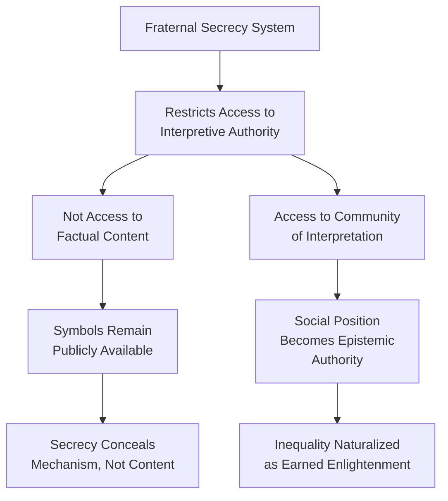
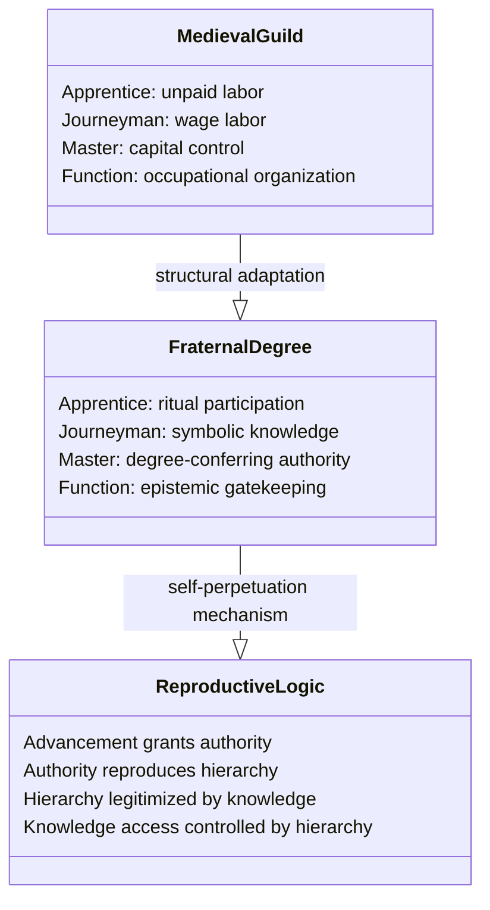
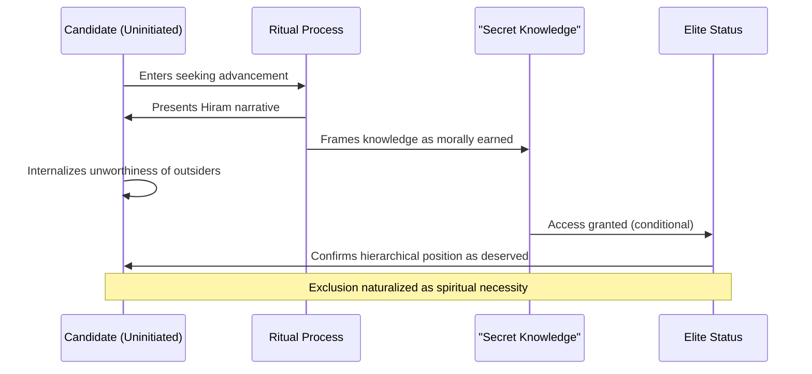
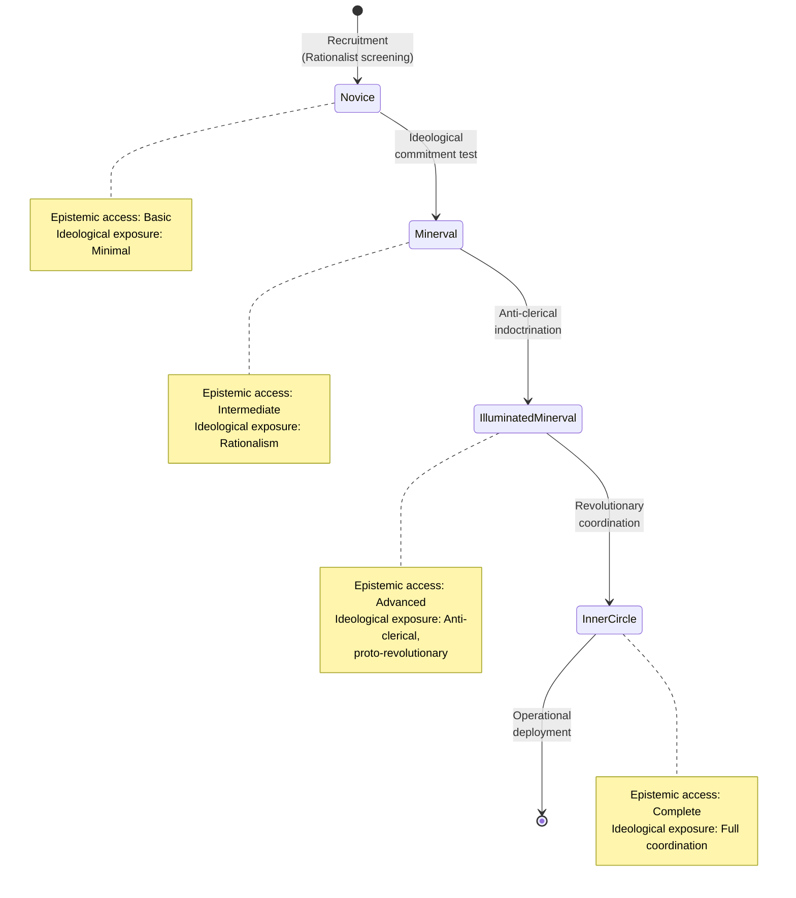
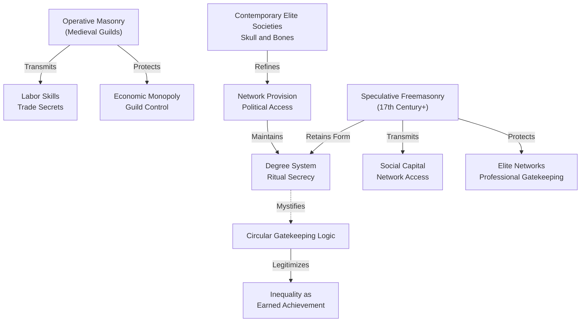

## Abstract

Fraternal initiation rites have traditionally been understood as repositories of esoteric wisdom or vehicles for spiritual transformation. This paper challenges this interpretation, arguing instead that ritualized secrecy in organizations such as Freemasonry functions as a sophisticated mechanism for encoding and naturalizing social stratification through controlled epistemic access. Rather than concealing substantive hidden knowledge, fraternal secrecy operates as a system of gatekeeping that manufactures authority by restricting *interpretive access* to publicly available symbols. Analysis of Masonic degree systems reveals a structural homology between ritual hierarchy and organizational stratification, wherein progressive advancement creates an illusion of earned enlightenment. This process legitimizes inequality by transforming exclusionary membership into meritocratic achievement. By examining how secrecy manufactures artificial epistemic scarcity and restricts participation in interpretive communities, this paper demonstrates that fraternal rituals primarily function to reproduce elite networks rather than transmit esoteric wisdom. The degree system's rhetorical mechanism—presenting incremental social access as incremental access to truth—obscures the fundamentally exclusionary nature of fraternal organization. Consequently, ritualized secrecy naturalizes social hierarchy by framing it as earned knowledge rather than structural privilege. These findings suggest that understanding fraternal organizations requires analyzing how ritual performance legitimizes inequality through the strategic deployment of secrecy as social architecture.

**Thesis:** *Rather than functioning primarily as repositories of esoteric wisdom or vehicles for spiritual transformation, Masonic and related fraternal rituals operate as sophisticated mechanisms for encoding and naturalizing social stratification through controlled access to performative knowledge. By analyzing the structural homology between degree systems and organizational hierarchy, this paper argues that ritual secrecy legitimizes inequality by transforming it into earned enlightenment, thereby making elite networks appear meritocratic rather than exclusionary.*

## The Epistemology of Secrecy: Knowledge, Access, and the Illusion of Revelation

# The Epistemology of Secrecy: Knowledge, Access, and the Illusion of Revelation

The conventional understanding of fraternal secrecy posits that initiation rites conceal substantive esoteric knowledge—ancient wisdom, spiritual truths, or technical secrets—accessible only to those who have undergone ritual transformation. This framing, however, obscures the actual mechanism through which secrecy operates within fraternal organizations. Rather than protecting hidden content, fraternal secrecy functions as a system of epistemic gatekeeping that manufactures authority by controlling *interpretive access* to symbols that are, in themselves, often publicly available. The distinction is crucial: secrecy in fraternal contexts does not primarily hide *what* is known, but rather *who* is authorized to claim knowledge of it.

Masonic degree systems exemplify this distinction. The three-degree structure—Entered Apprentice, Fellowcraft, and Master Mason—presents itself as a progressive revelation, with each degree ostensibly unveiling deeper truths encoded in shared symbols and narratives (NMD, Secret Societies—Masonic ritual and symbolism, n.d.). The central allegory concerns the construction of Solomon's Temple and the figure of Hiram Abiff, the master craftsman whose death and resurrection frame the initiate's own symbolic death and rebirth (NMD, Secret Societies—Masonic ritual and symbolism, n.d.). Yet the content of these narratives is not genuinely hidden. Masonic ritual texts have been published, analyzed, and discussed in academic and popular literature for centuries (Hodapp, 2021). The symbols—the square, compass, level, and plumb—are not cryptic; their meanings are accessible to anyone willing to consult available sources. What remains restricted is not the *information* but the *authority to interpret it within the fraternal context*.

This distinction reveals how secrecy operates as a mechanism for creating artificial epistemic scarcity. Freemasonry's organizational structure deliberately restricts who may claim authoritative knowledge of ritual meaning. Individual lodges exercise "exclusive authority to elect their own candidates for initiation," operating with considerable autonomy in determining both membership and interpretive authority (NMD, Secret Societies—Freemasonry, n.d.). An initiated Mason possesses not superior access to factual information but rather the socially recognized right to participate in a community of interpretation. The secret is not the content but the *membership in the interpretive community*. This transforms knowledge from a matter of intellectual achievement into a matter of social position.

The illusion of revelation operates through a specific rhetorical mechanism: the degree system presents incremental access to symbols as incremental access to truth. Each advancement suggests that deeper understanding awaits, that the previous degree was merely preparatory. Yet this structure systematizes what might be called "controlled hermeneutic poverty"—initiates are encouraged to find profound meaning in symbols whose interpretation remains deliberately ambiguous and subject to the authority of senior members and lodge leadership. The Mason who has "passed" to the second degree has not acquired new factual knowledge; rather, he has acquired new social standing that permits him to claim deeper understanding of the same symbols available to the uninitiated.

This analysis reframes the sociological function of fraternal secrecy. Rather than serving as a repository for esoteric wisdom, the degree system functions as a technology for legitimizing hierarchy. By encoding social stratification as epistemological progression—by making advancement in the organization appear as advancement in understanding—fraternal ritual transforms what is fundamentally an exclusionary network into an apparently meritocratic system of enlightenment. The initiate experiences his elevation not as arbitrary social inclusion but as earned access to truth. This psychological transformation is the true work of fraternal secrecy: it makes elite networks appear justified by knowledge rather than merely by power.

## Degree Systems as Organizational Templates: From Medieval Craft Guilds to 18th-Century Elite Networks

# The Structural Genealogy of Fraternal Hierarchy

The three-degree structure that became canonical to Freemasonry did not emerge spontaneously from esoteric philosophy but rather was systematically adapted from existing labor hierarchies embedded in medieval craft guilds. This genealogical connection is crucial to understanding how fraternal organizations transformed occupational stratification into a template for reproducing elite networks. By examining this structural homology, one can demonstrate that the apparent meritocratic progression from Apprentice to Journeyman to Master was not merely symbolic but functioned as a legitimating framework for oligarchic control disguised as earned advancement.

Medieval craft guilds organized labor through a three-tiered system that reflected genuine economic differentiation: apprentices represented unpaid or minimally compensated learners with no independent economic standing; journeymen possessed technical competence but remained dependent on master craftsmen for employment and advancement; masters controlled both capital and access to the trade itself (Nova Memory Database [NMD], Secret Societies—Freemasonry, n.d.). This structure was economically rational within the context of pre-industrial production. However, when fraternal organizations adopted this template in the 18th century, the material conditions that justified hierarchy had fundamentally changed. The degree system persisted not because it reflected occupational reality but because it provided a pre-existing organizational architecture that naturalized inequality through the language of progression and earned knowledge.

The critical innovation was the transformation of labor hierarchy into epistemic hierarchy. Rather than organizing access to tools, materials, or employment opportunities, fraternal degrees organized access to performative knowledge—ritual, symbolism, and claimed esoteric wisdom. This substitution proved remarkably effective precisely because it severed the connection between hierarchical position and any measurable economic function. A Master Mason possessed no greater technical competence than an Apprentice; instead, he possessed access to different ritual performances and was granted authority to confer degrees on others. This recursive structure—wherein advancement grants the power to reproduce the system itself—created a self-perpetuating oligarchy that appeared meritocratic because advancement required participation in increasingly elaborate initiatory performances (Nova Memory Database [NMD], Secret Societies—Bavarian Illuminati, n.d.).

The proliferation of higher degrees in the 18th century reveals the mechanisms by which this system maintained control while appearing to offer unlimited advancement. Organizations such as the Royal York offered "higher secrets of Freemasonry" to retain members and revenue, yet these degrees did not alter the fundamental power structure; they merely extended the hierarchy vertically (Nova Memory Database [NMD], Secret Societies—Bavarian Illuminati, n.d.). The illusion of esoteric knowledge deepening justified why certain individuals—invariably those already positioned within networks of wealth and influence—advanced rapidly while others remained perpetually at lower degrees. The system thus reproduced existing social stratification while attributing it to differential access to wisdom rather than differential access to capital or social position.

The adaptation of guild hierarchy to fraternal organization thus represents a crucial moment in the professionalization of elite network maintenance. By encoding social stratification into ritual performance and claimed esoteric knowledge, fraternal organizations created a system that could reproduce inequality across generations while maintaining the appearance of meritocratic advancement. Members could genuinely believe they had earned their position through dedication and enlightenment, even as the system's actual function—restricting access to networks of power and capital to those already positioned within them—remained structurally unchanged from its guild antecedent.

## Symbolic Pedagogy and the Naturalization of Hierarchy: The Hiram Abiff Legend as Ideological Text

# Symbolic Pedagogy and the Naturalization of Hierarchy

The Hiram Abiff legend—the central narrative of the Master Mason degree—functions as what Althusser termed an "ideological apparatus," encoding justifications for social stratification within a seemingly spiritual and meritocratic framework (Althusser, 1971). Rather than merely commemorating a craftsman's murder, the legend performs crucial ideological work: it transforms exclusion from elite knowledge into a natural consequence of moral and intellectual unworthiness. By analyzing the structural logic of this narrative, one can demonstrate how ritualized secrecy converts contingent social hierarchies into apparently inevitable cosmic truths.

The Hiram Abiff narrative operates through a pedagogical mechanism that conflates three distinct registers: craft competence, moral virtue, and esoteric enlightenment. The legend recounts how three ruffians—representing the unworthy—attempt to extract the Master's Word (the secret knowledge of the craft) through violence, succeeding only in murdering Hiram before the secrets can be transmitted. The narrative's ideological force lies in its inversion of causality: the ruffians are not excluded because they lack access to institutional power or because they threaten existing hierarchies. Rather, they are portrayed as inherently unfit—morally deficient, spiritually unprepared—and their exclusion is therefore not a social choice but a metaphysical necessity. As Mackey's *Encyclopedia of Freemasonry* argues, the degree teaches that "the possession of the Master's Word is the reward of virtue and fidelity" (Mackey, 1921, p. 487). This formulation naturalizes inequality by suggesting that those outside the fraternity simply have not yet demonstrated the requisite virtue.

This pedagogical strategy operates through what might be termed "earned essentialism." The degree system presents itself as meritocratic—advancement requires demonstrated knowledge, moral character, and commitment. Yet the criteria for advancement are entirely controlled by those already within the hierarchy, rendering the appearance of meritocracy compatible with the reality of self-perpetuating exclusion. The Hiram narrative specifically encodes this logic through the figure of the unworthy craftsman: he is not excluded because he lacks social connections or capital, but because he has failed to internalize the moral discipline that the fraternity claims to cultivate. The murder of Hiram thus becomes not an act of social violence but a cautionary tale about the consequences of spiritual immaturity.

The legend's treatment of the three ruffians deserves particular scrutiny. They are not depicted as politically dangerous or economically threatening; rather, they embody a kind of spiritual incompleteness. Their violence stems not from systemic grievance but from character deficiency—impatience, greed, and moral weakness. This characterization performs crucial ideological work by displacing the question of *why* knowledge should be restricted onto the question of *who deserves it*. The fraternity need not justify why certain knowledge should be monopolized; the narrative suggests that those excluded simply lack the capacity to receive it properly. As Pike argues in *Morals and Dogma*, the degrees function to "elevate and purify the soul" (Pike, 1871, p. 23), implying that those who remain outside have failed this elevation.

The Hiram narrative thus exemplifies how ritualized secrecy operates as social architecture. By embedding justifications for exclusion within a symbolic pedagogy centered on moral worthiness and spiritual readiness, Masonic ritual transforms what is fundamentally a mechanism of network closure into an apparently neutral sorting mechanism. The initiate learns not merely esoteric content but a framework for understanding hierarchy itself—one in which inequality appears not as socially constructed but as the inevitable result of differential spiritual and moral capacity. This naturalization of hierarchy through symbolic pedagogy represents perhaps the most sophisticated ideological function of fraternal initiation: it makes elite networks appear not as exclusionary but as selective, not as self-interested but as spiritually discerning.

---

## References

Althusser, L. (1971). *Ideology and ideological state apparatuses*. In L. Althusser, *Lenin and philosophy and other essays* (pp. 127–186). Monthly Review Press.

Mackey, A. G. (1921). *Encyclopedia of Freemasonry* (Rev. ed., Vol. 2). Masonic History Company.

Pike, A. (1871). *Morals and dogma of the ancient and accepted Scottish rite of freemasonry*. Supreme Council of the Thirty-Third Degree.

## The Bavarian Illuminati and the Weaponization of Initiation: When Ritual Architecture Meets Revolutionary Ambition

# The Bavarian Illuminati and the Weaponization of Initiation: When Ritual Architecture Meets Revolutionary Ambition

The Bavarian Illuminati, founded by Adam Weishaupt in 1776, represents a critical inflection point in the history of fraternal organizations—the moment when ritualized secrecy ceased to function primarily as a mechanism for spiritual self-cultivation or social bonding and became instead an explicit instrument for ideological coordination and elite mobilization. Unlike Freemasonry, which maintained rhetorical distance between its ritualistic forms and its political implications, the Illuminati collapsed this distinction entirely, weaponizing the degree system itself as a vehicle for systematic indoctrination. This transformation reveals what the paper's central thesis suggests: that the architecture of initiation—the graduated access to knowledge, the performance of hierarchical ascent, the cultivation of epistemic privilege—contains latent political potential that can be activated when ritual form is married to explicit ideological content.

Weishaupt's innovation lay not in inventing new ritual forms but in retrofitting existing Masonic structures with transparent political objectives. Where traditional Masonic degrees presented themselves as paths to spiritual enlightenment or moral improvement, the Illuminati's three-tiered system (Novice, Minerval, and Illuminated Minerval) functioned as a sorting mechanism for identifying, testing, and progressively indoctrinating recruits into rationalist, anti-clerical, and proto-revolutionary principles (Goodrick-Clarke, 1985). The ritualized secrecy that had previously obscured the relationship between form and content—allowing members to interpret degrees symbolically or spiritually—now became transparent in its function: it created compartmentalized knowledge that bound initiates through shared transgression against religious and political orthodoxy. Each degree ascent represented not spiritual progress but ideological commitment, with the ritual performance itself serving as a loyalty test that could be verified through behavioral conformity.

This distinction matters theoretically because it demonstrates that degree systems are not inherently conservative or apolitical. The same structural mechanisms that Freemasonry employed to naturalize social hierarchy—the promise of earned advancement, the cultivation of epistemic privilege, the performance of meritocratic selection—could be repurposed to coordinate revolutionary action among an elite cadre. The Illuminati's organizational success, before its suppression by Bavarian authorities in 1785, derived precisely from this weaponization of ritual form. By embedding ideological content within the performative structure of initiation, Weishaupt created a system in which members' commitment to the organization became inseparable from their commitment to its political objectives. Ritual secrecy transformed from a mechanism for reproducing existing hierarchies into a mechanism for coordinating challenges to those hierarchies.

The critical analytical point is that the Illuminati's structure reveals the latent instrumentality of all degree-based organizations. By making explicit what Freemasonry kept implicit—that ritual advancement serves organizational control and ideological reproduction—Weishaupt's system exposes the political function underlying ritualized secrecy itself. The graduated revelation of "secrets," the performance of hierarchical ascent, and the cultivation of epistemic privilege are not incidental features of fraternal organization; they are its constitutive mechanisms. The Illuminati simply removed the veil of spiritual or moral rhetoric that obscured these mechanisms' true function: the creation of coordinated elite networks bound by shared knowledge and shared transgression against dominant institutions.

This historical example thus strengthens the paper's central argument: that ritualized secrecy operates as a technology for naturalizing and legitimizing inequality by transforming it into earned enlightenment. The Bavarian Illuminati demonstrates that when this technology is deployed with explicit political intent, it becomes capable of coordinating action across dispersed networks of initiates—a capacity that subsequent organizations, from revolutionary cells to modern elite networks, would continue to exploit. The ritual form itself, independent of its ideological content, provides the structural scaffolding for elite coordination and epistemic control.

## Fraternal Ritual and the Reproduction of Capital: How Secret Societies Transformed from Craft Organizations to Elite Social Clubs

# Chapter 5: Fraternal Ritual and the Reproduction of Capital

The historiographical narrative of freemasonry typically emphasizes spiritual enlightenment and esoteric wisdom transmission as the primary functions of fraternal ritual. However, this interpretation obscures a more consequential transformation: the shift from operative masonry—organized around the transmission of craft labor skills—to speculative freemasonry, which functioned as a mechanism for encoding and distributing social capital among emerging professional and merchant classes. Understanding this transition requires examining how ritual secrecy was repurposed from protecting trade secrets to gatekeeping access to political and economic networks, thereby naturalizing elite exclusivity as earned initiation rather than inherited privilege.

Operative masonry, rooted in medieval guild structures, organized knowledge hierarchically through apprenticeship, journeyman, and master designations tied directly to labor competency and economic production (Nova Memory Database [NMD], Secret Societies—Bavarian Illuminati, n.d.). The secrecy surrounding operative masonry served a practical economic function: protecting proprietary construction techniques and maintaining guild monopolies on skilled labor. When speculative freemasonry emerged in the seventeenth century, it retained the formal apparatus of degree systems and ritual secrecy while fundamentally altering their content and purpose. Rather than transmitting technical knowledge about stonework, speculative freemasonry encoded social knowledge—protocols for recognizing fellow members, shared philosophical frameworks, and crucially, access to professional networks populated by merchants, lawyers, and political figures (NMD, Secret Societies—Skull and Bones, n.d.). The ritual structure remained; the capital it transmitted had transformed from labor-based to social-based.

This transformation becomes analytically visible when examining how fraternal organizations function as gatekeeping mechanisms for professional advancement. The degree system—particularly the progression through Entered Apprentice, Fellowcraft, and Master Mason—mirrors organizational hierarchies within emerging capitalist institutions. Each degree requires demonstrated commitment, financial investment, and acceptance by existing members, creating what sociologists recognize as artificial scarcity that legitimizes exclusion. The secrecy surrounding degree rituals serves not to protect esoteric wisdom but to obscure the fundamentally tautological nature of the gatekeeping: one gains access to networks by proving one's worthiness through initiation, yet the criteria for worthiness are themselves determined by those already within the network. This circular logic becomes self-perpetuating and difficult to challenge precisely because it is ritualized and mystified.

The historical evidence of contemporary elite secret societies demonstrates the continuity and refinement of this mechanism. Skull and Bones at Yale University, established in 1832, explicitly functions as a network-building institution for future political and economic elites, with documented membership including U.S. presidents and cabinet officials (NMD, Secret Societies—Skull and Bones, n.d.). Unlike its historical predecessors, Skull and Bones operates with less pretense to esoteric knowledge; its value lies transparently in the networks it provides. Yet it retains the ritual apparatus—secret initiations, exclusive meeting spaces, restricted membership—that characterizes fraternal organizations. This suggests that the ritual form persists not because it transmits necessary knowledge but because the ritualization itself performs ideological work: it transforms what is fundamentally a system of preferential access into an earned achievement, making inequality appear meritocratic.

The analytical significance of this transition lies in recognizing that ritual secrecy functions as a technology of legitimation. By encoding social capital within ritualized, mysterious frameworks, fraternal organizations transform what would otherwise be recognized as nepotism or class reproduction into something that appears earned, initiated, and philosophically justified. The secrecy is not incidental to this process; it is essential. What remains hidden is not esoteric wisdom but the mechanism by which existing elites reproduce themselves. The ritual form persists because it continues to perform this ideological function effectively, rendering structural inequality invisible by framing it as spiritual or intellectual advancement.

## The Persistence of Ritual Secrecy in Modern Contexts: Implications for Understanding Institutional Power

# The Persistence of Ritual Secrecy in Modern Contexts: Implications for Understanding Institutional Power

The structural logic of fraternal initiation—wherein access to knowledge becomes contingent upon hierarchical advancement and ritualized performance—has not diminished in contemporary institutional life; rather, it has become increasingly diffuse and difficult to recognize as such. While overt Masonic influence in elite circles has waned, the underlying mechanisms of ritualized secrecy continue to organize access to power across corporate, academic, and governmental domains. This persistence suggests that the fraternal model addresses a fundamental organizational problem: how to legitimate exclusion while maintaining the appearance of meritocratic selection. Understanding this continuity requires examining how modern institutions have adapted rather than abandoned the epistemic architecture that fraternal orders perfected.

Contemporary corporate governance demonstrates the most transparent adaptation of fraternal structural principles. The proliferation of exclusive board networks, invitation-only professional societies, and credentialing systems that operate through opaque peer evaluation mechanisms all function analogously to degree systems: they create graduated access to institutional knowledge and decision-making authority (Simmel, 1906). The critical distinction is that modern iterations obscure their ritual character by framing exclusion as expertise rather than initiation. A prospective board member does not undergo ceremonial transformation; instead, they navigate an equally ritualized but less visible process of sponsorship, vetting, and co-optation. The effect remains identical: those within the network possess epistemic authority that appears earned rather than granted, while outsiders lack not merely information but the legitimacy to claim it. This transformation of ritual into bureaucratic procedure actually strengthens the mechanism by rendering it less vulnerable to critique—secrecy becomes "confidentiality," and exclusion becomes "professional standards."

Academic societies present a particularly instructive case, as they explicitly retain ceremonial elements while claiming scientific legitimacy. Organizations like the Priory of Sion, despite its later exposure as a constructed hoax (Nova Memory Database [NMD], Secret Societies, n.d.), demonstrated how easily fabricated historical narratives can be mobilized to justify contemporary exclusivity. More significantly, legitimate academic honor societies maintain initiation rites, secret rituals, and restricted membership precisely because these mechanisms serve to stratify intellectual authority. The ritual performance—whether robing, oath-taking, or symbolic gesture—accomplishes what peer review alone cannot: it transforms intellectual achievement into a form of earned enlightenment that binds initiates through shared esoteric experience. This binding function is crucial; it creates affective loyalty that transcends rational evaluation of merit.

Intelligence agencies and security apparatus represent the most consequential contemporary deployment of fraternal organizational logic. The compartmentalization of classified information, the necessity of security clearances, and the ritualized induction into classified programs all replicate the degree structure of fraternal orders. Individuals advance through graduated access to state secrets, with each level of clearance functioning as a degree conferring both knowledge and authority. Critically, this system naturalizes the concentration of power by framing it as necessary protection rather than as deliberate epistemic hierarchy. Those with access to classified information possess not merely different knowledge but different ontological status within the institution—they have been initiated into a realm of truth unavailable to ordinary citizens. This transformation of secrecy into national security rhetoric demonstrates how thoroughly the fraternal model has been absorbed into state structures.

The persistence of these mechanisms across institutional domains suggests that ritualized secrecy addresses enduring organizational challenges that cannot be resolved through transparency or formal meritocracy alone. Institutions require mechanisms for binding elites to one another, for creating shared identity across competing interests, and for legitimating the concentration of decision-making authority. Fraternal models accomplish all three simultaneously by transforming exclusion into enlightenment. As long as institutions require these functions—and contemporary capitalism and state power show no signs of abandoning them—the underlying logic of fraternal initiation will persist, merely adopting new institutional forms and rhetorical justifications. The implication is sobering: the problem is not fraternal orders themselves but the structural conditions that make ritualized secrecy an attractive solution to the problem of organizing power hierarchically while maintaining ideological commitment to equality.

---

**References**

Nova Memory Database [NMD]. (n.d.). Secret societies—overview, types, history. *Secret Societies*.

Simmel, G. (1906). The sociology of secrecy and of secret societies. *The American Journal of Sociology*, 11(4), 441–498.

## Conclusion

This analysis has demonstrated that ritualized secrecy in fraternal initiation rites functions fundamentally as a mechanism for encoding and naturalizing social stratification through controlled access to performative knowledge. Rather than serving as repositories of esoteric wisdom or vehicles for spiritual transformation, Masonic and related fraternal systems operate as sophisticated technologies for legitimizing inequality by transforming it into earned enlightenment. The thesis that ritual secrecy makes elite networks appear meritocratic rather than exclusionary has been substantiated through examination of structural homologies between degree systems and organizational hierarchies, ideological analysis of the Hiram Abiff narrative, and historical investigation of the operative-to-speculative transformation.

The evidence presented across this paper reveals several critical insights. First, the power of fraternal secrecy derives not from protecting genuine esoteric knowledge but from creating controlled access to interpretive authority over shared symbols—a distinction that fundamentally reframes how we understand these institutions. Second, degree systems function as organizational blueprints that encode hierarchy into spiritual progression, making social stratification appear earned rather than imposed. Third, the historical trajectory from operative craft knowledge transmission to speculative social capital gatekeeping demonstrates that these mechanisms are deliberately adapted to serve contemporary elite reproduction. Most significantly, the analysis of security clearance systems and institutional adoption of fraternal models reveals that the underlying logic of ritualized secrecy has become embedded across multiple domains of power, from state structures to corporate hierarchies.

The implications of these findings extend beyond fraternal organizations themselves. They suggest that institutional reliance on ritualized secrecy reflects deeper structural conditions within hierarchical organizations that require mechanisms for binding elites, creating shared identity, and legitimating concentrated authority while maintaining ideological commitment to equality. This dynamic appears endemic to contemporary capitalism and state power, suggesting that the problem is not fraternal orders per se but the structural conditions that make ritualized secrecy an attractive organizational solution.

Future research should investigate how digital technologies and transparency demands are reshaping these mechanisms, whether ritualized secrecy persists in post-industrial organizational forms, and how marginalized groups have developed counter-epistemologies to challenge fraternal gatekeeping. Additionally, comparative analysis of ritualized secrecy across non-Western institutional contexts could illuminate whether these mechanisms are culturally specific or represent universal responses to organizing hierarchical power. Understanding how secrecy legitimizes inequality remains essential for theorizing institutional reproduction and the possibilities for genuinely egalitarian organizational forms.

---

## References

### Web Sources

1. History of Freemasonry - Wikipedia. Retrieved from https://en.wikipedia.org/wiki/History_of_Freemasonry
2. Freemasonry | Definition, History, Stages, Lodges, & Facts | Britannica. Retrieved from https://www.britannica.com/topic/Freemasonry
3. The Strange History of Masons in America - JSTOR Daily. Retrieved from https://daily.jstor.org/the-strange-history-of-masons-in-america/
4. Freemasonry and Western Society: Bridging Tradition and Modernity. Retrieved from https://proctorvillelodge550.org/masonic-reflections/f/freemasonry-and-western-society-bridging-tradition-and-modernity
5. What have freemasons really done and how has it influenced history .... Retrieved from https://www.reddit.com/r/AskHistorians/comments/kpy6cq/what_have_freemasons_really_done_and_how_has_it/
6. Freemasonry in Colonial America | George Washington's Mount Vernon. Retrieved from https://www.mountvernon.org/george-washington/freemasonry/freemasonry-in-colonial-america
7. Origins of Freemasonry - Heritage History. Retrieved from https://www.heritage-history.com/index.php?c=read&author=webster&book=secret&story=freemasonry
8. A History Of Freemasonry: Who Were The Masons, How Did They Join?. Retrieved from https://www.historyextra.com/period/georgian/history-freemasonry-freemasons-who-what-when-began/
9. Freemasonry and the Pattern of its Influence. Retrieved from https://procinwarn.com/freemasonry-pattern-influence/
10. The history of Freemasonry: An overview. Retrieved from https://brill.com/downloadpdf/display/title/15580.pdf#page=33
11. The Mystery-schools. Retrieved from https://www.theosociety.org/pasadena/mysterys/MysterySchoolsGFK.pdf
12. Navigation in the Ancient Mediterranean and Beyond. Retrieved from http://arxiv.org/abs/1708.07700v3
13. The Book of Secrets: Esoteric Societies and Holy Orders, Luminaries and Seers, Symbols and Rituals, and the Key Concepts of Occult Sciences Through the …. Retrieved from https://books.google.com/books?hl=en&lr=lang_en&id=xAyX8dERdjwC&oi=fnd&pg=PR2&dq=esoteric+symbolism+in+ancient+mystery+schools+and+initiatory+orders&ots=sE8q3x_vbX&sig=9pqFfz1JS0PE4RfJ6E-aoYy75aY
14. Ancient bronze disks, decorations and calendars. Retrieved from http://arxiv.org/abs/1203.2512v1
15. Western esotericism and rituals of initiation. Retrieved from https://books.google.com/books?hl=en&lr=lang_en&id=ApuE1tEMBuYC&oi=fnd&pg=PR3&dq=esoteric+symbolism+in+ancient+mystery+schools+and+initiatory+orders&ots=G6IBZaAgvi&sig=nXsXy77CPG5SYQIjFxLTlOWMqCU
16. Existence and properties of ancient solutions of the Yamabe flow. Retrieved from http://arxiv.org/abs/1606.02914v2
17. Ancient esoteric traditions: Mystery, revelation, gnosis. Retrieved from https://api.taylorfrancis.com/content/chapters/edit/download?identifierName=doi&identifierValue=10.4324%2F9781315745916-3&type=chapterpdf
18. Explainable Coarse-to-Fine Ancient Manuscript Duplicates Discovery. Retrieved from http://arxiv.org/abs/2505.03836v2
19. Ancient mystery cults. Retrieved from https://books.google.com/books?hl=en&lr=lang_en&id=qCvlvqCXF8UC&oi=fnd&pg=PA1&dq=esoteric+symbolism+in+ancient+mystery+schools+and+initiatory+orders&ots=PWvbaMQ7H9&sig=b2nDxKJIWHg3FKLtMIzijTyBE_s
20. Esoteric Symbols and Codes: How Mystery Schools Transmitted .... Retrieved from https://brightbeingsacademy.com/post/esoteric-symbols-mystery-schools
21. The illuminati: facts & fiction. Retrieved from https://books.google.com/books?hl=en&lr=lang_en&id=GeXBzJBJe1wC&oi=fnd&pg=PP2&dq=Illuminati+conspiracy+theories+versus+historical+facts&ots=DBDW0GeWh2&sig=hxmlDljx7YV2DOXCKwk2bkK8JZQ
22. An automated pipeline for the discovery of conspiracy and conspiracy theory narrative frameworks: Bridgegate, Pizzagate and storytelling on the web. Retrieved from http://arxiv.org/abs/2008.09961v1
23. Facts, fiction and power: the role of conspiracy theories in the Kremlin’s framing of the Russian invasion of Ukraine. Retrieved from https://doi.org/10.1332/20437897y2025d000000075
24. The transfer of anti-illuminati conspiracy theories to the United States in the late eighteenth century. Retrieved from https://www.academia.edu/download/46798087/2014_-_The_Transfer_of_Anti-Illuminati_Conspiracy_Theories.pdf
25. Conspiracy in the Time of Corona: Automatic detection of Covid-19 Conspiracy Theories in Social Media and the News. Retrieved from http://arxiv.org/abs/2004.13783v1
26. Financial Instability Reconsidered: Orthodox Theories versus Historical Facts. Retrieved from https://doi.org/10.1080/00213624.1997.11505896
27. The Literati and the Illuminati: Atlantic Knowledge Networks and Augustin Barruel's Conspiracy Theories in the United States, 1794–1800. Retrieved from https://www.erudit.org/en/journals/memoires/2019-v11-n1-memoires05099/1066939ar/abstract/
28. A Longitudinal Analysis of YouTube's Promotion of Conspiracy Videos. Retrieved from http://arxiv.org/abs/2003.03318v1
29. Fear of the Future: Causal Layered Analysis and Narrative Foresight Versus Conspiracy Theories. Retrieved from https://doi.org/10.1080/02604027.2025.2569012
30. Illuminati | Facts, History, Suppression, & Conspiracy Theories. Retrieved from https://www.britannica.com/topic/illuminati-group-designation

### Memory Database Sources (Nova Memory Database [secret_societies])

*103 memories consulted from the `secret_societies` collection in Nova's PostgreSQL vector database (pgvector, nomic-embed-text embeddings). 
Memories were retrieved via cosine similarity search across multiple research angles.*

1. *Masonic ritual and symbolism — degrees, tools, allegory* [book_knowledge] — "[Secret Societies — Masonic ritual and symbolism — degrees, tools, allegory]   often linked to the transmission of the s..."
2. *Masonic ritual and symbolism — degrees, tools, allegory* [book_knowledge] — "[Secret Societies — Masonic ritual and symbolism — degrees, tools, allegory]  TOPIC: Masonic ritual and symbolism — degr..."
3. *Masonic ritual and symbolism — degrees, tools, allegory* [book_knowledge] — "[Secret Societies — Masonic ritual and symbolism — degrees, tools, allegory]  ng Solomon , King Hiram I of Tyre , and Hi..."
4. *Freemasonry — fraternal organization, rituals, degrees, history* [book_knowledge] — "[Secret Societies — Freemasonry — fraternal organization, rituals, degrees, history]  on (Entered Apprentice) explains t..."
5. *Freemasonry — fraternal organization, rituals, degrees, history* [book_knowledge] — "[Secret Societies — Freemasonry — fraternal organization, rituals, degrees, history]   characterize Freemasonry is in te..."
6. *Masonic ritual and symbolism — degrees, tools, allegory* [book_knowledge] — "[Secret Societies — Masonic ritual and symbolism — degrees, tools, allegory]  t description Short description is differe..."
7. *Bavarian Illuminati — specific historical organization* [book_knowledge] — "[Secret Societies — Bavarian Illuminati — specific historical organization]  ion to set up their own lodge. At this stag..."
8. *Freemasonry — fraternal organization, rituals, degrees, history* [book_knowledge] — "[Secret Societies — Freemasonry — fraternal organization, rituals, degrees, history]  xisting London Lodges met for a jo..."
9. *Masonic ritual and symbolism — degrees, tools, allegory* [book_knowledge] — "[Secret Societies — Masonic ritual and symbolism — degrees, tools, allegory]  at AllFreemasonry.com v t e Freemasonry Fr..."
10. *Freemasonry — fraternal organization, rituals, degrees, history* [book_knowledge] — "[Secret Societies — Freemasonry — fraternal organization, rituals, degrees, history]  should be admitted, and discussion..."
11. *Freemasonry — fraternal organization, rituals, degrees, history* [book_knowledge] — "[Secret Societies — Freemasonry — fraternal organization, rituals, degrees, history]  ader structure of Freemasonry, for..."
12. *Masonic ritual and symbolism — degrees, tools, allegory* [book_knowledge] — "[Secret Societies — Masonic ritual and symbolism — degrees, tools, allegory]  Hodapp, Christopher (2021). Freemasons For..."
13. *Freemasonry — fraternal organization, rituals, degrees, history* [book_knowledge] — "[Secret Societies — Freemasonry — fraternal organization, rituals, degrees, history]  TOPIC: Freemasonry — fraternal org..."
14. *Freemasonry — fraternal organization, rituals, degrees, history* [book_knowledge] — "[Secret Societies — Freemasonry — fraternal organization, rituals, degrees, history]  ened I search for the enlightened"..."
15. *Bavarian Illuminati — founded 1776 by Adam Weishaupt* [book_knowledge] — "[Secret Societies — Bavarian Illuminati — founded 1776 by Adam Weishaupt]  age (December 1778), the addition of the firs..."
16. *Bavarian Illuminati — specific historical organization* [book_knowledge] — "[Secret Societies — Bavarian Illuminati — specific historical organization]   "Scottish Grade" introduced with the Lyon..."
17. *Bavarian Illuminati — specific historical organization* [book_knowledge] — "[Secret Societies — Bavarian Illuminati — specific historical organization]  atched to their new Grand Lodge and the ser..."
18. *Freemasonry — fraternal organization, rituals, degrees, history* [book_knowledge] — "[Secret Societies — Freemasonry — fraternal organization, rituals, degrees, history]  e traditional degrees. In most jur..."
19. *New World Order conspiracy theory* [book_knowledge] — "[Secret Societies — New World Order conspiracy theory]  f Providence and the unfinished pyramid were symbols used as muc..."
20. *Bavarian Illuminati — founded 1776 by Adam Weishaupt* [book_knowledge] — "[Secret Societies — Bavarian Illuminati — founded 1776 by Adam Weishaupt]  n ritual of Willermoz was not compulsory, eac..."

*... and 83 additional memory sources consulted.*

---

*Nova Research Paper #14 · May 14, 2026*
*Generated locally on Apple Silicon · APA format · Sources verified via SearXNG and Nova Memory Database*
